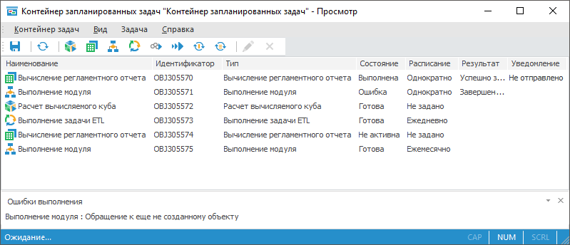

# Планирование задач и выполнение их по расписанию

Планирование задач и выполнение их по расписанию
-

# Планирование задач и выполнение их по расписанию

Для планирования задач и выполнения их по расписанию используйте инструмент
 «Планировщик задач».

	 Планировщик задач Контейнер запланированных задач в веб-приложении Контейнер запланированных задач в настольном приложении

		

		

		

Примечание.
 Планировщик задач входит в [комплект поставки
 продукта «Форсайт. Аналитическая платформа»](setup.chm::/05_RepoMngr/Setup_RepoMngr_Main.htm).
 В ОС Linux используется в виде консольного приложения Scheduler.

Инструмент «Планировщик задач»
 предназначен для планирования и выполнения ресурсоёмких задач по расписанию
 на сервере.

Ключевые возможности:

	- выполнение на сервере отложенных ресурсоёмких задач;

	- выполнение задач по расписанию, по условию, по наступлению системного
	 или настраиваемого события;

	- публикация на сервере результатов выполнения задач или отправка
	 результатов по различным каналам: e-mail, ftp;

	- работа в операционных системах семейства Windows и Linux.

Для работы с инструментом «Планировщик
 задач» вам понадобится [единица лицензирования](setup.chm::/08_Licensing/Admin_Licensing.htm)
 «PP_Scheduler».

Для начала работы смотрите статью
 «[Начало
 работы с инструментом «Планировщик задач](Getting_Started.htm)».

Для создания задач смотрите статью
 «[Создание
 запланированных задач](3_Work_Tasks/Work_Task.htm)».

Для запуска задач на выполнение
 смотрите статью «[Запуск
 задач на выполнение](1_Work_AppSrv/UiAppSrv_Work_Run.htm)».

Если остались вопросы, то смотрите
 статью «[Вопросы
 и ответы](AppSrv_FAQ.htm)».

См. также:

[Запуск
 планировщика задач](1_Work_AppSrv/UiAppSrv_Work_Run.htm) | [Просмотр
 параметров планировщика задач](1_Work_AppSrv/UiAppSrv_Work_AppSrv_Parameters.htm) | [Контейнер
 запланированных задач](Getting_Started.htm)

		Справочная
		 система на версию 10.9
		 от 18/08/2025,
		 © ООО «ФОРСАЙТ»,
