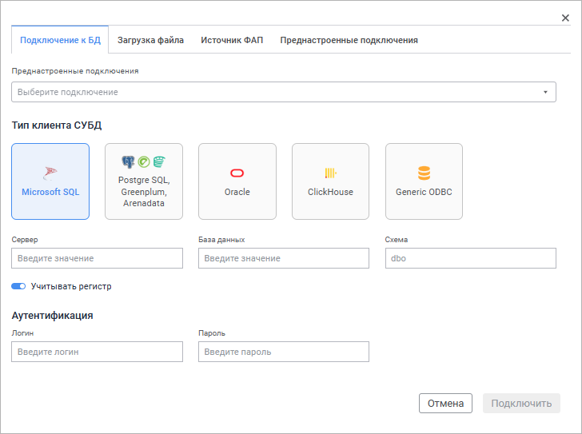
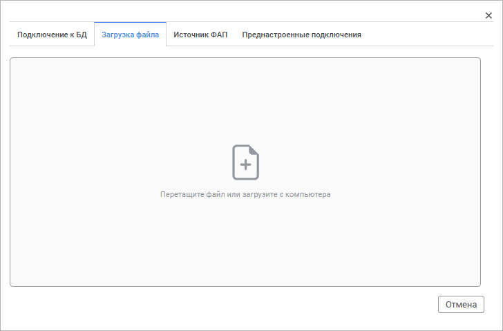
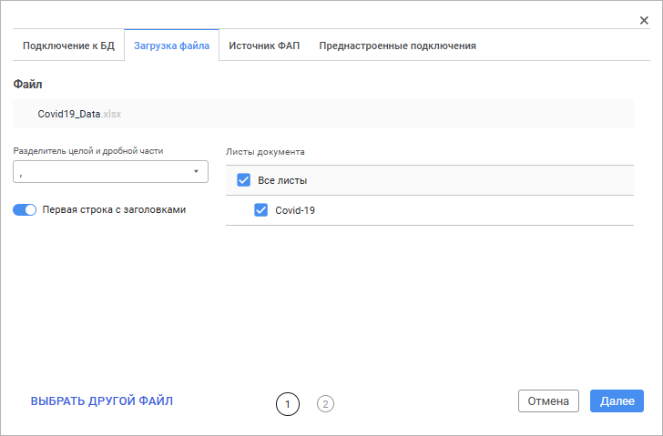
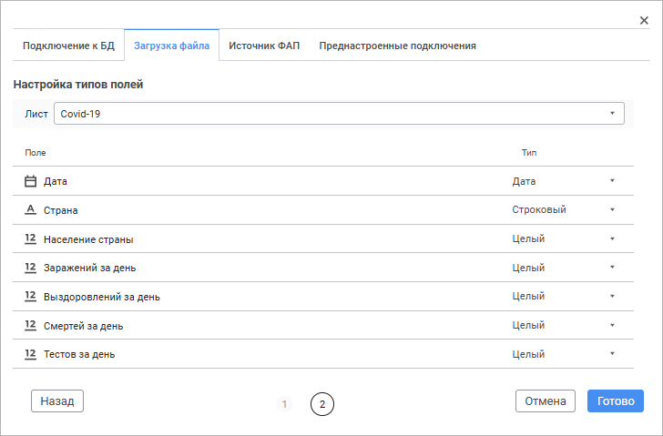
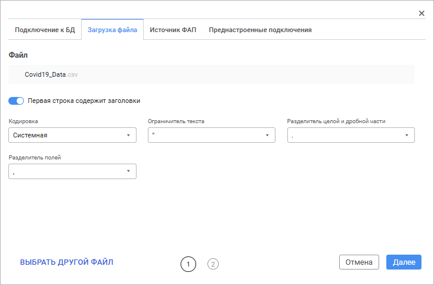
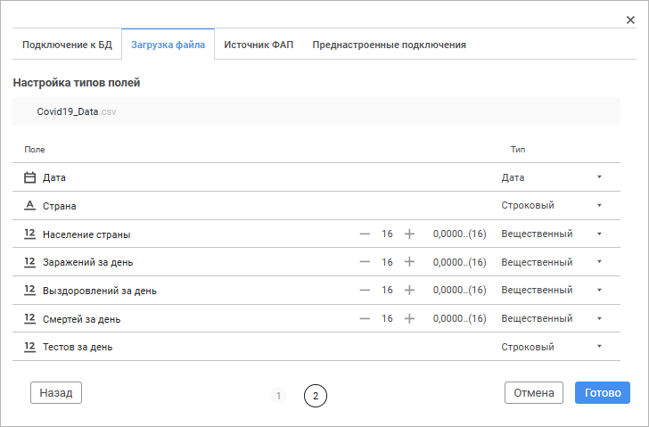
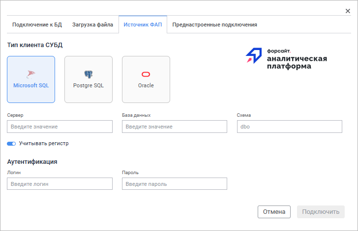
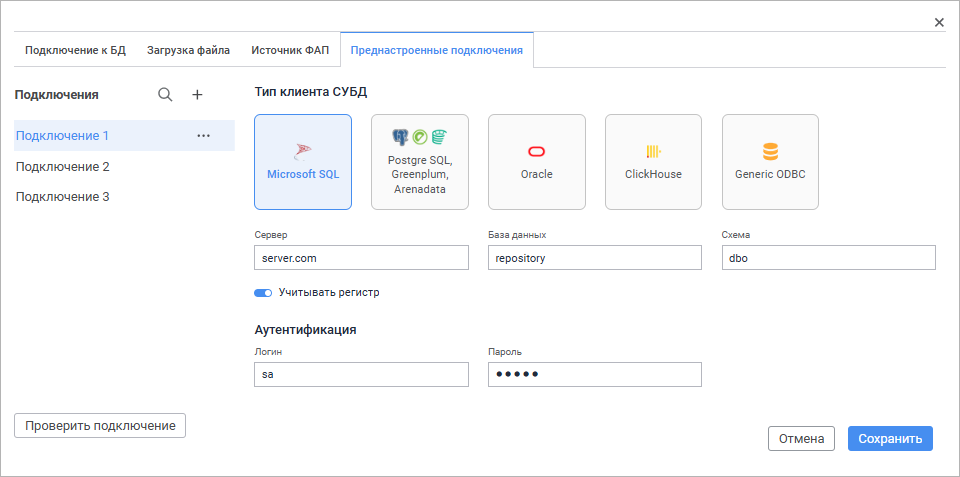
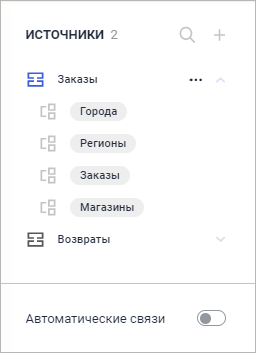
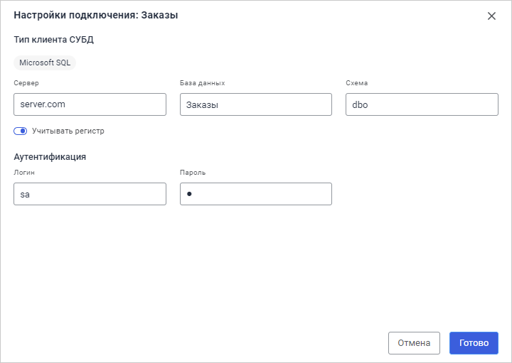

# Добавление источников

Добавление источников
-

# Добавление источников

Для добавления источников нажмите кнопку  «Добавить источник» на [боковой
 панели](../create_data_model.htm). Откроется окно добавления источника.

Набор настроек окна отличается в зависимости
 от выбранной вкладки:

	Подключение к БД
	 Загрузка файла Источник ФАП Преднастроенные подключения

		

		Для подключения к базе данных с ранее заданными настройками выберите
		 шаблон подключения в раскрывающемся списке «Преднастроенные
		 подключения». Все настройки подключения будут автоматически
		 заполнены в соответствии с шаблоном. Для редактирования настроек
		 подключения перейдите на вкладку «Преднастроенные
		 подключения» окна добавления источника.

		Примечание.
		 В раскрывающемся списке отображаются только те преднастроенные
		 подключения, на которые у пользователя есть [права](Admin.chm::/02_ComonFunction/Admin_SecManager_CommonFunction.htm).

		Для сброса преднастроенного подключения нажмите кнопку 
		 в списке шаблонов подключения.

Для подключения к базе данных задайте настройки:

	- Тип клиента СУБД. Выберите
	 [тип
	 клиента СУБД](Setup.chm::/01_SysReq/database_Support.htm):

		- Microsoft SQL;

		- PostgreSQL;

		- Greenplum;

		- Arenadata;

		- Oracle;

		- ClickHouse;

		- Generic ODBC.

После выбора типа клиента СУБД задайте настройки
 подключения к базе данных:

		- Сервер. Введите
		 псевдоним сервера. Поле доступно, если выбран тип клиента СУБД
		 Microsoft SQL, PostgreSQL, Greenplum, Arenadata, Oracle или ClickHouse
		 с установленным переключателем «Подключение
		 по параметрам»;

		- База данных. Задайте
		 имя базы данных. Поле доступно, если выбран тип клиента СУБД Microsoft
		 SQL, PostgreSQL, Greenplum, Arenadata или ClickHouse с установленным
		 переключателем «Подключение по
		 параметрам»;

		- Схема. Укажите идентификатор
		 пользовательской схемы для её использования в базе данных. По
		 умолчанию используется dbo для СУБД Microsoft SQL и public для
		 СУБД PostgreSQL, Greenplum, Arenadata. Поле доступно, если выбран
		 тип клиента СУБД Microsoft SQL, PostgreSQL, Greenplum, Arenadata
		 или Oracle;

		- Учитывать регистр.
		 Установите переключатель для работы с объектами и их полями в
		 СУБД с различным регистром символов в их физическом имени. Параметр
		 используется при раздаче прав на уровне СУБД и учитывается при
		 соединении и операциях с базой данных. Переключатель доступен,
		 если выбран тип клиента СУБД Microsoft SQL или PostgreSQL, Greenplum,
		 Arenadata;

		- Аутентификация.
		 Введите данные пользователя для подключения к базе данных:

			- Логин. Введите
			 имя пользователя, являющегося владельцем базы данных;

			- Пароль. Введите
			 пароль пользователя для доступа к СУБД.

Группа настроек доступна, если выбран тип
 клиента СУБД Microsoft SQL, PostgreSQL, Greenplum, Arenadata, Oracle или
 ClickHouse с установленным переключателем «Подключение
 по параметрам»;

		- DSN или строка подключения.
		 Введите наименование источника данных или параметры подключения
		 к источнику данных. Поле доступно, если выбран тип клиента СУБД
		 ClickHouse с установленным переключателем «DSN»
		 или Generic ODBC;

Примечание.
 При использовании типа клиента СУБД ClickHouse в DSN-строке необходимо
 указывать логин и пароль пользователя ClickHouse, например: Driver={ClickHouse
 ODBC Driver (Unicode)};Server=localhost;Database=default;UID=default;PWD=default.

		- Драйвер. Укажите
		 драйвер ODBC для подключения СУБД ClickHouse. Поле доступно, если
		 выбран тип клиента СУБД ClickHouse с установленным переключателем
		 «Подключение по параметрам».

Важно. При
 задании сервера, совпадающего с текущим BI-сервером приложения, а также
 базы данных, совпадающей с текущей базой данных для СУБД PostgreSQL или
 текущей базой данных ClickHouse для СУБД ClickHouse ODBC или СУБД Generic
 ODBC, подключение к базе данных недоступно.

		Для подключения к базе данных с заданными параметрами нажмите
		 кнопку «Подключить».

		Вкладка «Загрузка файла»
		 доступна, если выполнена установка и настройка [ClickHouse](../ClickHouse.htm).

		

		Для загрузки файла с компьютера:

			- Выполните установку и настройку
			 [ClickHouse](../ClickHouse.htm).

			- Для загрузки больших файлов
			 в ОС Linux задайте в файле /etc/apache2-fp10.x/apache2.conf
			 значение параметра:

		LimitRequestBody
		 0

			- Выполните одно из действий:

				- нажмите кнопку  «Загрузить с компьютера»
				 и в открывшемся окне выберите необходимый файл;

				- перетащите требуемый файл с помощью механизма Drag&Drop
				 в область окна.

		Примечание.
		 Для загрузки доступны только файлы формата .xlsx и .csv.

		В результате на вкладке отобразится мастер загрузки, вид которого
		 зависит от формата файла:

		[Мастер
		 загрузки файла формата .xlsx](javascript:TextPopup(this))

			При загрузке файла формата .xlsx отобразится первая страница
			 мастера загрузки:

			

			Задайте параметры:

				- Разделитель целой
				 и дробной части. Выберите из раскрывающегося списка
				 символ для разделения целой и дробной части чисел в файле;

				- Первая строка с
				 заголовками. По умолчанию переключатель активен.
				 Переведите переключатель в неактивное состояние, если
				 первая строка файла не содержит заголовки;

				- Листы документа.
				 По умолчанию выбраны все листы. При необходимости уберите
				 флажок с ненужных листов.

			Для замены загруженного файла нажмите кнопку «Выбрать
			 другой файл».

			Для удаления загруженного файла наведите на него курсор
			 и нажмите кнопку  «Удалить».

			Нажмите кнопку «Далее»
			 для перехода на вторую страницу мастера загрузки:

			

			Настройте наименования и типы полей в соответствующих столбцах
			 для листа, выбранного в раскрывающемся списке «Лист».
			 При выборе вещественного типа полей задайте количество отображаемых
			 знаков после запятой в поле ввода или с помощью кнопок  и .
			 По умолчанию отображается количество знаков, как в источнике.

			Доступны только листы, указанные в списке «Листы
			 документа» на первой странице мастера.

		[Мастер
		 загрузки файла формата .csv](javascript:TextPopup(this))

			При загрузке файла формата .csv отобразится первая страница
			 мастера загрузки:

			

			Задайте параметры:

				- Первая строка с
				 заголовками. По умолчанию переключатель активен.
				 Переведите переключатель в неактивное состояние, если
				 первая строка файла не содержит заголовки;

				- Кодировка.
				 Выберите из раскрывающегося списка способ кодировки текста
				 в файле;

				- Ограничитель текста.
				 Выберите из раскрывающегося списка символ для ограничения
				 полей в файле;

				- Разделитель целой
				 и дробной части. Выберите из раскрывающегося списка
				 символ для разделения целой и дробной части чисел в файле;

				- Разделитель полей.
				 Выберите из раскрывающегося списка символ для разделения
				 полей в файле.

			Для замены загруженного файла нажмите кнопку «Выбрать
			 другой файл».

			Для удаления загруженного файла наведите на него курсор
			 и нажмите кнопку  «Удалить».

			Нажмите кнопку «Далее»
			 для перехода на вторую страницу мастера загрузки:

			

			Настройте наименования и типы полей в соответствующих столбцах.
			 При выборе вещественного типа полей задайте количество отображаемых
			 знаков после запятой в поле ввода или с помощью кнопок  и .
			 По умолчанию отображается количество знаков, как в источнике.

		

		При подключении к репозиторию продукта «Форсайт. Аналитическая платформа»
		 поддерживается работа с иерархическими измерениями кубов и справочников.

		Для подключения к репозиторию платформы задайте настройки:

			- Тип клиента СУБД.
			 Выберите тип клиента СУБД. Доступные типы СУБД:

				- Microsoft SQL;

				- Postgre SQL;

				- Oracle.

		После выбора типа клиента СУБД задайте
		 настройки подключения к базе данных:

				- Сервер.
				 Введите псевдоним сервера;

				- База данных.
				 Задайте имя базы данных. Поле доступно, если выбран тип
				 клиента СУБД Microsoft SQL или Postgre SQL;

				- Схема. Укажите
				 идентификатор пользовательской схемы для её использования
				 в базе данных. По умолчанию используется dbo для СУБД
				 Microsoft SQL и public для СУБД Postgre SQL;

				- Учитывать регистр.
				 Установите переключатель для работы с объектами и их полями
				 в СУБД с различным регистром символов в их физическом
				 имени. Параметр используется при раздаче прав на уровне
				 СУБД и учитывается при соединении и операциях с базой
				 данных. Переключатель доступен, если выбран тип клиента
				 СУБД Microsoft SQL или Postgre SQL;

			- Аутентификация.
			 Введите данные пользователя для подключения к базе данных:

				- Логин. Введите
				 имя пользователя, являющегося владельцем базы данных;

				- Пароль.
				 Введите пароль пользователя для доступа к СУБД.

		Для подключения к репозиторию продукта «Форсайт. Аналитическая платформа»
		 с заданными параметрами нажмите кнопку «Подключить».

		После подключения к репозиторию выберите необходимые объекты
		 репозитория.

		

		Примечание.
		 Вкладка доступна только [администратору
		 информационной безопасности](Admin.chm::/04_SecurityPolicy/Editor_of_Politicy/Security_EditorPoliticy_Adm.htm)  и пользователям,
		 входящим в группу «Администраторы».

		На вкладке отображается список сохранённых подключений.

		Операции, доступные для подключения:

		[Создание
		 нового подключения](javascript:TextPopup(this))

			Для создания нового подключения:

				- Нажмите кнопку:

					- «Добавить»,
					 если на вкладке «Преднастроенные
					 подключения» нет ранее добавленных подключений;

					-  «Добавить подключение»
					 на панели «Подключения»,
					 если в списке шаблонов есть подключения.

				- Введите наименование подключения при необходимости.
				 По умолчанию отображается наименование «Подключение N»,
				 где N - порядковый номер шаблона в списке.

			Примечание.
			 Допустимо задавать одинаковые наименования для разных шаблонов.

				- Задайте настройки подключения.

			В результате выполнения действий будет добавлено новое подключение
			 с заданными настройками.

			После создания нового подключения администраторам системы
			 доступна [настройка
			 прав доступа](Admin.chm::/02_ComonFunction/Admin_SecManager_CommonFunction.htm)  к переднастроенным подключениям.

		[Задание
		 настроек подключения](javascript:TextPopup(this))

Для подключения к базе данных задайте настройки:

	- Тип клиента СУБД. Выберите
	 [тип
	 клиента СУБД](Setup.chm::/01_SysReq/database_Support.htm):

		- Microsoft SQL;

		- PostgreSQL;

		- Greenplum;

		- Arenadata;

		- Oracle;

		- ClickHouse;

		- Generic ODBC.

После выбора типа клиента СУБД задайте настройки
 подключения к базе данных:

		- Сервер. Введите
		 псевдоним сервера. Поле доступно, если выбран тип клиента СУБД
		 Microsoft SQL, PostgreSQL, Greenplum, Arenadata, Oracle или ClickHouse
		 с установленным переключателем «Подключение
		 по параметрам»;

		- База данных. Задайте
		 имя базы данных. Поле доступно, если выбран тип клиента СУБД Microsoft
		 SQL, PostgreSQL, Greenplum, Arenadata или ClickHouse с установленным
		 переключателем «Подключение по
		 параметрам»;

		- Схема. Укажите идентификатор
		 пользовательской схемы для её использования в базе данных. По
		 умолчанию используется dbo для СУБД Microsoft SQL и public для
		 СУБД PostgreSQL, Greenplum, Arenadata. Поле доступно, если выбран
		 тип клиента СУБД Microsoft SQL, PostgreSQL, Greenplum, Arenadata
		 или Oracle;

		- Учитывать регистр.
		 Установите переключатель для работы с объектами и их полями в
		 СУБД с различным регистром символов в их физическом имени. Параметр
		 используется при раздаче прав на уровне СУБД и учитывается при
		 соединении и операциях с базой данных. Переключатель доступен,
		 если выбран тип клиента СУБД Microsoft SQL или PostgreSQL, Greenplum,
		 Arenadata;

		- Аутентификация.
		 Введите данные пользователя для подключения к базе данных:

			- Логин. Введите
			 имя пользователя, являющегося владельцем базы данных;

			- Пароль. Введите
			 пароль пользователя для доступа к СУБД.

Группа настроек доступна, если выбран тип
 клиента СУБД Microsoft SQL, PostgreSQL, Greenplum, Arenadata, Oracle или
 ClickHouse с установленным переключателем «Подключение
 по параметрам»;

		- DSN или строка подключения.
		 Введите наименование источника данных или параметры подключения
		 к источнику данных. Поле доступно, если выбран тип клиента СУБД
		 ClickHouse с установленным переключателем «DSN»
		 или Generic ODBC;

Примечание.
 При использовании типа клиента СУБД ClickHouse в DSN-строке необходимо
 указывать логин и пароль пользователя ClickHouse, например: Driver={ClickHouse
 ODBC Driver (Unicode)};Server=localhost;Database=default;UID=default;PWD=default.

		- Драйвер. Укажите
		 драйвер ODBC для подключения СУБД ClickHouse. Поле доступно, если
		 выбран тип клиента СУБД ClickHouse с установленным переключателем
		 «Подключение по параметрам».

Важно. При
 задании сервера, совпадающего с текущим BI-сервером приложения, а также
 базы данных, совпадающей с текущей базой данных для СУБД PostgreSQL или
 текущей базой данных ClickHouse для СУБД ClickHouse ODBC или СУБД Generic
 ODBC, подключение к базе данных недоступно.

		[Поиск
		 подключения](javascript:TextPopup(this))

			Для быстрого поиска шаблона подключения нажмите кнопку  «Найти»
			 и в появившемся поле начните писать его наименование.

		[Переименование
		 подключения](javascript:TextPopup(this))

			Для редактирования наименования подключения:

				- Переведите наименование подключения в режим редактирования:

					- выполните команду  «Переименовать» в
					 раскрывающемся меню кнопки  «Действия» подключения;

					- щёлкните левой кнопкой мыши по наименованию
					 подключения.

				- Задайте новое наименование подключения.

				- Для сохранения наименование нажмите клавишу ENTER
				 или щёлкните мышью за пределами поля ввода наименования.

			В результате выполнения действий шаблон подключения будет
			 переименован.

		[Дублирование
		 подключения](javascript:TextPopup(this))

			Для дублирования шаблона подключения выполните команду  «Дублировать»
			 в раскрывающемся меню кнопки  «Действия» подключения. При
			 дублировании копируются наименование и настройки исходного
			 подключения, кроме параметров аутентификации пользователя.

		[Проверка
		 подключения](javascript:TextPopup(this))

			Для проверки преднастроенного подключения без добавления
			 источника данных на панель «Источники»
			 в проекте нажмите кнопку «Проверить
			 подключение».

		[Удаление
		 подключения](javascript:TextPopup(this))

			Для удаления шаблона подключения выполните команду  «Удалить»
			 в раскрывающемся меню кнопки  «Действия» шаблона. После
			 подтверждения действия выбранный шаблон подключения будет
			 удалён.

			Примечание.
			 Удаление шаблона подключения, используемого в проекте, не
			 доступно.

		Для сохранения преднастроенного подключения с заданными параметрами
		 нажмите кнопку «Сохранить».

		Примечание.
		 Корректность подключения не проверяется при нажатии на кнопку
		 «Сохранить».

После добавления источник данных будет отображаться в списке на боковой
 панели:

Доступные операции над источниками данных:

[Скрытие/раскрытие
 списка таблиц источника](javascript:TextPopup(this))

	Для раскрытия списка таблиц источника:

		- нажмите кнопку  «Развернуть»;

		- нажмите на пиктограмму источника .

	Для скрытия списка таблиц источника:

		- нажмите кнопку  «Свернуть»;

		- нажмите на пиктограмму источника .

[Поиск таблицы
 источника](javascript:TextPopup(this))

	Для быстрого поиска таблицы источника данных нажмите кнопку  «Найти»
	 и в появившемся поле начните писать его наименование.

[Переименование
 источника](javascript:TextPopup(this))

	Переименование доступно для источников: база данных, файл, источник
	 ФАП.

	Для редактирования наименования источника:

		- Переведите наименование источника данных в режим редактирования:

			- выполните команду  «Переименовать» в раскрывающемся
			 меню кнопки  «Действия» источника;

			- щёлкните левой кнопкой мыши по наименованию источника
			 данных.

		- Задайте новое наименование источника данных.

		- Для сохранения наименование нажмите клавишу ENTER или щёлкните
		 мышью за пределами поля ввода наименования.

	В результате выполнения действий источник данных будет переименован.

	Особенности переименования источника данных:

		- наименование источника данных не может быть пустым. После
		 выхода из режима редактирования пустое наименование источника
		 данных заменяется последним сохранённым наименованием;

		- на панели источников допустимы одинаковые наименования источников
		 данных;

		- пользовательские наименования сохраняются на панели источников
		 вместе с проектом.

[Редактирование
 подключения](javascript:TextPopup(this))

	При изменении учётных данных при подключении к базе данных или в
	 случае переноса набора таблиц в другую базу данных, на другой сервер
	 или схему может понадобиться редактирование подключения.

	Для редактирования подключения к источнику «Подключение
	 к БД» выполните команду  «Редактировать подключение» в раскрывающемся
	 меню кнопки  «Действия»
	 источника.

	Откроется окно «Настройки подключения»:

	

	В зависимости от типа клиента СУБД доступны настройки, аналогичные
	 настройкам, которые задаются при [подключении
	 к базе данных](#setting_up).

	Для сохранения заданных настроек нажмите кнопку «Готово».

	В случае успешного подключения к базе данных после редактирования
	 параметров в режиме «[Прямое подключение](../data_modes.htm#live)»
	 происходит проверка на корректное отрабатывание запроса SELECT для
	 модели данных.

	При переподключении в режиме «[Извлечение
	 данных](../data_modes.htm#extract)» будет предложено обновить таблицы базы данных для загрузки
	 актуальных данных.

	Если при обновлении данных возникает ошибка, то [статус
	 извлечения данных](../data_modes.htm#status) меняется на «Ошибка
	 в извлечении данных».

[Использование
 SQL-запроса](javascript:TextPopup(this))

	Для получения подробной информации об использовании SQL-запросов
	 в качестве источника данных обратитесь к разделу «[Создание
	 SQL-запросов](create_sql.htm)».

[Удаление
 источника](javascript:TextPopup(this))

	Для удаления источника выполните команду  «Удалить» в раскрывающемся меню кнопки
	  «Действия»
	 данного источника. После подтверждения действия выбранный источник
	 будет удалён.

После добавления источников приступите к добавлению [объектов](../Objects/add_objects.htm)
 на рабочую область.

См. также:

[Начало
 работы с инструментом «Модель данных»](../create_data_model.htm) | [Создание
 SQL-запросов](create_sql.htm) | [Настройка режимов работы
 с данными](../data_modes.htm) | [Добавление объектов
 и связей между ними](../Objects/add_objects.htm)

		Справочная
		 система на версию 10.9
		 от 18/08/2025,
		 © ООО «ФОРСАЙТ»,
