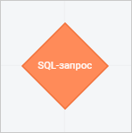
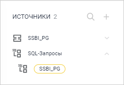

# Создание SQL-запросов

Создание SQL-запросов
-

# Создание SQL-запросов

SQL-запрос - выборка из
 таблиц на основе заданного запроса на языке SQL.

Создание SQL-запросов доступно только для [источников](add_data_sources.htm),
 добавленных при подключении к базе данных.

Для добавления SQL-запроса:

	- Выполните команду  «SQL-запрос» в раскрывающемся меню
	 кнопки  «Действия»
	 требуемого источника данных. Откроется окно создания SQL-запроса:

	- Сформируйте текст запроса на языке SQL в области формул окна.

В боковой панели окна создания SQL-запроса
 приведён список таблиц данных выбранного источника. Для добавления полей
 таблиц в запрос установите фокус ввода в требуемое место в рабочей области
 и выполните одно из действий:

		- выделите поле таблицы и нажмите кнопку «Вставить
		 в формулу»;

		- дважды нажмите на поле таблицы;

		- переместите поле таблицы в область формул с помощью механизма
		 Drag&Drop.

Для быстрого поиска полей начните вводить
 наименование поля частично или целиком в строке поиска. После выполнения
 действия на панели полей будут отображены поля, наименования которых удовлетворяют
 условиям поиска.

Для настройки отображения полей выберите
 способ отображения из раскрывающегося меню кнопки  «Настройки отображения».

Для скрытия боковой панели нажмите кнопку
  «Скрыть боковую панель».

	- Нажмите кнопку «Применить».

В результате на панели источников в источнике «SQL-Запросы»
 отобразится созданный запрос:

Помимо [базовых операций](add_data_sources.htm#operations)
 над источниками данных для SQL-запросов доступны дополнительные операции:

[Редактирование
 SQL-запросов](javascript:TextPopup(this))

	Для редактирования SQL-запроса выполните команду  «Редактировать» в раскрывающемся
	 меню кнопки  «Действия»
	 данного запроса. Откроется окно редактирования SQL-запроса, в котором
	 внесите требуемые изменения.

[Удаление
 SQL-запросов](javascript:TextPopup(this))

	Для удаления SQL-запроса выполните команду  «Удалить» в раскрывающемся меню кнопки
	  «Действия»
	 данного запроса. После подтверждения действия выбранный SQL-запрос
	 будет удалён.

	Для удаления сразу всех SQL-запросов выполните команду  «Удалить»
	 в раскрывающемся меню кнопки  «Действия» источника «SQL-Запросы».
	 После подтверждения действия источник «SQL-Запросы»
	 будет удалён вместе со всеми SQL-запросами.

См. также:

[Добавление
 источников](add_data_sources.htm) | [Добавление объектов
 и связей между ними](../Objects/add_objects.htm)

		Справочная
		 система на версию 10.9
		 от 18/08/2025,
		 © ООО «ФОРСАЙТ»,
