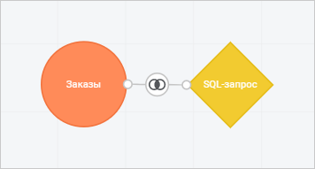
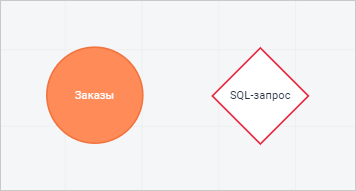
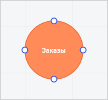
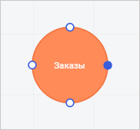
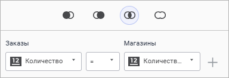
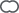
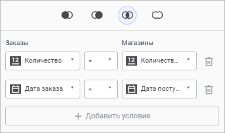

# Добавление объектов и связей между ними

Добавление объектов и связей между ними
-

# Добавление объектов и связей между ними

	При создании модели данных доступно добавление на рабочую область
	 объектов:

		- Круги таблиц. Таблицы
		 из [источников данных](../DataSources/add_data_sources.htm),
		 добавленные на рабочую область:

	

		- SQL-запросы. Выборки
		 из таблиц на основе [заданного
		 SQL-запроса](../DataSources/create_sql.htm):

	

	После добавления объектов необходимо [настроить
	 связи между ними](#relations).

## Добавление объектов

	Для добавления объекта на рабочую область выполните одно из действий:

		- дважды щёлкните по таблице данных или SQL-запросу из [списка источников](../DataSources/add_data_sources.htm);

		- перетащите таблицу данных или SQL-запрос из [списка
		 источников](../DataSources/add_data_sources.htm) на рабочую область с помощью механизма Drag&Drop.

	В результате на рабочей области будут отображаться круги таблиц
	 и/или SQL-запросы.

	Доступные операции над объектами:

	[Переименование
	 объектов](javascript:TextPopup(this))

		Для переименования добавленного объекта:

			- Выполните одно из действий:

				- нажмите кнопку  «Переименовать» в контекстном
				 меню выбранного объекта;

				- дважды щёлкните по наименованию объекта.

			- Удалите старое наименование и введите новое.

		В результате выполнения действий требуемому объекту будет задано
		 новое наименование.

	[Удаление
	 объектов](javascript:TextPopup(this))

		Для удаления добавленного объекта нажмите кнопку  «Удалить»
		 в его контекстном меню.

## Добавление связей

	При добавлении объектов на рабочую область требуется настраивать
	 связи между ними.

	Объекты без настроенных связей выделяются красным цветом:

		Объекты со связью
		 Объекты без связи

			

			

	Доступно ручное и автоматическое добавление связей:

	[Ручное
	 добавление связей](javascript:TextPopup(this))

		Ручное добавление связей выполняется при неактивном переключателе
		 «Автоматические связи»
		 на [панели источников](../create_data_model.htm).

		Для ручного добавления связи между объектами:

			- Наведите курсор на объект. На границе объекта появятся
			 коннекторы:

		

			- Выполните одно из действий:

				- нажмите на один из коннекторов и, удерживая нажатой
				 кнопку мыши, установите появившуюся стрелку на один из
				 коннекторов следующего объекта;

				- нажмите на один из коннекторов. Выбранный коннектор
				 будет подсвечен:

		

		После чего нажмите на один из коннекторов
		 следующего объекта.

		В результате между двумя объектами будет задана связь и откроется
		 [окно настройки связи](#relations_settings).

	[Автоматическое
	 добавление связей](javascript:TextPopup(this))

		Для автоматического добавления связей переведите переключатель
		 «Автоматические связи»
		 в активное положение и добавьте [объекты](#objects)
		 на рабочую область. Автоматическая связь строится по первым найденным
		 совпадениям имён полей.

		Примечание.
		 Автоматическое задание связей выполняется только при добавлении
		 новых кругов таблиц на рабочую область.

	[Удаление
	 связей](javascript:TextPopup(this))

		Для удаления добавленной связи нажмите кнопку  «Удалить»
		 в контекстном меню выбранной связи.

		После добавления объектов на рабочую область и задания связей
		 между ними отфильтруйте построенную модель данных, добавьте при
		 необходимости дополнительные поля и проверьте её корректность
		 с помощью [таблицы предварительного
		 просмотра](../Preview/preview_table.htm).

### Настройка связей

	Настройка связей выполняется в специальном окне настройки:

	[Для открытия
	 окна настройки связей](javascript:TextPopup(this))

		Щёлкните по существующей связи, для которой требуется задать
		 настройки.

	

	Для настройки связей выполните шаги:

		- Выберите тип связи объектов:

			-  Операция левого внешнего соединения
			 (LEFT OUTER JOIN). Из записей двух таблиц выбираются:

				- все записи первой таблицы;

				- только те записи второй таблицы, для которых найдено
				 совпадение с записями первой таблицы по значению связываемого
				 поля. Остальные записи второй таблицы отсекаются;

			-  Операция правого внешнего соединения
			 (RIGHT OUTER JOIN). Из записей двух таблиц выбираются:

				- только те записи первой таблицы, для которых найдено
				 совпадение с записями второй таблицы по значению связываемого
				 поля. Остальные записи первой таблицы отсекаются;

				- все записи второй таблицы;

			-  Операция внутреннего соединения
			 (INNER JOIN). Из записей двух таблиц выбираются только
			 те, у которых совпадают значения связываемых полей. Остальные
			 записи обеих таблиц отсекаются.

	Операция внутреннего соединения выбирается
	 по умолчанию при задании связи;

			-  Операция
			 полного внешнего соединения (FULL OUTER JOIN).
			 Из записей двух таблиц выбираются все записи без отсечений,
			 даже если не совпадают значения связываемых полей.

		- Выберите в раскрывающихся списках поля таблиц, по которым
		 будет создаваться связь.

		- Выберите в раскрывающемся списке условие соответствия
		 полей при объединении таблиц модели данных:

			- =. По умолчанию.
			 Устанавливается автоматическая связь между полями таблиц с
			 совпадающими заголовками;

			- ≠. Происходит
			 объединение в таблицу строк, при условии, что значения поля
			 первой таблицы не равны значениям поля второй таблицы;

			- >. Происходит
			 объединение в таблицу строк, при условии, что значения поля
			 первой таблицы больше, чем значения поля второй таблицы;

			- <. Происходит
			 объединение в таблицу строк, при условии, что значения поля
			 первой таблицы меньше, чем значения поля второй таблицы;

			- >=. Происходит
			 объединение в таблицу строк, при условии, что значения поля
			 первой таблицы больше или равны, чем значения поля второй
			 таблицы;

			- <=. Происходит
			 объединение в таблицу строк, при условии, что значения поля
			 первой таблицы меньше или равны, чем значения поля второй
			 таблицы.

	При необходимости добавьте множественную связь между объектами:

		- Нажмите кнопку  «Добавить условие».

		- Задайте настройки новой связи:

	

См. также:

[Создание
 модели данных](../create_data_model.htm) | [Добавление
 источников](../DataSources/add_data_sources.htm) | [Настройка режимов работы
 с данными](../data_modes.htm) | [Таблица предварительного
 просмотра](../Preview/preview_table.htm)

		Справочная
		 система на версию 10.9
		 от 18/08/2025,
		 © ООО «ФОРСАЙТ»,
