# Таблица предварительного просмотра

Таблица предварительного просмотра
-

# Таблица предварительного просмотра

	Таблица предварительного просмотра
	 используется для проверки корректности сформированной [модели
	 данных](../create_data_model.htm), задания [правил фильтрации](#filtration) данных
	 и добавления в модель [вычисляемых полей](#calculated_field).
	 В этой таблице отображаются первые 200 записей данных модели:

	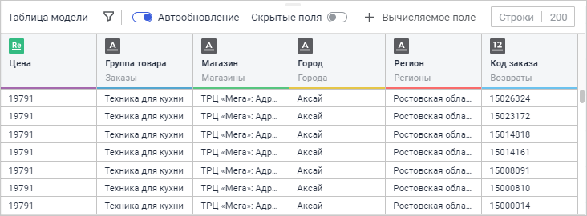

	Поля в таблице предпросмотра имеют ту же цветовую индикацию, что
	 и соответствующие им таблицы из [модели
	 данных](../create_data_model.htm).

	Доступные операции в таблице предварительного просмотра:

		- [настройка высоты таблицы](#height);

		- [переименование полей](#field_renaming);

		- [настройка скрытия/отображения полей](#field_hiding);

		- [автообновление таблицы](#autorefresh);

		- [настройка фильтрации модели данных](#filtration);

		- [создание вычисляемых полей с
		 помощью выражений](#calculated_field).

## Настройка высоты таблицы

	Для изменения высоты таблицы предварительного просмотра:

		- Наведите курсор мыши на верхнюю границу таблицы. Курсор
		 примет вид двойной стрелки.

		- Зажмите кнопку мыши и переместите границу по вертикали.

	В результате выполнения последовательности действий высота таблицы
	 будет изменена.

## Переименование полей

	Для переименования поля:

		- Выполните одно из действий:

			- выполните команду  «Переименовать» в раскрывающемся
			 меню кнопки 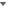 «Действия» в области заголовка
			 поля:

	

			- нажмите по текущему наименованию поля.

		- Задайте новое наименование поля.

	В результате полю будет задано новое наименование.

## Настройка скрытия/отображения полей

	Некоторые поля таблиц в [модели
	 данных](../create_data_model.htm) могут не использоваться для дальнейшего [анализа](../../InformationPanel/data_analysis.htm).
	 Например, это могут быть поля, содержащие коды элементов или вспомогательные
	 значения. В таблице предварительного просмотра имеется возможность
	 скрытия ненужных полей и их отображения.

	Для скрытия поля выполните команду 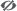 «Скрыть» в раскрывающемся меню кнопки
	  «Действия»
	 в области заголовка поля:

	

	Для отображения скрытого поля выполните команду  «Показать» в раскрывающемся меню
	 кнопки  «Действия»
	 в области заголовка поля.

	Для отображения скрытых полей в таблице предварительного просмотра
	 используйте переключатель «Скрытые
	 поля». По умолчанию переключатель активен и скрытые поля отображаются:

	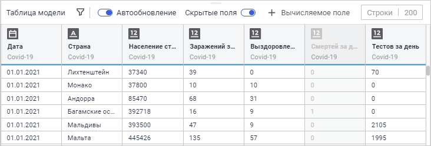

	При переводе переключателя «Скрытые
	 поля» в неактивное состояние скрытые поля перестанут отображаться
	 в таблице:

	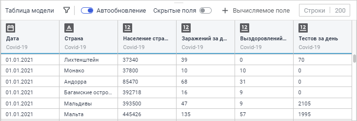

	При отключении отображения скрытых полей данные поля также перестанут
	 отображаться на боковой панели инструмента «Информационная панель».

## Автообновление таблицы

	Для настройки автообновления таблицы предварительного просмотра
	 используйте переключатель «Автообновление».
	 По умолчанию переключатель активен и данные в таблице обновляются
	 при каждом изменении в модели данных.

	При переводе переключателя «Автообновление»
	 в неактивное состояние появляется кнопка  «Обновить данные» для ручного обновления
	 данных:

	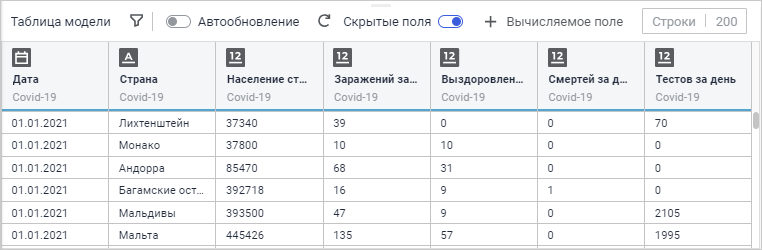

## Настройка фильтрации модели данных

	Таблица предварительного просмотра позволяет задавать правила фильтрации
	 для ограничения выборки данных модели. Для задания правила фильтрации
	 используйте окно «Фильтр модели данных»:

[Для открытия
 окна «Фильтр модели данных»](javascript:TextPopup(this))

	Нажмите кнопку  «Задать фильтр» в таблице предварительного
	 просмотра.

	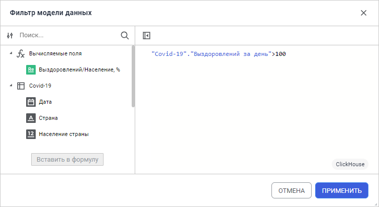

	Особенности задания правила фильтрации описаны в статье «[Задание
	 выражений](expressions.htm)».

	Примечание.
	 В окне «Фильтр модели данных»
	 доступно задание только логических выражений и SQL-запросов, по которым
	 будет производиться фильтрация.

	После задания правила фильтрации таблица предварительного просмотра
	 будет перестроена:

	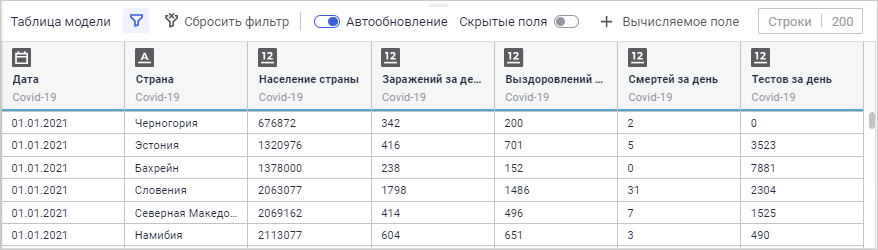

	Для редактирования формулы фильтрации нажмите кнопку  «Редактировать
	 фильтр».

	Для отмены фильтрации нажмите кнопку 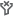 «Сбросить фильтр».

## Создание вычисляемых полей с помощью
	 выражений

	Таблица предварительного просмотра позволяет создавать дополнительные
	 поля, значения которых будут вычисляться по заданным выражениям. Для
	 задания выражения вычисляемого поля используйте окно «Вычисляемое
	 поле»:

[Для открытия
 окна «Вычисляемое поле»](javascript:TextPopup(this))

	Нажмите кнопку 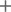 «Вычисляемое поле» в таблице предварительного
	 просмотра.

	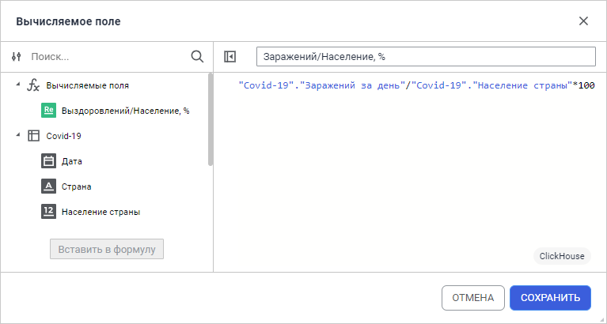

	Особенности задания выражений для вычисляемых полей описаны в статье
	 «[Задание выражений](expressions.htm)».

	Примечание.
	 В окне «Вычисляемое поле»
	 доступно задание выражений любого типа, а также SQL-запросов. Если
	 для вычисляемого поля задано логическое выражение, то поле будет принимать
	 только значения «0» для ложного выражения и «1» для истинного выражения.

	После создания вычисляемое поле будет отображаться в таблице предварительного
	 просмотра:

	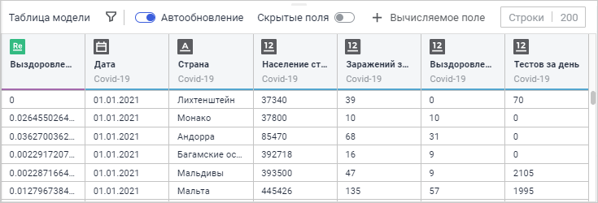

	Созданное поле также будет отображаться на боковой панели инструмента
	 «Информационная панель».

	Операции над вычисляемыми полями:

	[Переименование
	 поля](javascript:TextPopup(this))

		Для вычисляемого поля доступна операция [переименования](#field_renaming)
		 поля. При переименовании вычисляемого поля его новое наименование
		 будет отображено в редакторе формул и на [боковой
		 панели](../../InformationPanel/Starting.htm#structure_window) инструмента «Информационная панель».

	[Настройка
	 скрытия/отображения поля](javascript:TextPopup(this))

		Для вычисляемого поля доступна [настройка
		 скрытия/отображения](#field_hiding).

	[Редактирование
	 выражения](javascript:TextPopup(this))

		Для редактирования выражения вычисляемого поля выполните команду
		  «Редактировать
		 формулу» в раскрывающемся меню кнопки  «Действия» в области заголовка
		 поля.

	[Настройка
	 геороли](javascript:TextPopup(this))

		Для настройки геороли выполните команду 
		 «Геороль» в раскрывающемся
		 меню кнопки  «Действия»
		 для вычисляемого поля и выберите вариант «Широта»
		 или «Долгота».

	[Удаление
	 вычисляемого поля](javascript:TextPopup(this))

		Для удаления вычисляемого поля выполните команду  «Удалить»
		 в раскрывающемся меню кнопки  «Действия» в области заголовка
		 поля.

См. также:

[Начало
 работы с инструментом «Модель данных»](../create_data_model.htm) | [Добавление
 источников](../DataSources/add_data_sources.htm)

		Справочная
		 система на версию 10.9
		 от 18/08/2025,
		 © ООО «ФОРСАЙТ»,
