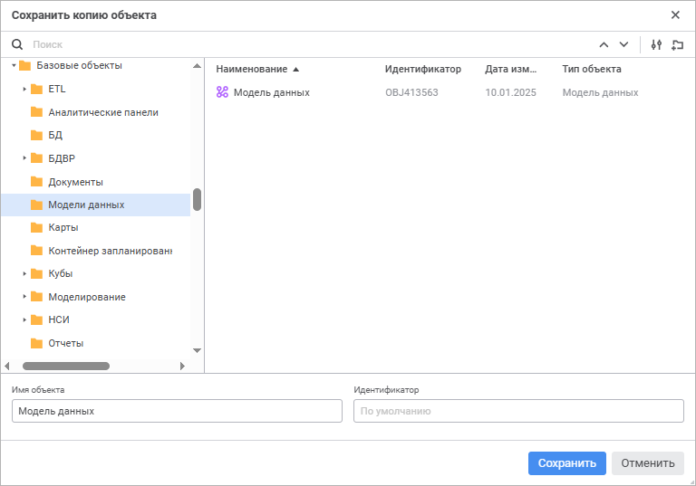

# Создание копии модели данных

Создание копии модели данных
-

# Создание копии модели данных

Для создания копии модели данных выполните команду «Сохранить
 как» в раскрывающемся меню кнопки «Сохранить»
 [главного меню](../InformationPanel/Starting.htm#structure_window).
 Будет открыто окно «Сохранить копию объекта»:

Для сохранения копии модели данных:

	- Выберите расположение сохраняемой модели данных в дереве объектов.

	- Нажмите кнопку  «Создать папку» для добавления новой
	 папки при необходимости и задайте её наименование.

	- Найдите существующую модель данных для выбора местоположения
	 сохранения копии или для использования её названия при необходимости.
	 Для быстрого выбора существующей модели данных в поле для поиска введите
	 её название/идентификатор/ключ в зависимости от выбранных вариантов
	 поиска объекта и нажмите клавишу ENTER. Передвигайтесь между результатами
	 поиска с помощью кнопок:

		-  «Найти
		 предыдущее» для перехода к предыдущему результату поиска;

		-  «Найти
		 далее» или клавиши ENTER для перехода к следующему результату
		 поиска.

Для настройки поиска нажмите кнопку  «Параметры поиска» и выберите в раскрывающемся
 меню:

		- вариант поиска объекта:

			- Искать по именам.
			 Флажок установлен по умолчанию. Поиск будет осуществляться
			 по именам объектов;

			- Искать по идентификаторам.
			 Флажок установлен по умолчанию. Поиск будет осуществляться
			 по идентификаторам объектов;

			- Искать по ключам.
			 Флажок установлен по умолчанию. Поиск будет осуществляться
			 по ключам объектов;

		- Учитывать регистр.
		 Поиск будет осуществляться с учётом регистра букв. Например, если
		 в поле поиска указано «Объект»,
		 то объекты, содержащие в наименовании и/или идентификаторе «объект» и «ОБЪЕКТ»,
		 найдены не будут;

		- Только слова целиком.
		 Поиск будет осуществляться только по объектам, содержащим в наименовании
		 и/или идентификаторе строку, полностью и точно совпадающую со
		 строкой, введённой в поле поиска.

	- Укажите следующие параметры:

		- Имя объекта. Введите
		 наименование копии модели данных. По умолчанию установлено наименование
		 текущей модели данных;

		- Идентификатор. Введите
		 уникальный идентификатор копии модели данных. Идентификатор может
		 состоять только из букв латинского алфавита, цифр и знака «_»
		 и не должен начинаться с цифр.

При пустых полях имя объекта и идентификатор
 модели данных устанавливаются автоматически.

При создании копии модели данных в репозитории создаётся новая модель
 данных, которая сразу же открывается для работы с ней.

Если объект с идентификатором, указанным в окне «Сохранить
 копию объекта», уже существует, то при попытке создания копии модели
 данных появится окно подтверждения действия. Подтвердите действие для
 замены существующего объекта копией модели данных.

См. также:

[Создание
 модели данных](create_data_model.htm) | [Построение
 модели данных](Building_Data_Model.htm)

		Справочная
		 система на версию 10.9
		 от 18/08/2025,
		 © ООО «ФОРСАЙТ»,
