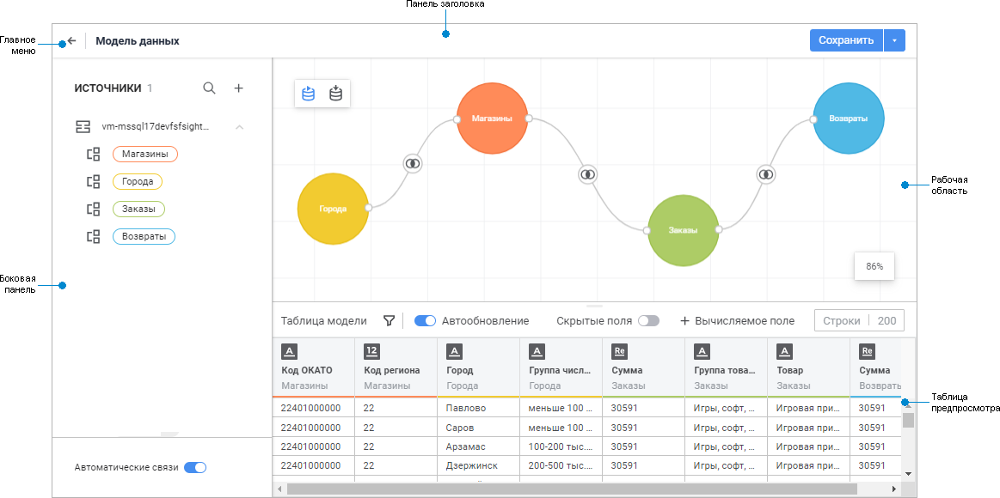

# Создание модели данных

Создание модели данных
-

# Создание модели данных

Модель данных - это совокупность
 таблиц из различных источников, соединённых друг с другом с помощью определённых
 в системе связей. Модель данных сопровождается визуальными элементами:
 кругами таблиц и SQL-запросами со связями на рабочей области, а также
 таблицей предварительного просмотра модели.

[Создание новой
 модели данных](javascript:TextPopup(this))

	Для создания новой модели данных:

		- в [навигаторе
		 объектов](GetStarted.chm::/Interface/interface_navigator.htm):

			- Выполните одно из действий:

				- нажмите кнопку «Создать»
				 главного меню;

				- выполните команду «Создать»
				 контекстного меню списка объектов;

			- Выберите «Модель данных»
			 на открывшейся панели «Новый
			 объект».

		- в [инструменте
		 «Информационная панель»](../InformationPanel/Starting.htm)
		 выполните команду  «
		 Добавить модель > Создать
		 новую» в раскрывающемся меню кнопки 
		 «Действия» в верхней части
		 боковой панели.

	Примечание.
	 Нажмите на кнопку  «Создать
	 модель данных» в центральной части боковой панели, если не
	 добавлен ни один источник.

	После создания модели данных выполните [её
	 построение](Building_Data_Model.htm).

[Открытие готовой
 модели данных](javascript:TextPopup(this))

	Для открытия готовой модели данных:

		- в [навигаторе
		 объектов](GetStarted.chm::/Interface/interface_navigator.htm):

			- выполните команду «Редактировать»
			 в контекстном меню модели данных;

			- выполните команду «Редактировать
			 в новой вкладке» в контекстном меню модели данных;

			- выполните команду «Редактировать
			 в новом окне» в контекстном меню модели данных;

			- дважды щёлкните по модели данных;

			- выделите модель данных и нажмите кнопку ENTER;

		- в [инструменте
		 «Информационная панель»](../InformationPanel/Starting.htm):

			- Выберите модель данных в раскрывающемся списке «Источники» в верхней части
			 боковой панели.

			- Выполните команду  «Редактировать
			 модель» в раскрывающемся меню кнопки  «Действия».

	Выбранная модель данных будет открыта
	 на отдельной вкладке браузера.

Пользовательский интерфейс модели данных:

[Элементы пользовательского
 интерфейса](javascript:TextPopup(this))

		- Главное меню. Содержит
		 кнопки и список команд, предназначенные для работы с моделью данных,
		 и кнопку для возвращения в навигатор. Также доступно сохранение
		 модели данных и [создание её копии](Save.htm).

		- Панель заголовка.
		 Содержит поле ввода названия модели данных.

		- Боковая панель.
		 Содержит список всех измерений, фактов и вычисляемых полей таблиц,
		 добавленных в модель данных, а также настройки полей визуализаторов.

		- Панель настроек.
		 Содержит настройки отображения и экспорта визуализаторов и слайдов
		 для их размещения.

		- Рабочая область.
		 Содержит инструменты для проведения анализа данных.

Таблицы на панели источников, [объекты](Objects/add_objects.htm)
 на рабочей области и соответствующие им поля в [таблице
 предпросмотра](Preview/preview_table.htm) имеют одинаковую цветовую индикацию.

Перед созданием модели данных выполните [настройку
 рабочей области](data_model_workspace_features.htm), если потребуется.

## Операции с моделью данных

При работе с моделью данных доступны следующие операции:

[Редактирование
 готовой модели данных](javascript:TextPopup(this))

	Для редактирования готовой модели данных:

		- в [навигаторе
		 объектов](GetStarted.chm::/Interface/interface_navigator.htm) выполните одно из действий:

			- выполните команду «Редактировать»
			 контекстного меню модели данных;

			- выполните команду «Редактировать
			 в новой вкладке» в контекстном меню модели данных;

			- выполните команду «Редактировать
			 в новом окне» в контекстном меню модели данных;

			- выделите модель данных и нажмите кнопку F4;

		- в [инструменте
		 «Информационная панель»](../InformationPanel/Starting.htm)
		 выполните команду «Редактировать
		 модель» в раскрывающемся меню кнопки 
		 «Действия» для [выбранной
		 модели данных](../InformationPanel/Building/Source.htm).

[Изменение названия
 модели данных](javascript:TextPopup(this))

	Для изменения названия модели данных измените наименование модели
	 данных в [главном
	 меню](create_data_model.htm#structure_window).

[Удаление модели
 данных](javascript:TextPopup(this))

	Для удаления готовой модели данных в [навигаторе
	 объектов](GetStarted.chm::/Interface/interface_navigator.htm) выполните одно из действий:

		- выполните команду 
		 «Удалить» контекстного
		 меню модели данных;

		- выделите модель данных и нажмите кнопку DELETE.

	Примечание.
	 Удаление модели данных возможно, если модель не используется в проекте,
	 иначе будет выведено соответствующее информационное окно.

[Перенос модели
 данных между репозиториями](javascript:TextPopup(this))

	При работе с моделью данных доступно [добавление
	 в обновление](UpdManager.chm::/Admin_UpMBObj_RunManager.htm#create_update) для переноса между репозиториями.
	 Для получения подробной информации об особенностях обновления модели
	 данных обратитесь к разделу «[Особенности установки
	 обновления](updmanager.chm::/UPD_features.htm#data_model)».

См. также:

[Настройка
 рабочей области](data_model_workspace_features.htm) | [Построение модели
 данных](Building_Data_Model.htm) | [Начало работы
 с инструментом «Информационная панель»](../InformationPanel/Starting.htm)

		Справочная
		 система на версию 10.9
		 от 18/08/2025,
		 © ООО «ФОРСАЙТ»,
