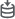
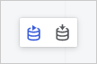
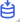
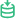

# Настройка режимов работы с данными

Настройка режимов работы с данными
-

# Настройка режимов работы с данными

	Для работы с данными [добавленных
	 источников](DataSources/add_data_sources.htm) доступны режимы [прямого подключения](#live)
	 и [извлечения данных](#extract).

	Примечание.
	 Извлечение данных доступно только для репозитория, [подключенного
	 к серверу СУБД PostgreSQL](DataSources/add_data_sources.htm).

	Переход между режимами осуществляется с помощью кнопок  «Прямое
	 подключение» и  «Извлечение
	 данных» на панели режимов:

	

## Прямое подключение

	Прямое подключение включено по умолчанию при создании [модели
	 данных](create_data_model.htm). В режиме прямого подключения модель данных, таблица предварительного
	 просмотра и данные визуализаторов регулярно запрашиваются непосредственно
	 из источника и всегда актуальны.

	Режим прямого подключения к данным подходит для работы с небольшим
	 объёмом данных из однородных источников. Под однородными источниками
	 подразумеваются базы данных с одинаковым типом клиента СУБД.

## Извлечение данных

	В режиме извлечения данных все данные таблиц созданной модели извлекаются
	 в специальную колоночную СУБД. Для поддержания актуальности данных
	 необходимо обновлять таблицы.

	Режим извлечения данных значительно ускоряет работу с данными и
	 визуализаторами. Данный режим подходит для работы с большими данными
	 и поддерживает разнородные источники в одной модели - базы данных
	 с разными типами клиента СУБД и пользовательские файлы.

	Примечание.
	 При использовании разнородных источников в режиме прямого подключения
	 неподдерживаемые таблицы отображаются недоступными, а на панели режимов
	 отображается всплывающее сообщение о том, что работа с разнородными
	 источниками доступна в режиме извлечения данных.

	В режиме извлечения данных данные из разнородных источников выгружаются
	 в БД ClickHouse. Для корректной работы режима выполните установку
	 и настройку [ClickHouse](ClickHouse.htm).

	При переходе в режим извлечения данных появится окно подтверждения
	 действия с предупреждением о необходимости ручного обновления данных.
	 После подтверждения действия режим будет переключён, а данные из источников
	 будут перегружены в фоновом режиме. Кнопка «Извлечение
	 данных» примет вид: .

###

### Ручное обновление данных

	При изменении данных в исходных таблицах необходимо обновить их
	 вручную.

	Для обновления данных конкретной таблицы модели данных выполните
	 команду  «Обновить»
	 её контекстного меню.

	Для обновления всех таблиц модели данных:

		- Нажмите кнопку  «Извлечение данных» на панели
		 режимов [в рабочей
		 области](create_data_model.htm#structure_window).

		- Выберите вариант «Обновить»
		 в раскрывающемся меню кнопки.

### Статус извлечения данных

	Статус извлечения данных отображается в виде индикатора  [в
	 главном меню](create_data_model.htm#structure_window) модели данных:

		-  - извлечение данных завершено успешно.
		 При наведении курсора на индикатор появится всплывающее сообщение
		 с информацией о количестве извлечённых таблиц;

		-  - выполняется извлечение данных;

		-  - ошибка в извлечении данных. При наведении
		 курсора на индикатор появляется всплывающее сообщение с наименованием
		 таблицы, при извлечении которой появилась ошибка.

	См. также:

	[Начало
	 работы с инструментом «Модель данных»](create_data_model.htm) | [Добавление
	 источников](DataSources/add_data_sources.htm)

		Справочная
		 система на версию 10.9
		 от 18/08/2025,
		 © ООО «ФОРСАЙТ»,
