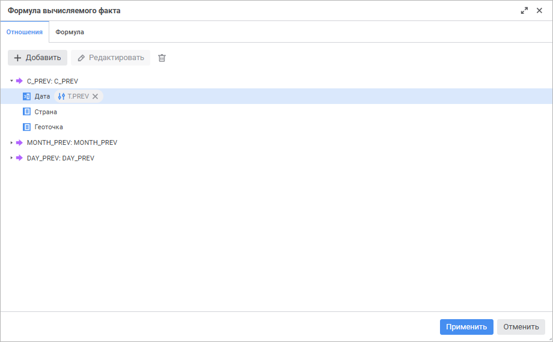
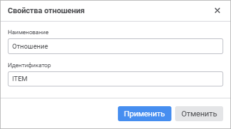
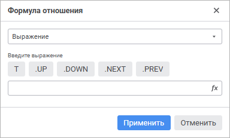
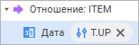
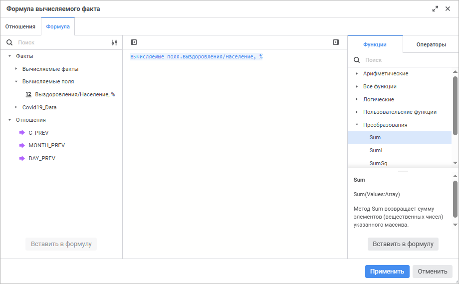
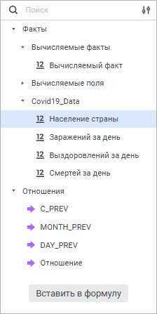
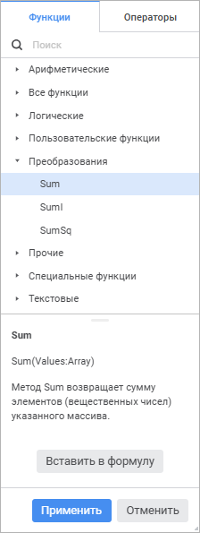

# Редактор выражения: Информационные панели

Редактор выражения: Информационные панели
-

# Редактор выражения

Для настройки формулы расчёта значения [вычисляемых
 фактов](calculated_facts.htm) используйте окно редактора выражения.

[Для
 открытия окна редактора выражений](javascript:TextPopup(this))

	Нажмите кнопку  «Вставить
	 формулу» в окне [настройки вычисляемого
	 факта](calculated_facts.htm).

	Отношения
	 Формула

		Отношения позволяют
		 получать значения путём смещения относительно текущей точки расчёта.

		Окно редактора выражения для задания формулы отношения имеет
		 вид:

		

		Для добавления отношения нажмите кнопку 
		 «Добавить». После выполнения
		 действия будет добавлено отношение со свойствами по умолчанию.
		 Под добавленным отношением будут отображены все измерения модели
		 данных.

		Для редактирования настроек выбранного отношения нажмите кнопку
		  «Редактировать».
		 Будет открыто окно «Свойства
		 отношения»:

		

		Задайте параметры:

			- Наименование.
			 Введите краткое описание отношения. По умолчанию задано наименование
			 «Отношение»;

			- Идентификатор.
			 Введите уникальный идентификатор отношения. По умолчанию задан
			 идентификатор ITEM.

		Для сохранения свойств отношения нажмите кнопку «Применить».

		Для удаления выбранного отношения нажмите кнопку  «Удалить».

		Для настройки отношения выбранного измерения:

			- Выполните одно из действий:

				- нажмите кнопку  «Редактировать»;

				- дважды щёлкните кнопкой
				 мыши по выбранному измерению;

				- выполните команду  «Формула
				 отношения», если для выбранного измерения была
				 настроена формула отношения.

		Будет открыто окно «Формула
		 отношения»:

		

			- Выберите в раскрывающемся списке, каким образом будет
			 задаваться формула отношения:

				- Не задано.
				 По умолчанию. В качестве позиции по измерению будет взята
				 текущая позиция;

				- Уровней вверх.
				 Результатом применения отношения будет элемент-владелец,
				 отстоящий на указанное количество уровней от текущего
				 элемента. В редакторе чисел задайте количество уровней.
				 Количество уровней вверх не может превышать общего количества
				 уровней минус один;

				- Элементов назад.
				 Результатом применения отношения будет элемент того же
				 уровня, отстоящий на указанный порядковый номер от текущего
				 элемента. В редакторе чисел задайте порядковый номер;

				- Указанный элемент. Результатом
				 применения отношения будет элемент, выбранный в раскрывающемся
				 списке;

				- Выражение.
				 Результатом применения отношения будет элемент, индекс
				 которого вычисляется по заданному выражению. Выражение
				 задается с помощью кнопок, расположенных рядом с полем
				 ввода, или с помощью редактора выражения. Составление
				 выражения требуется начинать с текущего элемента измерения,
				 для этого используйте кнопку «Т». Далее можно указать
				 смещение, например: T.PREV, T.PREV.UP, T.UP.NEXT и т.д.
				 Для составления выражения используйте кнопки:

					- T. Текущий
					 элемент. Следует всегда использовать при составлении
					 выражения;

					- UP.
					 На один уровень вверх;

					- DOWN.
					 На один уровень вниз;

					- NEXT.
					 Следующий элемент;

					- PREV.
					 Предыдущий элемент.

		Для вызова редактора выражения нажмите
		 кнопку  «Вставить
		 формулу».

		Для вычисления индекса элемента в
		 выражении можно использовать различные арифметические, логические,
		 текстовые функции, пользовательские функции и функции преобразования.

		После настройки напротив измерения
		 появится формула отношения, например:

		

		Добавленные отношения доступны для
		 [настройки вычисляемых фактов](calculated_facts.htm).

		Для удаления формулы отношения выбранного измерения нажмите
		 кнопку  «Очистить».

		При редактировании формулы отношений будут обновлены все формулы,
		 в которых использовалось это отношение.

		Вычисляемый факт представляет
		 собой функцию от значений других фактов, вычисляемых фактов или
		 отношений.

		Окно редактора выражения для задания формулы вычисляемого факта
		 имеет вид:

		

		Сформируйте формулу, по которой будет рассчитываться вычисляемый
		 факт.

		В формуле допускается использование арифметических операций,
		 функций, цифр, знаков сравнения и круглых скобок. При этом имеются
		 некоторые особенности:

			- вставка функций может осуществляться как с помощью клавиатуры,
			 так и с помощью специальной панели;

			- вставка цифр осуществляется только с помощью клавиатуры.

[Вставка операндов](javascript:TextPopup(this))

	Операнд - это элемент данных,
	 над которым выполняются действия при расчёте выражения. В редакторе
	 выражения операнды вставляются с помощью панели данных и отображаются
	 в выражении в фигурных скобках.

	Операнды отображаются на панели операндов редактора выражения:

	

	В качестве операндов используются:

		- [поля
		 таблицы модели данных](../../DataModel/Preview/preview_table.htm), в том числе [вычисляемые
		 поля](../../DataModel/Preview/preview_table.htm#calculated_field);

		- [SQL-запросы](../../DataModel/DataSources/create_sql.htm),
		 добавленные в [модель
		 данных](../../DataModel/create_data_model.htm);

		- [вычисляемые факты](calculated_facts.htm).

	Для вставки операнда в область формул выполните одно из действий:

		- с помощью панели операндов:

			- выделите операнд и нажмите кнопку «Вставить
			 в формулу»;

			- дважды щёлкните левой кнопкой мыши по операнду;

			- переместите операнд в область формул с помощью механизма
			 Drag&Drop;

		- с помощью области формул:

			- введите наименование операнда в области формул;

			- щёлкните в области формул в том месте, куда нужно вставить
			 операнд, нажмите сочетание клавиш CTRL+ПРОБЕЛ и выберите на
			 всплывающей панели требуемый операнд.

	Для быстрого поиска полей начните вводить наименование поля частично
	 или целиком в строке поиска. После выполнения действия на панели полей
	 будут отображены поля, наименования которых удовлетворяют условиям
	 поиска.

	Для настройки отображения полей выберите способ отображения из раскрывающегося
	 меню кнопки  «Настройки
	 отображения»:

		- Наименование. По
		 умолчанию. Отображение только наименований операндов;

		- Идентификатор. Отображение
		 только идентификаторов операндов;

		- Наименование и идентификатор.
		 Отображение наименований и идентификаторов операндов в формате:
		 <наименование> (<идентификатор>).

	Для скрытия панели операндов нажмите кнопку  «Скрыть панель операндов», для отображения
	 - нажмите кнопку 
	 «Отобразить панель операндов».

	Особенности использования в формулах вычисляемых полей:

		- вычисляемые поля, которые имеют в своей формуле другие вычисляемые
		 поля, считаются обычными вычисляемыми полями. Для них доступны
		 операции, аналогичные операциям над обычными вычисляемыми полями:
		 редактирование, сохранение, валидация, агрегация, добавление в
		 визуализаторы и др.;

		- сохранённые изменения вычисляемого поля учитываются при
		 расчёте другого вычисляемого поля или фильтра, построенного на
		 этом вычисляемом поле;

		- если вычисляемое поле стало некорректным, то другое вычисляемое
		 поле или фильтр, которые построены на этом вычисляемом поле, также
		 становятся некорректными. Некорректные поля будут скрыты на [боковой
		 панели](Visualizers/Visualization/visualization_setting.htm#side_panel). Визуализаторы, построенные на данных некорректных
		 полей, становятся некорректными;

		- при удалении вычисляемого поля, используемого в формуле
		 другого вычисляемого поля или в фильтре, будет сообщено о том,
		 что такое поле не может быть удалено.

[Вставка функций
 и операторов](javascript:TextPopup(this))

	Функция - это последовательность
	 действий, выполняемых над операндом при расчёте выражения.

	Оператор - это отдельное
	 действие, выполняемое над операндом при расчёте выражения.

	В редакторе выражения функции и операторы могут быть вставлены с
	 помощью панели функций или введены с клавиатуры.

	Функции и операторы отображаются на панели функций и операторов
	 на соответствующих вкладках:

	

	Для вставки функции или оператора в область формул выполните одно
	 из действий:

		- с помощью панели функций и операторов:

			- выделите функцию/оператор. Отобразится панель с описанием.
			 Нажмите кнопку «Вставить
			 в формулу»;

			- дважды щёлкните по функции/оператору;

			- перенесите функцию/оператор в область формул с помощью
			 механизма Drag&Drop;

		- с помощью области формул:

			- введите функцию/оператор в области формул;

			- щёлкните в области формул в том месте, куда нужно вставить
			 функцию/оператор, нажмите сочетание клавиш CTRL+ПРОБЕЛ и выберите
			 на всплывающей панели требуемую функцию/оператор.

	Для быстрого поиска функции или оператора начните вводить функцию/оператор
	 частично или целиком в строке поиска. После выполнения действия на
	 панели функций и операторов будут отображены функции/операторы, удовлетворяющие
	 условиям поиска.

	Для скрытия панели функций и операторов нажмите кнопку  «Скрыть
	 панель функций и операторов», для отображения - нажмите кнопку
	  «Отобразить
	 панель функций и операторов».

[Вставка символов](javascript:TextPopup(this))

	В формулах допускается использование символов: букв, цифр, знаков
	 сравнения и круглых скобок.

	Для использования символов в выражении введите их с помощью клавиатуры.
	 Текстовые константы заключаются в одинарные кавычки (').

[Работа с буфером
 обмена](javascript:TextPopup(this))

	Для копирования формулы в буфер обмена:

		- Выделите формулу.

		- Нажмите сочетание клавиш CTRL+C.

	Для вставки формулы из буфера обмена:

		- Установите курсор в место вставки формулы.

		- Нажмите сочетание клавиш CTRL+V.

Для применения заданной формулы и закрытия окна «Формула
 вычисляемого факта» нажмите кнопку «Применить».
 Сохранённая формула будет отображаться в [строке
 ввода формулы](calculated_facts.htm#formula) в окне «Создание вычисляемого
 факта»/«Настройки вычисляемого
 факта».

Проверка корректности формулы выполняется автоматически в процессе её
 настройки. Текст ошибки выводится на панель ошибок с указанием позиции,
 в которой допущена ошибка. Для установки курсора в место возникновения
 ошибки нажмите на панель ошибок.

См. также:

[Настройка
 вычисляемых фактов](calculated_facts.htm)

		Справочная
		 система на версию 10.9
		 от 18/08/2025,
		 © ООО «ФОРСАЙТ»,
