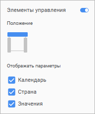
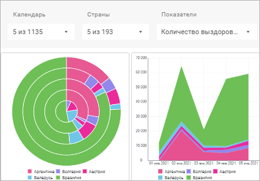
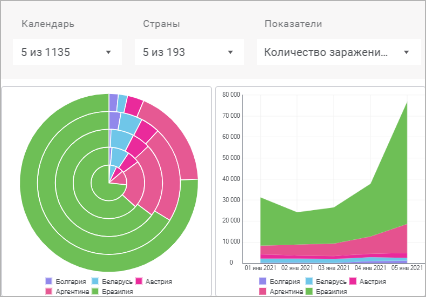

# Синхронизация визуализаторов на слайде

Синхронизация визуализаторов на слайде
-

# Синхронизация визуализаторов на слайде

	Синхронизация позволяет
	 управлять отметками одинаковых измерений сразу нескольких [визуализаторов](../Visualizers/visualizers.htm),
	 расположенных на одном [слайде](frames.htm).

	Доступные типы синхронизации:

		- [синхронизация по отметке](#mark);

		- [синхронизация по выделению](#selection).

	Примечание.
	 Доступно одновременное использование синхронизации по отметке и синхронизации
	 по выделению.

## Синхронизация по отметке

	Для применения синхронизации по отметке:

		- Активируйте режим синхронизации по отметке для слайда:

			- нажмите кнопку 
			 «Действие» на
			 вкладке соответствующего слайда и в раскрывшемся меню выберите
			  «Синхронизация»;

			- переведите переключатель «Синхронизация»
			 на [панели
			 настроек](../Visualizers/Visualization/visualization_setting.htm#settings_panel) слайда в активное состояние;

	На панели настроек появится список всех
	 визуализаторов, расположенных на слайде.

		- Активируйте режим синхронизации для визуализаторов на слайде.
		 Для этого установите флажки напротив требуемых визуализаторов
		 на [панели
		 настроек](../Visualizers/Visualization/visualization_setting.htm#settings_panel):

	

	В результате будет активирована синхронизация
	 по отметке для выбранных визуализаторов на слайде.

### Отключение синхронизации

	Для отключения режима синхронизации для визуализатора снимите с
	 него флажок в списке визуализаторов на [панели
	 настроек](../Visualizers/Visualization/visualization_setting.htm#settings_panel).

	Для отключения режима синхронизации для слайда:

		- нажмите кнопку 
		 «Действие» на вкладке
		 соответствующего слайда и в раскрывшемся меню выберите  «Синхронизация»;

		- переведите переключатель «Синхронизация»
		 на [панели
		 настроек](../Visualizers/Visualization/visualization_setting.htm#settings_panel) в неактивное состояние.

### Настройка элементов управления

	Для настройки элементов управления:

		- Включите [синхронизацию по отметке](#mark).

		- Переведите переключатель «Элементы
		 управления» на [панели
		 настроек](../Visualizers/Visualization/visualization_setting.htm#settings_panel) в активное состояние.

	В результате на панели настроек отобразятся настройки элементов
	 управления:

	

	Выберите расположение элементов управления на слайде, а также установите
	 флажки около параметров, которыми требуется управлять.

	После выполнения настроек в верхней части слайда отобразятся элементы
	 управления выбранных параметров визуализаторов:

	

	При изменении отметок измерений в элементах управления автоматически
	 будут перестраиваться все синхронизируемые визуализаторы:

	

	Дополнительные настройки элементов управления:

	[Изменение
	 ширины элементов управления](javascript:TextPopup(this))

		Для изменения ширины элемента управления:

			- Наведите курсор на правую границу элемента управления
			 на слайде. Курсор примет вид двунаправленной стрелки.

			- Зажмите кнопку мыши и потяните границу влево или вправо.

		В результате для элемента управления будет задана новая ширина.

	[Переименование
	 элементов управления](javascript:TextPopup(this))

		Для переименования элемента управления:

			- Нажмите по наименованию элемента управления на слайде.

			- Удалите старое наименование и введите новое.

		В результате для элемента управления будет задано новое наименование.

	[Изменение
	 порядка элементов управления](javascript:TextPopup(this))

		Для изменения порядка следования элементов управления на слайде
		 перетащите их с помощью механизма Drag&Drop.

## Синхронизация по выделению

	Синхронизация по выделению позволяет перестраивать визуализаторы
	 на слайде в соответствии с заданным выделением данных. При настроенной
	 синхронизации по выделению выделение данных на одном визуализаторе
	 автоматически приводит к отображению тех же выделенных данных на другом
	 визуализаторе, при этом:

		- для измерений, расположенных в [строках
		 и столбцах](../Visualizers/Visualization/visualization_setting.htm#rows_and_columns), отметка в [настройках
		 фильтра](../Visualizers/Visualization/visualization_setting.htm#dim_filter) не изменяется;

		- для фиксированных и исключённых из построения измерений
		 отметка в [настройках
		 фильтра](../Visualizers/Visualization/visualization_setting.htm#dim_filter) изменяется.

	Примечание.
	 Синхронизация доступна для визуализаторов, имеющих измерения, у которых
	 совпадают идентификаторы/наименования.

	Для настройки синхронизации по выделению выбранных визуализаторов:

		- Перейдите в группу параметров «Синхронизация»
		 [панели
		 настроек](../Visualizers/Visualization/visualization_setting.htm#settings_panel):

	

		- Установите флажки:

			- Передавать.
			 Управляющий визуализатор будет передавать выделенные данные
			 в другие визуализаторы, участвующие в синхронизации. По умолчанию
			 флажок установлен;

	Примечание.
	 Флажок «Передавать» доступен
	 для всех типов визуализаторов, кроме [Sankey-диаграммы](../Visualizers/Visualization/visualizer_types.htm#sankey),
	 [диаграммы
	 рассеяния](../Visualizers/Visualization/visualizer_types.htm#scatterplot), [индикатора](../Visualizers/Visualization/Indicator.htm),
	 [карты](../Visualizers/Visualization/Map.htm) и пользовательских
	 шаблонов диаграмм.

			- Принимать. Управляемый
			 визуализатор будет принимать выделенные данные из визуализаторов,
			 участвующих в синхронизации. По умолчанию флажок установлен.

	В результате при выделении данных в управляющем визуализаторе будут
	 перестраиваться данные в управляемых визуализаторах слайда. По умолчанию
	 все визуализаторы участвуют в синхронизации по выделению, как принимающие
	 и передающие.

	Если в управляемом визуализаторе отсутствуют измерения,
	 которые имеются в управляющем, они автоматически будут добавлены
	 в область «Фильтр» управляемого визуализатора.
	 Такие измерения недоступны для редактирования.

### Отключение синхронизации

	Для исключения визуализатора из синхронизации снимите флажки «Передавать» и «Принимать»
	 в группе параметров «Синхронизация»
	 на [панели
	 настроек](../Visualizers/Visualization/visualization_setting.htm#settings_panel).

### Сброс выделения данных при синхронизации

	Сброс синхронизации данных по выделению доступен для активной вкладки
	 [слайда](frames.htm) информационной панели, открытой в
	 [режимах редактирования и просмотра](../../Starting.htm).

	Для сброса синхронизации по выделению:

		- [Выделите
		 визуализатор](../Visualizers/visualizers.htm#select).

		- Нажмите кнопку  «Сбросить выделение» на всплывающей
		 панели инструментов.

	Примечание.
	 Кнопка  «Сбросить
	 выделение» на панели инструментов активна, если на слайде есть
	 визуализаторы с настроенной синхронизацией данных по выделению.

	Все визуализаторы слайда с
	 настроенной синхронизацией будут перестроены по [отметке](../Selecting_Dimension_Elements.htm),
	 заданной в области «[Поля](../Visualizers/Visualization/visualization_setting.htm#fields)»
	 на [боковой
	 панели](../Visualizers/Visualization/visualization_setting.htm#side_panel), выделение данных будет сброшено, автоматически добавленные
	 в область «Фильтр» измерения
	 будут удалены для всех визуализаторов, участвующих в синхронизации
	 данных по выделению.

### Особенности работы с синхронизацией по выделению

		- При [сохранении информационной панели](../Save.htm)
		 выделение данных в управляющем визуализаторе сохраняется и отображается
		 при повторном [открытии информационной
		 панели](../../Starting.htm) в режиме просмотра и в режиме редактирования. Выделение
		 данных в информационной панели, открытой в режиме просмотра, не
		 сохраняется.

		- При [копировании](../Visualizers/visualizers.htm#copy)
		 или [дублировании](../Visualizers/visualizers.htm#duplicate)
		 визуализатора копируются настройки синхронизации.

		- Если
		 к визуализатору была применена синхронизация по выделению, то
		 при изменении [отметки](../Selecting_Dimension_Elements.htm)
		 элементов измерения заданное выделение данных будет сброшено.
		 В случае выделения всех данных при смене отметки будут выделены
		 все данные.

		- Автоматически добавленные в управляемые визуализаторы измерения
		 удаляются в следующих случаях:

			- для управляющего визуализатора был снят флажок «[Передавать](#transfer)»,
			 т.е. визуализатор стал управляемым;

			- управляющий визуализатор был [удалён](../Visualizers/visualizers.htm#delete)
			 со слайда;

			- из [источника данных](../Source.htm) были
			 удалены измерения, на основе которых построен управляющий
			 визуализатор.

См. также:

[Добавление
 визуализаторов и работа с ними](../Visualizers/visualizers.htm) | [Настройка
 визуализации данных](../Visualizers/Visualization/visualization_setting.htm) | [Добавление слайдов и работа
 с ними](frames.htm)

		Справочная
		 система на версию 10.9
		 от 18/08/2025,
		 © ООО «ФОРСАЙТ»,
