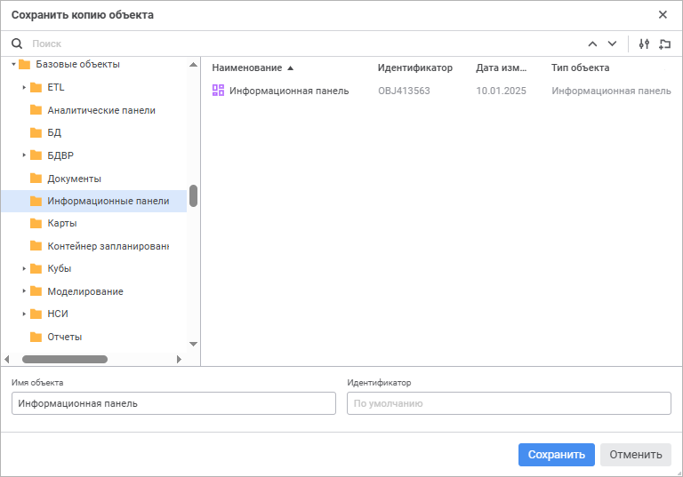

# Создание копии информационной панели

Создание копии информационной панели
-

# Создание копии информационной панели

Для создания копии информационной панели выполните команду «Сохранить
 как» в раскрывающемся меню кнопки «Сохранить»
 [главного меню](../Starting.htm#structure_window). Будет открыто
 окно «Сохранить копию объекта»:

Для сохранения копии информационной панели:

	- Выберите расположение копии сохраняемой информационной
	 панели в дереве объектов.

	- Нажмите кнопку  «Создать папку» для добавления новой
	 папки при необходимости и задайте её наименование.

	- Найдите существующую информационную панель для выбора местоположения
	 сохранения копии или для использования её названия при необходимости.
	 Для быстрого выбора существующей информационной панели в поле для
	 поиска введите её название/идентификатор/ключ в зависимости от выбранных
	 вариантов поиска объекта и нажмите клавишу ENTER. Передвигайтесь между
	 результатами поиска с помощью кнопок:

		-  «Найти
		 предыдущее» для перехода к предыдущему результату поиска;

		-  «Найти
		 далее» или клавиши ENTER для перехода к следующему результату
		 поиска.

Для настройки поиска нажмите кнопку  «Параметры поиска» и выберите в раскрывающемся
 меню:

		- вариант поиска объекта:

			- Искать по именам.
			 Флажок установлен по умолчанию. Поиск будет осуществляться
			 по именам объектов;

			- Искать по идентификаторам.
			 Флажок установлен по умолчанию. Поиск будет осуществляться
			 по идентификаторам объектов;

			- Искать по ключам.
			 Флажок установлен по умолчанию. Поиск будет осуществляться
			 по ключам объектов;

		- Учитывать регистр.
		 Поиск будет осуществляться с учётом регистра букв. Например, если
		 в поле поиска указано «Объект»,
		 то объекты, содержащие в наименовании и/или идентификаторе «объект» и «ОБЪЕКТ»,
		 найдены не будут;

		- Только слова целиком.
		 Поиск будет осуществляться только по объектам, содержащим в наименовании
		 и/или идентификаторе строку, полностью и точно совпадающую со
		 строкой, введённой в поле поиска.

	- Укажите следующие параметры:

		- Имя объекта. Введите
		 наименование копии информационной панели. По умолчанию установлено
		 наименование текущей информационной панели;

		- Идентификатор. Введите
		 уникальный идентификатор копии  информационной панели. Идентификатор
		 может состоять только из букв латинского алфавита, цифр и знака
		 «_» и не должен начинаться с цифр.

При пустых полях имя объекта и идентификатор
 панели устанавливаются автоматически.

При создании копии информационной панели в репозитории создаётся новая
 информационная панель, которая сразу же открывается в [режиме
 просмотра](../Starting.htm).

Если объект с идентификатором, указанным в окне «Сохранить
 копию объекта», уже существует, то при попытке создания копии панели
 появится окно подтверждения действия. Подтвердите действие для замены
 существующего объекта копией информационной панели.

См. также:

[Построение
 информационной панели](Create_Informatuion_Panel.htm)

		Справочная
		 система на версию 10.9
		 от 18/08/2025,
		 © ООО «ФОРСАЙТ»,
