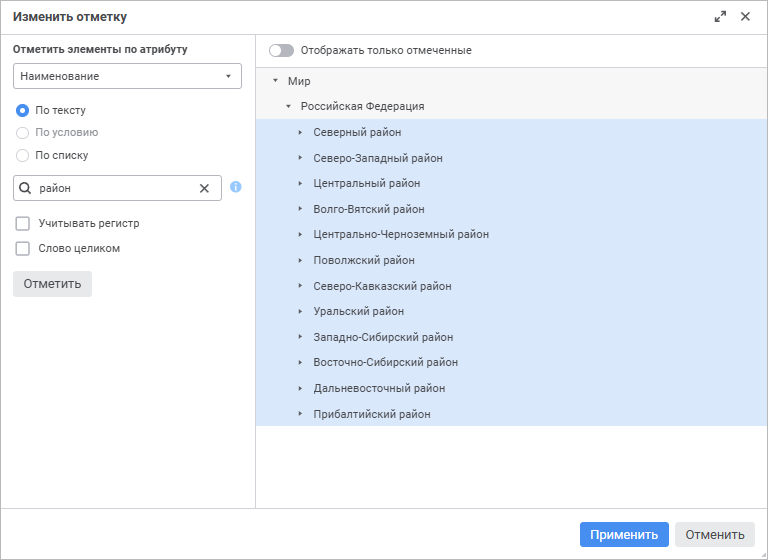

# Отметка элементов измерения

Отметка элементов измерения
-

# Отметка элементов измерения

Отметка элементов измерения предназначена для выбора данных, на основании
 которой строятся [визуализаторы](Visualizers/visualizers.htm)
 и [слайды](Frames/frames.htm).

Для изменения отметки измерения используйте:

	- различные [варианты отметки](#selectionvariants);

	- [схемы отметки](#selection_schemas);

	- [группы элементов](#selection_group).

Изменение отметки производится с помощью:

	- панели «[Фильтр измерения](Visualizers/Visualization/visualization_setting.htm#dim_filter)»;

	- [элементов
	 управления](Frames/visualizers_synchronization.htm#control) визуализаторами.

При изменении отметки измерения все зависящие от него измерения автоматически
 перестраиваются, после чего перестраиваются измерения, зависящие от перестроенных
 и т.д.

Изменение отметки в измерении, для которого настроена [синхронизация](Frames/visualizers_synchronization.htm),
 приводит к установке аналогичной отметки у всех остальных измерений группы.

### Варианты отметки

При работе с вариантами отметки элементов измерения доступны следующие
 операции:

[Отметить
 или снять отметку у элемента](javascript:TextPopup(this))

	Для отметки или снятия отметки элемента измерения щёлкните по нему
	 на открытой вкладке с измерением.

[Отметить
 всё](javascript:TextPopup(this))

	Для отметки всех элементов измерения выполните команду «Отметить
	 всё»:

	- в контекстном меню измерения на панели «[Фильтр
	 измерения](Visualizers/Visualization/visualization_setting.htm#dim_filter)»;

	- в контекстном меню измерения на панели [элементов
	 управления](Frames/visualizers_synchronization.htm#control) визуализаторами.

	После выполнения одного из действий будут отмечены все элементы
	 измерения.

[Изменить
 отметку](javascript:TextPopup(this))

	Для изменения отметки по критерию выбора выполните команду «Изменить отметку» контекстного меню
	 элемента.

	Будет открыто окно «Изменить отметку»:

	

	Область выбора для календарного измерения называется «Отметить
	 элементы по уровню».

	Для изменения отметки по критерию выбора:

		- Выберите атрибут или уровень, для которого будет задан критерий.
		 По умолчанию установлен атрибут, который [назначен
		 наименованием](uinavobj.chm::/reference_book/Master_Table_reference_book/UiMd_reference_book_Master_Table_page1_AttProps.htm). Для календарного измерения по
		 умолчанию установлен [высший
		 уровень](uinavobj.chm::/reference_book/Master_Calendar_reference_book/UiMd_reference_book_Master_Calendar_page2.htm), исключая корень.

		- Установите переключатель для определения типа критерия.
		 Доступный тип зависит от типа выбранного атрибута:

			- По
			 тексту. Доступно для строкового типа атрибута. В поле
			 для поиска введите текст, который содержат значения атрибутов
			 элементов необходимых для отметки. Для поиска доступны подстановки:

				- %. Используйте
				 с любой последовательностью символов;

				- _. Используйте
				 с одним любым символом.

	Установите флажок «Учитывать
	 регистр» для поиска с учетом регистра.

	Установите флажок «Слово
	 целиком» для поиска слов с точным совпадением с введённым текстом;

			- По условию. Доступен
			 для уровней календарного справочника и всех типов атрибутов,
			 кроме строкового. Выберите тип условия:

				- Равно;

				- Не равно;

				- Больше.
				  Доступно для типов: дата и время, целочисленный,
				 вещественный, дата;

				- Больше или равно.
				 Доступно для типов: дата и время, целочисленный, вещественный,
				 дата;

				- Меньше.
				 Доступно для типов: дата и время, целочисленный, вещественный,
				 дата;

				- Меньше или равно.
				 Доступно для типов: дата и время, целочисленный, вещественный,
				 дата;

				- Между. Доступно
				 для типов: дата и время, целочисленный, вещественный,
				 дата.

	Введите в поле значение или задайте диапазон
	 значений при выборе типа условия «Между»
	 . Редактор значения будет зависеть от типа атрибута. Для логического
	 типа доступен выбор значений: истина и ложь;

			- По списку. Доступен
			 для строкового и целочисленного типов атрибута. В поле введите
			 список значений атрибута. Список можно копировать из буфера
			 обмена. Поиск идёт с учетом регистра и полного совпадения
			 с введённым текстом.

		- Нажмите кнопку «Отметить»
		 для выделения элементов, соответствующих критерию, в области отображения
		 элементов измерения. Для отображения только отмеченных элементов
		 переведите переключатель «Отображать
		 только отмеченные» в активное состояние, при этом если
		 отмечены только дочерние элементы, то отображаться они будут с
		 родительскими.

		- Нажмите кнопку «Применить»
		 для применения новой отметки.

[Снять
 отметку со всех](javascript:TextPopup(this))

	Для снятия отметки со всех элементов измерения выполните команду
	 «Снять отметку со всех»:

	- в контекстном меню измерения на панели «[Фильтр
	 измерения](Visualizers/Visualization/visualization_setting.htm#dim_filter)»;

	- в контекстном меню измерения на панели [элементов
	 управления](Frames/visualizers_synchronization.htm#control) визуализаторами.

	После выполнения одного из действий со всех элементов измерения
	 будет снята отметка.

[Отметить
 подчиненные](javascript:TextPopup(this))

	Для отметки всех подчиненных элементов выполните команду «Отметить подчиненные по уровню»
	 или «Отметить все подчиненные»:

	- в контекстном меню измерения на панели «[Фильтр
	 измерения](Visualizers/Visualization/visualization_setting.htm#dim_filter)»;

	- в контекстном меню измерения на панели [элементов
	 управления](Frames/visualizers_synchronization.htm#control) визуализаторами.

[Снять
 отметку с подчиненных](javascript:TextPopup(this))

	Для снятия отметки со всех подчиненных элементов выполните команду
	 «Снять отметку с подчиненных»:

	- в контекстном меню измерения на панели «[Фильтр
	 измерения](Visualizers/Visualization/visualization_setting.htm#dim_filter)»;

	- в контекстном меню измерения на панели [элементов
	 управления](Frames/visualizers_synchronization.htm#control) визуализаторами.

[Отметить
 уровень](javascript:TextPopup(this))

	Для отметки уровня измерения выберите уровень в раскрывающемся меню
	 команды «Отметить уровень»:

	- в контекстном меню измерения на панели «[Фильтр
	 измерения](Visualizers/Visualization/visualization_setting.htm#dim_filter)»;

	- в контекстном меню измерения на панели [элементов
	 управления](Frames/visualizers_synchronization.htm#control) визуализаторами.

	После выполнения действий будет отмечен выбранный уровень измерения.

	Примечание.
	 Отметка уровня доступна для измерений с настроенными уровнями.

[Снять
 отметку с уровня](javascript:TextPopup(this))

	Для снятия отметки с уровня выберите уровень в раскрывающемся меню
	 команды «Снять отметку с уровня»:

	- в контекстном меню измерения на панели «[Фильтр
	 измерения](Visualizers/Visualization/visualization_setting.htm#dim_filter)»;

	- в контекстном меню измерения на панели [элементов
	 управления](Frames/visualizers_synchronization.htm#control) визуализаторами.

Для измерений, у которых отсутствует иерархия, доступны команды «Отметить всё», «Снять
 отметку со всех» и «Изменить отметку».

### Использование схемы отметки

[Схема отметки](UiNavObj.chm::/reference_book/look-and-feel_Reference_book/UiMd_reference_book_look-and-feel_Scheme.htm)
 - это объект репозитория, используемый в справочниках для автоматизации
 выделения элементов по заданным правилам.

Схема отметки будет применяться автоматически, пока не будет отключена.

[Применение
 схемы отметки](javascript:TextPopup(this))

	Для применения схемы отметки измерения выберите схему отметки в
	 раскрывающемся меню команды «Применить
	 схему отметки»:

	- в контекстном меню измерения на панели «[Фильтр
	 измерения](Visualizers/Visualization/visualization_setting.htm#dim_filter)»;

	- в контекстном меню измерения на панели [элементов
	 управления](Frames/visualizers_synchronization.htm#control) визуализаторами.

	Для применения выбранной схемы при открытии информационной панели
	 установите флажок «При открытии».
	 Для применения выбранной схемы при перестроении измерения установите
	 флажок «При перестроении измерения».
	 Если установлены оба флажка одновременно, то схема будет применяться
	 и при открытии информационной панели, и при перестроении измерения.

	Для отключения применения схемы отметки выберите пункт «Сбросить».

### Использование группы элементов

[Группа элементов](UiNavObj.chm::/reference_book/look-and-feel_Reference_book/UiMd_reference_book_look-and-feel_Group.htm)
 - это объект репозитория, используемый в справочниках для ограничения
 списка доступных элементов.

[Отметка
 группы элементов](javascript:TextPopup(this))

	Для отметки группы элементов измерения выберите группу элементов
	 в раскрывающемся меню команды «Отметить
	 группу»:

	- в контекстном меню измерения на панели «[Фильтр
	 измерения](Visualizers/Visualization/visualization_setting.htm#dim_filter)»;

	- в контекстном меню измерения на панели [элементов
	 управления](Frames/visualizers_synchronization.htm#control) визуализаторами.

	Применение отметки «Группа элементов»
	 снимет отметку со всех элементов и отметит группу.

	Для фильтрации элементов по выбранной группе установите флажок «Фильтровать элементы». После установки
	 флажка элементы, не входящие в выбранную группу, будут скрыты из списка
	 всех элементов измерения на панели «Фильтр
	 измерения».

	Для отключения применения отметки группы элементов выберите пункт
	 «Сбросить».

См. также:

[Настройка
 визуализации данных](Visualizers/Visualization/visualization_setting.htm)

		Справочная
		 система на версию 10.9
		 от 18/08/2025,
		 © ООО «ФОРСАЙТ»,
