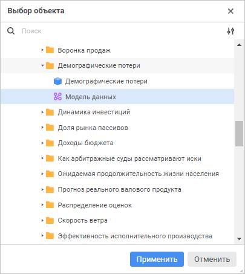
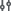
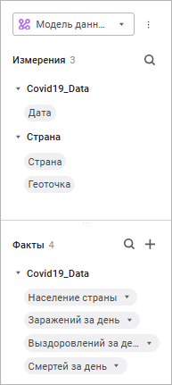
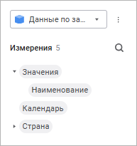

# Выбор и настройка источника данных визуализатора

Выбор и настройка источника данных визуализатора
-

# Выбор и настройка источника данных визуализатора

Для выбора и настройки источника данных визуализатора используйте раскрывающийся
 список «Источники» в верхней части
 [боковой панели](../Starting.htm#structure_window).

[Для отображения/скрытия
 панели](javascript:TextPopup(this))

	Для отображения боковой панели переведите кнопку  «Измерения» в активное состояние.
	 По умолчанию боковая панель отображается.

	Для скрытия боковой панели переведите кнопку  «Измерения» рабочей области в неактивное
	 состояние.

Примечание.
 Раскрывающийся список «Источники»
 доступен, если добавлен хотя бы один источник данных.

В качестве источников данных доступны:

	- [модели данных](../../DataModel/create_data_model.htm);

	- [стандартные
	 кубы](uinavobj.chm::/Cube/CreateCube/Master_Standart/UiMd_Cube_CreateCube_Master_Standart.htm).

## Работа с источниками данных

Операции, доступные над источниками данных:

	- [добавление источника данных](#add);

	- [редактирование источника данных](#edit);

	- [удаление источника данных](#delete).

### Добавление источника данных

[Создание новой
 модели данных](javascript:TextPopup(this))

	Если модель данных отсутствует в репозитории выполните команду  «Добавить модель >
	 Создать новую» в раскрывающемся меню кнопки 
	 «Действия» в верхней части
	 боковой панели. Откроется окно [создания
	 модели данных](../../DataModel/create_data_model.htm).

	Примечание.
	 Нажмите кнопку 
	 «Создать модель данных» в
	 центральной части боковой панели, если не добавлен ни один источник.

[Выбор существующей
 модели данных](javascript:TextPopup(this))

	Для выбора существующего источника данных в репозитории выполните
	 следующие действия:

		- Выполните команду 
		 «Добавить модель > Открыть
		 существующую» в раскрывающемся меню кнопки  «Действия»
		 в верхней части боковой панели.

	Примечание.
	 Нажмите кнопку «Выбрать модель данных»
	 в центральной части боковой панели, если не добавлен ни один источник.

	Будет открыто окно «Выбор
	 объекта»:

	

	Для настройки отображения объектов репозитория
	 в окне «Выбор объекта» в раскрывающемся
	 списке меню кнопки  «Отображение объекта» выберите один
	 из вариантов отображения:

			- Наименование.
			 Вариант по умолчанию;

			- Идентификатор;

			- Наименование и идентификатор.

		- Выберите необходимый объект
		 репозитория в дереве объектов репозитория.

	Для быстрого поиска нужного источника
	 по названию воспользуйтесь поиском. Введите искомый текст в поле для
	 поиска. Поиск будет выполняться автоматически по мере ввода искомого
	 текста. В списке будут только те источники, наименования которых содержат
	 вводимый текст.

	Для сброса результатов поиска нажмите
	 кнопку  «Очистить».

		- Нажмите кнопку «Применить».

После добавления источник данных будет отображаться в списке измерений
 на [боковой
 панели](Visualizers/Visualization/visualization_setting.htm#side_panel). Вид панели зависит от выбранного источника данных:

	 Модель
	 данных

	 Стандартный
	 куб

		Если в качестве источника данных выбрана [модель
		 данных](../../DataModel/create_data_model.htm), то для настройки визуализации данных доступны области
		 «Измерения» и «Факты»
		 на боковой панели:

		

		Если в качестве источника данных выбран [стандартный
		 куб](uinavobj.chm::/Cube/CreateCube/Master_Standart/UiMd_Cube_CreateCube_Master_Standart.htm), то для настройки визуализации данных доступна
		 область «Измерения» на
		 боковой панели:

		

		Куб может располагаться в [навигаторе
		 объектов](getstarted.chm::/Interface/Interface_Navigator.htm), в объектах «[Контейнер](UiNavObj.chm::/Container/Container.htm)»,
		 «[Бизнес-приложение](Constructor.chm::/Intro/Component_interface.htm)»
		 и «[Компонент](Constructor.chm::/Intro/Component_interface.htm#component)».

		Если для одного или нескольких измерений куба настроена [альтернативная
		 иерархия на основе атрибутов](uinavobj.chm::/reference_book/look-and-feel_Reference_book/Attributes_as_alt_hier.htm), то в области
		 «Измерения» на боковой
		 панели для этого измерения будут отображены справочники по настроенным
		 атрибутам. По умолчанию для измерений с иерархией на основе атрибутов
		 справочника отображается наименование «Наименование
		 атрибута».

		Измерения с иерархией на основе атрибутов справочника можно
		 использовать в качестве дополнительных измерений для [настройки
		 визуализации данных](Visualizers/Visualization/visualization_setting.htm).

		После применения иерархии на основе атрибутов справочника измерение
		 будет агрегировано, одинаковые по атрибуту элементы буду объединены
		 в один элемент.

### Редактирование источника данных

Для редактирования источника:

	- Выберите источник из раскрывающегося списка «Источники»
	 в верхней части боковой панели.

	- Выполните команду 
	 «Редактировать модель» в раскрывающемся
	 меню кнопки  «Действия».

В зависимости от используемого источника данных на отдельной вкладке
 браузера откроется:

	- [модель
	 данных](../../DataModel/create_data_model.htm);

	- [мастер стандартного куба](uinavobj.chm::/Cube/CreateCube/Master_Standart/UiMd_Cube_CreateCube_Master_Standart.htm).

### Удаление источника данных

Для удаления источника данных:

	- Выберите источник из раскрывающегося списка «Источники»
	 в верхней части боковой панели.

	- Выполните команду 
	 «Удалить модель» в раскрывающемся
	 меню кнопки  «Действия».

	- Подтвердите
	 удаление в диалоговом окне.

См. также:

[Построение
 информационной панели](Create_Informatuion_Panel.htm) | [Создание
 модели данных](../../DataModel/create_data_model.htm) | [Добавление
 визуализаторов и работа с ними](Visualizers/visualizers.htm)

		Справочная
		 система на версию 10.9
		 от 18/08/2025,
		 © ООО «ФОРСАЙТ»,
