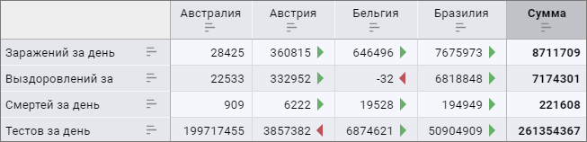
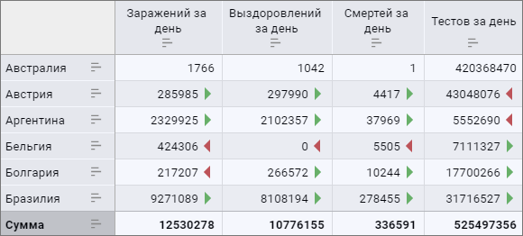
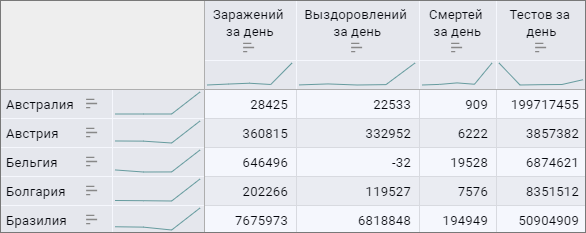

# Анализ данных в таблице: Информационные панели

Анализ данных в таблице: Информационные панели
-

# Анализ данных в таблице

В таблице доступен анализ данных при помощи следующих средств:

	- [Индикатор роста](#growth_rate);

	- [Спарклайны](#sparkline_table).

Индикатор
 роста позволяет отобразить характер изменения значения в ячейке
 относительно других значений.

Для отображения индикаторов роста по строкам или столбцам:

	- Переведите переключатель «Индикатор
	 роста» в активное состояние. По умолчанию переключатель неактивен,
	 индикатор роста не отображается.

	- Выберите вариант отображения «Для
	 строк» или «Для столбцов».
	 По умолчанию установлен переключатель «Для
	 строк».

Индикаторы роста будут отображены в таблице по строкам или по столбцам.
 Одновременное отображение индикаторов роста для строк и столбцов недоступно.

Для скрытия индикаторов роста переведите переключатель «Индикатор
 роста» в неактивное состояние.

Особенности отображения индикаторов роста:

	- при построении индикаторов роста по строкам пропускается первый
	 столбец ячеек, расположенный относительно боковика таблицы;

	- при построении индикаторов роста по столбцам пропускается первая
	 строка ячеек, расположенная относительно шапки таблицы;

	- если в ячейке предыдущей строки/столбца отсутствует значение
	 или оно равно текущему, то для этой ячейки не будет отображаться индикатор
	 роста;

	- если по столбцам/строкам расположено несколько измерений и в
	 любом из них, кроме первого, отмечено несколько элементов, то отображение
	 индикаторов роста по строкам/столбцам недоступно;

	- если для таблицы включено отображение [общих
	 итогов и/или промежуточных итогов](totals.htm), то для этих ячеек не будут
	 отображаться индикаторы роста;

	- при [экспорте](../../../Work/export.htm) таблицы
	 в формат XLSX индикаторы роста не экспортируются.

Пример отображения индикатора роста для строк:

Зеленая стрелка показывает, что значение в ячейке больше, чем значение
 в ячейке слева. Красная стрелка показывает, что значение в ячейке меньше,
 чем значение в ячейке слева.

Пример отображения индикатора роста для столбцов:

Зеленая стрелка показывает, что значение в ячейке больше, чем значение
 в ячейке сверху. Красная стрелка показывает, что значение в ячейке меньше,
 чем значение в ячейке сверху.

Спарклайн
 - это небольшая диаграмма, которая помещается внутри визуализатора. С
 помощью спарклайнов можно показывать тенденции в рядах данных. Спарклайны
 применяются для более наглядного представления больших наборов данных.
 Спарклайны могут отображаться для столбцов, строк и итогов таблицы.

Для настройки спарклайна:

	- Переведите переключатель «Спарклайн»
	 в активное состояние. По умолчанию переключатель не активен, спарклайны
	 не отображаются.

	- Выберите вариант отображения спарклайнов:

		- По строкам. Флажок
		 установлен по умолчанию. Спарклайны отображаются по строкам таблицы;

		- По столбцам. Спарклайны
		 отображаются по столбцам таблицы;

		- Отображать для итогов.
		 Спарклайны отображаются для итогов.

Примечание.
 Для отображения спарклайнов по итогам должны быть отображены [итоги
 по строкам/столбцам](totals.htm).

Для строк, столбцов и итогов таблицы спарклайн отображается в виде линейной
 диаграммы.

Для скрытия спарклайнов переведите переключатель «Спарклайн»
 в неактивное состояние.

Особенности отображения спарклайнов:

	- если во всей строке/столбце содержится только одна ячейка со
	 значением, то спарклайн не будет отображаться;

	- если в некоторых ячейках отсутствуют значения, то спарклайн
	 будет отображаться с разрывами;

	- если для таблицы включено отображение [промежуточных
	 итогов](totals.htm#output), то для этих ячеек будет отображаться спарклайн;

	- при [экспорте](../../../Work/export.htm) таблицы
	 в формат XLSX ячейки со спарклайнами отображаются пустыми.

Пример применения спарклайнов для строк и столбцов:

См. также:

[Настройка
 визуализации данных](../Visualization/visualization_setting.htm) | [Настройка визуализатора
 «Таблица»](Table.htm)

		Справочная
		 система на версию 10.9
		 от 18/08/2025,
		 © ООО «ФОРСАЙТ»,
