# Настройка размещения: Информационные панели

Настройка размещения: Информационные панели
-

# Настройка размещения

Для настройки размещения [таблицы](Select_Areas.htm#select_all_table),
 [боковика](Select_Areas.htm#select_sidehead) и [шапки](Select_Areas.htm#select_heading)
 используйте группу параметров «Размещение»
 [панели
 настроек](../Visualization/visualization_setting.htm#settings_panel).

[Для открытия
 группы параметров «Размещение»](javascript:TextPopup(this))

	Для открытия на панели параметров группы параметров «Размещение»:

		- Выделите [элемент
		 таблицы](Select_Areas.htm).

		- Переведите кнопку  «Настройки» на [панели
		 инструментов](../../../Starting.htm#structure_window) в активное состояние. По умолчанию панель настроек
		 скрыта.

		- Выберите требуемый тип элемента таблицы в раскрывающемся
		 меню заголовка панели настроек.

Параметры размещения зависят от выбранного типа области:

	  Таблица   Боковик   Шапка

		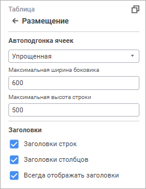

		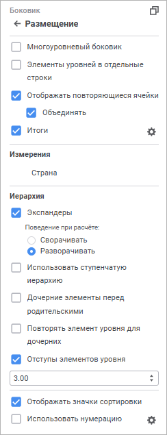

		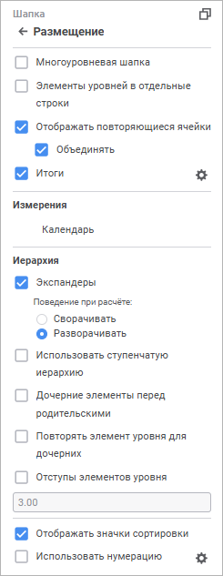

Задайте параметры для элемента «Таблица»:

[Автоподгонка
 ячеек](javascript:TextPopup(this))

	Выберите режим для подбора размера ячеек из раскрывающегося списка:

		- Нет. Автоподбор
		 отсутствует;

		- Сначала по ширине, затем
		 по высоте. Сначала выполняется автоподбор размера столбцов,
		 затем строк;

		- Сначала по высоте, затем
		 по ширине. Сначала выполняется автоподбор размера строк,
		 затем столбцов;

		- Только по ширине.
		 Ширина столбца устанавливается минимально требуемой для отображения
		 текста самой длинной ячейки в столбце таблицы;

		- Только по высоте.
		 Устанавливается минимальная требуемая высота для отображения текста
		 самой высокой ячейки в строке таблицы;

		- Автоматически. Автоподбор
		 выполняется автоматически согласно установленным параметрам:

			- Строк текста в ячейке
			 не более. При переключателе в активном положении ширина
			 столбца подбирается таким образом, чтобы для отображения текста
			 самой длинной строки в столбце ячейки требовалось не более
			 N строк, указанных в поле. Значение по умолчанию «8»;

			- Столбцов в таблице
			 не менее. При переключателе в активном положении в
			 таблице всегда будет отображаться минимум N столбцов, указанных
			 в поле. Значение по умолчанию «1»;

		- Упрощенная. По умолчанию.
		 Одновременная автоподгонка ширины, высоты и видимых данных. Автоподгонка
		 применяется для 20 строк/столбцов из начала, середины и конца
		 таблицы:

			- Максимальная ширина
			 боковика. Задайте ширину боковика. Значение по умолчанию
			 «600»;

			- Максимальная высота
			 строки. Задайте высоту строки. Значение по умолчанию
			 «500».

[Заголовки](javascript:TextPopup(this))

	Для отображения/скрытия заголовков боковика или шапки используйте
	 флажки:

		- Заголовки строк.
		 При установке флажка отображается боковик, при снятии флажка скрывается
		 уголок и боковик;

		- Заголовки столбцов.
		 При установке флажка отображается шапка, при снятии флажка скрывается
		 уголок и шапка;

		- Всегда отображать заголовки.
		 При установке флажка отображается боковик/шапка при отсутствующей
		 отметке в измерениях шапки/боковика, при снятии флажка вместо
		 таблицы будет отображаться ячейка со значением «Нет
		 данных». Отсутствие отметки возможно при привязке измерения
		 к параметру.

	По умолчанию все флажки установлены.

Задайте параметры для элементов «Боковик»
 и «Шапка»:

[Многоуровневый
 боковик/шапка](javascript:TextPopup(this))

	Для отображения в боковике/шапке уровней измерения в отдельных строках
	 без повторения родительских элементов установите флажок «Многоуровневый
	 боковик»/«Многоуровневая шапка».

[Элементы уровней
 в отдельные строки/столбцы](javascript:TextPopup(this))

	Для размещения элементов разных уровней в разных столбцах/строках,
	 установите флажок «Элементы уровней
	 в отдельные столбцы/строки».

	Примечание.
	 Размещение элементов разных уровней в разных столбцах/строках зависит
	 от использования [многоуровневого боковика/шапки](#layeredheader).
	 При установке или снятии флажка «Многоуровневый
	 боковик/шапка» автоматически устанавливается или снимается
	 флажок «Элементы уровней в отдельные
	 столбцы/строки». Если флажок «Многоуровневый
	 боковик/шапка» снят, то можно отдельно установить флажок «Элементы уровней в отдельные столбцы/строки».

	Слева приведён пример боковик исходной таблицы, справа - боковик
	 таблицы после размещения элементов разных уровней в разных столбцах:

	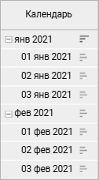  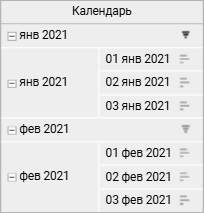

[Отображать повторяющиеся
 ячейки](javascript:TextPopup(this))

	Для отображения/скрытия повторяющихся ячеек в таблице данных установите/снимите
	 флажок «Отображать повторяющиеся
	 ячейки». По умолчанию повторяющиеся ячейки отображаются. Если
	 флажок снят, наименование уровня будет отображаться в отдельной строке
	 перед элементами уровня и в объединенной ячейке напротив элементов
	 уровня.

	При установке флажка «Объединять»
	 повторяющиеся элементы будут отображаться только для первой ячейки
	 уровня, при снятии флажка - элементы будут повторяться для каждого
	 элемента уровня.

	Слева показана таблица с установленным флажком «Элементы
	 уровней в отдельные столбцы» и снятым флажком «Отображать
	 повторяющиеся ячейки», справа - с установленными флажками «Элементы уровней в отдельные столбцы»,
	 «Отображать повторяющиеся ячейки»
	 и «Объединять»:

	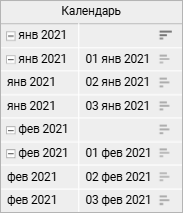  

[Итоги](javascript:TextPopup(this))

	Для настройки отображения и расчёта итогов:

		- установите флажок «Итоги».
		 Будут применены итоги по умолчанию или последние настроенные итоги;

		- нажмите кнопку  «Настройка» рядом с флажком «Итоги», будет отображена [группа параметров](totals.htm) «Итоги
		 по строкам»/«Итоги по
		 столбцам».

	Для отображения/скрытия итогов для данного измерения установите/снимите
	 флажок «[Отображать
	 итог](#dimension)» в контекстном меню измерения в группе параметров
	 «Размещение» на панели настроек.

[Измерения](javascript:TextPopup(this))

	Для отображения/скрытия итогов для данного измерения установите/снимите
	 флажок «Отображать итог» в
	 контекстном меню измерения в области «Измерения».
	 По умолчанию флажок установлен. Флажок доступен, если установлен флажок
	 «[Итоги](totals.htm)».

	Для создания более компактного вида таблицы используйте команды
	 контекстного меню выбранного измерения, расположенного в области «Измерения»:

		- [Объединить
		 с предыдущим](Merging_Dim.htm#merging). Доступно, если в боковик/шапку таблицы
		 выведено несколько измерений;

		- [Поджимать
		 элементы](Merging_Dim.htm#tucking). Доступно только для [объединённых
		 измерений](Merging_Dim.htm#merging) боковика/шапки таблицы;

		- Настроить. Доступно
		 при настройке [поджатия элементов](Merging_Dim.htm#tucking).

[Иерархия](javascript:TextPopup(this))

	Для настройки отображения иерархии установите или снимите флажки:

		- Экспандеры. По умолчанию
		 флажок установлен. Отображение/скрытие экспандеров для родительских
		 элементов иерархии.

	Для определения поведения экспандеров
	 при обновлении отчёта установите один из переключателей:

			- Сворачивать.
			 При обновлении отчёта иерархия измерений будет сворачиваться;

			- Разворачивать.
			 По умолчанию. При обновлении отчёта иерархия измерений будет
			 разворачиваться.

	Пример таблицы с экспандерами:

	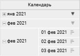

	При скрытии экспандеров все нераскрытые
	 дочерние элементы будут раскрыты в таблице:

	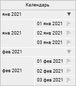

		- Использовать ступенчатую
		 иерархию. По умолчанию флажок снят. Если по столбцам/строкам
		 расположено несколько измерений, то для разграничения элементов
		 измерений в боковике/шапке рекомендуется использовать ступенчатую
		 иерархию.

	Пример таблицы без использования ступенчатой
	 иерархии:

	

	Пример таблицы с использованием ступенчатой
	 иерархии:

	

		- Дочерние элементы перед
		 родительскими. По умолчанию флажок снят. Размещение дочерних
		 элементов иерархии перед родительскими:

	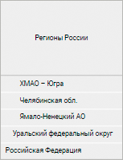

		- Повторять элемент уровня
		 для дочерних. По умолчанию флажок снят. Размещение родительских
		 элементов до и после дочерних:

	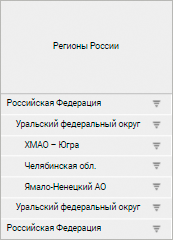

		- Отступы элементов уровня.
		 Отступы для наименований дочерних элементов. По умолчанию флажок
		 установлен и задан отступ 3 мм. Для изменения отступа введите
		 или выберите его размер в числовом редакторе.

	В таблице ниже установлен отступ 15 мм
	 и дочерние элементы отображены перед родительскими:

	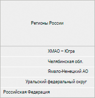

[Отображать
 значки сортировки](javascript:TextPopup(this))

	Для отображения значков сортировки по строкам и/или по столбцам
	 установите флажок «Отображать значки
	 сортировки» для шапки и боковика. После установки флажка в
	 заголовках строк/столбцов отображаются значки сортировки /. Флажки
	 установлены по умолчанию. При последовательном нажатии на любой из
	 значков его вид изменяется, и, соответственно, меняется вид сортировки:

		- . Сортировка по убыванию (в случае с
		 текстовыми значениями - от Я до А);

		- . Сортировка по возрастанию (в случае
		 с текстовыми значениями - от А до Я).

	Для типа области «Боковик»
	 сортировка доступна только по строкам, а для типа области «Шапка»
	 - только по столбцам.

	Примечание.
	 При наличии в шапке/боковике нескольких измерений сортировка применяется
	 только к самому нижнему/правому уровню шапки/боковика соответственно.

[Использовать
 нумерацию](javascript:TextPopup(this))

	Для настройки нумерации:

		- Установите флажок «Использовать
		 нумерацию». Будет применена [нумерация
		 по умолчанию](Numbering.htm) или последняя настроенная нумерация.

		- Нажмите кнопку  «Настройка» рядом с наименованием
		 флажка. Будет открыто окно «[Настройка нумерации](Numbering.htm)».

	По умолчанию флажок снят, нумерация не применяется.

См. также:

[Настройка
 визуализации данных](../Visualization/visualization_setting.htm) | [Настройка визуализатора
 «Таблица»](Table.htm)

		Справочная
		 система на версию 10.9
		 от 18/08/2025,
		 © ООО «ФОРСАЙТ»,
