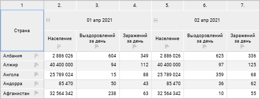
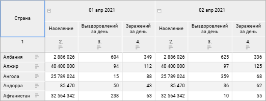
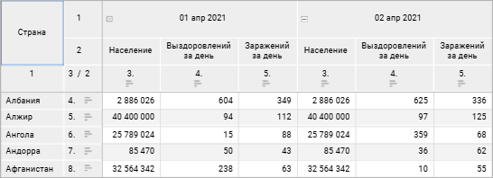

# Настройка нумерации: Информационные панели

Настройка нумерации: Информационные панели
-

# Настройка нумерации

Для таблицы можно включить и настроить нумерацию строк и столбцов. Для
 включения и настройки нумерации используйте группу параметров «[Размещение](Layout.htm)» [панели
 настроек](../Visualization/visualization_setting.htm#settings_panel).

[Для открытия
 группы параметров «Размещение»](javascript:TextPopup(this))

	Для открытия на панели параметров группы параметров «Размещение»:

		- Выделите [боковик](Select_Areas.htm#select_sidehead)
		 или [шапку](Select_Areas.htm#select_heading) таблицы.

		- Переведите кнопку  «Настройки» на [панели
		 инструментов](../../../Starting.htm#structure_window) в активное состояние. По умолчанию панель настроек
		 скрыта.

		- Выберите требуемый тип элемента таблицы в раскрывающемся
		 меню заголовка панели настроек.

Для включения нумерации установите флажок «Использовать
 нумерацию». Будет применена нумерация по умолчанию или последняя
 настроенная нумерация. Настройки по умолчанию:

	- номера строк отобразятся отдельным столбцом боковика перед заголовками;

	- нумерация начинается со строк с данными;

	- применяется сквозная нумерация.

Для настройки нумерации нажмите кнопку  «Настройка»
 рядом с наименованием флажка. Будет открыто окно «Настройка
 нумерации»:

Доступные настройки:

[Настройки нумерации
 для измерений и уровней](javascript:TextPopup(this))

	В области настройки нумерации для измерений и [уровней
	 измерений](UiNavObj.chm::/reference_book/Master_RDS_reference_book/Level.htm) укажите:

		- Тип нумерации. Выберите
		 тип нумерации для измерения/уровня в раскрывающемся списке:

			- Сквозная.
			 По умолчанию. Позволяет установить сквозную нумерацию элементов
			 уровня независимо от нумерации родительского уровня;

			- Иерархическая.
			 При установке нумерация уровня будет подчинена родительскому
			 уровню;

			- Иерархическая
			 с префиксом. При установке нумерация уровня будет подчинена
			 родительскому уровню, номер родительского элемента будет включен
			 в префикс;

		- Формат.
		 Выберите формат нумерации в раскрывающемся
		 списке:

			- 1, 2, 3. Установлено по
			 умолчанию;

			- a, b, c;

			- A, B, C;

			- i, ii, iii;

			- I, II, III;

			- а, б, в;

			- А, Б, В;

	Если закончились буквы алфавита, то нумерация
	 продолжается сначала с повторным символом;

		- Разделитель. Для
		 добавления символа после номера или для нумерации с префиксом
		 укажите любой один символ в поле. Если символ не задан, то разделителя
		 после номера и между номером и префиксом, если задан иерархический
		 тип нумерации с префиксом, не будет. Доступен для типов нумерации:
		 сквозная, иерархическая и иерархическая с префиксом. По умолчанию
		 используется разделитель «.».

[Начать с](javascript:TextPopup(this))

	Доступно для первого измерения. Для определения начального значения
	 нумерации введите значение в поле. По умолчанию установлено значение
	 «1». В зависимости от указанного
	 формата нумерации начальное значение в таблице преобразуется под формат,
	 при этом в окне настроек значение останется числовым.

[Префикс](javascript:TextPopup(this))

	По умолчанию префикс не используется. Для добавления символов перед
	 номером, укажите любые символы в поле. Префикс будет добавлен для
	 указанного измерения. Для применения префикса ко всем измерениям установите
	 для остальных измерений тип нумерации «Иерархическая
	 с префиксом».

[Область размещения](javascript:TextPopup(this))

	Для определения места расположения столбца с нумерацией относительно
	 заголовков установите переключатель в одно из положений: «Перед
	 заголовком» или «После заголовка».

	Пример положения «Перед заголовком»:

	

	Пример положения «После заголовка»:

	

[Объединять для
 всех измерений](javascript:TextPopup(this))

	При установленном флажке будет применяться сквозная нумерация. Доступно,
	 если боковик или шапка состоят из двух и более измерений. По умолчанию
	 флажок установлен. При снятом флажке элементы нумеруются в пределах
	 каждого элемента первого измерения, выведённого в боковик.

	При объединении измерений боковика с поджатием логика нумерации
	 не меняется.

	Пример, когда флажок установлен:

	

	Пример, когда флажок снят:

	

[Учитывать отступы
 элементов измерения](javascript:TextPopup(this))

	При установленном флажке будут отображаться отступы нумерации в
	 соответствии с отступами размещения элементов измерений в таблице.

[Начать нумерацию
 с уголка](javascript:TextPopup(this))

	При установленном флажке будет применяться нумерация с учётом строк/столбцов
	 уголка. При установке флажка для строк и столбцов:

	

См. также:

[Настройка
 визуализации данных](../Visualization/visualization_setting.htm) | [Настройка визуализатора
 «Таблица»](Table.htm) | [Настройка размещения](Layout.htm)

		Справочная
		 система на версию 10.9
		 от 18/08/2025,
		 © ООО «ФОРСАЙТ»,
