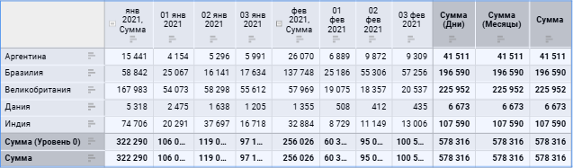
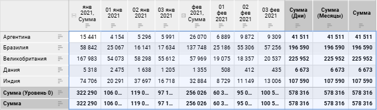
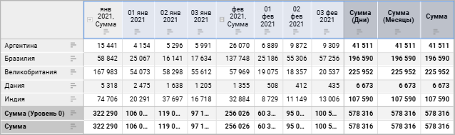
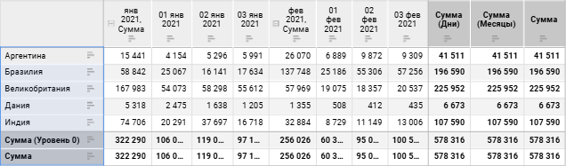
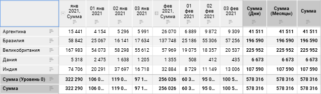
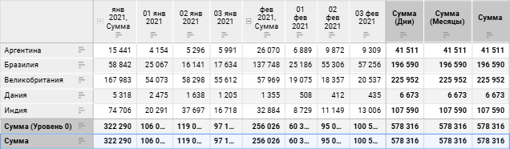

# Выделение элементов таблицы

Выделение элементов таблицы
-

# Выделение элементов таблицы

	Таблица данных состоит из нескольких основных [элементов](Table.htm),
	 каждый из которых имеет собственные настройки. Настройки, установленные
	 на [панели
	 настроек](../Visualization/visualization_setting.htm#settings_panel), применяются к выделенному элементу таблицы.

	При выделении элемента таблицы в раскрывающемся списке на панели
	 настроек отображается соответствующий пункт:

		- Таблица. При выделении
		 столбца/строки целиком, ячеек, относящихся к разным элементам
		 таблицы, отдельной ячейки или [всей
		 таблицы](#select_all_table);

		- Боковик. При выделении
		 [боковика](#select_sidehead);

		- Шапка. При выделении
		 [шапки](#select_heading);

		- Уголок. При выделении
		 [уголка](#select_corner);

		- Данные. При выделении
		 одной или нескольких [ячеек с данными](#select_data);

		- Итоги по строкам/столбцам.
		 При выделении ячеек, столбцов или строк [итогов](#select_total).

## Выделение всей таблицы

	Для выделения всей таблицы выполните одно из действий:

		- на [панели
		 настроек](../Visualization/visualization_setting.htm#settings_panel) в раскрывающемся меню выберите пункт «Таблица»;

		- выделите любую ячейку и нажмите сочетание клавиш CTRL+A.

	После выполнения действия будет выделена вся таблица данных:

	

## Выделение данных

	Для выделения данных:

		- [выделите
		 всю таблицу](#select_all_table), затем выполните команду «Оформление
		 > Данные» в контекстном меню любой ячейки таблицы;

		- на [панели
		 настроек](../Visualization/visualization_setting.htm#settings_panel) в раскрывающемся меню выберите пункт «Данные».

	После выполнения действия будут выделены данные таблицы:

	

## Выделение шапки

	Для выделения шапки выполните одно из действий:

		- [выделите всю таблицу](#select_all_table), затем
		 выполните команду «Оформление
		 > Шапка» в контекстном меню любой ячейки таблицы;

		- на [панели
		 настроек](../Visualization/visualization_setting.htm#settings_panel) в раскрывающемся меню выберите пункт «Шапка».

	После выполнения действия будет выделена шапка таблицы:

	

	Примечание.
	 При выделении шапки таблицы в выделение попадают итоги и промежуточные
	 итоги по строкам.

## Выделение боковика

	Для выделения боковика выполните одно из действий:

		- [выделите всю таблицу](#select_all_table), затем
		 выполните команду «Оформление
		 > Боковик» в контекстном меню любой ячейки таблицы;

		- на [панели
		 настроек](../Visualization/visualization_setting.htm#settings_panel) в раскрывающемся меню выберите пункт «Боковик».

	После выполнения действия будет выделен боковик таблицы:

	

	Примечание.
	 При выделении боковика таблицы в выделение попадают итоги и промежуточные
	 итоги по столбцам.

## Выделение уголка

	Для выделения уголка выполните одно из действий:

		- нажмите на [уголок](Table.htm) таблицы;

		- [выделите всю таблицу](#select_all_table), затем
		 выполните команду «Оформление
		 > Уголок» в контекстном меню любой ячейки таблицы;

		- на [панели
		 настроек](../Visualization/visualization_setting.htm#settings_panel) в раскрывающемся меню выберите пункт «Уголок».

	После выполнения действия будет выделен уголок таблицы:

	

## Выделение итогов по строкам/столбцам

	Для выделения итогов по строкам/столбцам выполните одно из действий:

		- [выделите всю таблицу](#select_all_table), затем
		 выполните команду «Оформление
		 > Итоги по строкам» или «Оформление
		 > Итоги по столбцам» в контекстном меню любой ячейки
		 таблицы;

		- на [панели
		 настроек](../Visualization/visualization_setting.htm#settings_panel) в раскрывающемся меню выберите пункт «Итоги
		 по строкам» или «Итоги
		 по столбцам».

	Примечание.
	 Пункты меню «Итоги по строкам»
	 и «Итоги по столбцам» отображаются,
	 если для таблицы включено отображение [итогов
	 по строкам/столбцам](totals.htm).

	После выполнения действия будут выделен итоги по строкам/столбцам
	 таблицы:

	

	См. также:

	[Настройка
	 визуализации данных](../Visualization/visualization_setting.htm) | [Настройка визуализатора
	 «Таблица»](Table.htm)

		Справочная
		 система на версию 10.9
		 от 18/08/2025,
		 © ООО «ФОРСАЙТ»,
