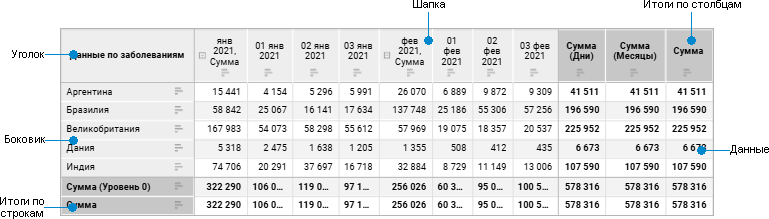

# Настройка визуализатора «Таблица»

Настройка визуализатора «Таблица»
-

# Настройка визуализатора «Таблица»

Визуализатор «Таблица» предназначен
 для отображения данных в табличном виде.

Для добавления визуализатора «Таблица»
 на рабочую область:

	- Выберите тип визуализатора  «Таблица»:

		- в раскрывающемся меню кнопки  «Вставка»
		 на [панели инструментов](../../../Starting.htm#structure_window).
		 Затем щёлкните по ячейке слайда;

		- в раскрывающемся меню ячейки слайда.

	- [Добавьте или выберите источник данных](../../Source.htm)
	 в раскрывающемся списке «Источники»
	 в верхней части [боковой
	 панели](../../../Starting.htm#structure_window).

Для визуализатора «Таблица»
 доступны операции, приведенные в разделе «[Добавление визуализаторов и работа с ними](../visualizers.htm)».

## Структура таблицы

Структура таблицы состоит из нескольких основных элементов, каждый из
 которых имеет собственные настройки:

[Элементы таблицы](javascript:TextPopup(this))

		- Уголок. Верхняя
		 левая ячейка таблицы, позволяющая отображать наименования измерений
		 по строкам или столбцам.

		- Боковик. Элемент
		 таблицы, который отображает наименования элементов измерения,
		 размещенного по строкам.

		- Шапка. Элемент таблицы,
		 который отображает наименования элементов измерения, размещенного
		 по столбцам.

		- Данные. Элемент
		 таблицы, состоящий из ячеек с данными.

		- Итоги по строкам/столбцам.
		 Элемент таблицы, состоящий из [итоговых значений](totals.htm)
		 по строкам/столбцам.

	Примечание.
	 Элементы таблицы «Итоги по строкам»
	 и «Итоги по столбцам» отображаются,
	 если для таблицы включено отображение [итогов
	 по строкам/столбцам](totals.htm).

Для настройки элемента таблицы [выделите его](Select_Areas.htm).

Для построения таблицы используйте поля:

	- [столбцы](../Visualization/visualization_setting.htm#rows_and_columns);

	- [строки](../Visualization/visualization_setting.htm#rows_and_columns);

	- [фильтр](../Visualization/visualization_setting.htm#filter);

	- [факты](../Visualization/visualization_setting.htm#facts).

Доступные настройки таблицы приведены в разделе «[Настройка таблицы и её элементов](Table_Formatting.htm)».

См. также:

[Добавление
 визуализаторов и работа с ними](../visualizers.htm) | [Выбор
 и настройка источника данных визуализатора](../../Source.htm) | [Настройка
 визуализации данных](../Visualization/visualization_setting.htm)

		Справочная
		 система на версию 10.9
		 от 18/08/2025,
		 © ООО «ФОРСАЙТ»,
