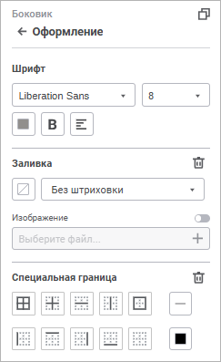
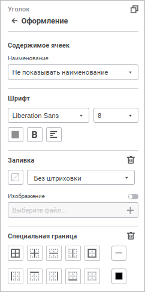
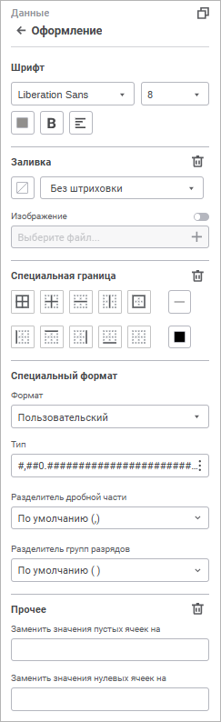
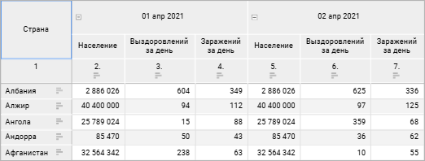
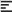
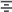
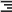
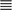

# Оформление элементов таблицы

Оформление элементов таблицы
-

# Оформление элементов таблицы

Для настройки оформления [боковика](Select_Areas.htm#select_sidehead),
 [шапки](Select_Areas.htm#select_heading), [уголка](Select_Areas.htm#select_corner),
 [данных](Select_Areas.htm#select_data) таблицы и [итогов
 по строкам/столбцам](Select_Areas.htm#select_total) используйте группу параметров «Оформление»
 [панели
 настроек](../Visualization/visualization_setting.htm#settings_panel).

[Для открытия
 группы параметров «Оформление»](javascript:TextPopup(this))

	Для открытия на панели параметров группы параметров «Оформление»:

		- Выделите [элемент таблицы](Select_Areas.htm).

		- Переведите кнопку  «Настройки» на [панели
		 инструментов](../../../Starting.htm#structure_window) в активное состояние. По умолчанию панель настроек
		 скрыта.

		- Выберите требуемый тип элемента таблицы в раскрывающемся
		 меню заголовка панели настроек.

Параметры размещения зависят от выбранного типа области:

	 Боковик/Шапка/Итоги

	  Уголок    Данные

		

		

		

Доступны следующие настройки:

[Настройка
 содержимого уголка таблицы](javascript:TextPopup(this))

	Доступно только для элемента таблицы «[Уголок](Select_Areas.htm#select_corner)».

	Для настройки содержимого уголка таблицы выберите вариант содержимого
	 уголка в группе параметров «Оформление»
	 или в контекстном меню уголка таблицы:

		- Не показывать наименование.
		 По умолчанию. Уголок таблицы пустой, наименование не отображается.

		- Наименование из шапки.
		 На панели настроек в раскрывающемся списке выберите измерение,
		 наименование которого необходимо отобразить в уголке таблицы;

		- Наименование из боковика.
		 По умолчанию. На панели настроек в раскрывающемся списке выберите
		 измерение, наименование которого необходимо отобразить в уголке
		 таблицы;

		- Пользовательское наименование.
		 На панели настроек в строке ввода задайте наименование. При переключении
		 вида наименования на отображение наименования из шапки или боковика
		 пользовательское наименование сбрасывается.

	В результате выполнения действий будет настроено содержимое уголка
	 таблицы.

	Особенности отображения наименования в уголке таблицы:

		- если в шапке или боковике таблицы несколько измерений, то
		 при выборе «Пользовательское
		 наименование» ячейки уголка объединяются в одну. Ранее
		 введённые наименования уголка будут сброшены;

		- если в шапке или боковике таблицы несколько измерений, то
		 при выборе «Наименование из шапки»
		 или «Наименование из боковика»
		 в строке ввода наименования будет отображаться наименование первого
		 по порядку размещения измерения. Уголок таблицы будет разделён
		 на несколько ячеек, наименования которых соответствуют измерениям
		 шапки или боковика;

		- если в шапке или боковике таблицы отсутствуют измерения,
		 то при выборе «Наименование из
		 шапки» или «Наименование
		 из боковика» уголок остаётся пустым.

	Пример уголка таблицы с пользовательским наименованием:

	

[Настройка
 шрифта](javascript:TextPopup(this))

	Для настройки шрифта задайте параметры:

	- Шрифт. Выберите один
	 из доступных шрифтов в раскрывающемся списке;

	- Размер шрифта. Установите
	 требуемый размер шрифта. Размер задаётся в пунктах, его можно ввести
	 вручную или ввести с помощью клавиатуры. Диапазон допустимых значений:
	 [6; 36];

	- Цвет шрифта. Выберите
	 цвет шрифта в раскрывающейся палитре. Для выбора доступны стандартные
	 и пользовательские цвета. По умолчанию палитра содержит только стандартные
	 цвета.

Для создания пользовательского цвета:

		- Нажмите кнопку  «Добавить
		 цвет». Откроется расширенная палитра цветов.

		- Выберите цвет в расширенной палитре цветов, на странице
		 браузера с помощью пипетки или задайте код цвета в формате RGB/HEX.

После выполнения действий пользовательский
 цвет будет создан и добавлен в палитру.

Для удаления пользовательского цвета из палитры
 выполните команду «Удалить» контекстного
 меню выбранного цвета.

Примечание.
 Максимально возможное количество пользовательских цветов в палитре равно
 23.

	- Начертание.
	 В раскрывающемся меню кнопки выберите начертание шрифта:

		- B. Жирное начертание;

		- I.
		 Курсивное начертание;

		- U.
		 Подчёркивание текста.

При нажатой кнопке будет использоваться соответствующий
 стиль начертания. Доступно использование нескольких стилей одновременно,
 например, нажатие кнопок «B» и
 «I» даёт полужирное
 курсивное начертание;

	- Выравнивание
	 текста в ячейке. В раскрывающемся меню кнопки выберите один
	 из способов выравнивания текста в ячейке:

		- . По левому краю;

		- . По центру;

		- . По правому краю;

		- . По ширине.

	В результате выполнения действий для выбранного элемента таблицы
	 будут применены заданные настройки шрифта.

Для сброса заданных настроек и возврата к стилю по умолчанию нажмите
 кнопку «Сбросить».

[Настройка
 заливки](javascript:TextPopup(this))

	Для настройки заливки задайте параметры:

		- Цвет
		 фона. Выберите в раскрывающемся меню вариант заливки для
		 настройки фона:

			- Без заливки.
			 По умолчанию заливка не используется;

			- Сплошная заливка.
			 Откройте вкладку «Один цвет»
			 в раскрывающейся палитре и выберите цвет однотонной заливки
			 области построения;

			- Двухцветная заливка.
			 Откройте вкладку «Два цвета»
			 в раскрывающейся палитре и выберите начальный и конечный цвета
			 двухцветного градиента. При необходимости укажите угол наклона;

		- Штриховка.
		 Выберите вариант штриховки в раскрывающемся меню :

			- Без штриховки.
			 По умолчанию штриховка не используется;

			- Типы штриховки.
			 После выбора типа штриховки задайте цвет штриховки в раскрывающейся
			 палитре цветов;

		- Изображение.
		 Для использования изображения в качестве заливки элемента таблицы:

			- Переведите переключатель «Изображение»
			 в активное положение. По умолчанию переключатель неактивен,
			 настройка заливки элемента таблицы выполняется стандартным
			 способом;

			- Нажмите кнопку 
			 «Выберите файл» и
			 выберите файл в открывшемся окне.

	После выбора изображения название файла
	 отобразится в соответствующем поле, заливка элемента таблицы будет
	 выполнена с использованием изображения.

	Для замены изображения повторно кнопку
	  «Выберите файл».

	После выбора изображения станут доступны
	 настройки:

			- Скачать.
			 Нажмите кнопку «Скачать»
			 для экспорта изображения, используемого в качестве заливки;

			- Растянуть
			 изображение. По умолчанию флажок снят, изображение
			 в элементе таблицы соответствует своему исходному размеру.
			 Для того, чтобы подогнать размер изображения под размер элемента
			 таблицы, установите флажок.

	Для сброса удаления изображения нажмите
	 кнопку  «Удалить»
	 рядом с названием текстуры.

	В результате выполнения действий для выбранного
	 элемента таблицы будут применены заданные настройки заливки.

	Для сброса заданных настроек заливки фона и штриховки и возврата
	 к стилю по умолчанию нажмите кнопку «Без
	 цвета».

Для установки пользовательского цвета:

	- нажмите кнопку  «Добавить
	 цвет», расположенную в стандартной палитре цветов, и выберите
	 цвет в расширенной палитре цветов;

	- выберите цвет в расширенной палитре цветов с помощью пипетки
	 или задайте код цвета в формате RGB/HEX.

После выполнения действий пользовательский цвет будет добавлен в палитру.

Примечание.
 Максимально возможное количество пользовательских цветов в палитре равно
 23.

Для удаления пользовательского цвета из палитры выполните команду «Удалить» контекстного меню выбранного
 цвета.

	В порядке применения [заливки](#fill) для элементов таблицы
	 каждый следующий пункт имеет приоритет выше и перекрывает предыдущий:

		- Данные (наименьший приоритет).

		- Итоги по столбцам.

		- Итоги по строкам (наибольший приоритет).

	Для сброса заданных настроек заливки нажмите кнопку  «Удалить»
	 рядом с названием вкладки «Заливка».

[Настройка
 границ](javascript:TextPopup(this))

	Для настройки границ задайте параметры:

		- выберите границы, которые необходимо
		 отобразить:

			- Все границы;

			- Внутренние границы;

			- Горизонтальная граница между ячеек;

			- Вертикальная граница между ячеек;

			- Граница, обводящая весь выбранный элемент с внешней
			 стороны;

			- Граница устанавливается слева от выбранного элемента;

			- Граница устанавливается сверху от выбранного элемента;

			- Граница устанавливается справа от выбранного элемента;

			- Граница устанавливается снизу от выбранного элемента;

			- Без границ;

		- выберите тип начертания границы
		 в раскрывающемся меню кнопки «Линия».
		 По умолчанию выбран формат «Без
		 линии», граница не отображается;

		- выберите цвет границы в раскрывающейся
		 палитре цветов. При необходимости укажите процент непрозрачности
		 заливки границы. Для выбора доступны стандартные и пользовательские
		 цвета. По умолчанию палитра содержит только стандартные цвета.

Для установки пользовательского цвета:

		- нажмите кнопку  «Добавить
		 цвет», расположенную в стандартной палитре цветов, и выберите
		 цвет в расширенной палитре цветов;

		- выберите цвет в расширенной палитре цветов с помощью пипетки
		 или задайте код цвета в формате RGB/HEX.

После выполнения действий пользовательский
 цвет будет добавлен в палитру.

Примечание.
 Максимально возможное количество пользовательских цветов в палитре равно
 23.

Для удаления пользовательского цвета из палитры
 выполните команду «Удалить» контекстного
 меню выбранного цвета.

	Для сброса цвета линии границы нажмите
	 кнопку «Без цвета».

	В результате выполнения действий для выбранного элемента таблицы
	 будут применены заданные настройки границы.

	В порядке применения специальных границ для элементов таблицы каждый
	 следующий пункт имеет приоритет выше и перекрывает предыдущий:

		- Вся таблица (наименьший приоритет).

		- Уголок.

		- Данные.

		- Итоги по строкам.

		- Итоги по столбцам.

		- Боковик.

		- Шапка (наибольший приоритет).

Для сброса заданных настроек и возврата к
 стилю по умолчанию нажмите кнопку  «Удалить».

[Специальный
 формат](javascript:TextPopup(this))

	Доступно только для элемента таблицы «[Данные](Select_Areas.htm#select_data)».

В раскрывающемся списке «Формат»
 выберите формат отображаемых значений. В зависимости от выбранного формата
 доступны дополнительные настройки отображения значений:

	- при выборе формата значений «Числовой»,
	 «Денежный», «Процентный»
	 или «Экспоненциальный» определите
	 в поле «Десятичных знаков»
	 число отображаемых знаков после запятой с помощью редактора чисел
	 или клавиатуры;

	- при выборе формата значений «Числовой»
	 или «Денежный» выберите в
	 раскрывающемся списке «Отрицательные
	 числа» требуемый способ отображения отрицательных чисел;

	- при выборе формата значений «Денежный»
	 выберите в раскрывающемся списке «Обозначение»
	 требуемую валюту;

	- при выборе формата значений «Числовой»
	 установите флажок «Разделитель группы
	 разрядов» для разделения групп разрядов чисел при необходимости;

	- при выборе формата значений «Дата»,
	 «Время» или «Дополнительный»
	 выберите в раскрывающемся списке «Тип»
	 требуемый тип отображения значений выбранного формата;

	- при выборе формата значений «Пользовательский»
	 определите в поле «Тип» свой
	 собственный способ отображения значений.

	Примечание.
	 Если для полей, участвующих в построении таблицы, были заданы [настройки
	 формата данных](../Visualization/visualization_setting.htm#data_format), то эти настройки будут отображены в группе настроек
	 «Специальный формат».

[Прочее](javascript:TextPopup(this))

	Доступно только для элемента таблицы «[Данные](Select_Areas.htm#select_data)».

	Для заполнения пустых или нулевых ячеек введите текст, число или
	 символы в соответствующих полях.

	Значения, которыми заполняются пустые ячейки, в том числе и числовые,
	 не будут сохранены в источнике.

	Для удаления заполнения пустых или нулевых ячеек нажмите кнопку
	  «Удалить».

## Особенности применения настроек

	- При выделении [боковика/шапки](Table.htm) таблицы
	 в выделение попадают итоги и промежуточные итоги по столбцам/строкам,
	 но стиль оформления будет применяться только для выбранного элемента,
	 т.е. для боковика/шапки.

	- При задании стиля оформления [итогов и промежуточных
	 итогов](totals.htm) по строкам/столбцам настройки будут применяться только
	 к данным итогов и промежуточных итогов.

	- Если в таблице включено отображение промежуточных итогов, то
	 для них применяется оформление, заданное для итогов. Оформление применяется
	 только к данным промежуточных итогов.

См. также:

[Настройка
 визуализации данных](../Visualization/visualization_setting.htm) | [Настройка визуализатора
 «Таблица»](Table.htm)

		Справочная
		 система на версию 10.9
		 от 18/08/2025,
		 © ООО «ФОРСАЙТ»,
