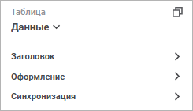
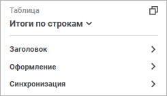

# Настройка таблицы и её элементов

Настройка таблицы и её элементов
-

# Настройка таблицы и её элементов

Настроить можно как всю таблицу, так и её отдельные [элементы](Select_Areas.htm).
 Для применения настроек к определённому [элементу
 таблицы](Select_Areas.htm) используйте [панель
 настроек](../Visualization/visualization_setting.htm#settings_panel). Набор настроек на панели зависит от выбранного элемента
 таблицы:

	 Таблица

	 Боковик/Шапка

	 Данные/Уголок

	 Итоги
	 по строкам/столбцам

		

		

		

		

Доступны следующие настройки и операции:

[Настройка заголовка](javascript:TextPopup(this))

	Для получения подробной информации обратитесь к разделу «[Настройка
	 заголовка](../Visualization/visualization_setting.htm#title)».

[Настройка данных](javascript:TextPopup(this))

	Задайте параметр «Агрегация фиксированных
	 измерений».

	Агрегация позволяет объединять значения элементов, отмеченных в
	 фиксированных измерениях.

	Для задания агрегации выберите метод в раскрывающемся списке:

		- Нет. Агрегация не
		 производится. Выбран по умолчанию;

		- Сумма. По умолчанию.
		 Суммируются значения элементов фиксированных измерений;

		- Минимум. У элементов
		 фиксированных измерений выбирается минимальное значение;

		- Максимум. У элементов
		 фиксированных измерений выбирается максимальное значение;

		- Арифметическое среднее.
		 Определяется среднее значение элементов фиксированных измерений
		 с учетом пустых значений.

[Настройка размещения](javascript:TextPopup(this))

	Для получения подробной информации обратитесь к разделу «[Настройка размещения](Layout.htm)».

[Отображение/скрытие
 пустых строк](javascript:TextPopup(this))

	Для отображения пустых строк переведите переключатель «Пустые
	 строки» в активное состояние. По умолчанию переключатель неактивен,
	 пустые строки не отображаются.

[Анализ данных](javascript:TextPopup(this))

	Для получения подробной информации о настройке обратитесь к разделу
	 «[Анализ
	 данных в таблице](Data_Analysis.htm)».

[Сортировка
 данных](javascript:TextPopup(this))

	Для получения подробной информации о сортировке данных всей таблицы
	 обратитесь к разделу «[Сортировка](../Visualization/visualization_setting.htm#sort)».

	Для быстрой сортировки данных всей таблицы используйте кнопки сортировки
	 в заголовках строк/столбцов:

		-  «Нет».
		 Сортировка не используется;

		-  «По
		 убыванию». Выполняется сортировка по убыванию;

		-  «По
		 возрастанию». Выполняется сортировка по возрастанию.

	Для отображения/скрытия значков сортировки в боковике/шапке установите/снимите
	 флажок «[Отображать
	 значки сортировки](Layout.htm#sort)» в группе параметров «Размещение»
	 на панели настроек.

[Оформление
 элементов таблицы](javascript:TextPopup(this))

	Для получения подробной информации о настройке обратитесь к разделу
	 «[Оформление
	 элементов таблицы](TableElemants_Format.htm)».

[Настройка
 синхронизации](javascript:TextPopup(this))

	Для получения подробной информации о настройке обратитесь к разделу
	 «[Синхронизация
	 визуализаторов на слайде](../../Frames/visualizers_synchronization.htm)».

[Исключение
 данных](javascript:TextPopup(this))

	Для исключения из таблицы лишней строки/столбца:

		- Выделите заголовок строки/столбца, которую необходимо исключить.

		- Выполните команду «Исключить»
		 контекстного меню выделенного заголовка строки/столбца.

	В результате из таблицы будет исключена строка/столбец.

	Для исключения из таблицы всех данных, кроме выделенных:

		- Выделите ячейку, строку, столбец или диапазон ячеек/строк/столбцов
		 в таблице, данные из которых должны отображаться в таблице.

		- Выполните команду «Исключить
		 остальные» контекстного меню выделенных ячеек.

	В результате из таблицы будут исключены все данные, кроме выделенных.

См. также:

[Настройка
 визуализации данных](../Visualization/visualization_setting.htm) | [Настройка визуализатора
 «Таблица»](Table.htm)

		Справочная
		 система на версию 10.9
		 от 18/08/2025,
		 © ООО «ФОРСАЙТ»,
