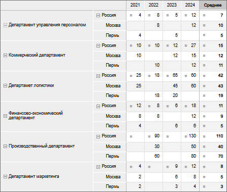
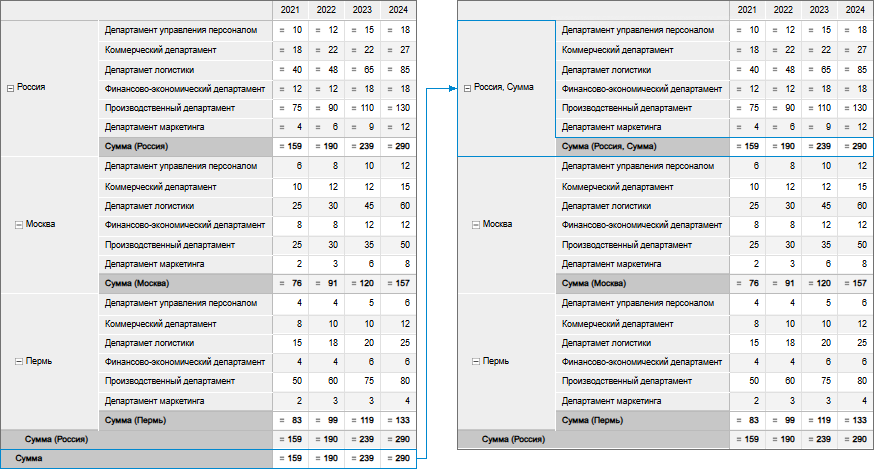
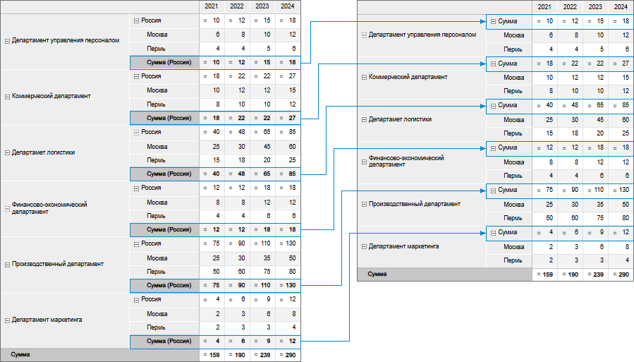

# Расчёт итоговых значений: Информационные панели

Расчёт итоговых значений: Информационные панели
-

# Расчёт итоговых значений

Итоги позволяют отобразить итоговые
 значения по строкам и/или столбцам.

Расчёт итоговых значений таблицы по столбцам и/или строкам и настройка
 их отображения выполняются с помощью группы параметров «Итоги
 по строкам»/«Итоги по столбцам»
 панели настроек.

[Для открытия
 группы параметров «Итоги по строкам/столбцам»](javascript:TextPopup(this))

		- Выделите [боковик](Select_Areas.htm#select_sidehead)
		 или [шапку](Select_Areas.htm#select_heading) таблицы.

		- Перейдите в группу параметров «[Размещение](Layout.htm)».

		- Установите флажок «Итоги».

		- Нажмите кнопку  «Настройка» рядом с флажком «Итоги».

Для отображения/скрытия итогов для данного измерения установите/снимите
 флажок «[Отображать
 итог](Layout.htm#dimension)» в контекстном меню измерения в группе параметров «[Размещение](Layout.htm)».

Настройки в группах параметров «Итоги
 по строкам» и «Итоги по столбцам»
 идентичны:

Доступны следующие настройки:

	- [Типы итогов](#types);

	- [Параметры расчёта](#parameters);

	- [Строка вывода](#output).

## Типы итогов

Выберите из раскрывающегося списка «Типы
 итогов» один или несколько требуемых типов итогов.

[Типы итогов](javascript:TextPopup(this))

		- Сумма. По умолчанию.

		- Среднее арифметическое.

		- Минимум.

		- Максимум.

		- Мода.

		- Медиана.

		- Дисперсия.

		- Среднеквадратическое отклонение.

		- Асимметрия.

		- Эксцесс.

		- Размах.

		- Коэффициент вариации.

		- Сумма квадратов.

		- Автокорреляция 1-го порядка.

		- Верхняя дециль.

		- Верхняя квартиль.

		- Нижняя квартиль.

		- Нижняя дециль.

		- Количество пустых ячеек.

		- Количество непустых ячеек.

		- Итог из источника.

Итоговые значения выбранных типов будут автоматически рассчитаны. Для
 сброса выбранных типов и скрытия итогов нажмите кнопку 
 «Очистить».

[Примеры итогов
 по столбцам и строкам](javascript:TextPopup(this))

	Пример итогов по столбцам и по строкам:

	  

## Параметры расчёта

После выбора [типов итоговых значений](#types) задайте параметры
 их расчёта на вкладке «Параметры расчёта»:

[Рассматривать
 пустые как нули](javascript:TextPopup(this))

	При установленном флажке пустые значения в ячейках будут рассматриваться
	 как нули. Это может быть важно, например, при вычислении средних значений.
	 По умолчанию флажок снят;

	Примечание.
	 Установка флажка не влияет на результат расчёта итоговых значений
	 типа «Количество пустых ячеек»
	 и «Количество непустых ячеек».

	Пример неустановленного и установленного флажка:

	  

[Не учитывать
 значения в вершинах](javascript:TextPopup(this))

	При установленном флажке не будут учитываться значения родительских
	 элементов иерархии. По умолчанию флажок снят.

[Общий итог /
 Промежуточный итог](javascript:TextPopup(this))

	Флажок «Общий итог» определяет
	 отображение общих итоговых значений по столбцам/строкам таблицы, рассчитанных
	 по всем элементам с установленной отметкой. По умолчанию флажок установлен.

	Флажок «Промежуточный итог»
	 определяет отображение итоговых значений, расположенных по строкам/столбцам
	 таблицы. В зависимости от состояния флажков:

		- По иерархии. Итоги
		 рассчитываются по [иерархии
		 измерений](uinavobj.chm::/reference_book/Master_RDS_reference_book/base_settings.htm#hierarchy) боковика/шапки таблицы по каждому
		 элементу с установленной отметкой;

		- По уровням. Итоги
		 рассчитываются по [уровням
		 измерений](uinavobj.chm::/reference_book/Master_RDS_reference_book/Level.htm) боковика/шапки таблицы по каждому
		 элементу с установленной отметкой.

	Флажки «По иерархии», «По уровням» актуальны, если в таблице
	 отображаются элементы иерархического измерения разных уровней иерархии.

	Примечание.
	 Если боковик/шапка таблицы состоит из нескольких иерархических измерений,
	 то при расчёте промежуточных итогов каждое следующее левое/верхнее
	 измерение берёт итог высшего уровня правого/нижнего измерения.

	При установке данных флажков в наименованиях итоговых элементов
	 отображаются наименования родительских элементов иерархии и/или наименования
	 уровней соответственно. Флажки «По
	 иерархии» и «По уровням»
	 установлены по умолчанию.

	Примечание.
	 Если общий итог совпадает с промежуточным итогом по иерархии/уровням,
	 то рекомендуется отключить отображение общего итога во избежание дублирования
	 информации.

	Пример с установленными флажками «Общий
	 итог», «Промежуточный итог»,
	 «По иерархии» и «Общий
	 итог», «Промежуточный итог»
	 и «По уровням»:

	  

[Выводить перед
 данными](javascript:TextPopup(this))

	При установленном флажке итоговые значения отображаются перед ячейками
	 с данными. По умолчанию флажок снят.

	Пример:

	

[Рассчитывать
 для одного элемента](javascript:TextPopup(this))

	При установленном флажке дополнительно будут рассчитываться итоговые
	 значения для элементов по каждому уровню и для элементов, содержащих
	 один столбец/строку. По умолчанию флажок снят.

	Пример неустановленного флажка:

	

	Пример установленного флажка:

	

## Строка вывода

Если в таблице отображаются элементы иерархического измерения разных
 уровней иерархии, то для вывода общего итога и/или итога иерархии в строку
 родительского элемента задайте параметры на вкладке «Строка
 вывода»:

[Общий итог](javascript:TextPopup(this))

	При установленном флажке в строку родительского элемента будет выводиться
	 общее итоговое значение. По умолчанию флажок снят.

[Итоги по иерархии](javascript:TextPopup(this))

	При установленном флажке в строку родительского элемента будут выводиться
	 итоговые значения по иерархии. По умолчанию флажок снят.

[Тип итога](javascript:TextPopup(this))

	Из раскрывающегося списка выбирается один из [типов
	 итогов](#types), применённых к таблице. Параметр доступен, если установлен
	 флажок «Общий итог» и/или
	 «Итоги по иерархии».

[Наименование
 элемента](javascript:TextPopup(this))

	Из раскрывающегося списка выбирается тип отображения наименования
	 родительского элемента:

		- Исходный элемент.
		 Выводится наименование исходного элемента;

		- Метод итога. Выводится
		 наименование метода итога;

		- Комбинированное.
		 По умолчанию. Выводятся наименования исходного элемента и метода
		 итога.

	Параметр доступен, если установлен флажок
	 «Общий итог» и/или «Итоги по иерархии».

[Разделитель](javascript:TextPopup(this))

	В поле задаётся разделитель между наименованиями элемента и метода
	 итога. По умолчанию в качестве разделителя установлена запятая - «,».
	 Параметр доступен, если установлен флажок «Общий
	 итог» и/или «Итоги по иерархии»
	 и выбран тип наименования «Комбинированное».

[Примеры отображения
 итогов в строке родительского элемента](javascript:TextPopup(this))

	Примеры отображения итогов в строке родительского элемента:

		- при установке флажка «Общий
		 итог», типа итога «Сумма»,
		 наименования элемента «Комбинированное»
		 и разделителя «,»:

	

		- при установке флажка «Итоги
		 по иерархии», типа итога «Сумма»
		 и наименования элемента «Метод
		 итога»:

	

См. также:

[Настройка
 визуализации данных](../Visualization/visualization_setting.htm) | [Настройка визуализатора
 «Таблица»](Table.htm) | [Настройка размещения](Layout.htm)

		Справочная
		 система на версию 10.9
		 от 18/08/2025,
		 © ООО «ФОРСАЙТ»,
