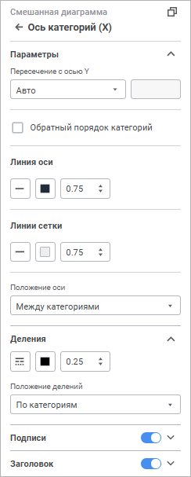

# Оси диаграммы: Информационные панели

Оси диаграммы: Информационные панели
-

# Оси диаграммы

Оси - компоненты диаграммы,
 служащие для упорядочивания данных на диаграмме. Заголовки столбцов и
 строк таблицы образуют координатную сетку, позволяющую определить адрес
 каждой ячейки. На диаграмме аналогичную роль играют ось категорий (X)
 и ось значений (Y). Оси присутствуют на всех диаграммах, кроме [круговых](visualizer_types.htm#pie)
 и [кольцевых](visualizer_types.htm#doughnut) диаграмм.

Дополнительная ось - вспомогательная ось значений, в которую могут быть
 помещены:

	- значения рядов данных, значительно отличающиеся от значений
	 других рядов;

	- значения рядов, представленные на диаграмме в различных типах
	 данных (например, цена и объём).

По дополнительной оси можно вывести один или несколько рядов данных.

Сетка - набор линий, перпендикулярных
 оси. Основные линии сетки проходят от каждого основного деления оси через
 всю область построения диаграммы, неосновные - от каждого промежуточного
 деления.

Основные деления - перпендикулярные
 штрихи на линии оси, содержащие подписи; промежуточные деления - штрихи
 без подписей, расположенные на линии оси между основными делениями.

Для настройки осей диаграммы используйте группу параметров «Ось
 категорий (Х)», «Ось значений
 (Y)», «Ось значений (дополнительная)»
 [панели настроек](visualization_setting.htm#settings_panel).

Примечание.
 Для настройки осей [лепестковой диаграммы](visualizer_types.htm#radar)
 используйте группу параметров «Ось значений».

[Для открытия
 группы параметров «Ось категорий Х», «Ось значений Y», «Ось значений дополнительная»](javascript:TextPopup(this))

	Для открытия группы параметров «Ось
	 категорий (Х)», «Ось значений
	 (Y)»:

	- Выделите диаграмму.

	- Переведите кнопку  «Настройки» на [панели
	 инструментов](../../../Starting.htm#structure_window) в активное состояние.

	- Выберите требуемую группу параметров.

	Для открытия группы параметров «Ось
	 значений (дополнительная)» выделите диаграмму, установите флажок
	 «[По
	 дополнительной оси](Data_Series.htm#add_axis)» для одного или нескольких рядов данных
	 диаграммы в группе параметров «[Ряды данных](Data_Series.htm)» затем выберите группу
	 параметров на панели параметров.

Наборы настроек зависят от выбранной оси и диаграммы.

Задайте настройки:

	- [параметры](#parameter);

	- [деления](#tick_mark);

	- [подписи](#labels);

	- [заголовок](#caption).

## Параметры

Для настройки параметров оси задайте:

[Максимальное,
 минимальное значение](javascript:TextPopup(this))

	Доступно:

		- для оси категорий X для [линейчатой
		 диаграммы](visualizer_types.htm#bar_horizontal);

		- для оси значений Y для [столбиковой](visualizer_types.htm#bar),
		 [линейной](visualizer_types.htm#line), [смешанной](visualizer_types.htm#mixed)
		 диаграмм и [диаграммы с областями](visualizer_types.htm#area);

		- для оси значений дополнительной для [столбиковой](visualizer_types.htm#bar),
		 [линейчатой](visualizer_types.htm#bar_horizontal),
		 [линейной](visualizer_types.htm#line), [смешанной](visualizer_types.htm#mixed)
		 диаграмм и [диаграммы с областями](visualizer_types.htm#area);

		- для оси значений для [лепестковой
		 диаграммы](visualizer_types.htm#radar).

	Выберите способ определения максимального и минимального значений
	 оси из раскрывающегося списка:

		- Авто. По умолчанию.
		 Значение будет рассчитано автоматически, исходя из данных источника;

		- Фиксированный. Задайте
		 максимальное/минимальное значение в соответствующем поле.

[Пересечение
 с осью](javascript:TextPopup(this))

	Доступно для осей X и Y. Недоступно для [лепестковой
	 диаграммы](visualizer_types.htm#radar).

	В раскрывающемся списке «Пересечение
	 с осью Y»/«Пересечение с осью
	 X» укажите вариант размещения оси категорий X/оси значений
	 Y:

		- Авто. По умолчанию.
		 Пересечение с осью Y/Х в минимальном значении;

		- В заданной точке.
		 Пересечение с осью Y/Х в заданной точке. Укажите значение точки
		 в поле;

		- В максимальном значении.
		 Пересечение с осью Y/Х в максимальном значении. Подписи значений
		 располагаются снаружи области построения.

[Расположить
 ось между категориями](javascript:TextPopup(this))

	Доступно для оси значений Y. Недоступно для [лепестковой
	 диаграммы](visualizer_types.htm#radar).

	Установите флажок «Расположить
	 ось между категориями» для расположения оси между указанной
	 точкой и следующей за ней. По умолчанию флажок снят.

	Примечание.
	 Флажок доступен при размещении оси Y «[В заданной точке](#crosses)».

[Обратный порядок
 категорий/значений](javascript:TextPopup(this))

	Недоступно для [лепестковой
	 диаграммы](visualizer_types.htm#radar).

	Для расположения категорий/значений оси в обратном порядке установите
	 флажок «Обратный порядок категорий/значений».
	 При обратном порядке категорий ось Y будет отображаться справа, дополнительная
	 ось - слева. При обратном порядке значений ось X будет отображаться
	 сверху. По умолчанию флажок снят.

[Линии
 оси/сетки](javascript:TextPopup(this))

	Для настройки линий оси/сетки задайте:

		- Тип линии. Из раскрывающегося
		 списка выберите тип линии;

		- Толщина линии. Задайте
		 требуемую толщину линии с помощью клавиатуры или редактора чисел.

[Положение оси](javascript:TextPopup(this))

	Доступно для оси категорий X для [столбиковой](visualizer_types.htm#bar),
	 [линейной](visualizer_types.htm#line), [смешанной](visualizer_types.htm#mixed)
	 диаграмм и [диаграммы с областями](visualizer_types.htm#area),
	  и для оси значений Y для [линейчатой
	 диаграммы](visualizer_types.htm#bar_horizontal).

	Задайте положение оси, выбрав из раскрывающегося списка:

		- По
		 категориям. Ось категорий пересекается с осью значений
		 в середине категории;

		- Между
		 категориями. Ось категорий пересекается с осью значений
		 в начале категории. Значение по умолчанию.

## Деления

Для настройки линий делений задайте:

[Тип линии](javascript:TextPopup(this))

	Недоступно для [лепестковой
	 диаграммы](visualizer_types.htm#radar).

	Для отображения делений выберите из раскрывающегося списка линию.

[Цвет линии](javascript:TextPopup(this))

	Недоступно для [лепестковой
	 диаграммы](visualizer_types.htm#radar).

	Выберите цвет однотонной заливки линии в раскрывающейся палитре.

[Толщина линии](javascript:TextPopup(this))

	Недоступно для [лепестковой
	 диаграммы](visualizer_types.htm#radar).

	Задайте требуемую толщину линии с помощью клавиатуры или редактора
	 чисел.

[Положение
 делений](javascript:TextPopup(this))

	Доступно для оси категорий X для [столбиковой](visualizer_types.htm#bar),
	 [линейной](visualizer_types.htm#line), [смешанной](visualizer_types.htm#mixed)
	 диаграмм и [диаграммы с областями](visualizer_types.htm#area),
	 а также для оси Y для [линейчатой
	 диаграммы](visualizer_types.htm#bar_horizontal).

	Задайте положение делений, выбрав из раскрывающегося списка:

		- По
		 категориям. Деления располагаются посередине категории.
		 Значение по умолчанию;

		- Между
		 категориями. Деления располагаются в начале категории.

[Интервалы](javascript:TextPopup(this))

	Доступно для оси значений Y, дополнительной оси, оси категорий X
	 [столбиковой](visualizer_types.htm#bar), [линейчатой](visualizer_types.htm#bar_horizontal),
	 [линейной](visualizer_types.htm#line), [смешанной](visualizer_types.htm#mixed)
	 диаграмм, [диаграммы с областями](visualizer_types.htm#area)
	 и оси значений [лепестковой диаграммы](visualizer_types.htm#radar).

	Для настройки расстояния между делениями выберите из раскрывающегося
	 списка:

		- Авто. Автоматический
		 расчёт расстояния между делениями;

		- Фиксировано. Задайте
		 количество расстояний между делениями в поле;

		- Гарантированная дистанция.
		 Задайте расстояние между делениями в миллиметрах в поле;

		- Другое. Выберите
		 режим построения шкалы:

			- Масштабирование кластеризацией.
			 Режим используется при неравномерных данных, например, есть
			 значения, равные 1 и 1000. Позволяет отображать данные с опусканием
			 неинформативных интервалов шкалы. При этом получаемая шкала
			 становится неравномерной, а график нагляднее.

			В поле задайте абсолютный шаг масштабирования, выражаемый в
			 единицах шкалы. Если приращение следующего ряда относительно
			 предыдущего больше заданного шага, то приращение на шкале
			 ограничивается этим шагом, при этом ряды рассматриваются по
			 возрастанию;

			- Распределенное масштабирование.
			 Данный режим аналогичен кластеризации, только шаг масштабирования
			 в поле задается в процентах разницы между отсортированными
			 двумя соседними рядами;

			- Логарифмическая шкала.
			 Значения шкалы вычисляются десятичным логарифмом в зависимости
			 от имеющихся данных.

## Подписи

Для настройки подписей делений оси переведите переключатель «Подписи»
 в активное состояние и задайте параметры:

[Шрифт](javascript:TextPopup(this))

	Выберите один из доступных шрифтов в раскрывающемся списке. При
	 необходимости можно загрузить [пользовательские
	 шрифты](Setup.chm::/UiWebSetup/03_Setup_Web/General_for_linux/Loading_Custom_Fonts.htm).

[Размер шрифта](javascript:TextPopup(this))

	Установите требуемый размер шрифта. Размер задаётся в пунктах, его
	 можно выбрать из раскрывающегося списка или ввести с помощью клавиатуры.
	 Диапазон допустимых значений: [8; 72].

[Цвет](javascript:TextPopup(this))

	Выберите цвет текста в раскрывающейся палитре.

[Начертание](javascript:TextPopup(this))

	Выберите начертание шрифта:

		- B. Полужирное начертание;

		- I.
		 Курсивное начертание;

		- U.
		 Подчеркивание текста.

	При нажатой кнопке будет использоваться
	 соответствующий стиль начертания. Доступно использование нескольких
	 стилей одновременно, например, нажатие кнопок «B»
	 и «I»
	 даёт полужирное курсивное начертание.

[Угол поворота](javascript:TextPopup(this))

	Задайте угол поворота подписи с помощью клавиатуры или редактора
	 чисел.

[Автоинтервалы
 между подписями](javascript:TextPopup(this))

	Доступен для оси X для [столбиковой](visualizer_types.htm#bar),
	 [линейной](visualizer_types.htm#line), [смешанной](visualizer_types.htm#mixed)
	 диаграмм, [диаграммы с областями](visualizer_types.htm#area)
	 и оси Y [линейчатой диаграммы](visualizer_types.htm#bar_horizontal).

	При установленном флажке интервалы между подписями будут рассчитаны
	 автоматически.

[Формат](javascript:TextPopup(this))

	Доступен для оси значений Y, дополнительной оси, оси категорий X
	 [столбиковой](visualizer_types.htm#bar), [линейчатой](visualizer_types.htm#bar_horizontal),
	 [линейной](visualizer_types.htm#line), [смешанной](visualizer_types.htm#mixed)
	 диаграмм и [диаграммы с областями](visualizer_types.htm#area),
	 оси значений [лепестковой диаграммы](visualizer_types.htm#radar).

	В раскрывающемся списке «Формат»
	 выберите формат значений оси.

	В зависимости от выбранного формата станут доступны дополнительные
	 настройки отображения значений:

		- при выборе формата значений «Числовой»,
		 «Денежный», «Процентный»
		 или «Экспоненциальный»
		 станет доступно поле «Десятичных
		 знаков», в котором определите число отображаемых знаков
		 после запятой с помощью редактора чисел или клавиатуры;

		- при выборе формата значений «Денежный»
		 станет доступен раскрывающийся список «Обозначение»,
		 в котором выберите требуемую валюту.

[Масштаб](javascript:TextPopup(this))

	Доступен для оси значений Y, дополнительной оси, оси категорий X
	 [столбиковой](visualizer_types.htm#bar), [линейчатой](visualizer_types.htm#bar_horizontal),
	 [линейной](visualizer_types.htm#line), [смешанной](visualizer_types.htm#mixed)
	 диаграмм и [диаграммы с областями](visualizer_types.htm#area),
	 оси значений [лепестковой диаграммы](visualizer_types.htm#radar).

	Если на оси требуется отобразить большие значения, то их можно масштабировать.
	 Таким образом, они будут занимать меньше пространства. Масштабирование
	 выполняется по формуле: X = A *
	 B, где A - исходное
	 значение, B - коэффициент
	 масштабирования. В раскрывающемся списке «Масштаб»
	 выберите коэффициент масштабирования данных:

		- Нет. По умолчанию.
		 B = 1;

		- Сотни. B
		 = 0.01;

		- Тысячи. B
		 = 0.001;

		- Миллионы. B = 0.000001;

		- Миллиарды. B = 0.000000001;

		- Триллионы. B = 0.000000000001.

	Например, на оси отображаются значения:
	 45000, 46000 и так далее. После применения масштаба «Тысячи»
	 на оси будут отображаться следующие значения: 45, 46 и так далее.

Для сброса заданных настроек подписи переведите переключатель «Подписи» в неактивное состояние.

## Заголовок

Недоступен для [лепестковой](visualizer_types.htm#radar)
 диаграммы.

Для отображения заголовка оси переведите переключатель «Заголовок»
 в активное состояние и введите текст, который будет отображаться в области
 заголовка оси, в соответствующее поле. Задайте настройки текста заголовка:

[Шрифт](javascript:TextPopup(this))

	Выберите один из доступных шрифтов в раскрывающемся списке. При
	 необходимости можно загрузить [пользовательские
	 шрифты](Setup.chm::/UiWebSetup/03_Setup_Web/General_for_linux/Loading_Custom_Fonts.htm).

[Размер шрифта](javascript:TextPopup(this))

	Установите требуемый размер шрифта. Размер задаётся в пунктах, его
	 можно выбрать из раскрывающегося списка или ввести с помощью клавиатуры.
	 Диапазон допустимых значений: [8; 72].

[Цвет](javascript:TextPopup(this))

	Выберите цвет текста в раскрывающейся палитре.

[Начертание](javascript:TextPopup(this))

	Выберите начертание шрифта:

		- B. Полужирное начертание;

		- I.
		 Курсивное начертание;

		- U.
		 Подчеркивание текста.

	При нажатой кнопке будет использоваться
	 соответствующий стиль начертания. Доступно использование нескольких
	 стилей одновременно, например, нажатие кнопок «B»
	 и «I»
	 даёт полужирное курсивное начертание.

Для сброса заданных настроек заголовка переведите переключатель «Заголовок» в неактивное состояние.

См. также:

[Настройка
 визуализации данных](visualization_setting.htm)

		Справочная
		 система на версию 10.9
		 от 18/08/2025,
		 © ООО «ФОРСАЙТ»,
