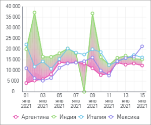

# Коридоры диаграммы: Информационные панели

Коридоры диаграммы: Информационные панели
-

# Коридоры диаграммы

Коридор диаграммы - выделенная
 часть области построения, находящаяся между двумя рядами [линейной
 диаграммы](visualizer_types.htm#line). Доступно создание нескольких коридоров.

Для настройки параметров коридоров линейной диаграммы используйте группу
 параметров «Коридоры диаграммы»
 [панели настроек](visualization_setting.htm#settings_panel).

[Для открытия
 группы параметров «Коридоры диаграммы»](javascript:TextPopup(this))

	Для открытия группы параметров «Коридоры
	 диаграммы»:

	- Выделите диаграмму.

	- Переведите кнопку  «Настройки» на [панели
	 инструментов](../../../Starting.htm#structure_window) в активное состояние.

	- Выберите требуемую группу параметров.

Откройте панель настроек коридора, нажав кнопку «Добавить
 коридор» для добавления нового коридора или дважды щёлкнув по уже
 существующему коридору для его редактирования:

Задайте параметры:

[Ряды](javascript:TextPopup(this))

	Выберите первый и второй ряды коридора в раскрывающихся списках
	 «Ряд 1» и «Ряд
	 2» соответственно.

[Заливка](javascript:TextPopup(this))

	В раскрывающейся палитре выберите способ заливки коридора:

		- Сплошная заливка.
		 Откройте вкладку «Один цвет»
		 и выберите цвет однотонной заливки коридора. При необходимости
		 укажите процент непрозрачности заливки;

		- Двухцветная заливка.
		 По умолчанию. Откройте вкладку «Два
		 цвета» и выберите начальный и конечный цвета двухцветного
		 градиента. При необходимости укажите процент непрозрачности заливки.

[Наименование](javascript:TextPopup(this))

	Задайте наименование коридора, которое будет отображаться в легенде.

[Отображать
 в легенде](javascript:TextPopup(this))

	Установите флажок для отображения коридора в легенде.

Нажмите кнопку «Добавить коридор»
 для сохранения настроек нового коридора и добавления его на диаграмму.

Примечание.
 При редактировании уже существующего коридора кнопка «Добавить
 коридор» недоступна. Сохранение изменённых настроек коридора происходит
 автоматически.

Для удаления коридора наведите на него курсор и нажмите кнопку  «Удалить».

См. также:

[Настройка
 визуализации данных](visualization_setting.htm)

		Справочная
		 система на версию 10.9
		 от 18/08/2025,
		 © ООО «ФОРСАЙТ»,
