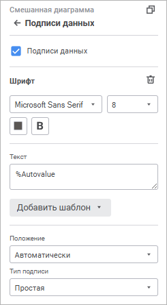
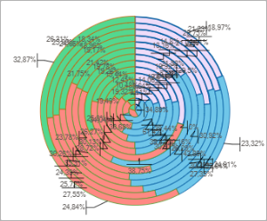
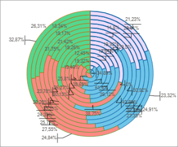

# Подписи данных: Информационные панели

Подписи данных: Информационные панели
-

# Подписи данных

Подписи данных содержат сведения
 о рядах или отдельных точках данных и упрощают понимание диаграммы. Подписи
 добавляются ко всем рядам диаграммы. В зависимости от того, что нужно
 выделить в диаграмме, подписи можно добавлять:

	- ко всем рядам диаграммы;

	- к одному ряду;

	- к [линии уровня](Level_Lines.htm).

Настройка подписей данных доступна для визуализаторов всех [типов](visualizer_types.htm),
 кроме [таблицы](../Table/Table.htm), [диаграммы
 рассеяния](visualizer_types.htm#scatterplot), [Sankey-диаграммы](visualizer_types.htm#sankey)
 и [индикатора](Indicator.htm).

Для настройки подписей данных используйте группу параметров «Подписи
 данных» [панели
 настроек](visualization_setting.htm#settings_panel).

[Для открытия
 группы параметров «Подписи данных»](javascript:TextPopup(this))

	Для открытия группы параметров «Подписи
	 данных»:

	- Выделите диаграмму.

	- Переведите кнопку  «Настройки» на [панели
	 инструментов](../../../Starting.htm#structure_window) в активное состояние.

	- Выберите требуемую группу параметров.

Для отображения подписей данных установите флажок «Подписи
 данных» и задайте настройки:

[Шрифт](javascript:TextPopup(this))

	Задайте настройки шрифта:

		- Шрифт. Выберите
		 один из доступных шрифтов в раскрывающемся списке. При необходимости
		 можно загрузить [пользовательские
		 шрифты](Setup.chm::/UiWebSetup/03_Setup_Web/General_for_linux/Loading_Custom_Fonts.htm);

		- Размер шрифта. Установите
		 требуемый размер шрифта. Размер задаётся в пунктах, его можно
		 выбрать из раскрывающегося списка или ввести с помощью клавиатуры.
		 Диапазон допустимых значений: [8; 36];

		- Цвет. Выберите цвет
		 шрифта в раскрывающейся палитре.

	Для выбора доступны стандартные и пользовательские
	 цвета. По умолчанию палитра содержит только стандартные цвета.

	Для создания пользовательского цвета:

			- Нажмите кнопку «Добавить
			 цвет». Откроется расширенная палитра цветов.

			- Выберите цвет в расширенной палитре цветов, на странице
			 браузера с помощью пипетки или задайте код цвета в формате
			 RGB/HEX.

	После выполнения действий пользовательский
	 цвет будет создан и добавлен в палитру;

	Примечание.
	 Максимально возможное количество пользовательских цветов в палитре
	 равно 23.

		- Начертание. Выберите
		 начертание шрифта:

			- B. Полужирное
			 начертание;

			- I.
			 Курсивное начертание;

			- U.
			 Подчеркивание текста.

	При нажатой кнопке будет использоваться
	 соответствующий стиль начертания. Доступно использование нескольких
	 стилей одновременно, например, нажатие кнопок «B»
	 и «I»
	 даёт полужирное курсивное начертание.

Для сброса заданных настроек и возврата к
 стилю по умолчанию нажмите кнопку  «Удалить».

[Текст подписи](javascript:TextPopup(this))

	Для подписи может быть задан произвольный текст, шаблон или использовано
	 сочетание текста с шаблонами. Для ввода текста и шаблонов используйте
	 поле «Текст».

	Для добавления шаблона в текст подписи:

		- Нажмите кнопку «Добавить
		 шаблон».

		- В раскрывающемся списке выберите один из доступных шаблонов
		 текста.

	После выполнения действий выбранный шаблон будет добавлен в текст
	 подписи после позиции курсора.

	Доступные шаблоны:

		- %PointNo. Номер
		 точки;

		- %PointName. Имя
		 точки;

		- %SerieNo. Номер
		 ряда;

		- %SerieName. Имя
		 ряда;

		- %Data. Пользовательский
		 формат данных;

		- %PercentPartHundredth.
		 Доли с накоплением;

		- %PercentPart. Доли
		 в процентах с накоплением;

		- %PercentHundredth.
		 Доли - отношение значения точки ряда к сумме значений этой же
		 точки всех рядов;

		- %Percent. Доли в
		 процентах - отношение значения точки ряда к сумме значений этой
		 же точки всех рядов, представленное в процентах;

		- %Part. Значение
		 с накоплением;

		- %YValue. Значение
		 по оси Y;

		- %XValue. Значение
		 по оси X;

		- %Autovalue. По умолчанию.
		 Автоматический формат значения. Для всех диаграмм, кроме [круговой](visualizer_types.htm#pie),
		 будет использовано значение точки ряда данных. Для круговой диаграммы
		 используется отношение значения точки ряда к сумме значений этой
		 же точки всех рядов.

[Положение
 подписи](javascript:TextPopup(this))

	Для диаграмм доступны варианты расположения подписей данных:

		- Автоматически. По
		 умолчанию. Положение подписей данных выбирается автоматическим
		 образом;

		- В
		 центре;

		- У вершины внутри;

		- У
		 вершины снаружи;

		- У
		 основания внутри;

		- Пользовательское.

	Примечание.
	 Для [линейных](visualizer_types.htm#line), [лепестковых](visualizer_types.htm#radar)
	 диаграмм, а также [диаграмм с областями](visualizer_types.htm#area)
	 доступны варианты «Слева»,
	 «Сверху», «Справа»,
	 «Снизу». Варианты «У
	 вершины внутри», «У вершины
	 снаружи» и «У основания внутри»
	 недоступны. Для смешанных диаграмм доступны варианты «Автоматически»
	 и «Пользовательское».

	При выборе пользовательского расположения подписей становится доступным
	 определение:

		- Расположения подписей по горизонтали. Выберите из раскрывающегося списка
		 расположение подписей по горизонтали:

			- справа;

			- по центру. По умолчанию;

			- слева;

		- Расположения
		 подписей по вертикали. Выберите из раскрывающегося списка
		 расположение подписей по вертикали:

			- снизу;

			- по центру. По умолчанию;

			- сверху;

		- Смещение подписи.
		 Задайте длину смещения подписи относительно ряда по горизонтали,
		 по вертикали и процент смещения подписи относительно длины столбика.

[Тип подписи](javascript:TextPopup(this))

	Для диаграмм доступны следующие варианты размещения подписей данных:

		- Простая. Подпись
		 отображается в виде метки, не соединенной линией с рядом (установлен
		 по умолчанию);

		- Выноска. Подпись
		 отображается в виде выноски, соединенной линией с рядом;

		- Указатель. Подпись
		 отображается в виде указателя, соединенного линией с рядом.

	Для [столбиковых](visualizer_types.htm#bar), [линейчатых](visualizer_types.htm#bar_horizontal),
	 [круговых](visualizer_types.htm#pie) и [кольцевых](visualizer_types.htm#doughnut)
	 диаграмм для варианта [расположения подписи данных](#position)
	 «У вершины снаружи» при любом
	 размещении подписей данных доступен флажок «Скрыть
	 подписи при пересечнии».

	Отображение круговой диаграммы, если флажок «Скрыть
	 подписи при пересечнии» снят и установлен:

	     

	При использовании нового механизма размещения подписей данных
	 предотвращается их пересечение.

По умолчанию флажок «Подписи данных»
 не установлен, подписи данных не отображаются.

См. также:

[Настройка
 визуализации данных](visualization_setting.htm)

		Справочная
		 система на версию 10.9
		 от 18/08/2025,
		 © ООО «ФОРСАЙТ»,
