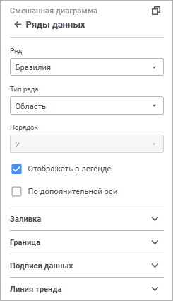
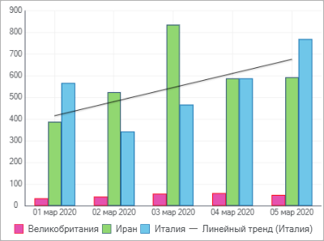
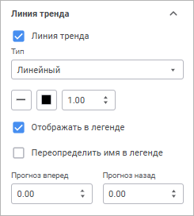

# Ряды данных: Информационные панели

Ряды данных: Информационные панели
-

# Ряды данных

Ряд данных - это элемент диаграммы,
 представляющий массив данных. На основе совокупности рядов данных строится
 диаграмма. На диаграмме ряды данных отображаются в графической форме,
 например, в форме набора разноцветных столбиков. Ряд данных диаграммы,
 для которого определено наименование, обозначается отдельным цветом и
 значком, указанными в легенде.

Для настройки рядов данных диаграммы используйте группу параметров «Ряды данных» [панели
 настроек](visualization_setting.htm#settings_panel).

[Для открытия
 группы параметров «Ряды данных»](javascript:TextPopup(this))

	Для открытия группы параметров «Ряды
	 данных»:

	- Выделите диаграмму.

	- Переведите кнопку  «Настройки» на [панели
	 инструментов](../../../Starting.htm#structure_window) в активное состояние.

	- Выберите требуемую группу параметров.

Настройка доступна для всех типов [диаграмм](visualizer_types.htm),
 кроме [диаграммы рассеяния](visualizer_types.htm#scatterplot)
 и [Sankey-диаграммы](visualizer_types.htm#sankey).

По умолчанию в раскрывающемся списке «Ряд»
 выбрано значение «Все». Данное
 значение позволяет задать настройки, которые применяются для всех существующих
 на диаграмме рядов. Для настройки определённого ряда выберите его в раскрывающемся
 списке «Ряд», а для настройки
 всех рядов выберите ряд «Все».
 Следует учитывать, что настройки, заданные для ряда «Все»,
 не перекрывают настройки, заданные вручную для конкретного ряда.

Количество отображаемых настроек зависит от типа диаграммы/ряда.

Параметры, доступные для конкретного ряда и для ряда «Все»:

[Тип
 ряда](javascript:TextPopup(this))

	Для изменения типа ряда [смешанных](visualizer_types.htm#mixed)
	 и [лепестковых](visualizer_types.htm#radar) диаграмм в
	 раскрывающемся списке «Тип ряда»
	 выберите тип:

		- Линия. Ряд будет
		 отображаться в виде линии;

		- Столбик. Ряд будет
		 отображаться в виде столбика. Доступно только для смешанных диаграмм;

		- Область. Ряд будет
		 отображаться в виде закрашенной области.

[Сглаживание
 линии ряда](javascript:TextPopup(this))

	Сглаживание линии используется для устранения эффекта ломаной линии,
	 возникающего при построении [линейных](visualizer_types.htm#line)
	 и [лепестковых](visualizer_types.htm#radar) диаграмм, а
	 также ряда [типа](#type) «Линия»
	 [смешанной диаграммы](visualizer_types.htm#mixed).

	Для сглаживания линейных рядов диаграммы установите флажок «Сглаживать линию».

[Заливка
 ряда](javascript:TextPopup(this))

	Заливка ряда доступна для всех типов диаграмм, кроме [линейной](visualizer_types.htm#line),
	 а также для всех [типов рядов](#type), кроме «Линия».

	Для настройки заливки ряда откройте раскрывающуюся палитру и выберите
	 тип заливки в раскрывающемся списке:

	- Без заливки. Заливка
	 не используется;

	- Автоматическая заливка.
	 По умолчанию. Применяется автоматическая однотонная сплошная заливка;

	- Сплошная заливка. Выберите
	 в раскрывающейся палитре цвет однотонной заливки области построения.
	 При необходимости укажите процент непрозрачности заливки;

	- Двухцветная заливка.
	 Выберите в раскрывающейся палитре начальный и конечный цвета двухцветного
	 градиента. При необходимости укажите угол наклона и процент непрозрачности
	 заливки;

	- Неоднородная заливка.
	 Выберите в раскрывающейся палитре базовый цвет заливки линейным градиентом.
	 При необходимости укажите процент непрозрачности заливки;

	- Заливка со штриховкой.
	 Выполните действия:

		- Выберите цвет однотонной заливки в раскрывающейся палитре.
		 При необходимости укажите процент непрозрачности заливки и цвета
		 штриховки.

		- Выберите образец текстуры в раскрывающемся списке «Штриховка».

		- Выберите цвет штриховки в раскрывающейся палитре.

	Если в раскрывающемся списке «[Ряд](#series)»
	 выбрано значение «Все», то
	 в зависимости от используемого типа заливки дополнительно будут доступны
	 флажки:

		- Выбор цвета. Флажок
		 доступен для сплошной и неоднородной заливок. При установке флажка
		 к диаграмме применяется заливка выбранным цветом;

		- От, До. Флажки доступны
		 для двухцветной заливки. При установке каждого из флажков к диаграмме
		 применяется двухцветная заливка выбранными цветами.

	Примечание.
	 Если для какого-то ряда диаграммы задана своя заливка, то она сохраняется,
	 независимо от состояния флажков. Для применения заданной заливки ко
	 всей диаграмме нажмите кнопку «Для
	 всех».

	По умолчанию все флажки сняты.

[Граница
 ряда](javascript:TextPopup(this))

	Настройка границы ряда доступна для всех типов диаграмм, кроме [линейной](visualizer_types.htm#line), а также для всех [типов рядов](#type), кроме «Линия».

	Для настройки границы ряда данных задайте:

		- Тип линии. Из раскрывающегося
		 списка выберите тип линии;

		- Цвет линии. Выберите
		 цвет линии в раскрывающейся палитре;

		- Толщина линии. Задайте
		 требуемую толщину линии с помощью клавиатуры или редактора чисел.

[Линия
 ряда](javascript:TextPopup(this))

	Настройка линии ряда доступна для рядов [линейной
	 диаграммы](visualizer_types.htm#line), а также для рядов [типа](#type) «Линия»
	 в [смешанной](visualizer_types.htm#mixed) и [лепестковой](visualizer_types.htm#radar)
	 диаграммах.

	Для настройки линии ряда данных задайте:

		- Тип линии. Из раскрывающегося
		 списка выберите тип линии;

		- Цвет линии. Выберите
		 цвет линии в раскрывающейся палитре;

		- Толщина линии. Задайте
		 требуемую толщину линии с помощью клавиатуры или редактора чисел.

[Маркеры](javascript:TextPopup(this))

	Маркер - это отдельное значение массива данных, отображаемое в виде
	 точки или фигуры.

	Для настройки отображения маркеров ряда данных убедитесь, что установлен
	 флажок «Маркеры» на панели
	 параметров.

	Настройка отображения маркеров доступна для рядов [линейной](visualizer_types.htm#line)
	 диаграммы, а также для рядов [типа](#type) «Линия»
	 [смешанной](visualizer_types.htm#mixed) и [лепестковой](visualizer_types.htm#radar)
	 диаграмм. Перечисленные типы диаграмм должны быть [двумерными](General_Settings.htm#3d_chart).

	Задайте параметры:

		- Тип. Выберите в
		 раскрывающемся списке тип маркера:

			- Ромб. Маркеры
			 отображаются в виде ромбов;

			- Обратный треугольник.
			 Маркеры отображаются в виде треугольников с вершинами, направленными
			 вниз;

			- Треугольник.
			 Маркеры отображаются в виде треугольников с вершинами, направленными
			 вверх;

			- Круг. Маркеры
			 отображаются в виде кругов;

			- Квадрат. Маркеры
			 отображаются в виде квадратов;

			- Линия. Маркеры
			 отображаются в виде штриха;

		- Размер. Задайте
		 размер маркеров в миллиметрах с помощью клавиатуры или редактора
		 чисел;

		- Автоматический поворот.
		 Установите флажок для наклона маркеров по касательной к линии
		 ряда диаграммы. При снятом флажке маркеры располагаются строго
		 вертикально;

	Примечание.
	 Автоматический поворот маркеров доступен только для типа маркеров
	 «Обратный треугольник», «Треугольник».

		- Заливка. Укажите
		 цвет заливки в раскрывающейся палитре. При необходимости укажите
		 процент прозрачности заливки в поле «Непрозрачность».
		 Для сброса заливки маркеров нажмите кнопку 
		 «Без цвета»;

		- Граница. Настройте
		 отображение границы:

			- Тип. Выберите
			 в раскрывающемся списке тип границы;

			- Цвет. Выберите
			 цвет однотонной заливки границы в раскрывающейся палитре:

			- Толщина. Задайте
			 толщину границы с помощью клавиатуры или редактора чисел.

	После выполнения действий маркеры будут отображаться для ряда данных
	 в соответствии с заданными параметрами.

	При необходимости снимите флажок «Маркеры»
	 для скрытия маркеров ряда данных на диаграмме.

Параметры, доступные для выбранного ряда:

[Порядок
 следования ряда](javascript:TextPopup(this))

	Изменение порядка следования рядов на диаграмме доступно при снятом
	 флажке «[Привязать
	 к источнику](General_Settings.htm#source_binding)».

	В раскрывающемся списке «Порядок»
	 выберите порядок следования ряда на диаграмме. Нумерация рядов начинается
	 с единицы. Порядок следования ряда на диаграмме устанавливает порядок
	 его отображения в [легенде](Legend.htm).

[Отображение/скрытие
 ряда в легенде](javascript:TextPopup(this))

	Для настройки отображения ряда в [легенде](Legend.htm)
	 используйте флажок «Отображать в
	 легенде». По умолчанию флажок установлен, и ряд в легенде отображается.

[Подписи
 данных](javascript:TextPopup(this))

	Подписи данных содержат сведения о рядах или отдельных точках данных
	 и упрощают понимание диаграммы.

	Для отображения подписей для выбранного ряда установите флажок «Подписи данных».

	Подробное описание настройки подписи данных приведено в разделе
	 «[Подписи
	 данных](Data_Labels.htm)».

[Построение
 ряда по дополнительной оси](javascript:TextPopup(this))

	Дополнительная ось - вспомогательная ось значений, в которую могут
	 быть помещены:

		- значения рядов данных, значительно отличающиеся от значений
		 других рядов;

		- значения рядов, представленные на диаграмме в другом типе
		 данных.

	Для построения ряда по дополнительной оси значений установите флажок
	 «По дополнительной оси». После
	 установки флажка на [панели
	 настроек](../../../Starting.htm#structure_window) появится группа параметров «Ось
	 значений дополнительная», предназначенная для настройки дополнительной
	 оси.

	Примечание.
	 Построение ряда по дополнительной оси доступно для всех типов диаграмм,
	 кроме [лепестковой](visualizer_types.htm#radar), [круговой](visualizer_types.htm#pie)
	 и [кольцевой](visualizer_types.htm#doughnut).

	Подробное описание настройки дополнительной оси приведено в разделе
	 «[Оси диаграммы](Axes.htm)».

[Линия
 тренда](javascript:TextPopup(this))

	Линия тренда позволяет графически отображать тенденции данных и
	 прогнозировать их дальнейшие изменения.

	

	Для отображения линии тренда установите флажок «Линия
	 тренда».

	Примечание.
	 Настройка линии тренда доступна для [столбиковой](visualizer_types.htm#bar),
	 [линейчатой](visualizer_types.htm#bar_horizontal), [линейной](visualizer_types.htm#line),
	 [смешанной](visualizer_types.htm#mixed) диаграммы и [диаграммы с областями](visualizer_types.htm#area).

	После установки флажка появится панель настройки параметров линии
	 тренда:

	

	Задайте параметры:

		- Тип. Выберите в
		 раскрывающемся списке тип линии тренда:

			- Линейный. Применяется
			 в самых простых случаях, когда точки ряда данных расположены
			 близко к прямой. Линейный тип линии тренда применим для величины,
			 которая увеличивается или убывает с постоянной скоростью;

			- Логарифмический.
			 Логарифмическая линия тренда хорошо описывает величину, которая
			 вначале быстро растёт или убывает, а затем постепенно стабилизируется.
			 Логарифмическая линия тренда может использоваться как для
			 отрицательных, так и для положительных значений данных;

			- Экспоненциальный.
			 Экспоненциальная линия тренда - кривая линия, которую следует
			 использовать, если скорость изменения данных непрерывно возрастает.
			 Однако для данных, которые содержат нулевые или отрицательные
			 значения, этот тип линии тренда неприменим;

			- Степенной. Степенная
			 линия тренда даёт хорошие результаты, если зависимость, которая
			 содержится в данных, характеризуется постоянной скоростью
			 роста. Примером такой зависимости может служить ускорение
			 автомобиля за каждый интервал времени, равный одной секунде.
			 Если в данных есть нулевые или отрицательные значения, использование
			 степенной линии тренда невозможно;

			- Среднее. Линия
			 тренда проходит через среднее значение ряда данных. Такая
			 линия тренда позволяет просмотреть динамику изменения рассматриваемой
			 величины в зависимости от среднего значения;

			- Пиковые значения.
			 Строятся линии тренда: проходящая через максимальное значение
			 ряда данных и проходящая через минимальное значение ряда данных;

		- Вид линии. Из раскрывающегося
		 списка выберите вид линии;

		Примечание.
		 Выбор вида линии тренда доступен только для двумерных типов диаграмм.

		- Цвет линии. Выберите
		 цвет линии в раскрывающейся палитре;

		- Толщина линии. Задайте
		 требуемую толщину линии с помощью клавиатуры или редактора чисел.

	Для настройки отображения линии тренда в [легенде](Legend.htm)
	 используйте флажок «Отображать в
	 легенде» . По умолчанию флажок установлен, и линия тренда в
	 легенде отображается.

	Для переопределения названия линии тренда в легенде установите флажок
	 «Переопределить имя в легенде»
	 и задайте новое название линии. Доступно только при установленном
	 флажке «Отображать в легенде».

	В зависимости от выбора типа линии тренда будут доступны дополнительные
	 поля:

		- Прогноз вперёд/Прогноз
		 назад. Задайте требуемое количество шагов прогнозирования
		 с помощью клавиатуры или редактора чисел. Данная настройка доступна
		 для всех типов линий тренда, кроме «Среднее»
		 и «Пиковые значения»;

		- Пиковый интервал.
		 Задайте требуемый интервал, на котором будут вычисляться пиковые
		 значения ряда, с помощью клавиатуры или редактора чисел. Данная
		 настройка доступна только для линий тренда типа «Пиковые
		 значения».

Для применения настроек ряда «Все»
 для всех рядов, включая ряды с пользовательскими настройками, нажмите
 кнопку «Для всех».

См. также:

[Настройка
 визуализации данных](visualization_setting.htm)

		Справочная
		 система на версию 10.9
		 от 18/08/2025,
		 © ООО «ФОРСАЙТ»,
