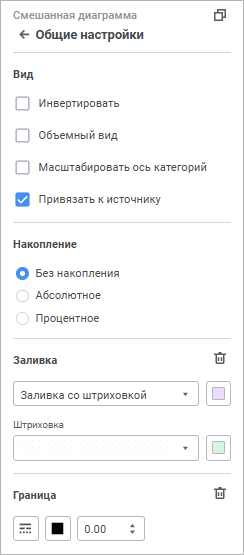
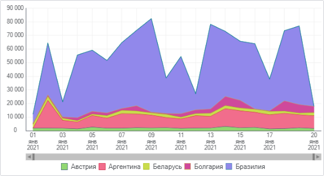
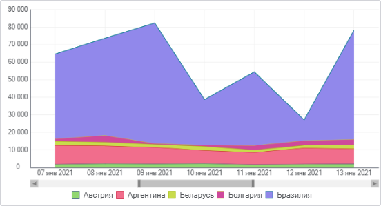
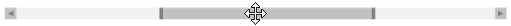

# Общие настройки: Информационные панели

Общие настройки: Информационные панели
-

# Общие настройки

Для настройки вида отображения, типа накопления, заливки фона и границы
 диаграммы используйте группу параметров «Общие
 настройки» [панели
 настроек](visualization_setting.htm#settings_panel).

[Для открытия
 группы параметров «Общие настройки»](javascript:TextPopup(this))

	Для открытия группы параметров «Общие
	 настройки»:

	- Выделите диаграмму.

	- Переведите кнопку  «Настройки» на [панели
	 инструментов](../../../Starting.htm#structure_window) в активное состояние.

	- Выберите требуемую группу параметров.

Для настройки вида отображения визуализаторов задайте параметры:

[Инвертировать](javascript:TextPopup(this))

	Настройка изменения ориентации шкал доступна для [столбиковой](visualizer_types.htm#bar),
	 [линейчатой](visualizer_types.htm#bar_horizontal), [линейной](visualizer_types.htm#line),
	 [смешанной](visualizer_types.htm#mixed), [круговой](visualizer_types.htm#pie)
	 диаграмм и [диаграммы с областями](visualizer_types.htm#area).

	Для изменения ориентации шкал установите флажок «Инвертировать».
	 При этом ось X будет ориентирована снизу вверх, а ось Y слева направо.
	 Также будет инвертирован порядок отображения рядов в [легенде](Legend.htm).
	 При снятом флажке ориентация шкал и порядок рядов в легенде вернутся
	 к исходному виду

[Объемный
 вид](javascript:TextPopup(this))

	Настройка отображения диаграммы в объёмном виде доступна для [столбиковой](visualizer_types.htm#bar), [линейчатой](visualizer_types.htm#bar_horizontal),
	 [линейной](visualizer_types.htm#line), [смешанной](visualizer_types.htm#mixed),
	 [круговой](visualizer_types.htm#pie) диаграмм и [диаграммы
	 с областями](visualizer_types.htm#area).

	Для отображения диаграммы в объемном виде установите флажок «Объемный вид».

[Масштабировать
 ось категорий](javascript:TextPopup(this))

	Масштабирование позволяет
	 изменять размер отображаемого участка диаграммы с сохранением пропорций.
	 Масштабирование оси категорий применяется для управления отображением
	 области диаграммы.

	Настройка доступна для [столбиковой](visualizer_types.htm#bar),
	 [линейчатой](visualizer_types.htm#bar_horizontal), [линейной](visualizer_types.htm#line),
	 [смешанной](visualizer_types.htm#mixed) диаграмм и [диаграммы
	 с областями](visualizer_types.htm#area).

	Для изменения масштаба диаграммы с помощью «скроллера» установите
	 флажок «Масштабировать ось категорий».

	После установки флажка под будет отображаться «скроллер» под областью
	 диаграммы:

	

	Для выполнения масштабирования наведите указатель мыши к границе
	 «скроллера». Указатель примет вид двунаправленной стрелки:

	

	Щёлкните по границе «скроллера» и передвиньте её. Диаграмма автоматически
	 перестроится. В области построения диаграммы будет отображаться участок,
	 соответствующий участку «скроллера»:

	

	Для перемещения «скроллера» наведите на него указатель мыши. Указатель
	 примет вид четырехнаправленной стрелки:

	

	Нажмите кнопку мыши и, удерживая ее, передвиньте участок «скроллера»
	 в необходимую позицию. В области построения отобразится соответствующий
	 участок диаграммы.

	Для быстрого выполнения масштабирования наведите указатель мыши
	 на «скроллер» или на область диаграммы и прокрутите колесико мыши
	 вверх для увеличения масштаба, вниз - для уменьшения масштаба.

	Для возвращения диаграммы к исходному виду:

		- снимите флажок «Масштабировать
		 ось категорий»;

		- передвиньте границы «скроллера» в исходное положение.

	По умолчанию отображение «скроллера» отключено.

[Привязать
 к источнику](javascript:TextPopup(this))

	Для сохранения оформления рядов данных диаграммы установите флажок
	 «Привязать к источнику» в
	 группе параметров «Общие настройки»
	 на [панели настроек](../../../Starting.htm#structure_window).
	 После установки флажка оформление рядов данных не будет меняться при
	 изменении отметки в измерении.

	Примечание.
	 При работе со [смешанной диаграммой](visualizer_types.htm#mixed)
	 ряды линейного типа будут отображаться на переднем плане относительно
	 других типов рядов.

[Накопление](javascript:TextPopup(this))

	Настройка накопления доступна для [столбиковой](visualizer_types.htm#bar),
	 [линейчатой](visualizer_types.htm#bar_horizontal),[
	 линейной](visualizer_types.htm#line),  [смешанной](visualizer_types.htm#mixed)
	 диаграмм и [диаграмма с областями](visualizer_types.htm#area).

	Для построения диаграммы с накоплением выберите способ накопления
	 в группе «Общие настройки»
	 на [панели настроек](../../../Starting.htm#structure_window):

		- Без накопления.
		 Диаграмма отображает абсолютные значения ряда;

		- Абсолютное. Диаграмма
		 отображает значения с накоплением, позволяя оценить вклад каждого
		 значения в общую сумму;

		- Процентное. Диаграмма
		 отображает значения в процентном стиле, позволяя оценить долю
		 каждого значения в общей сумме.

	По умолчанию настройки накопления скрыты.

[Заливка
 и фон](javascript:TextPopup(this))

	Для различных визуализаторов доступны настройки заливки фона в группах
	 параметров:

		- Заливка. Настройка
		 доступна для всех типов [диаграмм](visualizer_types.htm),
		 кроме [Sankey-диаграммы](visualizer_types.htm#sankey)
		 и [диаграммы рассеяния](visualizer_types.htm#scatterplot).
		 Для настройки заливки визуализатора выберите вид заливки:

			- Без заливки.
			 Заливка фона визуализатора не используется;

			- Сплошная заливка.
			 Укажите цвет заливки в раскрывающейся палитре. При необходимости
			 укажите процент прозрачности заливки в поле «Непрозрачность»;

			- Двухцветная заливка.
			 Укажите начальный и конечный цвета градиента в раскрывающихся
			 палитрах. При необходимости укажите угол наклона и процент
			 прозрачности градиента в полях «Поворот
			 угла наклона» и «Непрозрачность»;

			- Заливка со штриховкой.
			 Укажите цвет заливки в раскрывающейся палитре, выберите вид
			 штриховки в раскрывающемся списке и задайте цвет штриховки.
			 При необходимости укажите процент прозрачности заливки в поле
			 «Непрозрачность».

	Примечание.
	 При задании прозрачности сплошной,
	 градиентной или заливки
	 со штриховкой учитывайте, что 0% соответствует полной прозрачности
	 (фон визуализатора станет невидимым), 100% соответствует полной непрозрачности.

Для сброса заданных настроек и возврата к
 стилю по умолчанию нажмите кнопку  «Удалить».

		- Фон. Настройка доступна
		 для [слайдов](../../Frames/frames.htm) и визуализаторов:
		 «[Sankey-диаграмма](visualizer_types.htm#sankey)»,
		 «[Диаграмма рассеяния](visualizer_types.htm#scatterplot)»,
		 «[Индикатор](Indicator.htm)», «[Текст](Text.htm)»,
		 «[Изображение](Image.htm)». Для настройки заливки фона
		 задайте требуемые цвета в раскрывающейся палитре.

Для сброса заданных настроек и возврата к
 стилю по умолчанию нажмите кнопку «Сбросить».

[Граница](javascript:TextPopup(this))

	Для настройки границы диаграммы задайте:

		- Тип линии. Из раскрывающегося
		 списка выберите тип линии;

		- Цвет линии. Выберите
		 цвет линии в раскрывающейся палитре;

		- Толщина линии. Задайте
		 требуемую толщину линии с помощью клавиатуры или редактора чисел.

Для сброса заданных настроек и возврата к
 стилю по умолчанию нажмите кнопку  «Удалить».

См. также:

[Настройка
 визуализации данных](visualization_setting.htm)

		Справочная
		 система на версию 10.9
		 от 18/08/2025,
		 © ООО «ФОРСАЙТ»,
