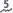
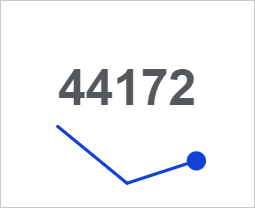
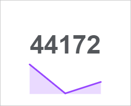

# Настройка визуализатора «Индикатор»

Настройка визуализатора «Индикатор»
-

# Настройка визуализатора «Индикатор»

Визуализатор «Индикатор», состоящий
 из значения показателя и спарклайна, предназначен для
 отслеживания динамики.

Для добавления визуализатора на рабочую область:

	- выберите тип визуализатора  «Индикатор»
	 в раскрывающемся меню кнопки 
	 «Вставка» на панели инструментов
	 и щёлкните по ячейке слайда;

	- щёлкните по ячейке слайда и выберите тип визуализатора  «Индикатор»
	 в раскрывающемся меню.

Затем [добавьте или выберите источник данных](../../Source.htm)
 в раскрывающемся списке «Источники»
 в верхней части [боковой
 панели](../../../Starting.htm#structure_window).

Примечание.
 Для визуализатора «Индикатор»
 доступны все операции, приведенные в статье «[Добавление визуализаторов
 и работа с ними](../visualizers.htm)».

Пример отображения индикатора:

Доступные поля для построения индикатора:

	- [линия тренда](visualization_setting.htm#trendline);

	- [фильтр](visualization_setting.htm#filter);

	- [факты](visualization_setting.htm#facts).

Доступные настройки индикатора:

[Настройка заголовка](javascript:TextPopup(this))

	Для получения подробной информации о настройке обратитесь к разделу
	 «[Настройка
	 заголовка](visualization_setting.htm#title)».

[Настройка
 числа](javascript:TextPopup(this))

	Для настройки числа задайте параметры:

		- Размер шрифта. Выберите
		 способ задания размера шрифта числа:

			- Авто. Размер
			 шрифта числа устанавливается автоматически;

			- Вручную. Размер
			 шрифта числа вводится с помощью клавиатуры или кнопок «+»
			 и «-»;

		- Формат числа. Выберите
		 формат отображения числа:

			- Число. Число
			 отображается без изменений;

			- Процент. Число
			 отображается в процентном виде: число увеличивается в 100
			 раз и справа от него отображается символ процента «%»;

		- Знаков после запятой.
		 Выберите способ задания количества знаков после запятой:

			- Авто. Число
			 знаков после запятой устанавливается автоматически;

			- Вручную. Число
			 знаков после запятой вводится с помощью клавиатуры или кнопок
			 «+» и «-»;

		- Разделять разряды.
		 Установите флажок при необходимости разделения разрядов числа
		 через пробел;

		- Выравнивание. Выберите
		 выравнивание числа относительно визуализатора:

			-  «По левому краю»;

			-  «По центру».
			 По умолчанию;

			-  «По правому краю».

[Настройка
 единиц измерения](javascript:TextPopup(this))

	Для настройки единиц измерения выберите способ задания значения
	 единиц измерения:

		- Авто. Единицы измерения
		 устанавливаются автоматически;

		- Вручную. Единицы
		 измерения выбираются из раскрывающегося списка:

			- Тысячи, K;

			- Миллионы, M;

			- Миллиарды, B;

			- Триллионы, T.

[Настройка
 дополнительного текста](javascript:TextPopup(this))

	Для настройки дополнительного текста заполните поля:

		- Префикс. Текст,
		 отображаемый непосредственно перед числом;

		- Постфикс. Текст,
		 отображаемый сразу после числа.

[Настройка
 спарклайна](javascript:TextPopup(this))

	Спарклайн - это небольшая
	 диаграмма, которая помещается внутри визуализатора. С помощью спарклайнов
	 можно показывать тенденции в рядах данных. Спарклайны применяются
	 для более наглядного представления больших наборов данных.

	Для настройки спарклайна:

		- Переведите переключатель «Спарклайн»
		 в активное состояние. По умолчанию переключатель неактивен, спарклайны
		 не отображаются.

		- Выберите способ отображения спарклайна:

			-  «Линейный».
			 Спарклайн отображается в виде линейной диаграммы:

	

			-  «С областью».
			 Спарклайн отображается в виде областной диаграммы:

	

			- Последний элемент.
			 Установите флажок для отображения в визуализаторе наименования
			 последнего элемента измерения:

	

	Для скрытия спарклайнов переведите переключатель «Спарклайн»
	 в неактивное состояние.

[Настройка цвета
 фона](javascript:TextPopup(this))

	Для получения подробной информации о настройке обратитесь к разделу
	 «[Заливка
	 и фон](General_Settings.htm#background_color)».

[Настойка цвета шрифта](javascript:TextPopup(this))

	Для получения подробной информации о настройке обратитесь к разделу
	 «[Настройка
	 цвета шрифта](visualization_setting.htm#font_color)».

См. также:

[Добавление визуализаторов и работа с ними](../visualizers.htm)
 | [Выбор
 и настройка источника данных визуализатора](../../Source.htm)
 | [Настройка
 визуализации данных](visualization_setting.htm)

		Справочная
		 система на версию 10.9
		 от 18/08/2025,
		 © ООО «ФОРСАЙТ»,
