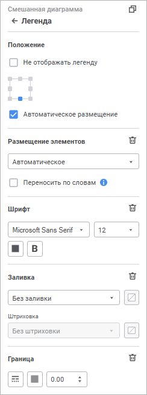
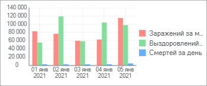
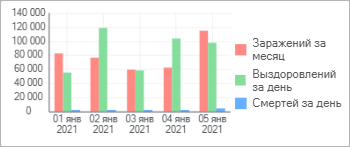

# Легенда: Информационные панели

Легенда: Информационные панели
-

# Легенда

Легенда содержит названия и
 маркеры рядов данных на диаграмме. Порядок отображения рядов данных в
 легенде соответствует их [порядку следования](Data_Series.htm#order)
 на диаграмме.

Примечание.
 В легенде отображаются только те ряды данных, для которых установлен флажок
 «[Отображать
 в легенде](Data_Series.htm#show_legend)».

Для настройки легенды диаграммы используйте группу параметров «Легенда» [панели
 настроек](visualization_setting.htm#settings_panel).

[Для открытия
 группы параметров «Легенда»](javascript:TextPopup(this))

	Для открытия группы параметров «Легенда»:

	- Выделите диаграмму.

	- Переведите кнопку  «Настройки» на [панели
	 инструментов](../../../Starting.htm#structure_window) в активное состояние.

	- Выберите требуемую группу параметров.

Настройка легенды доступна для визуализаторов всех [типов](visualizer_types.htm),
 кроме [таблицы](../Table/Table.htm) и [Sankey-диаграммы](visualizer_types.htm#sankey).

Для настройки легенды диаграммы задайте параметры:

[Положение](javascript:TextPopup(this))

	Выберите вариант расположения легенды относительно области диаграммы,
	 выделив его мышью. Доступны варианты: в левом верхнем углу, по центру
	 верхней границы, в правом верхнем углу, по центру правой границы,
	 в правом нижнем углу, по центру нижней границы блока, в левом нижнему
	 углу, по центру левой границы. При выборе варианта расположения будет
	 автоматически установлен флажок «Автоматическое
	 размещение легенды».

	По умолчанию легенда отображается в положении «По
	 центру нижней границы»:

	

	Для скрытия легенды установите флажок «Не
	 отображать легенду».

[Размещение
 элементов](javascript:TextPopup(this))

	Определите настройки размещения элементов в легенде:

		- для задания варианта размещения элементов выберите требуемый
		 вариант из раскрывающегося списка:

			- Автоматическое.
			 По умолчанию. Количество строк и столбцов подбирается в зависимости
			 от количества элементов легенды и её размеров;

			- В несколько столбцов.
			 Укажите количество столбцов для размещения элементов легенды.
			 При любом размере легенды будет использоваться заданное количество
			 столбцов;

			- В несколько строк.
			 Укажите количество строк для размещения элементов легенды.
			 При любом размере легенды будет использоваться заданное количество
			 строк;

	Примечание.
	 Для просмотра элементов диаграммы, которые не помещаются в легенде,
	 используйте полосу прокрутки строк/столбцов.

		- для переноса слов в легенде установите флажок «Переносить
		 по словам». Настройка используется только для варианта
		 размещения элементов легенды «В
		 несколько столбцов» со значением «1».

	Возможные варианты отображения наименований
	 элементов легенды:

			- наименования элементов без переноса слов:

	

			- наименования элементов с переносом слов:

	

[Шрифт](javascript:TextPopup(this))

	Для настройки шрифта задайте параметры:

		- Шрифт. Выберите
		 один из доступных шрифтов в раскрывающемся списке. При необходимости
		 можно загрузить [пользовательские
		 шрифты](Setup.chm::/UiWebSetup/03_Setup_Web/General_for_linux/Loading_Custom_Fonts.htm);

		- Размер шрифта. Установите
		 требуемый размер шрифта. Размер задаётся в пунктах, его можно
		 выбрать из раскрывающегося списка или ввести вручную. Диапазон
		 допустимых значений: [8; 36];

		- Начертание. Выберите
		 начертание шрифта:

			- B. Полужирное
			 начертание;

			- I.
			 Курсивное начертание;

			- U.
			 Подчеркивание текста.

	При нажатой кнопке будет использоваться
	 соответствующий стиль начертания. Доступно использование нескольких
	 стилей одновременно, например, нажатие кнопок «B»
	 и «I»
	 даёт полужирное курсивное начертание.

[Заливка](javascript:TextPopup(this))

	Для настройки фона легенды выберите тип заливки в раскрывающемся
	 списке:

		- Без заливки. Заливка
		 не используется;

		- Сплошная заливка.
		 Выберите в раскрывающейся палитре цвет однотонной заливки области
		 построения. При необходимости укажите процент непрозрачности заливки;

		- Двухцветная заливка.
		 Выберите в раскрывающейся палитре начальный и конечный цвета двухцветного
		 градиента. При необходимости укажите угол наклона и процент непрозрачности
		 заливки;

		- Заливка со штриховкой.
		 Выполните действия:

			- Выберите цвет однотонной заливки в раскрывающейся палитре.
			 При необходимости укажите процент непрозрачности заливки и
			 цвета штриховки.

			- Выберите образец текстуры в раскрывающемся списке «Штриховка».

			- Выберите цвет штриховки в раскрывающейся палитре.

Для сброса заданных настроек и возврата к
 стилю по умолчанию нажмите кнопку  «Удалить».

[Граница](javascript:TextPopup(this))

	Настройка границы легенды аналогична настройке [границы
	 визуализаторов](General_Settings.htm#border).

См. также:

[Настройка
 визуализации данных](visualization_setting.htm)

		Справочная
		 система на версию 10.9
		 от 18/08/2025,
		 © ООО «ФОРСАЙТ»,
