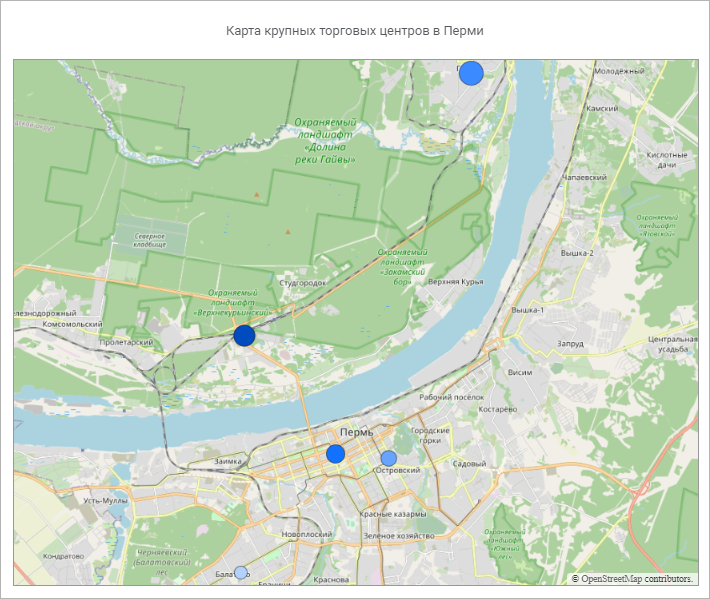
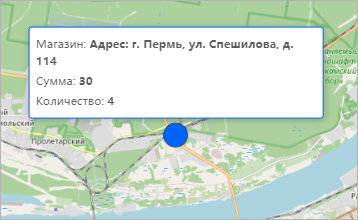

# Настройка визуализатора «Карта»

Настройка визуализатора «Карта»
-

# Настройка визуализатора «Карта»

Визуализатор «Карта» предназначен
 для решения задач анализа геоданных и отображения данных на основе их
 географического положения. В инструменте для отображения карты используется
 свободный картографический сервис OpenStreetMap.

Для добавления визуализатора на рабочую область:

	- выберите тип визуализатора  «Карта» в
	 раскрывающемся меню кнопки 
	 «Вставка» на панели инструментов
	 и щёлкните по ячейке слайда;

	- щёлкните по ячейке слайда и выберите тип визуализатора 
	 «Карта» в раскрывающемся
	 меню.

Затем [добавьте или выберите источник данных](../../Source.htm)
 в раскрывающемся списке «Источники»
 в верхней части [боковой
 панели](../../../Starting.htm#structure_window).

Примечание.
 Для визуализатора «Карта» доступны
 все операции, приведенные в статье «[Добавление визуализаторов и работа с ними](../visualizers.htm)».

Пример отображения карты:

Доступные поля для построения карты:

	- [геообъекты](visualization_setting.htm#geoobjects);

	- [широта](visualization_setting.htm#latitude_and_longitude);

	- [долгота](visualization_setting.htm#latitude_and_longitude);

	- [факты](visualization_setting.htm#facts);

	- [фильтр](visualization_setting.htm#filter);

	- [цвет](visualization_setting.htm#color_form_size);

	- [размер](visualization_setting.htm#color_form_size).

Доступные настройки карты:

[Настройка заголовка](javascript:TextPopup(this))

	Для получения подробной информации о настройке обратитесь к разделу
	 «[Настройка
	 заголовка](visualization_setting.htm#title)».

[Настройка
 онлайн-отображения карты](javascript:TextPopup(this))

	Для настройки онлайн-отображения карты используйте переключатель
	 «Онлайн-карта» на [панели
	 настроек](../../../Starting.htm#structure_window). При активном состоянии переключателя карта отображается
	 в онлайн-режиме и автоматически загружается из веб-сервиса OpenStreetMap.
	 При неактивном состоянии переключателя карта отображается в офлайн-режиме
	 и для её построения используется сохранённые в памяти изображения
	 карты.

	Поведение переключателя по умолчанию зависит от доступа пользователя
	 в сеть Интернет: если пользователь подключён к сети Интернет, то переключатель
	 находится в активном состоянии, в противном случае - в неактивном
	 состоянии.

[Настройка
 автомасштаба карты](javascript:TextPopup(this))

	Для настройки автоматического масштабирования карты используйте
	 переключатель «Автомасштаб» на
	 [панели настроек](../../../Starting.htm#structure_window).
	 При активном состоянии переключателя при задании или изменении полей
	 визуализатора карта автоматически масштабируется по отображаемым данным.
	 При неактивном состоянии переключателя масштабирование доступно только
	 вручную.

	По умолчанию переключатель находится в активном состоянии.

## Операции с картами

[Масштабирование
 карты](javascript:TextPopup(this))

	Для изменения масштаба карты используйте кнопки в левом нижнем углу
	 визуализатора:

		- +. Увеличивает масштаб
		 карты;

		- -. Уменьшает масштаб
		 карты.

	Масштабирование выполняется по центру карты.

[Перемещение
 по карте](javascript:TextPopup(this))

	Для перемещения по карте зажмите кнопку мыши и переместите курсор
	 в нужном направлении. Отображаемая область карты будет перемещаться
	 вслед за курсором.

[Просмотр
 информации о точках на карте](javascript:TextPopup(this))

	Для просмотра информации о точке на карте наведите на неё курсор.
	 Отобразится всплывающая панель с данными о точке:

	

См. также:

[Добавление визуализаторов и работа с ними](../visualizers.htm)
 | [Выбор
 и настройка источника данных визуализатора](../../Source.htm)
 | [Настройка
 визуализации данных](visualization_setting.htm)

		Справочная
		 система на версию 10.9
		 от 18/08/2025,
		 © ООО «ФОРСАЙТ»,
