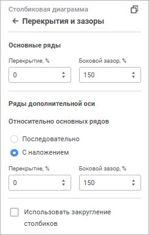

# Перекрытия и зазоры: Информационные панели

Перекрытия и зазоры: Информационные панели
-

# Перекрытия и зазоры

Настройка перекрытия и зазоров помогает отрегулировать расстояние между
 рядами и их положение относительно друг друга на диаграмме.

Для настройки перекрытия и зазоров используйте группу параметров «Перекрытия и зазоры» [панели
 настроек](visualization_setting.htm#settings_panel).

[Для открытия
 группы параметров «Перекрытия и зазоры»](javascript:TextPopup(this))

	Для открытия группы параметров «Перекрытия
	 и зазоры»:

	- Выделите диаграмму.

	- Переведите кнопку  «Настройки» на [панели
	 инструментов](../../../Starting.htm#structure_window) в активное состояние.

	- Выберите требуемую группу параметров.

Примечание.
 Отображаемые параметры зависят от типа диаграммы.

Задайте параметры:

[Перекрытие](javascript:TextPopup(this))

	Доступно для [столбиковой](visualizer_types.htm#bar),
	 [линейчатой](visualizer_types.htm#bar_horizontal) и [смешанной](visualizer_types.htm#mixed) диаграмм, если есть
	 ряды типа «Столбик».

	Параметр определяет положение рядов относительно друг друга. Задайте
	 значение перекрытия в процентах. Если значение положительное, то ряды
	 накладываются друг на друга, если отрицательное - между рядами будет
	 зазор. По умолчанию установлено значение 0. Диапазон допустимых значений:
	 [-100; 100].

[Боковой
 зазор](javascript:TextPopup(this))

	Доступно для [столбиковой](visualizer_types.htm#bar),
	 [линейчатой](visualizer_types.htm#bar_horizontal) и [смешанной](visualizer_types.htm#mixed) диаграмм, если есть
	 ряды типа «Столбик».

	Параметр определяет расстояние между рядами в соседних точках диаграммы.
	 Задайте значение бокового зазора в процентах. По умолчанию установлено
	 значение 150%. Диапазон допустимых значений: [0, 500].

[Относительно
 основных рядов](javascript:TextPopup(this))

	Доступно для [столбиковой](visualizer_types.htm#bar),
	 [линейчатой](visualizer_types.htm#bar_horizontal) и [смешанной](visualizer_types.htm#mixed) диаграмм, если есть
	 ряды типа «Столбик». Группа
	 параметров отображается, если хотя бы один ряд данных диаграммы расположен
	 по [дополнительной оси](Data_Series.htm#add_axis).

	Для выбора варианта положения рядов [дополнительной
	 оси](Data_Series.htm#add_axis) в группе «Относительно основных
	 рядов» установите переключатель:

		- Последовательно.
		 Основные ряды и ряды дополнительно оси располагаются последовательно;

		- С наложением. Ряды
		 дополнительной оси будут накладываться на основные ряды. Значение
		 по умолчанию. При выборе расположения дополнительных рядов
		 «С наложением» для рядов
		 станут доступны параметры «[Перекрытие](#overlap)» и «[Боковой зазор](#gap)». Доступные параметры определяются
		 наличием этих параметров для основных рядов.

[Использовать
 закругление столбиков](javascript:TextPopup(this))

	Доступно для [столбиковой](visualizer_types.htm#bar),
	 [линейчатой](visualizer_types.htm#bar_horizontal) и [смешанной](visualizer_types.htm#mixed) диаграмм, если есть
	 ряды типа «Столбик».

	Параметр определяет отображение рядов диаграммы в виде закругленных
	 столбиков. Установите флажок «Использовать
	 закругление столбиков» для закругления.

[Зазор
 между окружностями](javascript:TextPopup(this))

	Доступно для [круговой](visualizer_types.htm#pie) и [кольцевой](visualizer_types.htm#doughnut) диаграмм.

	Параметр определяет расстояние между рядами диаграммы. Задайте значение
	 зазора в миллиметрах. По умолчанию установлено значение 0. Диапазон
	 допустимых значений: [0, 100].

[Диаметр
 отверстия](javascript:TextPopup(this))

	Доступно для [кольцевой](visualizer_types.htm#doughnut)
	 диаграммы.

	Параметр определяет размер диаметра отверстия относительно диаметра
	 диаграммы. Задайте значение в процентах. По умолчанию установлено
	 значение 50%. Диапазон допустимых значений: [10%, 90%].

[Угол
 поворота](javascript:TextPopup(this))

	Доступно для [круговой](visualizer_types.htm#pie) и [кольцевой](visualizer_types.htm#doughnut) диаграмм.

	Параметр определяет угол поворота центральной оси в градусах. Поворот
	 осуществляется по часовой стрелке. Задайте значение в градусах. По
	 умолчанию установлено значение 0. Диапазон допустимых значений: [0,
	 360].

См. также:

[Настройка
 визуализации данных](visualization_setting.htm)

		Справочная
		 система на версию 10.9
		 от 18/08/2025,
		 © ООО «ФОРСАЙТ»,
