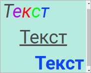

# Настройка визуализатора «Текст»

Настройка визуализатора «Текст»
-

# Настройка визуализатора «Текст»

Визуализатор «Текст» предназначен
 для отображения текстовой информации.

Для добавления визуализатора на рабочую область:

	- выберите тип визуализатора  «Текст»
	 в раскрывающемся меню кнопки 
	 «Вставка» на панели инструментов
	 и щёлкните по ячейке слайда;

	- щёлкните по ячейке слайда и выберите тип визуализатора  «Текст» в раскрывающемся
	 меню.

Для визуализатора «Текст» доступны
 операции:

	- [изменение размеров визуализатора](../visualizers.htm#resize);

	- [перемещение визуализатора](../visualizers.htm#move);

	- [копирование визуализатора](../visualizers.htm#copy);

	- [дублирование визуализатора](../visualizers.htm#duplicate);

	- [удаление визуализатора](../visualizers.htm#delete).

Пример отображения текста:

Доступные настройки текста:

[Настройка цвета
 фона](javascript:TextPopup(this))

	Для получения подробной информации о настройке обратитесь к разделу
	 «[Заливка
	 и фон](General_Settings.htm#background_color)».

[Настройка
 шрифта](javascript:TextPopup(this))

	Для настройки текста задайте параметры в группе «Шрифт» на
	 [панели настроек](../../../Starting.htm#structure_window):

		- Шрифт. В раскрывающемся
		 списке выберите один из шрифтов;

		- Размер шрифта. Установите
		 требуемый размер шрифта с помощью кнопок 
		 и ;

	Примечание.
	 Размер шрифта изменяется в зависимости от размера текстового блока.

		- Начертание. В раскрывающемся
		 меню кнопки выберите начертание шрифта:

				- .
				 Жирное начертание;

				- .
				 Курсивное начертание;

				- . Подчёркивание текста;

		- Цвет шрифта. Выберите
		 цвет шрифта в раскрывающейся палитре цветов. Для установки нового
		 цвета нажмите кнопку «Спектр»,
		 расположенную в стандартной палитре цветов, и выберите цвет в
		 расширенной палитре. По умолчанию установлен цвет шрифта #48494c
		 в формате HEX;

		- Заливка. Выберите
		 цвет заливки текста в раскрывающейся палитре цветов. По умолчанию
		 заливка отсутствует.

	Настройки выравнивания будут применены к выделенному тексту в текстовом
	 блоке.

Для сброса заданных настроек и возврата к стилю по умолчанию нажмите
 кнопку «Сбросить».

[Выравнивание
 строк](javascript:TextPopup(this))

	В раскрывающемся меню кнопки выберите один из способов выравнивания
	 выделенных строк:

		- . По левому краю;

		- . По центру;

		- . По правому краю.

	Настройки выравнивания будут применены к выделенному тексту в текстовом
	 блоке.

	Примечание.
	 Выравнивание выделенных строк имеет меньший приоритет, чем общая настройка
	 выравнивания для всего блока.

[Выравнивание
 текста](javascript:TextPopup(this))

	Выберите тип выравнивания текста в раскрывающихся списках:

		- По горизонтали.
		 Задайте выравнивание текста относительно границ:

			- По левому краю.
			 Текст размещается по левому краю;

			- По центру. Текст
			 размещается по центру;

			- По правому краю.
			 Текст размещается по правому краю;

		- По вертикали. Задайте
		 выравнивание текста относительно границ:

			- По верхнему краю.
			 Текст размещается по верхнему краю;

			- По центру. Текст
			 размещается по центру;

			- По нижнему краю.
			 Текст размещается по нижнему краю.

	Настройки выравнивания будут применены ко всему тексту в текстовом
	 блоке.

	Примечание.
	 Выравнивание для всего блока имеет больший приоритет, чем настройка
	 выравнивания выделенных строк.

См. также:

[Добавление визуализаторов и работа с ними](../visualizers.htm)
 | [Настройка
 визуализации данных](visualization_setting.htm)

		Справочная
		 система на версию 10.9
		 от 18/08/2025,
		 © ООО «ФОРСАЙТ»,
