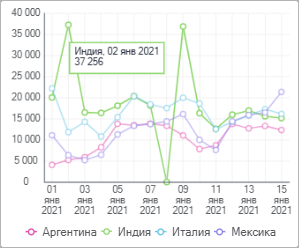
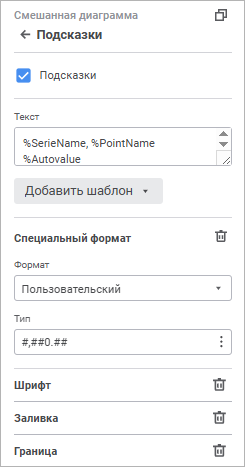

# Всплывающие подсказки: Информационные панели

Всплывающие подсказки: Информационные панели
-

# Всплывающие подсказки

Всплывающая подсказка отображает
 необходимую информацию о точке ряда данных, линии уровня или ряде данных
 в [легенде](Legend.htm) при наведении курсора на соответствующий
 элемент диаграммы.

Для настройки параметров всплывающих подсказок используйте группу параметров
 «Подсказки» [панели
 настроек](visualization_setting.htm#settings_panel).

[Для открытия
 группы параметров «Подсказки»](javascript:TextPopup(this))

	Для открытия группы параметров «Подсказки»:

	- Выделите диаграмму.

	- Переведите кнопку  «Настройки» на [панели
	 инструментов](../../../Starting.htm#structure_window) в активное состояние.

	- Выберите требуемую группу параметров.

Установите флажок «Подсказки»
 для отображения подсказок на диаграмме и задайте параметры:

[Текст](javascript:TextPopup(this))

	Для подсказок может быть задан произвольный текст, шаблон или использовано
	 сочетание текста с шаблонами. Для ввода текста и шаблонов используйте
	 поле «Текст».

	Для добавления шаблона в текст подписи:

		- Нажмите кнопку «Добавить
		 шаблон».

		- В раскрывающемся списке выберите один из доступных шаблонов
		 текста.

	После выполнения действий выбранный шаблон будет добавлен в текст
	 подписи после позиции курсора.

	Доступные шаблоны:

		- %PointNo. Номер
		 точки;

		- %PointName. Имя
		 точки;

		- %SerieNo. Номер
		 ряда;

		- %SerieName. Имя
		 ряда;

		- %PercentPartHundredth.
		 Доли с накоплением;

		- %PercentPart. Доли
		 в процентах с накоплением;

		- %PercentHundredth.
		 Доли - отношение значения точки ряда к сумме значений этой же
		 точки всех рядов;

		- %Percent. Доли в
		 процентах - отношение значения точки ряда к сумме значений этой
		 же точки всех рядов, представленное в процентах;

		- %Part. Значение
		 с накоплением;

		- %YValue. Значение
		 точки по оси Y;

		- %XValue. Значение
		 точки по оси X;

		- %Value. Значение
		 точки;

		- %Autovalue. По умолчанию.
		 Автоматический формат значения.

	Примечание.
	 Текст всплывающих подсказок для [линий уровня](Level_Lines.htm)
	 определяется автоматически.

[Специальный
 формат](javascript:TextPopup(this))

В раскрывающемся списке «Формат»
 выберите формат отображаемых значений. В зависимости от выбранного формата
 доступны дополнительные настройки отображения значений:

	- при выборе формата значений «Числовой»,
	 «Денежный», «Процентный»
	 или «Экспоненциальный» определите
	 в поле «Десятичных знаков»
	 число отображаемых знаков после запятой с помощью редактора чисел
	 или клавиатуры;

	- при выборе формата значений «Числовой»
	 или «Денежный» выберите в
	 раскрывающемся списке «Отрицательные
	 числа» требуемый способ отображения отрицательных чисел;

	- при выборе формата значений «Денежный»
	 выберите в раскрывающемся списке «Обозначение»
	 требуемую валюту;

	- при выборе формата значений «Числовой»
	 установите флажок «Разделитель группы
	 разрядов» для разделения групп разрядов чисел при необходимости;

	- при выборе формата значений «Дата»,
	 «Время» или «Дополнительный»
	 выберите в раскрывающемся списке «Тип»
	 требуемый тип отображения значений выбранного формата;

	- при выборе формата значений «Пользовательский»
	 определите в поле «Тип» свой
	 собственный способ отображения значений.

Для сброса заданных настроек и возврата к
 стилю по умолчанию нажмите кнопку  «Удалить».

	Примечание.
	 Если для полей, участвующих в построении диаграммы, были заданы [настройки
	 формата данных](visualization_setting.htm#data_format), то эти настройки будут отображены в группе настроек
	 «Специальный формат».

[Шрифт](javascript:TextPopup(this))

	Задайте настройки шрифта:

		- Шрифт. Выберите
		 один из доступных шрифтов в раскрывающемся списке. При необходимости
		 можно загрузить [пользовательские
		 шрифты](Setup.chm::/UiWebSetup/03_Setup_Web/General_for_linux/Loading_Custom_Fonts.htm);

		- Размер шрифта. Установите
		 требуемый размер шрифта. Размер задаётся в пунктах, его можно
		 выбрать из раскрывающегося списка или ввести с помощью клавиатуры.
		 Диапазон допустимых значений: [8; 36];

		- Начертание. Выберите
		 начертание шрифта:

			- B. Полужирное
			 начертание;

			- I.
			 Курсивное начертание;

			- U.
			 Подчеркивание текста.

	При нажатой кнопке будет использоваться
	 соответствующий стиль начертания. Доступно использование нескольких
	 стилей одновременно, например, нажатие кнопок «B»
	 и «I»
	 даёт полужирное курсивное начертание.

Для сброса заданных настроек и возврата к
 стилю по умолчанию нажмите кнопку  «Удалить».

[Заливка](javascript:TextPopup(this))

	В раскрывающейся палитре выберите способ заливки фона подсказок:

		- Сплошная заливка.
		 По умолчанию. Выберите цвет однотонной заливки фона подсказок.
		 При необходимости укажите процент непрозрачности заливки.

		- Без заливки.
		 Заливка фона подсказок использоваться не будет. Нажмите кнопку
		  «Без цвета».

Для сброса заданных настроек и возврата к
 стилю по умолчанию нажмите кнопку  «Удалить».

[Граница](javascript:TextPopup(this))

	Для настройки границы области подсказок задайте параметры:

		- Тип линии. Выберите
		 тип линии из раскрывающегося списка;

	Примечание.
	 Настройка цвета линии доступна только при отключённом флажке «В цвет показателя»;

		- Толщина линии. Задайте
		 требуемую толщину линии с помощью клавиатуры или редактора чисел.

	При установленном флажке «В цвет
	 показателя» цвет границы области подсказки совпадает с цветом
	 области, для которой отображается подсказка. Флажок установлен по
	 умолчанию.

Для сброса заданных настроек и возврата к
 стилю по умолчанию нажмите кнопку  «Удалить».

См. также:

[Настройка
 визуализации данных](visualization_setting.htm)

		Справочная
		 система на версию 10.9
		 от 18/08/2025,
		 © ООО «ФОРСАЙТ»,
