# Настройка визуализации данных

Настройка визуализации данных
-

# Настройка визуализации данных

	При работе с информационной панелью в [режиме
	 редактирования](../../../Starting.htm#modes) для настройки визуализации данных используются
	 [боковая панель](#side_panel) и [панель
	 настроек](#settings_panel).

## Боковая панель

	Боковая панель предназначена для работы с измерениями и фактами
	 [визуализаторов](../visualizers.htm), а также для настройки
	 их полей.

[Для отображения/скрытия
 панели](javascript:TextPopup(this))

	Для отображения боковой панели переведите кнопку 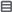 «Измерения» в активное состояние.
	 По умолчанию боковая панель отображается.

	Для скрытия боковой панели переведите кнопку 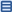 «Измерения» рабочей области в неактивное
	 состояние.

	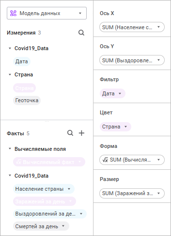

	Боковая панель состоит из групп:

		- Измерения. Содержит
		 поля [источника данных визуализатора](../../Source.htm):

			- поля [модели
			 данных](../../../../DataModel/create_data_model.htm), типы которых не относятся к целым или вещественным
			 числам;

			- все измерения [стандартного
			 куба](uinavobj.chm::/Cube/CreateCube/Master_Standart/UiMd_Cube_CreateCube_Master_Standart.htm).

		- Факты. Содержит
		 поля целого и вещественного типов модели данных, а также [вычисляемые
		 факты](../../calculated_facts.htm) и [вычисляемые
		 поля](../../../../DataModel/Preview/preview_table.htm#calculated_field). Отображается, если в качестве [источника
		 данных](../../Source.htm) информационной панели выбрана [модель
		 данных](../../../../DataModel/create_data_model.htm);

		- Поля. Предназначена
		 для настройки полей, необходимых для построения [визуализаторов](../visualizers.htm);

	Примечание.
	 Настройка полей доступна только для [выделенного
	 визуализатора](../visualizers.htm#select).

		- Фильтр измерения.
		 Предназначена для [настройки фильтра измерения](#dim_filter).

	Примечание.
	 При отображении группы «Фильтр измерения»
	 группы «Измерения» и «Факты» скрываются.

### Операции с измерениями и фактами

	[Поиск
	 измерений и фактов](javascript:TextPopup(this))

		Для поиска измерения нажмите кнопку 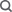 «Поиск» в группе «Измерения»
		 и начните вводить наименование требуемого измерения.

		Для поиска факта нажмите кнопку  «Поиск» в группе «Факты»
		 и начните вводить наименование требуемого факта.

	[Работа
	 с вычисляемыми фактами](javascript:TextPopup(this))

		Для получения подробной информации о работе с вычисляемыми фактами
		 обратитесь к разделу «[Настройка
		 вычисляемых фактов](../../calculated_facts.htm)».

### Задание полей

	[Задание
	 строк и столбцов](javascript:TextPopup(this))

		Задание строк и столбцов доступно для визуализаторов всех [типов](../visualizers.htm), кроме типов «[Диаграмма рассеяния](visualizer_types.htm#scatterplot)»,
		 «[Индикатор](Indicator.htm)»,
		 «[Карта](Map.htm)».

		Для задания строк/столбцов перетащите требуемые измерения и/или
		 факты в области «Строки»/«Столбцы» группы «Поля»
		 с помощью механизма Drag&Drop. Для быстрого добавления измерений
		 в область «Строки» дважды
		 щёлкните по требуемому измерению.

		В результате в списке строк/столбцов будут отображаться добавленные
		 измерения и/или факты:

		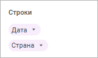

		Для изменения порядка следования добавленных полей используйте
		 команды 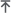 «Вверх»
		 и 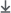 «Вниз»
		 в раскрывающемся меню кнопки  «Действия».

	[Задание
	 фильтра](javascript:TextPopup(this))

		Для задания фильтра доступны все измерения и факты, кроме [вычисляемых фактов](../../calculated_facts.htm).

		Для задания фильтра:

			- перетащите требуемые измерения и/или факты в область
			 «Фильтр» группы «Поля» с помощью механизма
			 Drag&Drop;

			- дважды щёлкните по требуемому измерению.

		В результате в списке фильтров будут отображаться добавленные
		 измерения и/или факты:

		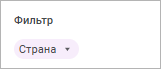

		Примечание.
		 Измерения стандартного куба с включенным [методом агрегации](uinavobj.chm::/Cube/Agregation.htm)
		 при размещении в области «Фильтр»
		 исключаются из построения представления данных.

	[Задание
	 фактов](javascript:TextPopup(this))

		Задание фактов доступно для визуализаторов всех [типов](visualizer_types.htm),
		 кроме типа «[Диаграмма
		 рассеяния](visualizer_types.htm#scatterplot)».

		Примечание.
		 Для задания фактов доступны данные только из группы «Факты».

		Для задания факта:

			- перетащите требуемый факт в область «Факты»
			 группы «Поля» с помощью
			 механизма Drag&Drop;

			- дважды щёлкните по требуемому измерению/факту.

		В результате в списке фактов будет отображаться добавленный
		 факт:

		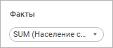

	[Задание
	 осей X и Y](javascript:TextPopup(this))

		Задание осей X и Y доступно только для визуализаторов типа «[Диаграмма
		 рассеяния](visualizer_types.htm#scatterplot)».

		Примечание.
		 Для задания осей доступны данные только из группы «Факты».

		Для задания осей:

			- перетащите требуемые факты в области «Ось X»
			 и/или «Ось Y»
			 группы «Поля» с помощью
			 механизма Drag&Drop;

			- дважды щёлкните по требуемому факту.

		В результате в списке осей будут отображаться добавленные факты:

		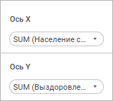

	[Задание
	 цвета, формы и размера точек](javascript:TextPopup(this))

		Задание цвета и размера точек доступно только для визуализаторов
		 типа «[Диаграмма
		 рассеяния](visualizer_types.htm#scatterplot)» и «[Карта](Map.htm)».

		Задание формы точек доступно только для визуализаторов типа
		 «[Диаграмма
		 рассеяния](visualizer_types.htm#scatterplot)».

		Для задания цвета/размера/формы точек перетащите требуемые измерения
		 и/или факты в области «Цвет»/«Размер»/«Форма»
		 соответственно группы «Поля»
		 с помощью механизма Drag&Drop. В результате в списке цветов/размеров/форм
		 будут отображаться добавленные измерения и/или факты:

		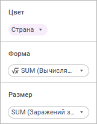

		Цвета/размеры/формы точек на визуализаторе будут определяться
		 значениями элементов добавленных измерений/фактов.

	[Задание
	 линии тренда](javascript:TextPopup(this))

		Задание линий тренда доступно только для визуализаторов типа
		 «[Индикатор](Indicator.htm)».

		Для задания линии тренда перетащите требуемые измерения и/или
		 факты в область «Линия тренда»
		 группы «Поля» с помощью
		 механизма Drag&Drop. В результате в списке линий тренда будут
		 отображаться добавленные измерения и/или факты:

		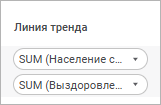

		Для изменения порядка следования добавленных полей используйте
		 команды  «Вверх»
		 и  «Вниз»
		 в раскрывающемся меню кнопки  «Действия».

	[Задание
	 геообъектов](javascript:TextPopup(this))

		Задание геообъектов доступно только для визуализаторов типа
		 «[Карта](Map.htm)».

		Примечание.
		 Для задания геообъектов доступны данные только из группы «Измерения».

		Для задания геообъектов:

			- перетащите требуемое измерение в область «Геообъекты»
			 группы «Поля» с помощью
			 механизма Drag&Drop;

			- дважды щёлкните по требуемому измерению.

		В результате в списке геообъектов будет отображаться добавленное
		 измерение:

		

		Геообъекты отображаются на карте в виде точек.

	[Задание
	 широты и долготы](javascript:TextPopup(this))

		Задание широты и долготы доступно только для визуализаторов
		 типа «[Карта](Map.htm)».

		Примечание.
		 Для задания широты и долготы доступны данные только из группы
		 «Факты».

		Для задания широты или долготы:

			- выполните команду 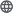 «Геороль»
			 в раскрывающемся меню кнопки  «Действия» для факта и выберите
			 вариант «Широта» или
			 «Долгота»;

			- перетащите требуемый факт в область «Широта»
			 или «Долгота» группы
			 «Поля» с помощью механизма
			 Drag&Drop.

		В результате в списке широт и долгот будут отображаться добавленные
		 факты:

		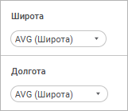

		Широта и долгота отвечают за координаты геообъектов по широте
		 и долготе в соответствии с правилом:

			- если значение широты положительно, то координата берётся
			 по северной широте, в противном случае - по южной широте;

			- если значение долготы положительно, то координата берётся
			 по восточной долготе, в противном случае - по западной
			 долготе.

		Для добавленных фактов по умолчанию устанавливается метод агрегации
		 «Арифметическое среднее».
		 Для изменения метода агрегации выберите требуемый метод из раскрывающегося
		 списка команды «Агрегация»
		 в раскрывающемся меню кнопки  «Действия»:

			- Арифметическое среднее
			 (AVG);

			- Минимум (MIN);

			- Максимум (MAX).

### Операции с полями

	[Изменение
	 роли поля](javascript:TextPopup(this))

		Для изменения роли поля, участвующего в построении визуализатора,
		 откройте раскрывающееся меню кнопки  «Действия» и установите переключатель:

			- Факт. При установке
			 переключателя для полей с типом данных «Строковый»,
			 «Дата» или «Время» доступна [настройка
			 агрегации](#fact_aggreagtion) и выбор метода: MIN, MAX, COUNT или COUNTD.
			 По умолчанию используется метод MAX;

			- Измерение. При
			 установке переключателя для полей c любым типом данных доступна
			 [настройка фильтра измерений](#dim_filter).

		По умолчанию роль определяется в зависимости от исходного расположения
		 поля: в группе «Измерения»
		 или «Факты».

		Примечание.
		 Изменение роли поля доступно для фактов и [вычисляемых
		 полей](../../../../DataModel/Preview/expressions.htm), если в качестве [источника
		 данных](../../Source.htm) информационной панели выбрана [модель
		 данных](../../../../DataModel/create_data_model.htm). Если поле визуализатора не поддерживает выбранную
		 роль поля источника данных, то поле источника данных будет автоматически
		 перемещено на допустимое поле визуализатора.

	[Настройка
	 фильтра для измерений](javascript:TextPopup(this))

		Задание фильтра доступно для всех измерений, кроме измерений,
		 построенных на [вычисляемых
		 фактах](../../calculated_facts.htm).

		Для задания фильтра измерения:

	- Выполните команду 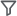 «Настроить фильтр» в раскрывающемся
	 меню кнопки 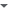 «Действия».
	 В результате группы «Измерения»
	 и «Факты» будут скрыты и появится
	 группа «Фильтр измерения»:

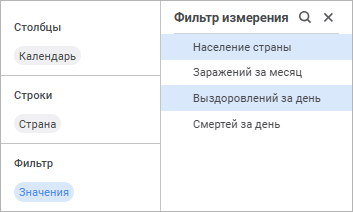

	- Выберите требуемые элементы выбранного поля. Для иерархических
	 и календарных измерений доступен выбор уровня измерения.

Для выбора диапазона элементов выберите первый
 элемент диапазона, после чего, зажав клавишу SHIFT, выберите последний
 элемент диапазона.

При необходимости воспользуйтесь строкой
 поиска для быстрого поиска элементов.

  Для быстрого
 выбора всех элементов выполните команду контекстного меню «Отметить
 всё». Для снятия выбора со всех элементов выполните команду контекстного
 меню «Снять отметку со всех».

Для получения подробной информации об отметке
 элементов поля обратитесь к разделу «[Отметка
 элементов измерения](../../Selecting_Dimension_Elements.htm)».

	- Щёлкните по свободному пространству в области «Поля»
	 для закрытия группы «Фильтр измерения».

	[Настройка
	 агрегации уровней](javascript:TextPopup(this))

		Для настройки агрегации уровней календарных или иерархических
		 измерений выполните действия:

			- Добавьте календарное или иерархическое измерение в область
			 «Столбцы» или «Строки» группы «Поля».

			- Выполните команду 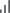 «Агрегация уровней» в раскрывающемся
			 меню кнопки  «Действия» добавленного измерения.
			 Будет открыто окно «Агрегация
			 уровней календаря»:

		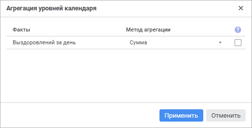

		В окне отображается список добавленных
		 фактов с методами агрегации.

			- Выберите в раскрывающемся списке «Метод
			 агрегации» методы агрегации для каждого факта. По умолчанию
			 установлен метод агрегации «Сумма».

			- При необходимости установите флажок «Агрегировать
			 по отметке в измерении» для агрегации уровней только
			 по отметкам в измерении. По умолчанию флажок не установлен,
			 агрегация уровней происходит по всем элементам измерения.

		После выполнения действий для добавленного календарного или
		 иерархического измерения будет настроена агрегация для каждого
		 из фактов.

	[Настройка
	 агрегации для фактов](javascript:TextPopup(this))

		По умолчанию для фактов устанавливается метод агрегации «Сумма». Для изменения метода
		 агрегации выберите требуемый метод из раскрывающегося списка команды
		 «Агрегация» в раскрывающемся
		 меню кнопки  «Действия»:

	- Сумма (SUM);

	- Арифметическое среднее (AVG);

	- Минимум (MIN);

	- Максимум (MAX);

	- Количество значений (COUNT);

	- Количество различных значений (COUNTD);

	- Ст. отклонение по выборке (STDDEV);

	- Медиана (MEDIAN);

	- Ст. отклонение по ГС (STDDEVP).

		Особенности задания агрегации для фактов:

			- для полей [«Широта»
			 и «Долгота»](#latitude_and_longitude) доступны методы агрегации:

				- Арифметическое среднее (AVG);

				- Минимум (MIN);

				- Максимум (MAX);

			- для [вычисляемых
			 фактов](../../calculated_facts.htm), добавленных в визуализаторы, устанавливаются методы
			 агрегации, настроенные для исходных фактов.

	[Настройка
	 формата данных](javascript:TextPopup(this))

		Настройка формата данных доступна для фактов, [вычисляемых
		 полей](../../../../DataModel/Preview/expressions.htm) и [вычисляемых фактов](../../calculated_facts.htm).

		Заданные настройки формата данных применяются для [оформления
		 элементов таблицы](../Table/TableElemants_Format.htm#special) и [всплывающих
		 подсказок на диаграммах](Tooltips.htm#special).

		Для изменения формата данных:

			- Выполните одно из действий на боковой панели:

				- выберите факт, вычисляемый факт или вычисляемое
				 поле в группе «Факты»
				 на боковой панели;

				- добавьте факты, вычисляемые факты или вычисляемые
				 поля в группу «Поля» на
				 боковой панели.

			- Выполните команду 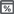 «Формат
			 данных» в раскрывающемся меню кнопки  «Действия»
			 для факта, вычисляемого факта или вычисляемого поля.

		После выполнения действий будет открыто окно «Настройки
		 формата данных»:

		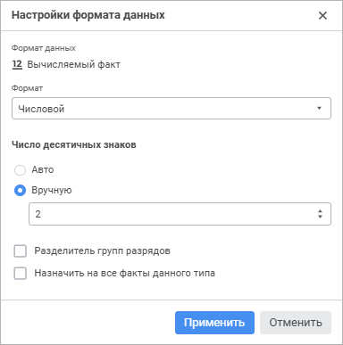

		В окне отображается тип данных и наименование факта или вычисляемого
		 поля.

		В раскрывающемся списке «Формат»
		 выберите формат данных:

			- Числовой. При
			 использовании числового формата значения будут представлены
			 в виде целого или вещественного числа с заданным числом десятичных
			 знаков и использованием разделителя группы разрядов;

			- Процентный.
			 При использовании процентного формата значение чисел умножается
			 на 100 и добавляется знак «%». Ввод чисел в ячейку при данном
			 формате будет по-разному обрабатываться в зависимости от использования
			 знака «%». Например, при вводе «40%» в ячейке будет отражено
			 «40%», при этом значение в ячейке «0,4». Если вводится «40»,
			 то в ячейке отображается «4000%», при этом значение в ячейке
			 будет «40»;

			- Пользовательский.
			 По умолчанию. Содержит кодовые представления всех доступных
			 форматов данных.

		В зависимости от выбранного формата доступны различные настройки:

			- для пользовательского формата данных в раскрывающемся
			 списке «Шаблон» выберите
			 один из базовых форматов, составленных с использованием специальных
			 зарезервированных символов (кодов форматов).

		Если ни один из форматов не подходит,
		 то можно добавить собственный. Для формирования целой и/или дробной
		 части включите в раздел следующие шаблоны:

				- #. Выводятся
				 только значащие числа, незначащие нули не отображаются;

				- 0. Незначащие
				 нули отображаются, если количество разрядов числа меньше
				 количества нулей в формате;

				- " "
				 (<пробел>).
				 При наличии знака пробела между # и/или 0 будет включен
				 режим групп разрядов. Число будет разделено пробелами
				 по 3 цифры. При вставке пробелов после шаблона целой части
				 числа - каждый пробел будет понижать разрядность отображаемого
				 числа на 3, что соответствует отображению в тысячах при
				 одном пробеле. Например, шаблон "0 " будет отображать
				 число "10 000" как "10".

		Задание шаблона дробной части производится
		 после знака запятой ",".

		Если дробная часть числа содержит
		 цифр больше, чем формат содержит шаблонов, число округляется так,
		 чтобы количество разрядов соответствовало количеству шаблонов.
		 Если же целая часть числа содержит цифр больше, чем формат содержит
		 шаблонов, отображаются все значащие разряды.

		Примеры использования шаблонов числа:

				 Формат

				 Исходное значение

				 Отображаемое значение

				 #
				 5
				 5

				 00
				 5
				 05

				 # #
				 10

				1000
				 10

				1 000

				 #,0#
				 12

				12,557
				 12,0

				12,56

				 # #,000
				 150
				 150,000

				 #<пробел>
				 10000
				 10

				 #<пробел>,00
				 100
				 0,10

				 #,0E+00
				 1000
				 1,0E+003

			- для процентного и числового форматов данных:

				- задайте количество отображаемых знаков после запятой:

					- Авто.
					 По умолчанию установлено автоматическое определение
					 количества отображаемых знаков после запятой, как
					 в источнике;

					- Вручную.
					 Задайте количество отображаемых знаков после запятой
					 в поле ввода или с помощью кнопок 
					 и . По умолчанию
					 отображается количество знаков, как в источнике;

				- установите флажок «Разделитель
				 групп разрядов» для отображения разделителей разрядов
				 (пробелов). По умолчанию флажок не установлен.

		Для применения настроек формата данных ко всем фактам этого
		 же типа данных установите флажок «Назначить
		 на все факты данного типа». Флажок отображается в окне
		 «Настройки формата данных»,
		 открытом в группе «Факты»
		 на боковой панели. По умолчанию флажок не установлен.

		Для применения настроек формата данных ко всем [визуализаторам](visualizer_types.htm),
		 где присутствует данный факт, вычисляемый факт или вычисляемое
		 поле, нажмите кнопку «Применить».

		Особенности отображения формата данных [итогов](../Table/totals.htm):

			- если в визуализаторе отображаются итоги по строкам или
			 столбцам, подсчитанные по фактам, то к значениям итогов по
			 умолчанию применяется формат, заданный для факта;

			- если итоги подсчитываются по элементу измерения, где
			 данные разных фактов представлены в одном формате, то в итогах
			 выводится значение в формате фактов;

			- если итоги подсчитываются по элементу измерения, где
			 данные разных фактов представлены в разных форматах, то в
			 итогах выводится значение в пользовательском формате с шаблоном
			 # ##0.#################.

	[Удаление
	 полей](javascript:TextPopup(this))

Для удаления добавленного поля выполните одно из действий:

	- выполните команду  «Удалить»
	 в раскрывающемся меню кнопки  «Действия»;

	- перетащите поле в группу «Измерения»
	 или «Факты» с помощью механизма
	 Drag&Drop.

## Панель настроек

	Панель настроек предназначена для настройки отображения [визуализатора](../visualizers.htm)
	 или [слайда](../../Frames/frames.htm).

	[Для отображения/скрытия
	 панели](javascript:TextPopup(this))

		Для отображения панели настроек переведите кнопку  «Настройки»
		 на [панели инструментов](../../../Starting.htm#structure_window)
		 в активное состояние. По умолчанию панель настроек скрыта.

		Для скрытия панели настроек визуализатора переведите кнопку
		  «Настройки»
		 на [панели инструментов](../../../Starting.htm#structure_window)
		 в неактивное состояние.

	Набор настроек на панели зависит от выбранного слайда или от типа
	 выбранного визуализатора:

		 Таблица

		 Диаграмма

		 Индикатор

		 Карта

		 Текст

		 Изображение

		 Слайд

			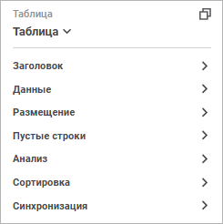

			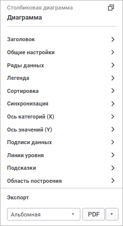

			

			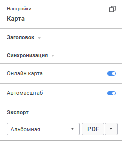

			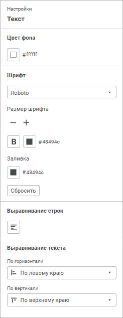

			

			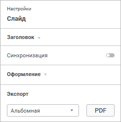

	Общие настройки, доступные для визуализаторов различных [типов](visualizer_types.htm)
	 и [слайдов](../../Frames/frames.htm):

	[Копирование
	 идентификатора](javascript:TextPopup(this))

		Для настройки визуализаторов через системную сборку на языке
		 Fore:

			- [Выделите](../visualizers.htm#select) визуализатор.

			- Нажмите кнопку 
			 «Скопировать идентификатор»
			 на [панели
			 настроек](../../../Starting.htm#structure_window).

			- Используйте системную сборку [Dashboard](kedashboard.chm::/KeDashboard_TitlePage.htm)
			 в инструменте «[Среда
			 разработки](Developer.chm::/desktop_title.htm)» для работы с информационной
			 панелью.

		Примечание.
		 При смене типа визуализатора с применением языка Fore на
		 тип, который не входит в перечень [поддерживаемых
		 типов диаграмм](visualizer_types.htm), на панели настроек будут доступны только [настройки заголовка](#title) и [настройки
		 цвета фона](General_Settings.htm#background_color).

	[Настройка
	 заголовка](javascript:TextPopup(this))

		Для настройки заголовка выбранного [визуализатора](../visualizers.htm#select)
		 или [слайда](../../Frames/frames.htm#select):

			- Переведите переключатель «Показать
			 заголовок» в группе «Заголовок»
			 на [панели
			 настроек](../../../Starting.htm#structure_window) в активное состояние. По умолчанию переключатель
			 находится в неактивном состоянии, заголовок не отображается.

			- Введите текст заголовка. По умолчанию в качестве наименования
			 отображается тип визуализатора и его порядковый номер на слайде
			 для данного типа визуализатора.

			- Задайте параметры текста:

		- Шрифт.
		 Выберите один из доступных шрифтов в раскрывающемся списке;

		- Размер
		 шрифта. Установите требуемый размер шрифта. Размер задаётся
		 в пунктах, его можно ввести вручную или или ввести с помощью клавиатуры.
		 Диапазон допустимых значений: [6; 36];

		- Цвет
		 шрифта. Выберите цвет шрифта в раскрывающейся палитре.
		 Для выбора доступны стандартные и пользовательские цвета. По умолчанию
		 палитра содержит только стандартные цвета.

Для создания пользовательского цвета:

			- Нажмите кнопку  «Добавить
			 цвет». Откроется расширенная палитра цветов.

			- Выберите цвет в расширенной палитре цветов, на странице
			 браузера с помощью пипетки или задайте код цвета в формате
			 RGB/HEX.

После выполнения действий пользовательский
 цвет будет создан и добавлен в палитру.

Для удаления пользовательского цвета из палитры
 выполните команду «Удалить» контекстного
 меню выбранного цвета.

Примечание.
 Максимально возможное количество пользовательских цветов в палитре равно
 23.

		- Начертание.
		 В раскрывающемся меню кнопки выберите начертание шрифта:

			- B. Жирное начертание;

			- I.
			 Курсивное начертание;

			- U.
			 Подчёркивание текста.

При нажатой кнопке будет использоваться соответствующий
 стиль начертания. Доступно использование нескольких стилей одновременно,
 например, нажатие кнопок «B» и
 «I» даёт полужирное
 курсивное начертание.

			- Выберите один из способов
			 выравнивания текста в заголовке в раскрывающемся меню кнопки
			 «Положение»:

				- . По левому
				 краю;

				- . По центру;

				- . По правому
				 краю;

				- . По ширине.

		В результате выполнения действий для выбранного визуализатора
		 или слайда будут применены заданные настройки заголовка.

		Для скрытия заголовка переведите переключатель «Показать
		 заголовок» в группе «Заголовок»
		 на панели настроек в неактивное состояние.

Для сброса заданных настроек и возврата к стилю по умолчанию нажмите
 кнопку «Сбросить».

		При полном удалении текста заголовка будет отображаться заголовок
		 по умолчанию: [Тип визуализатора][Порядковый
		 номер визуализатора данного типа].

		Если у визуализатора был установлен заголовок по умолчанию,
		 то при смене типа визуализатора будет установлен заголовок, соответствующий
		 новому типу визуализатора.

		Пример визуализатора с отображением заголовка и без отображения
		 заголовка:

		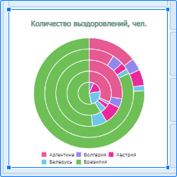     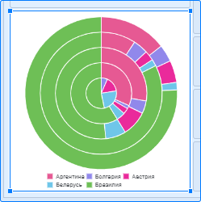

	[Отображение
	 значений фильтров](javascript:TextPopup(this))

		Для отображения в заголовке визуализатора отметки элементов
		 по фиксированным и исключённым измерениям, размещённых в области
		 «[Фильтр](#filter)»
		 на боковой панели:

			- Установите флажок «Отображать
			 значения фильтров» в группе «Заголовок»
			 на панели настроек. По умолчанию флажок не установлен. При
			 установленном флажке в заголовке визуализатора будет отображаться
			 отметка по фиксированным и исключённым измерениям с не пустой
			 и не полной отметкой. Максимальное число выводимых строк для
			 каждого фиксированного и исключённого измерения - 4. Полный
			 текст отметки по измерениям отображается во всплывающей подсказке
			 при наведении курсора мыши на заголовок.

			- Задайте параметры текста выводимой отметки элементов:

		- Шрифт.
		 Выберите один из доступных шрифтов в раскрывающемся списке;

		- Размер
		 шрифта. Установите требуемый размер шрифта. Размер задаётся
		 в пунктах, его можно ввести вручную или или ввести с помощью клавиатуры.
		 Диапазон допустимых значений: [6; 36];

		- Цвет
		 шрифта. Выберите цвет шрифта в раскрывающейся палитре.
		 Для выбора доступны стандартные и пользовательские цвета. По умолчанию
		 палитра содержит только стандартные цвета.

Для создания пользовательского цвета:

			- Нажмите кнопку  «Добавить
			 цвет». Откроется расширенная палитра цветов.

			- Выберите цвет в расширенной палитре цветов, на странице
			 браузера с помощью пипетки или задайте код цвета в формате
			 RGB/HEX.

После выполнения действий пользовательский
 цвет будет создан и добавлен в палитру.

Для удаления пользовательского цвета из палитры
 выполните команду «Удалить» контекстного
 меню выбранного цвета.

Примечание.
 Максимально возможное количество пользовательских цветов в палитре равно
 23.

		- Начертание.
		 В раскрывающемся меню кнопки выберите начертание шрифта:

			- B. Жирное начертание;

			- I.
			 Курсивное начертание;

			- U.
			 Подчёркивание текста.

При нажатой кнопке будет использоваться соответствующий
 стиль начертания. Доступно использование нескольких стилей одновременно,
 например, нажатие кнопок «B» и
 «I» даёт полужирное
 курсивное начертание.

Для сброса заданных настроек и возврата к
 стилю по умолчанию нажмите кнопку «Сбросить».

			- Установите флажок «Сокращать
			 список значений» для управления форматом вывода отметки.
			 По умолчанию флажок установлен.

				- при установленном флажке отметка выводится в формате:

		[наименование_измерения]:
		 [наименование_первого_отмеченного_элемента]..[наименование_последнего_отмеченного_элемента]
		 (Отмечено [количество_отмеченных]
		 из [всего_элементов])

				- при снятом флажке отметка выводится в формате:

		[наименование_измерения]:
		 [элемент 1], [элемент
		 2], [элемент 3]
		 …

		Для календарного измерения, размещённого
		 в области «Фильтр», в
		 заголовок выводятся диапазоны отмеченных элементов.

		При изменении отметки элементов с помощью панели «[Фильтр измерения](#dim_filter)», [элементов
		 управления](../../Frames/visualizers_synchronization.htm#control) или [синхронизации
		 визуализаторов](../../Frames/visualizers_synchronization.htm) отметка элементов в заголовке будет обновлена.

		[Экспорт визуализаторов](../../../Work/export.htm)
		 при установленном флажке «Отображать
		 значения фильтров» будет осуществляться следующим образом:

			- в форматы PDF и XLSX будет экспортирована полная отметка
			 элементов по фиксированным и исключённым измерениям вне зависимости
			 от значения флажка «Сокращать
			 список значений»;

			- в формат PNG будет экспортирована отметка элементов
			 по фиксированным и исключённым измерениям в соответствии со
			 значением флажка «Сокращать
			 список значений».

	[Настройка
	 синхронизации визуализаторов на слайде](javascript:TextPopup(this))

		Для получения подробной информации о настройке обратитесь к
		 разделу «[Синхронизация
		 визуализаторов на слайде](../../Frames/visualizers_synchronization.htm)».

	[Сортировка](javascript:TextPopup(this))

		Настройка сортировки доступна для визуализаторов всех [типов](visualizer_types.htm),
		 кроме [диаграммы рассеяния](visualizer_types.htm#scatterplot),
		 [Sankey-диаграммы](visualizer_types.htm#sankey), [карты](Map.htm), [индикатора](Indicator.htm),
		 [текста](Text.htm) и [изображения](Image.htm).

		Для отображения настроек сортировки переведите переключатель
		 «Использовать сортировку»
		 в группе «Сортировка» на
		 [панели настроек](../../../Starting.htm#structure_window)
		 в активное состояние. По умолчанию переключатель «Использовать
		 сортировку» неактивен, настройки сортировки не отображаются.

		Задайте настройки сортировки:

			- Выберите способ сортировки:

				- Строки.
				 Сортировка выполняется по строкам;

				- Столбцы.
				 Сортировка выполняется по столбцам.

			- Выберите строку/столбец для сортировки из раскрывающегося
			 списка «Сортировать строку»/«Сортировать столбец».

			- Выберите тип сортировки:

				- «Без сортировки».
				 Сортировка не используется;

				- «По убыванию».
				 Выполняется сортировка по убыванию;

				- «По возрастанию».
				 Выполняется сортировка по возрастанию.

		В результате для выбранного визуализатора будет настроена сортировка.

		Примечание.
		 При скрытии настроек сортировки настроенная сортировка сохраняется.

	[Настройка
	 цвета шрифта](javascript:TextPopup(this))

		Для настройки цвета шрифта выберите требуемый цвет в раскрывающейся
		 палитре цветов.

		По умолчанию установлен цвет шрифта #54575b в формате HEX.

	Настройки, доступные для различных типов визуализаторов, приведены
	 в разделах:

		- [Настройка визуализатора «Таблица](../Table/Table.htm)»;

		- [Настройка визуализатора «Диаграмма](visualizer_types.htm)»;

		- [Настройка визуализатора «Индикатор](Indicator.htm)»;

		- [Настройка визуализатора «Карта](Map.htm)»;

		- [Настройка визуализатора «Текст](Text.htm)»;

		- [Настройка визуализатора «Изображение](Image.htm)».

	См. также:

	[Добавление
	 визуализаторов и работа с ними](../visualizers.htm) | [Добавление
	 слайдов и работа с ними](../../Frames/frames.htm) | [Синхронизация
	 визуализаторов на слайде](../../Frames/visualizers_synchronization.htm)

		Справочная
		 система на версию 10.9
		 от 18/08/2025,
		 © ООО «ФОРСАЙТ»,
