# Настройка визуализатора «Диаграмма»

Настройка визуализатора «Диаграмма»
-

# Настройка визуализатора «Диаграмма»

	Визуализатор «Диаграмма»
	 предназначен для отображения данных в графическом виде.

	Для добавления диаграммы на рабочую область выберите необходимый
	 тип диаграммы:

		- в раскрывающемся меню кнопки  «Вставка»
		 на [панели инструментов](../../../Starting.htm#structure_window).
		 Затем щёлкните по ячейке слайда;

		- в раскрывающемся меню ячейки слайда.

	Доступные типы диаграмм:

		-  «[Лепестковая диаграмма](#radar)»;

		-  «[Столбиковая диаграмма](#bar)»;

		- 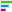 «[Линейчатая
		 диаграмма](#bar_horizontal)»;

		-  «[Линейная
		 диаграмма](#line)»;

		-  «[Диаграмма
		 с областями](#area)»;

		-  «[Круговая
		 диаграмма](#pie)»;

		-  «[Кольцевая диаграмма](#doughnut)»;

		-  «[Смешанная диаграмма](#mixed)»;

		-  «[Sankey-диаграмма](#sankey)»;

		-  «[Диаграмма рассеяния](#scatterplot)».

	Затем [добавьте или выберите источник
	 данных](../../Source.htm) в раскрывающемся списке «Источники»
	 в верхней части [боковой
	 панели](../../../Starting.htm#structure_window).

	Для визуализатора «Диаграмма»
	 доступны все операции, приведенные в статье «[Добавление визуализаторов и работа с ними](../visualizers.htm)».

## Лепестковая диаграмма

	Лепестковая диаграмма позволяет
	 сравнить статистические значения нескольких рядов данных.

	В лепестковой диаграмме все категории имеют собственные оси координат,
	 расходящиеся лучами из начала координат. Значения, относящиеся к одному
	 ряду, соединяются линиями.

	Пример отображения лепестковой диаграммы:

	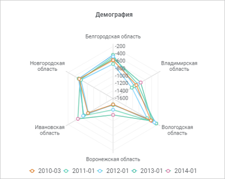

	Доступные поля для построения лепестковой диаграммы:

	- [столбцы](visualization_setting.htm#rows_and_columns);

	- [строки](visualization_setting.htm#rows_and_columns);

	- [фильтр](visualization_setting.htm#filter);

	- [факты](visualization_setting.htm#facts).

	Доступные настройки лепестковой диаграммы:

		- [отображение/скрытие
		 заголовка](visualization_setting.htm#title);

		- [настройка легенды](Legend.htm);

		- [сортировка](visualization_setting.htm#sort);

		- [настройка оси значений (Y)](Axes.htm);

		- [настройка подписей данных](Data_Labels.htm);

		- [настройка подсказок](Tooltips.htm);

		- [настройка
		 цвета фона](General_Settings.htm#background_color);

		- [настройка цвета ряда](Data_Series.htm#fill_series);

		- [настройка
		 цвета шрифта](visualization_setting.htm#font_color).

## Столбиковая диаграмма

	Столбиковая диаграмма используется
	 для демонстрации изменений данных за определённый период времени или
	 для иллюстрирования сравнения объектов.

	На столбиковой диаграмме значение каждого элемента отображается
	 в виде вертикального столбика, длина которого пропорциональна значению
	 элемента. Для каждой из групп данных отображается свой набор столбиков,
	 каждый ряд данных обозначается отдельным цветом, указанным в легенде.

	Пример отображения столбиковой диаграммы:

	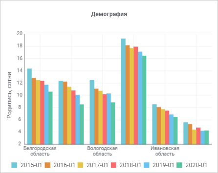

	Доступные поля для построения столбиковой диаграммы:

	- [столбцы](visualization_setting.htm#rows_and_columns);

	- [строки](visualization_setting.htm#rows_and_columns);

	- [фильтр](visualization_setting.htm#filter);

	- [факты](visualization_setting.htm#facts).

	Доступные настройки столбиковой диаграммы:

	- [отображение/скрытие
	 заголовка](visualization_setting.htm#title);

	- [настройка
	 накопления](General_Settings.htm#accumulation);

	- [настройка
	 легенды](Legend.htm);

	- [сортировка](visualization_setting.htm#sort);

	- [настройка
	 осей](Axes.htm): ось категорий (X), ось значений (Y);

	- [настройка
	 подписей данных](Data_Labels.htm);

	- [настройка
	 подсказок](Tooltips.htm);

	- [настройка
	 цвета фона](General_Settings.htm#background_color);

	- [настройка
	 цвета ряда](Data_Series.htm#fill_series);

	- [настройка
	 цвета шрифта](visualization_setting.htm#font_color).

## Линейчатая диаграмма

	Линейчатая диаграмма используется
	 для демонстрации изменений данных за определённый период времени или
	 для иллюстрирования сравнения объектов.

	На линейчатой диаграмме значение каждого элемента отображается в
	 виде горизонтального столбика, длина которого пропорциональна значению
	 элемента. Для каждой из групп данных отображается свой набор столбиков,
	 каждый ряд данных обозначается отдельным цветом, указанным в легенде.

	Пример отображения линейчатой диаграммы:

	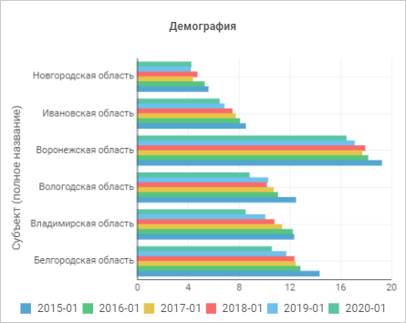

	Доступные поля для построения линейчатой диаграммы:

	- [столбцы](visualization_setting.htm#rows_and_columns);

	- [строки](visualization_setting.htm#rows_and_columns);

	- [фильтр](visualization_setting.htm#filter);

	- [факты](visualization_setting.htm#facts).

	Доступные настройки линейчатой диаграммы:

	- [отображение/скрытие
	 заголовка](visualization_setting.htm#title);

	- [настройка
	 накопления](General_Settings.htm#accumulation);

	- [настройка
	 легенды](Legend.htm);

	- [сортировка](visualization_setting.htm#sort);

	- [настройка
	 осей](Axes.htm): ось категорий (X), ось значений (Y);

	- [настройка
	 подписей данных](Data_Labels.htm);

	- [настройка
	 подсказок](Tooltips.htm);

	- [настройка
	 цвета фона](General_Settings.htm#background_color);

	- [настройка
	 цвета ряда](Data_Series.htm#fill_series);

	- [настройка
	 цвета шрифта](visualization_setting.htm#font_color).

## Линейная диаграмма

	Линейная диаграмма позволяет
	 изобразить изменение данных с течением времени в едином масштабе.
	 Подходит для изображения трендов изменения данных с равными интервалами.

	На линейной диаграмме каждый элемент данных представляется точкой,
	 вертикальная координата которой пропорциональна значению элемента.
	 В случае нескольких групп данных точки, соответствующие одному ряду
	 данных, соединяются ломаной линией.

	Пример отображения линейной диаграммы:

	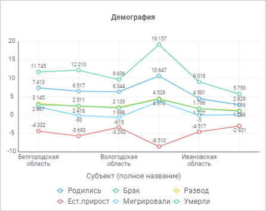

	Доступные поля для построения линейной диаграммы:

	- [столбцы](visualization_setting.htm#rows_and_columns);

	- [строки](visualization_setting.htm#rows_and_columns);

	- [фильтр](visualization_setting.htm#filter);

	- [факты](visualization_setting.htm#facts).

	Доступные настройки линейной диаграммы:

	- [отображение/скрытие
	 заголовка](visualization_setting.htm#title);

	- [настройка
	 накопления](General_Settings.htm#accumulation);

	- [настройка
	 легенды](Legend.htm);

	- [сортировка](visualization_setting.htm#sort);

	- [настройка
	 осей](Axes.htm): ось категорий (X), ось значений (Y);

	- [настройка
	 подписей данных](Data_Labels.htm);

	- [настройка
	 подсказок](Tooltips.htm);

	- [настройка
	 цвета фона](General_Settings.htm#background_color);

	- [настройка
	 цвета ряда](Data_Series.htm#fill_series);

	- [настройка
	 цвета шрифта](visualization_setting.htm#font_color).

## Диаграмма с областями

	Диаграмма с областями позволяет
	 изобразить величину изменений в зависимости от времени. Может использоваться
	 для привлечения внимания к суммарному значению в соответствии с трендом.

	На областной диаграмме для каждой группы данных по вертикали откладываются
	 отрезки, пропорциональные значениям всех элементов данных. Точки,
	 соответствующие одному ряду разных групп, соединяются ломаной линией.
	 Область под ломаной отображается с заливкой, установленной для этого
	 элемента данных.

	Пример отображения областной диаграммы:

	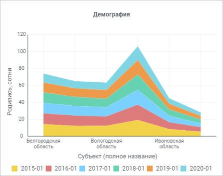

	Доступные поля для построения областной диаграммы:

	- [столбцы](visualization_setting.htm#rows_and_columns);

	- [строки](visualization_setting.htm#rows_and_columns);

	- [фильтр](visualization_setting.htm#filter);

	- [факты](visualization_setting.htm#facts).

	Доступные настройки областной диаграммы:

	- [отображение/скрытие
	 заголовка](visualization_setting.htm#title);

	- [настройка
	 накопления](General_Settings.htm#accumulation);

	- [настройка
	 легенды](Legend.htm);

	- [сортировка](visualization_setting.htm#sort);

	- [настройка
	 осей](Axes.htm): ось категорий (X), ось значений (Y);

	- [настройка
	 подписей данных](Data_Labels.htm);

	- [настройка
	 подсказок](Tooltips.htm);

	- [настройка
	 цвета фона](General_Settings.htm#background_color);

	- [настройка
	 цвета ряда](Data_Series.htm#fill_series);

	- [настройка
	 цвета шрифта](visualization_setting.htm#font_color).

## Круговая диаграмма

	Круговая диаграмма демонстрирует
	 размер элементов одного ряда данных пропорционально сумме элементов.

	Каждая группа данных отображается в виде круга, разделённого на
	 секторы, угловые размеры которых пропорциональны значениям элементов
	 данных.

	Пример отображения круговой диаграммы:

	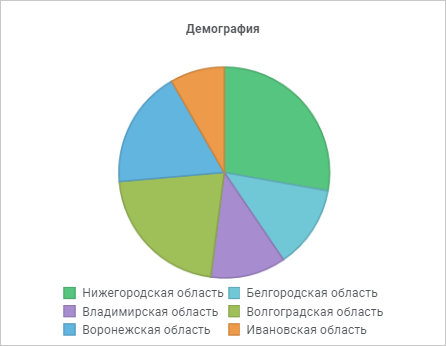

	Доступные поля для построения круговой диаграммы:

	- [столбцы](visualization_setting.htm#rows_and_columns);

	- [строки](visualization_setting.htm#rows_and_columns);

	- [фильтр](visualization_setting.htm#filter);

	- [факты](visualization_setting.htm#facts).

	Доступные настройки круговой диаграммы:

		- [отображение/скрытие
		 заголовка](visualization_setting.htm#title);

		- [настройка легенды](Legend.htm);

		- [сортировка](visualization_setting.htm#sort);

		- [настройка подписей данных](Data_Labels.htm);

		- [настройка подсказок](Tooltips.htm);

		- [настройка
		 цвета фона](General_Settings.htm#background_color);

		- [настройка цвета ряда](Data_Series.htm#fill_series);

		- [настройка
		 цвета шрифта](visualization_setting.htm#font_color).

## Кольцевая диаграмма

	Кольцевая диаграмма демонстрирует
	 размер элементов одного ряда данных пропорционально сумме элементов.

	Каждая группа данных отображается в виде кольца, разделённого на
	 секторы. Первый ряд данных отображается в центре диаграммы. Если в
	 подписях данных отображаются проценты, то каждое кольцо в сумме должно
	 давать 100 %.

	Пример отображения кольцевой диаграммы:

	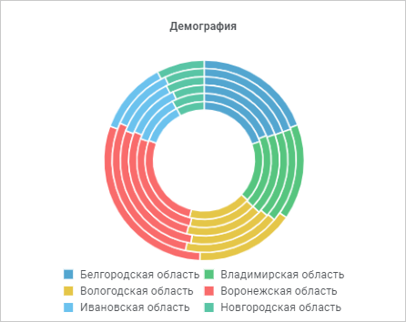

	Доступные поля для построения кольцевой диаграммы:

	- [столбцы](visualization_setting.htm#rows_and_columns);

	- [строки](visualization_setting.htm#rows_and_columns);

	- [фильтр](visualization_setting.htm#filter);

	- [факты](visualization_setting.htm#facts).

	Доступные настройки кольцевой диаграммы:

		- [отображение/скрытие
		 заголовка](visualization_setting.htm#title);

		- [настройка легенды](Legend.htm);

		- [сортировка](visualization_setting.htm#sort);

		- [настройка подписей данных](Data_Labels.htm);

		- [настройка подсказок](Tooltips.htm);

		- [настройка
		 цвета фона](General_Settings.htm#background_color);

		- [настройка цвета ряда](Data_Series.htm#fill_series);

		- [настройка
		 цвета шрифта](visualization_setting.htm#font_color).

## Смешанная диаграмма

	Смешанная диаграмма позволяет
	 для каждой группы данных определить свой тип диаграммы: столбики или
	 линии. Например, можно объединить график, содержащий данные о покупках
	 одного вида товаров, с гистограммой, отображающей покупки другого
	 вида товаров.

	Пример отображения смешанной диаграммы:

	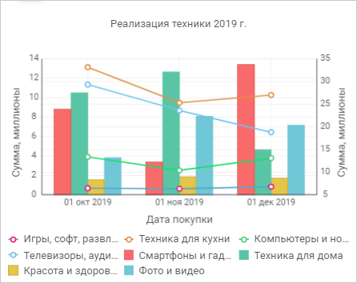

	Доступные поля для построения смешанной диаграммы:

	- [столбцы](visualization_setting.htm#rows_and_columns);

	- [строки](visualization_setting.htm#rows_and_columns);

	- [фильтр](visualization_setting.htm#filter);

	- [факты](visualization_setting.htm#facts).

	Доступные настройки кольцевой диаграммы:

		- [отображение/скрытие
		 заголовка](visualization_setting.htm#title);

		- [настройка накопления](General_Settings.htm#accumulation);

		- [настройка легенды](Legend.htm);

		- [сортировка](visualization_setting.htm#sort);

		- [изменение типа ряда](Data_Series.htm#type);

		- [настройка осей](Axes.htm): ось категорий (X),
		 ось значений (Y), дополнительная ось (Y);

		- [настройка подписей данных](Data_Labels.htm);

		- [настройка подсказок](Tooltips.htm);

		- [настройка
		 цвета фона](General_Settings.htm#background_color);

		- [настройка цвета ряда](Data_Series.htm#fill_series);

		- [настройка
		 цвета шрифта](visualization_setting.htm#font_color).

## Sankey-диаграмма

	Sankey-диаграмма позволяет
	 отображать потоки данных и их количественные величины в пропорциональном
	 соотношении друг к другу.

	Ширина линий (потоков) используется для отображения величин: чем
	 шире поток, тем больше его количественное значение. Линии потока могут
	 объединяться или разделяться на разных уровнях диаграммы - это позволяет
	 наглядно отобразить распределение величин по разным категориям. Потоки
	 и деление на категории дополнительно отображаются разными цветами
	 с использованием градиентной заливки.

	Sankey-диаграммы удобно использовать для визуального отображения
	 распределения денежных средств или ресурсов, а также для демонстрации
	 потока любого системного процесса.

	Элементы измерений диаграммы формируют начальную и конечную точки
	 потока, а элементы фактов - «вес» потока, т.е. его ширину. Каждая
	 пара измерений формирует один уровень диаграммы. Потоки Sankey-диаграммы
	 строятся слева направо.

	При построении Sankey-диаграммы учитывайте следующие особенности:

		- расположите измерения по строкам в том порядке, в котором
		 они должны отображаться на диаграмме;

		- используйте только один факт.

	Пример отображения Sankey-диаграммы:

	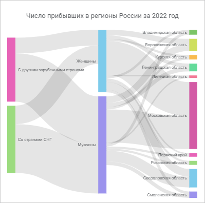

	Доступные поля для построения Sankey-диаграммы:

	- [столбцы](visualization_setting.htm#rows_and_columns);

	- [строки](visualization_setting.htm#rows_and_columns);

	- [фильтр](visualization_setting.htm#filter);

	- [факты](visualization_setting.htm#facts).

	Доступные настройки Sankey-диаграммы:

		- [отображение/скрытие
		 заголовка](visualization_setting.htm#title);

		- [настройка
		 цвета фона](General_Settings.htm#background_color);

		- [настройка
		 цвета шрифта](visualization_setting.htm#font_color).

## Диаграмма рассеяния

	Диаграмма рассеяния отображает
	 данные в виде точек, рассеянных по плоскости.

	На диаграмме рассеяния координаты каждой точки равны значениям двух
	 каких-то параметров. Если предполагается, что один из параметров зависит
	 от другого, то обычно значения независимого параметра откладывается
	 по горизонтали, а значения зависимого - по вертикали.

	Диаграммы рассеяния удобны для отображения многомерных данных. С
	 их помощью можно определить потенциальные взаимосвязи между количественными
	 переменными.

	Пример отображения диаграммы рассеяния:

	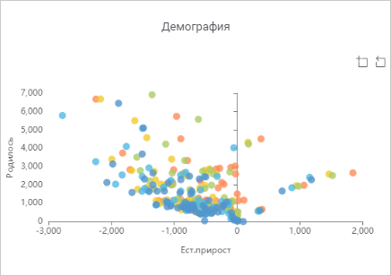

	Доступные поля для построения диаграммы рассеяния:

		- [ось X](visualization_setting.htm#axis);

		- [ось Y](visualization_setting.htm#axis);

		- [фильтр](visualization_setting.htm#filter);

		- [цвет](visualization_setting.htm#color_form_size);

		- [форма](visualization_setting.htm#color_form_size);

		- [размер](visualization_setting.htm#color_form_size).

	Доступные настройки диаграммы рассеяния:

		- [отображение/скрытие
		 заголовка](visualization_setting.htm#title);

		- [настройка осей](Axes.htm): ось категорий (X),
		 ось значений (Y);

		- [настройка
		 цвета фона](General_Settings.htm#background_color);

		- [настройка
		 цвета шрифта](visualization_setting.htm#font_color).

	Операции над диаграммами рассеяния:

	[Масштабирование
	 диаграммы](javascript:TextPopup(this))

		Для более подробного просмотра какой-либо области диаграммы
		 рассеяния:

			- Нажмите кнопку  «Масштабирование» в правом
			 верхнем углу диаграммы.

			- Выделите требуемую область диаграммы.

		В результате масштаб диаграммы будет изменён для отображения
		 выделенной области.

		Пример диаграммы до масштабирования:

		

		Пример диаграммы после масштабирования:

		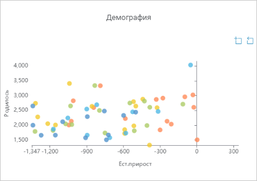

		Для возврата обычного масштаба нажмите кнопку  «Сброс
		 масштабирования».

См. также:

[Добавление
 визуализаторов и работа с ними](../visualizers.htm) | [Выбор
 и настройка источника данных визуализатора](../../Source.htm) | [Настройка
 визуализации данных](visualization_setting.htm)

		Справочная
		 система на версию 10.9
		 от 18/08/2025,
		 © ООО «ФОРСАЙТ»,
