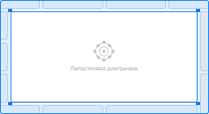
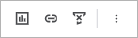
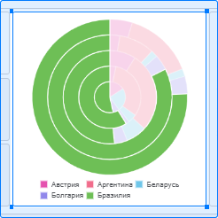
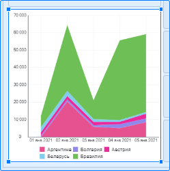
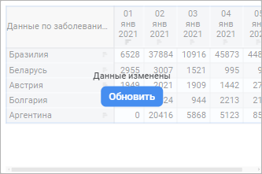
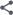

# Добавление визуализаторов и работа с ними

Добавление визуализаторов и работа с ними
-

# Добавление
 визуализаторов и работа с ними

Визуализаторы позволяют отображать
 определённый пользователем разрез данных построенной [модели](../../../DataModel/create_data_model.htm)
 в различных формах. С помощью визуализаторов [разных
 типов](Visualization/visualizer_types.htm) можно построить многогранную отчётность, провести подробный
 анализ данных и выявить неочевидные закономерности. Доступные визуализаторы:

	- [Таблица](Table/Table.htm).
	 Отображает данные в табличном виде;

	- [Диаграмма](Visualization/visualizer_types.htm).
	 Отображает данные в виде графиков;

	- [Индикатор](Visualization/Indicator.htm).
	 Отображает данные с помощью маркированной шкалы;

	- [Карта](Visualization/Map.htm).
	 Отображает картографические данные;

	- [Текст](Visualization/Text.htm).
	 Отображает текстовую информацию;

	- [Изображение](Visualization/Image.htm).
	 Отображает визуальные элементы.

Примечание.
 Изменение данных в источниках данных автоматически отображается во всех
 визуализаторах.

## Операции с визуализаторами

При работе с информационной панелью в [режиме
 редактирования](../../Starting.htm#modes) для всех визуализаторов доступны следующие операции:

[Добавление
 визуализатора](javascript:TextPopup(this))

	Для добавления визуализатора на рабочую область:

		- выберите тип визуализатора в раскрывающемся меню кнопки
		  «Вставка»
		 на панели инструментов и щёлкните по ячейке слайда;

		- щёлкните по ячейке слайда и выберите тип визуализатора в
		 раскрывающемся меню.

	В результате на рабочую область будет добавлен выбранный визуализатор:

	

	Компоновка информационной панели выполняется в автоматическом режиме,
	 в котором размер визуализаторов подбирается таким образом, чтобы панель
	 размещалась на одном экране без полос прокрутки.

	Для расположения визуализаторов произвольным образом:

		- [измените размеры визуализаторов](#resize);

		- [переместите визуализаторы](#move).

	Примечание.
	 Добавление визуализаторов доступно, пока на слайде есть свободные
	 ячейки.

[Выбор
 источника данных](javascript:TextPopup(this))

	Для получения подробной информации о выборе источника данных визуализатора
	 обратитесь к разделу «[Выбор
	 и настройка источника данных визуализатора](../Source.htm)».

[Выделение
 визуализатора](javascript:TextPopup(this))

	Для выделения визуализатора щёлкните по нему. Выделенный визуализатор
	 отмечается синей рамкой:

	

	При выделении визуализатора появляется всплывающая панель настроек:

	

	На панели настроек доступны:

		- [изменение типа визуализатора](#change_type);

		- настройка [синхронизации](#synchronization) по
		 отметке и по выделению;

		- [копирование визуализатора](#copy);

		- [дублирование визуализатора](#duplicate);

		- [публикация визуализатора](#publish);

		- [удаление визуализатора](#delete).

	Для сброса выделения щёлкните по свободному пространству на рабочей
	 области.

[Изменение
 размеров визуализатора](javascript:TextPopup(this))

	Для изменения размеров визуализатора:

		- [Выделите](#select) визуализатор.

		- Наведите курсор мыши на границу визуализатора. Указатель
		 мыши примет вид двунаправленной стрелки.

		- Зажмите кнопку мыши и измените размер визуализатора.

	В результате размер выделенного визуализатора будет изменён.

[Перемещение
 визуализатора](javascript:TextPopup(this))

	Для перемещения визуализатора по рабочей области:

		- [Выделите](#select) визуализатор.

		- Наведите курсор мыши на границу визуализатора. Указатель
		 мыши примет вид руки.

		- Зажмите левую кнопку мыши и переместите визуализатор в требуемую
		 позицию на рабочей области.

	Примечание.
	 Область для размещения визуализатора должна быть такого же размера,
	 как визуализатор.

	В результате выделенный визуализатор будет перемещён в выбранную
	 область.

[Задание
 заголовка визуализатора](javascript:TextPopup(this))

	Для задания заголовка выбранного [визуализатора](#select):

		- Переведите переключатель «Показать
		 заголовок» в группе «Заголовок»
		 на [панели
		 настроек](Visualization/visualization_setting.htm#settings_panel) в активное положение. По умолчанию переключатель
		 находится в неактивном состоянии, заголовок не отображается.

		- Задайте [настройки
		 заголовка](Visualization/visualization_setting.htm#title).

	В результате у визуализатора будет отображаться заголовок.

	Пример визуализатора с отображением заголовка и без отображения
	 заголовка:

	     

	Для изменения заголовка визуализатора выполните шаги по настройке
	 заголовка визуализатора, описанные выше, или выполните последовательность
	 действий:

		- Щёлкните в области заголовка визуализатора.

		- Удалите старый заголовок и введите новый.

		- Нажмите клавишу ENTER или щёлкните вне области заголовка
		 слайда.

	В результате заголовок визуализатора будет изменён.

	Для получения подробной информации о настройке заголовка визуализатора
	 обратитесь к разделу «[Настройка
	 заголовка](Visualization/visualization_setting.htm#title)».

[Выделение
 элементов данных визуализатора](javascript:TextPopup(this))

	Для выделения элемента данных на визуализаторе щёлкните по требуемому
	 элементу. В результате визуализатор и элемент данных на нём будут
	 выделены:

	

	Для сброса выделения элемента данных щёлкните по свободной области
	 визуализатора.

[Изменение
 типа визуализатора](javascript:TextPopup(this))

	Для изменения типа визуализатора:

		- [Выделите](#select) визуализатор.

		- Нажмите кнопку «Изменить
		 тип» с пиктограммой выделенного визуализатора на всплывающей
		 панели настроек.

		- Выберите в раскрывающемся меню требуемый тип визуализатора.

	В результате тип выделенного визуализатора будет изменён.

	Пример визуализатора до и после смены типа:

	     

[Автообновление
 визуализатора](javascript:TextPopup(this))

	Автообновление позволяет автоматически перестраивать визуализатор
	 при любом изменении, которое влияет на его отображение. К упомянутым
	 изменениям относятся:

		- [в инструменте «Информационная панель»](../../Starting.htm):

			- добавление/удаление поля на [боковой
			 панели](../../Starting.htm) для визуализатора;

			- смена отметки в поле при помощи панели измерений или
			 элементов управления на слайде при [синхронизации
			 визуализаторов](#synchronization);

			- смена [типа визуализатора](#change_type);

			- редактирование любой настройки визуализатора на [панели
			 настроек](../../Starting.htm);

	Примечание.
	 Изменения [настройки
	 отображения/скрытия заголовка визуализатора](Visualization/visualization_setting.htm#title) автоматически отображаются
	 на визуализаторе даже при отключённом автообновлении.

		- [в инструменте
		 «Модель данных»](../../../DataModel/create_data_model.htm):

			- редактирование/удаление [связей
			 между таблицами](../../../DataModel/Objects/add_objects.htm#relations), поля которых используются в визуализаторе;

			- удаление [таблицы](../../../DataModel/Objects/add_objects.htm#objects),
			 поля которой задействованы в визуализаторе;

			- переименование/скрытие [полей](../../../DataModel/Preview/preview_table.htm),
			 задействованных в визуализаторе;

			- редактирование/удаление/переименование [вычисляемых
			 полей](../../../DataModel/Preview/preview_table.htm#calculated_field), задействованных в визуализаторе;

			- удаление [источника](../../../DataModel/DataSources/add_data_sources.htm),
			 поля таблиц которого используются в визуализаторе;

			- задание/редактирование/удаление [фильтра
			 модели данных](../../../DataModel/Preview/preview_table.htm#filtration).

	По умолчанию автообновление визуализатора включено. Для отключения
	 автообновления визуализатора:

		- [Выделите](#select) визуализатор.

		- Переведите кнопку  «Автообновление» на всплывающей
		 панели настроек в неактивное состояние.

	В результате автообновление выделенного визуализатора будет отключено.

	При отключённом автообновлении после любого изменения на визуализаторе
	 появляется кнопка «Обновить»
	 для его ручного перестроения:

	

	Для включения автообновления переведите кнопку  «Автообновление» на всплывающей панели
	 настроек в активное состояние.

[Настройка
 синхронизации](javascript:TextPopup(this))

	[Синхронизация
	 по отметке](../Frames/visualizers_synchronization.htm#mark) позволяет управлять отметкой одинаковых измерений
	 сразу нескольких [визуализаторов](visualizers.htm), размещённых
	 на одном слайде.

	[Синхронизация
	 по выделению](../Frames/visualizers_synchronization.htm#selection) позволяет перестраивать визуализаторы на слайде в
	 соответствии с заданным выделением данных.

[Работа
 с буфером обмена](javascript:TextPopup(this))

	Работа с буфером обмена доступна при работе с визуализаторами, расположенными
	 на одной вкладке информационной панели.

	Для создания точной копии визуализатора:

		- [Выделите](#select) визуализатор.

		- Выполните одно из действий:

			- выполните команду  «Копировать» в раскрывающемся
			 меню кнопки  «Действия» на всплывающей
			 [панели настроек](../../Starting.htm#structure_window);

			- нажмите сочетание клавиш CTRL+SHIFT+C.

	В результате визуализатор будет скопирован в буфер обмена.

	Для вставки визуализатора щёлкните по ячейке слайда и выберите «Вставить из буфера обмена».

	Примечание.
	 Вставка визуализаторов из буфера обмена доступна, пока на слайде есть
	 свободные ячейки.

[Дублирование
 визуализатора](javascript:TextPopup(this))

	Для создания точной копии визуализатора:

		- [Выделите](#select) визуализатор.

		- Выполните одно из действий:

			- выполните команду  «Дублировать» в раскрывающемся
			 меню кнопки  «Действия» на всплывающей
			 [панели настроек](../../Starting.htm#structure_window);

			- нажмите сочетание клавиш CTRL+D.

	В результате будет создана точная копия выделенного визуализатора.

	Примечание.
	 Дублирование визуализаторов доступно, пока на слайде есть свободные
	 ячейки.

[Публикация
 визуализатора](javascript:TextPopup(this))

	Для публикации визуализатора:

		- [Выделите](#select) визуализатор.

		- Выполните команду 
		 «Опубликовать» в раскрывающемся
		 меню кнопки  «Действия»
		 на всплывающей [панели
		 настроек](../../Starting.htm#structure_window).

		- Задайте [настройки
		 публикации](../../../Project/Publishing.htm).

	В результате выполнения действий визуализатор будет опубликован
	 во внешние приложения.

[Удаление
 визуализатора](javascript:TextPopup(this))

	Для удаления визуализатора:

		- [Выделите](#select) визуализатор.

	Примечание.
	 Для удаления нескольких визуализаторов в[ыделите](#select)
	 их, зажав клавишу CTRL.

		- Выполните одно из действий:

			- выполните команду  «Удалить» в раскрывающемся
			 меню кнопки  «Действия» на всплывающей
			 [панели настроек](../../Starting.htm#structure_window);

			- нажмите клавишу DELETE.

	После подтверждения действия выделенный визуализатор будет удалён.

[Экспорт
 визуализаторов](javascript:TextPopup(this))

	Для получения подробной информации обратитесь к разделу «[Экспорт визуализаторов и слайдов](../../Work/export.htm)».

[Печать визуализаторов](javascript:TextPopup(this))

	Для получения подробной информации обратитесь к разделу «[Печать визуализаторов и слайдов](../../Work/print.htm)».

Для получения подробной информации об отображения данных визуализаторов
 обратитесь к разделу «[Настройка
 визуализации данных](Visualization/visualization_setting.htm)».

См. также:

[Построение
 информационной панели](../Create_Informatuion_Panel.htm) | [Настройка
 визуализации данных](Visualization/visualization_setting.htm) | [Добавление слайдов
 и работа с ними](../Frames/frames.htm) | [Синхронизация
 визуализаторов на слайде](../Frames/visualizers_synchronization.htm)

		Справочная
		 система на версию 10.9
		 от 18/08/2025,
		 © ООО «ФОРСАЙТ»,
