# Настройка вычисляемых фактов

Настройка вычисляемых фактов
-

# Настройка вычисляемых фактов

	Вычисляемый факт представляет собой функцию от значений других фактов,
	 вычисляемых фактов или отношений.

	Работа с вычисляемыми фактами доступна в информационных панелях,
	 [источниками данных](Source.htm) которых являются [модели
	 данных](../../DataModel/create_data_model.htm).

## Создание вычисляемого факта

	Для быстрой настройки вычисляемого факта выполните команду 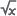 «+ Вычисляемый
	 факт» в раскрывающемся меню кнопки  «Действия» для факта или вычисляемого
	 поля и выберите тип вычисляемого факта. Команда доступна для всех
	 фактов модели данных: факты таблицы, целочисленые и вещественные вычисляемые
	 поля, факты, для которых задана [геороль](Visualizers/Visualization/visualization_setting.htm#latitude_and_longitude).

	Для создания вычисляемого факта нажмите кнопку 
	 «Создать вычисляемый факт»
	 в группе «Факты». Откроется
	 окно «Создание вычисляемого факта»:

	

	Задайте параметры:

	[Наименование](javascript:TextPopup(this))

		Введите наименование вычисляемого факта. Допустимо задание одинаковых
		 наименований для разных вычисляемых фактов. По умолчанию отображается
		 наименование «Вычисляемый факт
		 N», где N - порядковый номер факта при добавлении.

	[Тип
	 вычисляемого факта](javascript:TextPopup(this))

		Выберите в раскрывающемся списке тип вычисляемого факта:

			- Формула вычисляемого
			 факта. Значение по умолчанию. Задание пользовательской
			 формулы вычисляемого факта с помощью [редактора
			 выражения](ExpressionEditor.htm);

			- Нарастающий итог.
			 Агрегация нарастающим итогом в рамках заданного уровня:

		SUM_S[Факт,L1,ROOT]

		Где:

				- Факт - текущее значение;

				- L1 - заданный уровень (день (DAY), месяц (MONTH),
				 год (YEAR).

		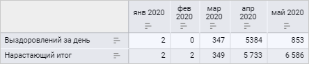

			- Абсолютный прирост
			 (цепной). Разница между текущим и предыдущим значением:

		Факт-C_PREV[Факт]

		Где:

				- Факт - текущее значение;

				- C_PREV[Факт] - предыдущее значение.

		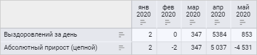

			- Абсолютный прирост
			 (базисный). Разница между текущим и первым отмеченным
			 значением:

		Факт-FIRST_S[Факт,L1,ROOT]

		Где:

				- Факт - текущее значение;

				- FIRST_S[Факт,L1,ROOT] - первое отмеченное значение
				 по заданному уровню.

		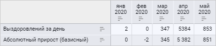

			- Темп роста (цепной).
			 Отношение текущего значения к предыдущему:

		abs(Факт/C_PREV[Факт])

		Где:

				- Факт - текущее значение;

				- C_PREV[Факт] - предыдущее значение.

		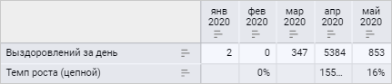

			- Темп роста (базисный).
			 Отношение текущего значения к первому отмеченному:

		abs(Факт/FIRST_S[Факт,L1,ROOT])

		Где:

				- Факт - текущее значение;

				- FIRST_S[Факт,L1,ROOT] - первое отмеченное значение
				 по заданному уровню.

		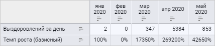

			- Темп прироста (цепной).
			 Разница между текущим значением и предыдущим относительно
			 предыдущего значения:

		(Факт-C_PREV[Факт])/abs(C_PREV[Факт])

		Где:

				- Факт - текущее значение;

				- C_PREV[Факт] - предыдущее значение.

		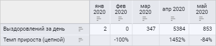

			- Темп прироста (базисный).
			 Разница между текущим значением и первым отмеченным относительно
			 первого значения:

		(Факт-FIRST_S[Факт,L1,ROOT])/abs(FIRST_S[Факт,L1,ROOT])

		Где:

				- Факт - текущее значение;

				- FIRST_S[Факт,L1,ROOT] - первое отмеченное значение
				 по заданному уровню.

		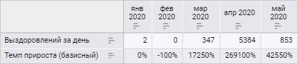

			- Темп прироста (год
			 к году):

				- Уровень расчёта
				 - Год. Разница между текущим годом и прошлым относительно
				 прошлого:

		(Факт-C_PREV[Факт])/abs(C_PREV[Факт])

		Где:

					- Факт - текущее значение;

					- C_PREV[Факт] - предыдущее значение.

		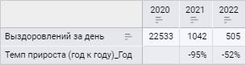

				- Уровень расчёта
				 - Месяц. Сравнение значения с тем же самым месяцем
				 год назад:

		(Факт-MONTH_PREV[Факт])/abs(MONTH_PREV[Факт])

		Где:

					- Факт - текущее значение;

					- MONTH_PREV[Факт] - значение в этом же месяце
					 год назад.

		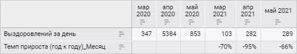

				- Уровень расчёта
				 - День. Сравнение значения с тем же самым днём
				 год назад:

		(Факт-DAY_PREV[Факт])/abs(DAY_PREV[Факт])

		Где:

					- Факт - текущее значение;

					- DAY_PREV[Факт] - значение в этот же день год
					 назад.

		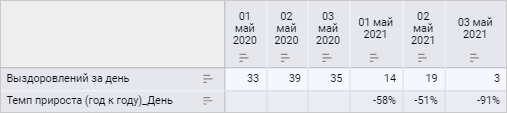

		Примечание.
		 При расчёте вычисляемых фактов типа «Нарастающий
		 итог», «Абсолютный прирост
		 (базисный)», «Темп роста (базисный)»,
		 «Темп прироста (базисный)»
		 учитывается отметка элементов. Для остальных типов вычисляемых
		 фактов расчёт происходит по всем элементам.

	[Факт](javascript:TextPopup(this))

		Параметр «Факт» отображается
		 для всех [типов вычисляемого факта](#type_fact), кроме
		 «Формула вычисляемого факта».

		Выберите факт, на основе которого будет рассчитан вычисляемый
		 факт. В списке отображаются все факты модели данных: факты из
		 таблиц, целочисленные и вещественные [вычисляемые
		 поля](../../DataModel/Preview/preview_table.htm#calculated_field), а также другие вычисляемые факты. Для поиска факта в
		 списке начните вводить наименование в строке поиска.

		Примечание.
		 На основе одного и того же факта можно настроить несколько вычисляемых
		 фактов.

	[Уровень
	 расчёта](javascript:TextPopup(this))

		Параметр «Уровень расчёта»
		 отображается для всех [типов вычисляемого
		 факта](#type_fact), кроме «Формула вычисляемого
		 факта», «Абсолютный прирост
		 (цепной)», «Темп роста (цепной)»
		 и «Темп прироста (цепной)».

		Задайте уровень календаря, на котором будет производиться расчёт:
		 «Год», «Месяц» или «День». По умолчанию установлено значение «Месяц».

	[Формула](javascript:TextPopup(this))

		Составьте или отредактируйте выражение, по которому будет рассчитываться
		 значение вычисляемого факта:

			- с помощью [редактора выражения](ExpressionEditor.htm).
			 Для открытия окна редактора выражений нажмите кнопку 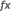 «Вставить формулу»
			 в окне [настройки вычисляемого
			 факта](calculated_facts.htm);

			- с использованием имеющихся фактов, отношений и специальных
			 функций.

		Формула в строке ввода отображается после выбора [факта](#fact)
		 и [уровня расчёта](#level) для всех типов вычисляемого
		 факта, кроме «Формула вычисляемого
		 факта», и после настройки формулы расчёта значения с помощью
		 редактора выражений для всех типов вычисляемого факта.

		После редактирования формулы вычисляемого факта будут обновлены
		 все визуализаторы, в построении которых участвовал данный факт.

		Примечание.
		 При изменении формулы [вычисляемых фактов](#type_fact),
		 кроме типа «Формула вычисляемого
		 факта», тип вычисляемого факта будет изменён на  «Формула вычисляемого факта».

	[Рассчитать
	 по фактическим данным](javascript:TextPopup(this))

		Установите флажок для расчёта заданной формулы по фактическим
		 данным: сначала будет оценена матрица с исходными данными, которая
		 извлекается в соответствии с заданной отметкой, а затем осуществляется
		 расчёт только в тех точках, по которым имеются данные.

		При снятом флажке расчёт будет производиться в соответствии
		 с выставленной отметкой измерений: расчёт в каждой точке полученного
		 декартова произведения отмеченных элементов.

		Для типа вычисляемого факта «[Формула вычисляемого факта](#type_fact)» флажок
		 «Рассчитать по фактически данным»
		 по умолчанию установлен.

		Особенности расчёта вычисляемого факта:

			- если в формуле вычисляемого факта используются специальные
			 функции (DIF, FIL, SUM и другие), то значение вычисляемого
			 факта будет рассчитано только для тех точек, для которых имеются
			 необходимые данные в исходной матрице;

			- если в формуле вычисляемого факта используются отношения,
			 которые осуществляют сдвиг или берётся значение конкретного
			 факта, то значение вычисляемого факта будет рассчитано только
			 для тех точек, для которых имеются необходимые данные в исходной
			 матрице;

			- если сдвиг нужно выполнить из отметки, которой нет в
			 матрице, то значение не будет рассчитано.

	[Всегда
	 добавлять в отметку](javascript:TextPopup(this))

		Установите флажок для включения вычисляемого факта при расчёте
		 результирующей матрицы куба. Флажок актуален при работе с кубом
		 в прикладных макросах, которые вычисляют куб и работают с данными
		 куба. Вычисляемые факты, для которых флажок установлен, будут
		 всегда рассчитываться при расчёте результирующей матрицы куба.

		По умолчанию флажок снят, вычисляемый факт рассчитывается, если
		 он включен в отметку в прикладном макросе.

	Для сохранения настроек вычисляемого факта нажмите кнопку «Применить». Вычисляемый факт будет
	 добавлен в группу «Вычисляемые поля»
	 на панели «Факты».

## Операции над вычисляемыми фактами

	При работе с вычисляемыми фактами доступны операции:

	[Настройка
	 вычисляемого факта](javascript:TextPopup(this))

		Для настройки вычисляемого факта выполните команду  «Настройки»
		 в раскрывающемся меню кнопки  «Действия» для факта. Будет открыто
		 окно «Настройки вычисляемого
		 факта»:

		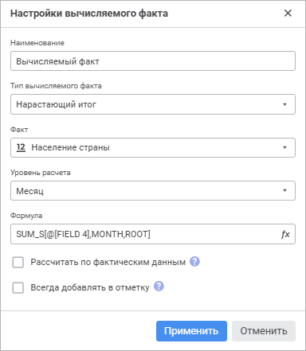

		Измените при необходимости настройки вычисляемого факта. Настройки
		 аналогичны настройкам, задаваемым при [создании
		 вычисляемого факта](#create).

		Для сохранения настроек вычисляемого факта нажмите кнопку «Применить».

		Настройки применяются во всех визуализаторах модели данных,
		 в которых используется вычисляемый факт.

	[Настройка
	 формата данных](javascript:TextPopup(this))

		Для настройки формата данных выполните команду  «Формат
		 данных» в раскрывающемся меню кнопки  «Действия» для вычисляемого факта.
		 Будет открыто окно «[Настройка
		 формата данных](Visualizers/Visualization/visualization_setting.htm#data_format)».

		Для типов вычисляемых фактов «Темп
		 роста (цепной)», «Темп
		 роста (базисный)», «Темп
		 прироста (цепной)», «Темп
		 прироста (базисный)» и «Темп
		 прироста (год к году)» для всех уровней расчёта по
		 умолчанию установлен процентный формат данных. Для типов вычисляемых
		 фактов «Нарастающий итог»,
		 «Абсолютный прирост (цепной)»
		 и «Абсолютный прирост (базисный)»
		 по умолчанию установлен пользовательский формат данных.

	[Настройка
	 геороли](javascript:TextPopup(this))

		Для настройки геороли выполните команду 
		 «Геороль» в раскрывающемся
		 меню кнопки  «Действия»
		 для вычисляемого факта и выберите вариант «Широта»
		 или «Долгота».

	[Добавление
	 вычисляемого факта в визуализатор](javascript:TextPopup(this))

		Вычисляемые факты можно использовать при построении [визуализаторов](Visualizers/visualizers.htm)
		 для [задания
		 различных полей](Visualizers/Visualization/visualization_setting.htm#fields), кроме [фильтра](Visualizers/Visualization/visualization_setting.htm#filter),
		 как обычные факты.

		Примечание.
		 Для корректного построения визуализатора, в котором используются
		 вычисляемые факты в качестве полей, в исходной модели данных должны
		 присутствовать все измерения и факты, используемые в формуле вычисляемого
		 факта. При добавлении в визуализатор вычисляемого факта, построенного
		 на календарном измерении, календарное измерение будет автоматически
		 добавлено в модель данных, если оно отсутствовало.

	[Удаление
	 вычисляемого факта](javascript:TextPopup(this))

		Для удаления вычисляемого факта выполните команду  «Удалить»
		 в раскрывающемся меню кнопки  «Действия».

		Если вычисляемый факт используется в качестве поля при построении
		 [визуализатора](Visualizers/visualizers.htm), будет
		 запрошено подтверждение выполняемого действия. После подтверждения
		 выбранный вычисляемый факт будет удалён из визуализатора, группы
		 «Поля» и группы «Вычисляемые поля» на панели
		 «Факты».

## Особенности работы с вычисляемыми фактами

	[Удаление
	 из модели данных исходного факта](javascript:TextPopup(this))

		Если из модели данных был удалён исходный факт, на основе которого
		 рассчитывался вычисляемый факт, то:

			- при открытии окна «Настройки
			 вычисляемого факта» поле «Факт»
			 будет пустым. Выберите новый факт для дальнейшей работы с
			 этим вычисляемым фактом;

			- визуализатор, при построении которого использовался
			 вычисляемый факт, не будет отстроен.

	[Удаление
	 из модели данных измерений и исходного факта](javascript:TextPopup(this))

		Если из модели данных были удалены измерение и/или исходный
		 факт, на основе которых была настроена формула вычисляемого факта,
		 то формула расчёта вычисляемого факта будет считаться некорректной,
		 в формуле останется идентификатор удалённого измерения/факта.
		 Отредактируйте [формулу расчёта](#formula).

		Если из модели данных были удалены все календарные измерения и
		 исходный факт, на основе которого была настроена формула вычисляемого
		 факта, будет предложено выполнить последовательность действий:

			- Настроить исходный факт для расчёта.

			- Добавить календарное измерение в модель данных.

См. также:

[Построение
 информационной панели](Create_Informatuion_Panel.htm) | [Настройка
 визуализации данных](Visualizers/Visualization/visualization_setting.htm) | [Редактор
 выражения](ExpressionEditor.htm)

		Справочная
		 система на версию 10.9
		 от 18/08/2025,
		 © ООО «ФОРСАЙТ»,
