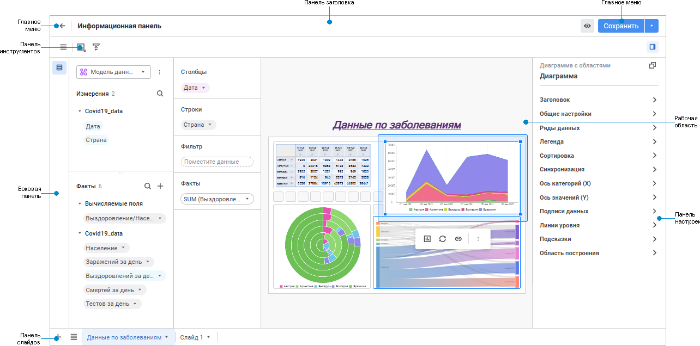
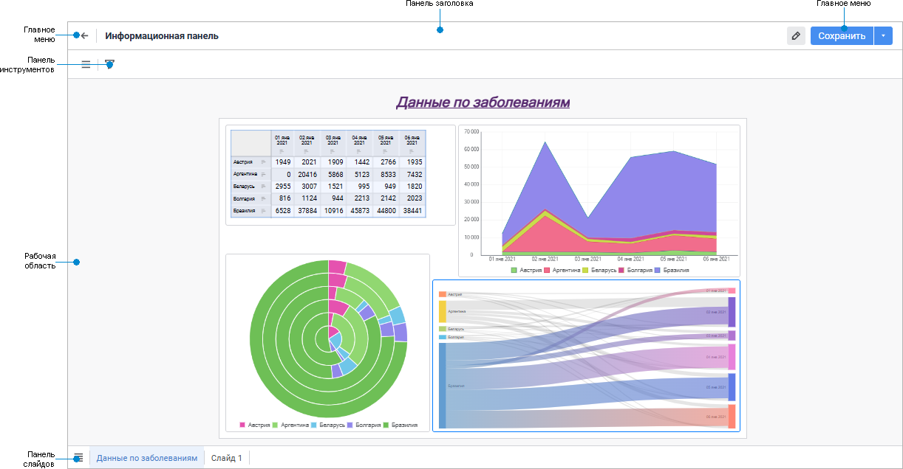

# Начало работы с инструментом «Информационная панель»

Начало работы с инструментом «Информационная панель»
-

# Начало работы с инструментом «Информационная
 панель»

Для начала работы с инструментом создайте новую или откройте готовую
 информационную панель.

[Создание новой
 информационной панели](javascript:TextPopup(this))

	Для создания новой информационной панели в [навигаторе
	 объектов](GetStarted.chm::/Interface/interface_navigator.htm) нажмите кнопку  «Создать» в главном меню и выберите
	 тип объекта на боковой панели «[Новый
	 объект](UiNav.chm::/02_Navigator/General_Principles_of_Work.htm#add_object)».
	 Информационная панель будет открыта в [режиме редактирования](#modes).

[Открытие
 готовой информационной панели](javascript:TextPopup(this))

	Для открытия готовой информационной панели в [навигаторе
	 объектов](GetStarted.chm::/Interface/interface_navigator.htm) выполните одно из действий:

		- выполните команду «Открыть»
		 в контекстном меню информационной панели;

		- выполните команду «Открыть
		 в новой вкладке» в контекстном меню информационной панели;

		- выполните команду «Открыть
		 в новом окне» в контекстном меню информационной панели;

		- дважды щёлкните по информационной панели;

		- выделите информационную панель и нажмите кнопку ENTER.

	По умолчанию выбранная информационная панель будет открыта в [режиме просмотра](#modes).

Для построения информационной панели
 смотрите статью «[Построение
 информационной панели](Building/Create_Informatuion_Panel.htm)».

Для работы с готовой информационной
 панелью смотрите статью «[Работа
 с готовой информационной панелью](Work/Work_with_information_bar.htm)».

Пользовательский интерфейс информационной панели:

	 В
	 режиме редактирования

	 В
	 режиме просмотра

		

		

[Элементы
 пользовательского интерфейса](javascript:TextPopup(this))

		- Главное меню. Содержит
		 кнопки и список команд для работы с информационной панелью и кнопку
		 для возвращения в навигатор. Также доступно сохранение информационной
		 панели и [создание её ](../DataModel/Save.htm)[копии](Building/Save.htm).

		- Панель заголовка.
		 Содержит поле ввода названия информационной панели.

		- Панель инструментов.
		 Содержит кнопки для настройки информационной панели при редактировании
		 и для работы с данными при просмотре.

		- Боковая панель.
		 Содержит раскрывающийся список всех источников данных информационной
		 панели, а также для выбранного источника данных измерения, факты
		 и вычисляемые поля таблиц информационной панели, и настройки полей
		 визуализаторов. Доступна при работе с информационной панелью в
		 режиме редактирования.

		- Панель настроек.
		 Содержит настройки отображения и экспорта визуализаторов и слайдов
		 для их размещения. Доступна при работе с информационной панелью
		 в режиме редактирования.

		- Рабочая область.
		 Содержит инструменты для проведения анализа данных.

		- Панель слайдов.
		 Предназначена для работы со слайдами при редактировании и переключении
		 между ними при просмотре.

## Операции с информационной панелью

При работе с информационной панелью доступны следующие операции:

[Изменение названия
 информационной панели](javascript:TextPopup(this))

	Для переименования информационной панели:

		- Щёлкните мышью по названию информационной панели на [панели
		 заголовка](#structure_window). Заголовок будет переведён в режим редактирования.

		- Удалите старое название и введите новое.

		- [Сохраните информационную панель](Building/Save.htm).

	В результате выполнения действий информационная панель будет переименована.

[Переход
 между режимами работы с информационной панелью](javascript:TextPopup(this))

	Для перехода между режимами работы с информационной панелью:

		- нажмите кнопку  «Редактирование»
		 главного меню для перехода в режим редактирования;

		- нажмите кнопку  «Просмотр»
		 главного меню для перехода в режим просмотра.

См. также:

[Построение
 информационной панели](Building/Create_Informatuion_Panel.htm) | [Работа с готовой информационной
 панелью](Work/Work_with_information_bar.htm)

		Справочная
		 система на версию 10.9
		 от 18/08/2025,
		 © ООО «ФОРСАЙТ»,
