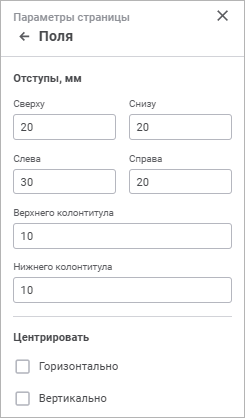

# Поля на странице: Информационные панели

Поля на странице: Информационные панели
-

# Поля на странице

Для настройки полей страницы используйте группу параметров «Поля»
 панели параметров.

[Для открытия
 группы параметров «Поля»](javascript:TextPopup(this))

	Для открытия на панели параметров группы параметров «Поля»:

		- Выполните команду для запуска [печати
		 визуализатора](../print.htm#visualizer).

		- Нажмите кнопку 
		 «Параметры страницы» в
		 правом верхнем углу при выполнении предварительного просмотра
		 визуализатора. Будет открыта панель параметров «Параметры
		 страницы».

		- Перейдите в группу параметров «Поля».

Задайте параметры:

[Отступы, мм](javascript:TextPopup(this))

	Укажите в числовых полях отступы:

		- Сверху, Снизу, Слева, Справа.
		 Установите интервал между соответствующим полем и краем печатной
		 страницы;

		- Верхнего колонтитула/Нижнего
		 колонтитула. Установите расстояние между верхним колонтитулом
		 и верхом страницы, между нижним колонтитулом и низом страницы
		 в миллиметрах. Это расстояние должно быть меньше размера верхнего
		 и нижнего полей соответственно.

[Центрировать](javascript:TextPopup(this))

	Выберите способ, по которому будут отцентрированы объекты листа:

		- Горизонтально. Установите
		 флажок для центрирования объектов на листе отчёта по горизонтали;

		- Вертикально. Установите
		 флажок для центрирования объектов на листе отчёта по вертикали.

После выполнения действий будут настроены поля
 страницы для [печати](../print.htm).

См. также:

[Работа
 с готовой информационной панелью](../Work_with_information_bar.htm) | [Печать визуализаторов
 и слайдов](../print.htm)

		Справочная
		 система на версию 10.9
		 от 18/08/2025,
		 © ООО «ФОРСАЙТ»,
