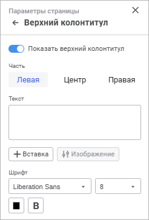
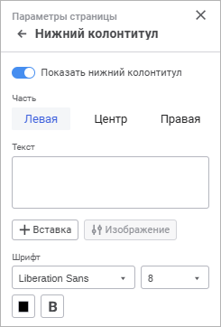

# Колонтитулы на странице: Информационные панели

Колонтитулы на странице: Информационные панели
-

# Колонтитулы на странице

Для настройки колонтитулов на странице используйте группы параметров
 «Верхний колонтитул»/«Нижний
 колонтитул» панели параметров.

[Для открытия
 группы параметров «Верхний колонтитул»/«Нижний колонтитул»](javascript:TextPopup(this))

	Для открытия на панели параметров группы параметров «Верхний
	 колонтитул»/«Нижний колонтитул»:

		- Выполните команду для запуска [печати
		 визуализатора](../print.htm#visualizer).

		- Нажмите кнопку 
		 «Параметры страницы» в
		 правом верхнем углу при выполнении предварительного просмотра
		 визуализатора. Будет открыта панель параметров «Параметры
		 страницы».

		- Перейдите в группу параметров «Верхний
		 колонтитул»/«Нижний колонтитул».

	 Верхний
	 колонтитул

	 Нижний
	 колонтитул

		

		

Задайте параметры:

[Показать верхний/нижний
 колонтитул](javascript:TextPopup(this))

	По умолчанию переключатель переведён в активное состояние. Доступна
	 настройка верхнего/нижнего колонтитула и его отображение на листах
	 отчёта.

[Часть](javascript:TextPopup(this))

	Область колонтитула условно разделена на три части, отличающиеся
	 способом выравнивания содержимого: по левому краю, по центру или по
	 правому краю. Каждая часть имеет свои собственные параметры.

[Текст](javascript:TextPopup(this))

	Текст колонтитула формируется с использованием специальных подстановок
	 или ввода статичного текста.

	Для использования подстановки выберите
	 соответствующие варианты подстановок в раскрывающемся меню кнопки
	  «Вставка»:

			 Вариант подстановки
			 Подстановка/тег
			 Описание

			 Номер страницы
			 &[Page]
			 Будет выведен номер текущей страницы.

			 Количество страниц
			 &[Pages]
			 Будет выведено количество страниц текущего отчёта.

			 Текущая дата
			 &[Date]
			 Будет выведена текущая дата.

			 Текущее время
			 &[Time]
			 Будет выведено текущее время.

			 Название отчёта
			 &[Name]
			 Будет выведено наименование отчёта.

[Шрифт](javascript:TextPopup(this))

	Задайте настройки шрифта:

		- Тип шрифта. Выберите
		 в раскрывающемся списке шрифт, установленный в операционной системе;

		- Размер. Выберите
		 в раскрывающемся списке размер шрифта;

		- Цвет. Выберите в
		 раскрывающейся палитре цвет шрифта. Для выбора доступны стандартные
		 и пользовательские цвета. По умолчанию палитра содержит только
		 стандартные цвета.

	Для создания пользовательского цвета:

			- Нажмите кнопку  «Добавить
			 цвет». Откроется расширенная палитра цветов.

			- Выберите цвет в расширенной палитре цветов, на странице
			 браузера с помощью пипетки или задайте код цвета в формате
			 RGB/HEX.

	После выполнения действий пользовательский
	 цвет будет создан и добавлен в палитру.

	Примечание.
	 Максимально возможное количество пользовательских цветов в палитре
	 равно 23.

	Для удаления пользовательского цвета
	 из палитры выполните команду «Удалить»
	 контекстного меню выбранного цвета.

		- Начертание. Выберите
		 один или несколько типов начертания шрифта в раскрывающемся меню
		 кнопки «Начертание»:

			- B. Полужирное
			 начертание;

			- I. Курсивное
			 начертание;

			- U.
			 Подчёркивание текста;

			- S.
			 Зачёркивание текста линией.

После выполнения действий будут настроены колонтитулы
 на странице для [печати](../print.htm).

См. также:

[Работа
 с готовой информационной панелью](../Work_with_information_bar.htm) | [Печать визуализаторов
 и слайдов](../print.htm)

		Справочная
		 система на версию 10.9
		 от 18/08/2025,
		 © ООО «ФОРСАЙТ»,
