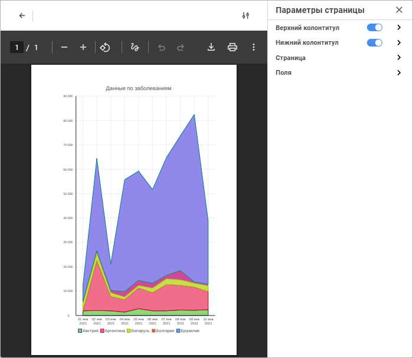
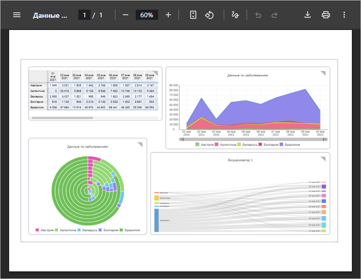
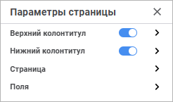

# Печать визуализаторов и слайдов

Печать визуализаторов и слайдов
-

# Печать визуализаторов и слайдов

При работе с информационными панелями доступна печать:

	- [отдельных визуализаторов](#visualizer);

Примечание.
 Печать доступна для всех визуализаторов, кроме [изображения](../Building/Visualizers/Visualization/Image.htm)
 и [текста](../Building/Visualizers/Visualization/Text.htm).

	- [всего слайда](#frame).

## Печать визуализатора

Для печати [выбранного
 визуализатора](../Building/Visualizers/visualizers.htm#select):

	- Выполните команду  «Печать»:

		- на всплывающей [панели
		 настроек](../Starting.htm#structure_window) при работе с информационной панелью [в
		 режиме просмотра](../Starting.htm#modes);

		- в раскрывающемся меню кнопки  «Действия»
		 на всплывающей [панели
		 настроек](../Starting.htm#structure_window) при работе с информационной панелью [в
		 режиме редактирования](../Starting.htm#modes).

	- Выполните [настройки](#settings) в окне предварительного
	 просмотра визуализатора информационной панели:

## Печать слайда

Для печати слайда:

	- Выполните команду  «Печать» главного меню.

	- Выполните настройки в окне предварительного просмотра информационной
	 панели:

## Настройка печати визуализаторов и слайдов

Для настройки параметров печати выбранного визуализатора откройте панель
 параметров «Параметры страницы»:

[Для открытия
 панели параметров «Параметры страницы»](javascript:TextPopup(this))

	Для открытия панели параметров «Параметры
	 страницы» нажмите кнопку  «Параметры
	 страницы» в правом верхнем углу при выполнении предварительного
	 просмотра визуализатора.

Для настройки печати используйте группы параметров:

	- [Верхний/нижний
	 колонтитул](Print/Footers_params.htm). Предназначены для настройки верхнего/нижнего
	 колонтитула;

	- [Страница](Print/Common_ParamsPage.htm).
	 Предназначена для настройки общих параметров страницы;

	- [Поля](Print/Fields_OnPage.htm).
	 Предназначена для настройки отступов на странице.

См. также:

[Построение
 информационной панели](../Building/Create_Informatuion_Panel.htm) | [Работа
 с готовой информационной панелью](Work_with_information_bar.htm)

		Справочная
		 система на версию 10.9
		 от 18/08/2025,
		 © ООО «ФОРСАЙТ»,
