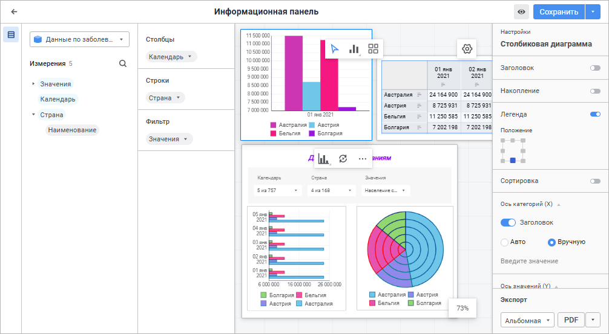

# Анализ данных

Анализ данных
-

# Анализ данных

Анализ данных - основная
 задача, которую решает инструмент «Информационная панель».
 Анализ предназначен для поиска неочевидных связей и закономерностей в
 разрозненной информации, автоматизации деятельности бизнес-аналитиков,
 поддержки принятия решений. С помощью анализа можно найти в имеющихся
 данных неожиданные ответы на вопросы, волнующие бизнес-руководителей.
 Анализ данных позволяет достичь основной цели продукта - поиска «узких»
 мест для повышения каких-либо показателей бизнеса: производительности
 труда, объёма продаж, эффективности распределения ресурсов и многих других.

Перед выполнением анализа данных ознакомьтесь с особенностями
 работы в рабочей области.

На вкладке доступны операции для анализа данных:

	- [настройка
	 визуализаторов данных](Building/Visualizers/Visualization/visualization_setting.htm);

	- [настройка слайдов для размещения
	 визуализаторов данных](Building/Frames/frames.htm).

По окончании работы с визуализаторами данных и слайдами с размещёнными
 на них визуализаторами сохраните информационную панель:

	- нажмите кнопку «Сохранить»
	 на [панели заголовка](Starting.htm);

	- нажмите сочетание клавиш CTRL+S.

Перед сохранением информационной панели при необходимости:

	- измените наименование информационной панели;

	- [экспортируйте
	 требуемые визуализаторы и слайды](Work/export.htm).

См. также:

[Начало работы
 с инструментом «Информационная панель»](Starting.htm) | Особенности
 рабочей области

		Справочная
		 система на версию 10.9
		 от 18/08/2025,
		 © ООО «ФОРСАЙТ»,
