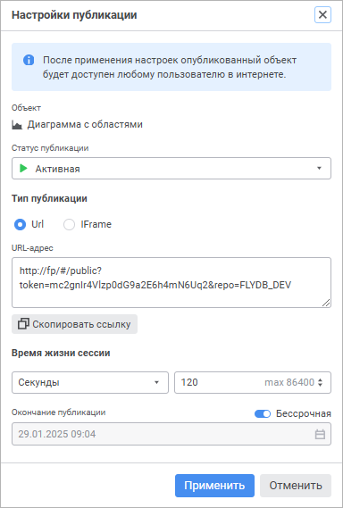
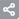
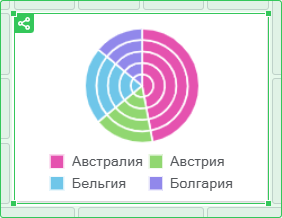
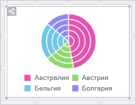

# Публикация объектов

Публикация объектов
-

# Публикация объектов

Для анализа и визуализации данных доступна публикация визуализаторов
 и слайдов в виде отдельных объектов.

Примечание.
 Публикация объектов доступна только пользователям, имеющим права [администратора](Admin.chm::/04_SecurityPolicy/Editor_of_Politicy/Security_EditorPoliticy_Adm.htm).
 Опубликованные объекты доступны во внешних источниках без авторизации
 любым пользователям в интернете.

Для публикации объекта:

	- Выделите объект.

	- Выполните команду 
	 «Опубликовать»:

		- в раскрывающемся меню кнопки  «Действия»
		 на всплывающей панели настроек для [визуализатора](../InformationPanel/Building/Visualizers/visualizers.htm);

		- на всплывающей панели настроек для [слайда](../InformationPanel/Building/Frames/frames.htm).

	- Задайте [настройки публикации](#publish).

Примечание.
 Для корректной работы опубликованных объектов [настройте
 гостевой вход](setup.chm::/UiWebSetup/Authentication/Guest_login.htm). Гостевой пользователь должен обладать
 привилегией «[Право чтения и открытия всех объектов](Admin.chm::/04_SecurityPolicy/Admin_Priv.htm#objects)».

## Настройки публикации

Для задания или изменения настроек публикации используйте окно «Настройки публикации»:

Задайте настройки публикации:

[Объект](javascript:TextPopup(this))

	Отображается тип и наименование публикуемого объекта.

[Статус
 публикации](javascript:TextPopup(this))

	Выберите статуса публикации в раскрывающемся меню:

		- Активная. Значение
		 по умолчанию. Публикация будет активна в течение [заданного
		 времени](#end_publish).

		Если публикация активна, объекты будут отмечены зелёной рамкой
		 и значком активной публикации ;

		- Приостановлена.
		 Публикация объекта будет приостановлена, объект не будет удалён
		 из реестра опубликованных объектов.

		Если публикация приостановлена, объекты будут отмечены серой рамкой
		 и значком приостановленной публикации .

		Для активации публикации задайте [дату окончания
		 публикации](#end_publish);

		- Снять с публикации.
		 Объект будет недоступен на внешних ресурсах и удалён из реестра
		 опубликованных объектов.

	Пример активной публикации:

	

	Пример приостановленной публикации:

	

[Тип публикации](javascript:TextPopup(this))

	Для выбора типа публикации установите переключатель:

		- Url. Ссылка позволяет
		 открыть объект на просмотр в отдельной вкладке браузера. URL-адрес
		 генерируется автоматически. Для копирования ссылки нажмите кнопку
		 «Скопировать ссылку»;

		- IFrame. Код позволяет
		 встроить объект на пользовательскую веб-страницу. Код для вставки
		 генерируется автоматически. Для копирования кода нажмите кнопку
		 «Скопировать код».

[Время
 жизни сессии](javascript:TextPopup(this))

	Настройка регулирует срок жизни сессии для опубликованных объектов
	 и позволяет автоматически [приостанавливать публикацию](#status)
	 объекта по истечении срока.

	Задайте время жизни сессии:

		- В раскрывающемся списке выберите единицу измерения: секунды,
		 минуты или часы.

		- Введите необходимое значение в области ввода. При этом в
		 подсказке будет отображено максимально возможное значение для
		 выбранной единицы измерения.

	Особенности ввода значений:

		- недопустимо задание отрицательных значений и ввод любых
		 символов, кроме чисел;

		- в области ввода значения максимально разрешено ввести 10
		 знаков;

		- если введённое значение превышает максимальное значение
		 или длина значения более 10 символов, то в качестве значения устанавливается
		 максимальное значение;

		- при попытке удалить значение в поле ввода устанавливается
		 минимальное значение по умолчанию, равное 1.

[Окончание
 публикации](javascript:TextPopup(this))

	По умолчанию публикация бессрочная, переключатель «Бессрочная»
	 находится в активном состоянии.

	Для изменения окончания публикации:

		- Переведите переключатель «Бессрочная»
		 в неактивное состояние.

		- Задайте дату и время окончания публикации с помощью календаря
		 или поля ввода. Дата и время задаются в формате ДД.ММ.ГГГГ ЧЧ:ММ.

	Если срок публикации истёк, то [статус публикации](#status)
	 автоматически переводится в «Приостановлена».

Для сохранения настроек публикации объекта нажмите кнопку «Опубликовать»/«Применить».

Для снятия объекта с публикации измените статус публикации на «[Снять с публикации](#status)». Для сохранения
 настроек нажмите кнопку «Снять с публикации».

См. также:

[Построение
 информационной панели](../InformationPanel/Building/Create_Informatuion_Panel.htm) | [Добавление
 визуализаторов и работа с ними](../InformationPanel/Building/Visualizers/visualizers.htm) | [Добавление
 слайдов и работа с ними](../InformationPanel/Building/Frames/frames.htm)

		Справочная
		 система на версию 10.9
		 от 18/08/2025,
		 © ООО «ФОРСАЙТ»,
