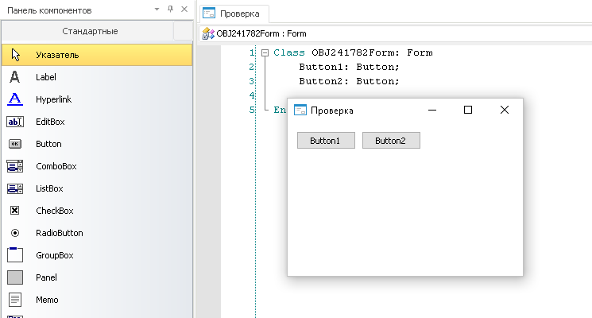
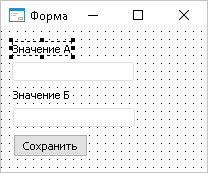
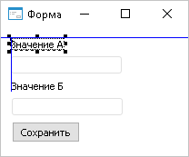

# Размещение компонентов на форме

Размещение компонентов на форме
-

# Размещение компонентов на форме

## Добавление компонентов

Для добавления нового компонента на форму необходимо:

	- на одной из [панелей
	 компонентов](../03_Windows_of_Development_Environment/Panels_component.htm) щелкнуть на нужном компоненте;

	- щелкнуть в том месте формы, куда необходимо разместить
	 компонент;

	- зажать кнопку мыши на форме и переместить курсор,
	 определив размеры вставляемого компонента.

	

Для перемещения компонентов на форме необходимо:

	- выделить компонент (группу компонентов);

	- зажать кнопку мыши в области компонента (одного из
	 компонентов группы) и переместить в необходимое место формы.

Работа по выравниванию компонентов на форме зависит от настроек [дизайнера форм](Developer.chm::/About_Developing/Development_Environment_Options.htm).

## Выравнивание компонентов с привязкой к сетке

При перемещении компонента (группы компонентов) с помощью мыши выравнивание
 осуществляется по вершинам сетки, отображаемым на форме в виде точек.
 В качестве точки привязки выступает верхний левый угол компонента. При
 изменении размеров компонента привязка также будет осуществляться к вершинам
 сетки.

## Выравнивание компонентов без привязки к сетке

При перемещении компонента (группы компонентов) учитываются:

	-  координаты соседних компонентов.

	-  допустимые отступы от краев формы.

	- отступы от других компонентов.

При совпадении координат либо отступов компонентов на форме будут отображаться
 вспомогательные линии, по которым и осуществляется ориентация компонента.
 Линии допустимых границ формы и границ компонентов отображаются синим
 цветом. Линии, отражающие минимальное допустимое расстояние между компонентами,
 отображаются красным цветом.

## Выравнивание компонентов с клавиатуры

Для точной настройки места расположения и размеров компонентов используются
 сочетания клавиш:

	- для перемещения компонентов без привязки к сетке/другим
	 компонентам - переместить компонент удерживая клавишу ALT;

	- для перемещения компонентов с клавиатуры - сочетание
	 клавиш CTRL+UP/DOWN/LEFT/RIGHT;

	- для изменения размеров компонентов - SHIFT+UP/DOWN/LEFT/RIGHT.

См. также:

[Компоненты
 среды разработки](../Development_environment_components.htm)

		Справочная
		 система на версию 10.9
		 от 18/08/2025,
		 © ООО «ФОРСАЙТ»,
