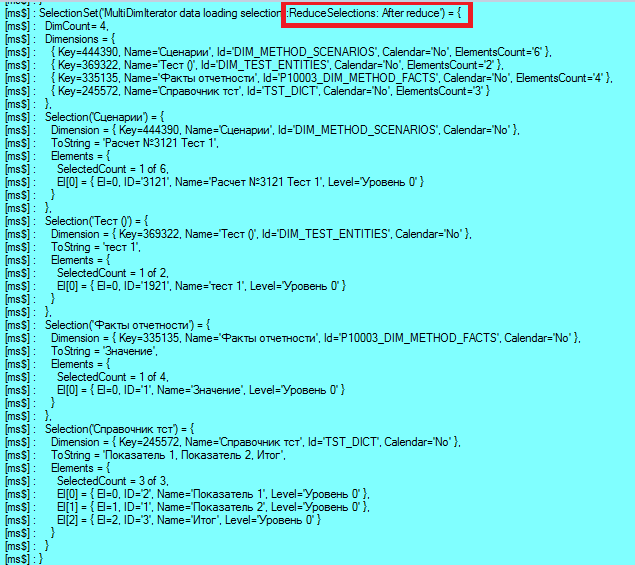
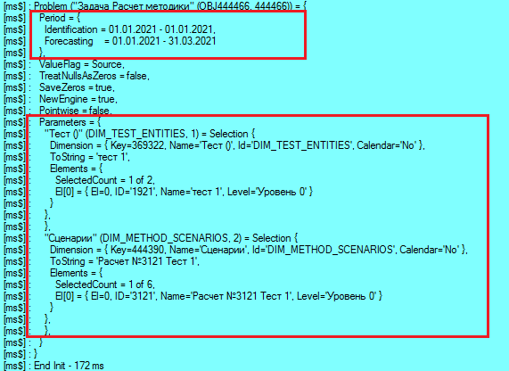
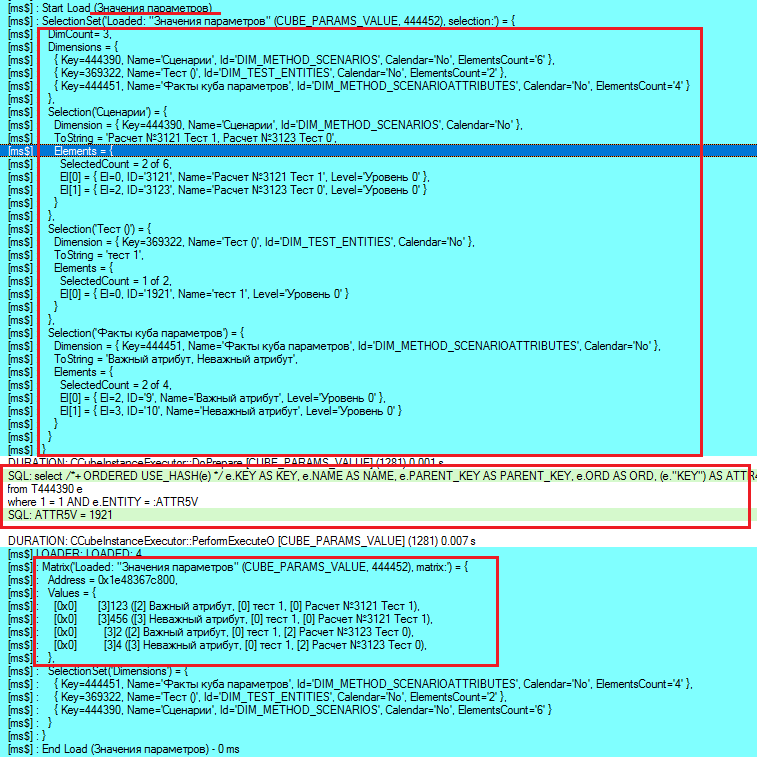
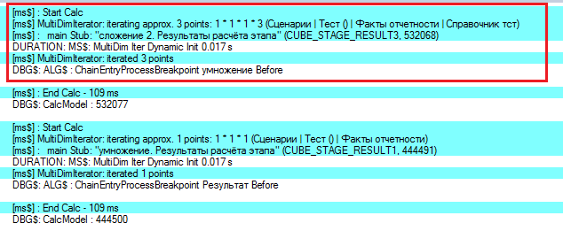
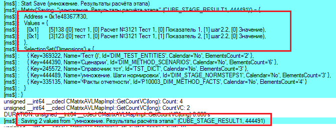

# Работа с отладочной информацией

Работа с отладочной информацией
-

# Работа с отладочной информацией

	Во время работы в «Форсайт. Аналитическая платформа»
	 ядром формируется и выводится отладочная информация.

	Для просмотра отладочной информации используйте:

		- поток ошибок stderr в ОС Linux;

		- [syslog](https://ru.wikipedia.org/wiki/Syslog)
		 в ОС Linux;

		- Debugger в ОС Windows, который можно просмотреть через специализированную
		 программу, например, [DebugView](https://learn.microsoft.com/en-us/sysinternals/downloads/debugview). DebugView
		 входит в пакет программ [Sysinternals](https://learn.microsoft.com/en-us/sysinternals/downloads/).

	Пример лога DebugView с информацией из «Форсайт. Аналитическая платформа»:

...
1 0.00000000 [42364] DLL: PiLib is loaded
2 0.00067080 [42364] [II] 49616 [] GENERIC: 10.9.10109.0
3 0.00070060 [42364] [II] 49616 [] GENERIC: PiLog init: reading settings
4 0.01603390 [42364] DLL: ModDrawing is loaded
5 0.01725630 [42364] DLL: UiLib is loaded
6 0.01826630 [42364] DLL: Fore is loaded
7 0.01913290 [42364] DLL: UiSom is loaded
8 0.01959310 [42364] DLL: ModAndy is loaded
9 0.02006100 [42364] DLL: ModImportExport is loaded
10 0.02129140 [42364] [II] 49616 [] INTL: SetLocale=Russian_RUS.1251
11 0.02254660 [42364] [II] 49616 [] INTL: c:\Program Files\Foresight\Analytics Platform 10.x\ru\PiResCore.dll
12 0.02281860 [42364] DLL: ModTabSheet is loaded
13 0.02338610 [42364] DLL: UiTabSheet is loaded
14 0.02383190 [42364] DLL: UiAndy is loaded
15 0.02432030 [42364] DLL: UiWsp is loaded
16 0.02494430 [42364] [II] 49616 [] EVENT: Start event...
17 0.02500540 [42364] [II] 49616 [] EVENT: Finish event...
18 0.02682870 [42364] [II] 49616 [] INTL: c:\Program Files\Foresight\Analytics Platform 10.x\ru\BCGCBProRes.dll
19 0.12588820 [42364] [II] 49616 [] STARTUP: State persistence initialized
20 0.12590840 [42364] [II] 49616 [] STARTUP: Keyboard manager initialized
21 0.12710100 [42364] [II] 49616 [] INTL: c:\Program Files\Foresight\Analytics Platform 10.x\ru\PiResUi.dll
22 0.12970150 [42364] [II] 49616 [] STARTUP: BCGCBP initialized
23 0.13009170 [42364] [II] 49616 [] STARTUP: InitCommonControls passed
24 0.13054450 [42364] [EE] 49616 [] INTL: Failed to find .\Hlp\Studio.chm
25 0.13060200 [42364] DLL: Studio is loaded
26 0.13096640 [42364] [II] 49616 [] STARTUP: Command line parsed
27 0.13098070 [42364] [II] 49616 [] STARTUP: OLE initialized
28 0.13953030 [42364] [II] 49616 [] STARTUP: InitCommonControls passed
29 0.13997211 [42364] [EE] 49616 [] INTL: Failed to find .\Hlp\PP.chm
30 0.14002401 [42364] DLL: UiHost is loaded
31 0.15107670 [42364] [II] 49616 [] STARTUP: Image lists loaded
32 0.15366040 [42364] DLL: KeSom is loaded
33 0.15479620 [42364] DLL: XMLLib2 is loaded
34 0.19133680 [42364] [WW] 49616 [] LICENSE: Connection to license service is not secure
35 0.19137061 [42364] [II] 49616 [] LICENSE: License service: http://lic-server:8510, source: envvar
36 0.19218490 [42364] [II] 49616 [] LICENSE: Requesting feature "AnalyticsPlatform" v9...
37 0.29769361 [42364] [II] 49616 [] LSDURATION: LsServiceRequest 0.105 s
38 0.29773480 [42364] [II] 49616 [] LICENSE: Accepted request for feature "AnalyticsPlatform" from service
39 0.32130730 [42364] [II] 49616 [] LSDURATION: LsServiceRelease 0.023 s
40 0.32135299 [42364] [II] 49616 [] LICENSE: License AnalyticsPlatform released from service
41 0.36167911 [42364] [II] 49616 [] LSDURATION: LsServiceGetFeatures 0.006 s
42 3.00725913 [42364] [II] 49616 [] LICENSE: Requesting feature "AnalyticsPlatform" v9...
43 3.11853385 [42364] [II] 49616 [] LSDURATION: LsServiceRequest 0.111 s
44 3.11854792 [42364] [II] 49616 [] LICENSE: Accepted request for feature "AnalyticsPlatform" from service
45 3.11917806 [42364] [II] 49616 [] MB: Use audit connection for audit log: False
46 3.12151909 [42364] [II] 49616 [] SECURITY: Audit user: FSAUDIT, source: registry HKLM
47 3.13232207 [42364] DLL: KeMsSql is loaded
48 3.15662003 [42364] [II] 49616 [] SECURITY: Builtin authorization mode: False
49 3.16814613 [42364] [EE] 49616 [] SETUP: The "RecursiveDeps" settings parameter not found
50 3.17200327 [42364] [II] 49616 [] MB: SessionId for log = [680293AAF0B64B70]
51 3.17207718 [42364] [II] 49616 [680293AAF0B64B70] DURATION: CSomMetabase::Open - start
52 3.17259669 [42364] [II] 49616 [680293AAF0B64B70] SETUP: Key: \Software\Foresight\Foresight Analytics Platform\10.0\Service\Mbs\WAREHOUSE Value: endpoint = , NOT SET
53 3.17431545 [42364] [II] 49616 [680293AAF0B64B70] DURATION: CSomMetabase::PerformLogon - start
54 3.17940521 [42364] [II] 49616 [680293AAF0B64B70] DURATION: CSomSecurity::ReadFrom - start
55 3.17955256 [42364] [II] 49616 [680293AAF0B64B70] DURATION: CSomSecurity::ReadFrom - ABACUSAT - start
56 3.17982268 [42364] [II] 49616 [680293AAF0B64B70] DURATION: CSomSecurity::ReadFrom - ABACUSAT 0.000 s
57 3.17992377 [42364] [II] 49616 [680293AAF0B64B70] DURATION: CSomSecurity::ReadFrom - ABACGRAT - start
58 3.18012524 [42364] [II] 49616 [680293AAF0B64B70] DURATION: CSomSecurity::ReadFrom - ABACGRAT 0.000 s
59 3.18015671 [42364] [II] 49616 [680293AAF0B64B70] DURATION: CSomSecurity::ReadFrom - USC - start
60 3.18200445 [42364] [II] 49616 [680293AAF0B64B70] DURATION: CSomSecurity::ReadFrom - USC 0.002 s
61 3.18203568 [42364] [II] 49616 [680293AAF0B64B70] DURATION: CSomSecurity::ReadFrom - GRC - start
62 3.18288398 [42364] [II] 49616 [680293AAF0B64B70] DURATION: CSomSecurity::ReadFrom - GRC 0.001 s
63 3.18291879 [42364] [II] 49616 [680293AAF0B64B70] DURATION: CSomSecurity::ReadFrom - MEM - start
64 3.18322134 [42364] [II] 49616 [680293AAF0B64B70] DURATION: CSomSecurity::ReadFrom - MEM 0.000 s
65 3.18325591 [42364] [II] 49616 [680293AAF0B64B70] DURATION: CSomSecurity::ReadFrom - POL - start
66 3.18536329 [42364] DLL: KeABAC is loaded
67 3.18629718 [42364] [II] 49616 [680293AAF0B64B70] DURATION: CSomSecurity::ReadFrom - POL 0.003 s
68 3.18633175 [42364] [II] 49616 [680293AAF0B64B70] DURATION: CSomSecurity::ReadFrom - CLSSDS - start
69 3.18950629 [42364] [II] 49616 [680293AAF0B64B70] DURATION: CSomMetabase::InitClasses - start
70 3.18955731 [42364] [II] 49616 [680293AAF0B64B70] DURATION: CSomMetabase::InitClasses 0.000 s
71 3.19792318 [42364] [II] 49616 [680293AAF0B64B70] DURATION: CSomSecurity::ReadFrom - CLSSDS 0.012 s
72 3.19793916 [42364] [II] 49616 [680293AAF0B64B70] DURATION: CSomSecurity::ReadFrom - tokens - start
73 3.19875669 [42364] [II] 49616 [680293AAF0B64B70] DURATION: CSomSecurity::ReadFrom - tokens 0.001 s
74 3.19878912 [42364] [II] 49616 [680293AAF0B64B70] DURATION: CSomSecurity::ReadFrom 0.019 s
75 3.22177553 [42364] [II] 49616 [680293AAF0B64B70] DURATION: CSomMetabase::PerformLogon 0.047 s
76 3.22270012 [42364] [II] 49616 [680293AAF0B64B70] USERINFO: User = ADMIN, DB session Id = 73, JLO session Id = 393885
77 3.22511435 [42364] [II] 49616 [680293AAF0B64B70] SYSUTILS: Getting cache folder. Result folder is C:\Users\ivanov\AppData\Local\Foresight\Foresight Analytics Platform\AsmCache0\Mod\WAREHOUSE\10_9_10109_0\Runtime\D1\
78 3.22512603 [42364] [II] 49616 [680293AAF0B64B70] SYSUTILS: Getting cache folder. Result folder is C:\Users\ivanov\AppData\Local\Foresight\Foresight Analytics Platform\AsmCache0\Mod\WAREHOUSE\10_9_10109_0\Runtime\
79 3.22535539 [42364] [II] 49616 [680293AAF0B64B70] DURATION: CSomMetabase::BuildTree - start
80 3.22539163 [42364] [II] 49616 [680293AAF0B64B70] DURATION: CSomMetabase::InitClasses - start
81 3.22543120 [42364] [II] 49616 [680293AAF0B64B70] DURATION: CSomMetabase::InitClasses 0.000 s
82 3.22726798 [42364] [II] 49616 [680293AAF0B64B70] DURATION: CSomMetabase::ReadAttributes - start
83 3.23892522 [42364] [II] 49616 [680293AAF0B64B70] DURATION: CSomMetabase::ReadAttributes 0.012 s
84 3.23893690 [42364] [II] 49616 [680293AAF0B64B70] DURATION: CSomMetabase::ReadSecurityDescriptors - start
85 3.26921082 [42364] [II] 49616 [680293AAF0B64B70] DURATION: CSomMetabase::ReadSecurityDescriptors 0.030 s
86 3.26924324 [42364] [II] 49616 [680293AAF0B64B70] DURATION: CSomMetabase::ReadObjects - start
87 4.01325798 [42364] [II] 49616 [680293AAF0B64B70] DURATION: CSomMetabase::ReadObjects 0.744 s
88 4.01330614 [42364] [II] 49616 [680293AAF0B64B70] DURATION: CSomMetabase::UpdateClasses - start
89 4.01804876 [42364] [II] 49616 [680293AAF0B64B70] DURATION: Bind custom extender - start
90 4.04042816 [42364] DLL: KeFore is loaded
91 4.15169191 [42364] [II] 49616 [680293AAF0B64B70] DURATION: Bind custom extender 0.134 s
92 4.15184498 [42364] [II] 49616 [680293AAF0B64B70] DURATION: CSomMetabase::UpdateClasses 0.138 s
93 4.15185499 [42364] [II] 49616 [680293AAF0B64B70] DURATION: CSomMetabase::BuildChildren - start
94 4.68656349 [42364] [II] 49616 [680293AAF0B64B70] DURATION: CSomMetabase::BuildChildren 0.535 s
95 4.68664885 [42364] [II] 49616 [680293AAF0B64B70] DURATION: CSomMetabase::BuildTree 1.461 s
96 4.68667459 [42364] [II] 49616 [680293AAF0B64B70] DURATION: CSomMetabase::AddPrivateFolderTo - start
97 4.68673897 [42364] [II] 49616 [680293AAF0B64B70] DURATION: CSomMetabase::AddPrivateFolderTo 0.000 s
98 4.68678570 [42364] [II] 49616 [680293AAF0B64B70] DURATION: CSomMetabaseManager::OnMbOpen - start
99 4.68821621 [42364] [II] 49616 [680293AAF0B64B70] DURATION: CSomMetabaseManager::OnMbOpen 0.001 s
100 4.68832970 [42364] [II] 49616 [680293AAF0B64B70] MB: Metabase opened - WAREHOUSE (393885)
101 4.68838072 [42364] [II] 49616 [680293AAF0B64B70] DURATION: CSomMetabase::Open 1.516 s
102 4.70307636 [42364] DLL: KePython is loaded
103 4.70965481 [42364] DLL: ModIo is loaded
104 4.79017258 [42364] [II] 49616 [680293AAF0B64B70] PLUG: ModForms
105 4.79327917 [42364] DLL: ModForms is loaded
106 4.79658794 [42364] [II] 49616 [680293AAF0B64B70] STARTUP: Login dialog passed
...

	Описание структуры лога представлено [ниже](#logstruct).

	Примечание.
	 Номера строк и время фиксации сообщения в примере лога выводятся самой
	 программой DebugView.

## Вывод дополнительной отладочной информации

	По умолчанию в лог выводится следующая информация:

		- загружаемые и выгружаемые библиотеки платформы;

		- запросы к серверу СУБД;

		- сообщения компилятора Fore;

		- сообщения, выводимые в консоль среды разработки из прикладного
		 кода;

		- время выполнения каких-либо операций;

		- ошибки.

	При необходимости объем выводимой информации может быть изменён
	 за счёт изменения уровня логирования. Более подробное описание об
	 изменении настроек логирования представлено в подразделе базы знаний
	 «[Расширенное
	 логирование и получение дополнительной отладочной информации](KnowledgeBase.chm::/01_Fore/KB000030/KnowledgeBase_KB000030_1.htm)».

## Структура лога

	Каждая строка в логе представляется в следующем формате:

	[<SeverityLevel>] <ThreadId> [<UserContext>]
	 <CategoryName>: <Message>\r\n

	Где:

		- SeverityLevel.
		 Уровень важности сообщения. Представляется в виде дублированной
		 первой буквы английского наименования уровня логирования:

			- [TT] - Сообщения уровня Trace;

			- [DD] - Сообщения уровня Debug;

			- [II] - Сообщения уровня Info;

			- [WW] - Сообщения уровня Warning;

			- [EE] - Сообщения уровня Error;

			- [CC] - Сообщения уровня Critical.

		- ThreadId.
		 Идентификатор потока приложения;

		- UserContext.
		 Уникальный идентификатор сессии пользователя. Формируется во время
		 подключения к репозиторию, в дальнейшем данным идентификатором
		 дополняются сообщения, чтобы можно было следить в рамках какого
		 подключения выполнялись определённые действия. Пример строки формирования
		 идентификатора сессии: [18392] [II] 37648 [] MB: SessionId for
		 log = [7E728F555694421F];

		- CategoryName.
		 Категория события. Зависит от выполняемого действия или отражает
		 инструмент платформы, выполняющий действие;

		- Message.
		 Непосредственное сообщение, выводимое в лог.

	В начале сессии выводится информация о пользователе, который осуществляет
	 подключение:

	...

	134 0.07614390 [18392]  USRLO = sa

	135 0.07614390 [18392]  USRSTA = IVANOV

	136 0.07614390 [18392]  USRDOM = WORK

	137 0.07614390 [18392]  RESLO =

	138 0.08997750 [18392] [DD] 37648 [7E728F555694421F]
	 PREPARED SQL: insert into dbo.B_JLO(SES, STAMP, STAMP_OUT, US_SID,
	 US_NAM, US_DES, US_STA, US_OS, US_IP, ALLO,CMNT,SES_ID, US_MAC) values(:A,
	 :B, :C, :D, :E, :F, :G, :H, :I, :J,:CMNT, @@SPID, :K)

	139 0.09016420 [18392] [DD] 37648 [7E728F555694421F]
	 PARAMS:

	140 0.09016420 [18392]  A = 382386

	141 0.09016420 [18392]  B = 03.04.2025
	 12:06:01.418

	142 0.09016420 [18392]  C = 29.12.2027
	 12:06:01.418

	143 0.09016420 [18392]  D = PS-1-1

	144 0.09016420 [18392]  E = ADMIN

	145 0.09016420 [18392]  F = Пользователь
	 ADMIN

	146 0.09016420 [18392]  G = IVANOV

	147 0.09016420 [18392]  H = ivan.ivanov

	148 0.09016420 [18392]  I = 10.9.46.116

	149 0.09016420 [18392]  J = 1

	150 0.09016420 [18392]  CMNT = Версия платформы:
	 10.8.8.0 LTS x64 Настольное приложение

	...

	В дальнейшем используются следующие категории для обозначения сообщений:

		- Основные категории отладочных
		 сообщений:

			- SQL или PREPARED SQL. Запрос, выполняемый
			 к серверу СУБД;

			- PARAMS. Набор
			 параметров, передаваемых вместе с запросом;

			- FORE. Сообщения,
			 выводимые компилятором языка Fore;

			- $DBG. Сообщения,
			 выводимые при выполнении прикладного кода на Fore с помощью
			 методов класса [Debug](ForeSys.chm::/Class/Debug/Debug.htm);

			- EXCEPTION. Различные
			 виды ошибок;

			- DURATION. Время
			 выполнения какого-либо метода или действия.

		- Инструменты, с которыми связано
		 отладочное сообщение:

			- [ms$]. Сообщение,
			 сгенерированное при работе инструментов моделирования и прогнозирования,
			 алгоритмов расчёта;

			- [eax$]. Сообщение,
			 сгенерированное при работе с экспресс-отчётами;

			- ADHOC. Сообщение,
			 сгенерированное при работе с аналитическими панелями;

			- INMEM. Выполнение
			 каких-либо действий, связанных с кешированием In-Memory: получение
			 данных из кеша, сохранение данных в кеш и другие;

			- JAVA. Сообщения,
			 связанные с выполнением кода на Java;

			- Python. Сообщения,
			 связанные с выполнением кода на Python;

			- VCS. Сообщения,
			 связанные с работой системы управления версиями.

## Разбор лога

	В первую очередь проверьте наличие сообщений об ошибках. Для этого
	 воспользуйтесь поиском по тексту ключевого слова Exception.
	 Для поиска используйте стандартное сочетание клавиш CTRL+F, для продолжения
	 поиска - F3. Пример возможной ошибки:

	...

	[II] 3452 [] $DBG: [II] 9832 [7E728F555694421F
	 ] FORE: Start assembly loading: Metabase

	[II] 3452 [] $DBG: [II] 9832 [7E728F555694421F
	 ] FORE: Finish assembly loading: Metabase

	[II] 3452 [] $DBG: [II] 9832 [7E728F555694421F
	 ] FORE: Finish assembly loading: OBJ347145

	[II] 3452 [] INTL-SETLOCALE: Russian_RUS.1251

	[II] 11940 [191E71BACA2146EE] GENERIC: LockResolve
	 CNavigatePanel::InitMembers()

	[II] 3452 [] $DBG: [EE] 9832 [7E728F555694421F
	 ] EXCEPTION_CLASS: CPiException

	[II] 3452 [] $DBG: [EE] 9832 [7E728F555694421F
	 ] EXCEPTION: TEXT: Обращение к еще не созданному объекту

	[II] 11940 [191E71BACA2146EE] GENERIC: LockResolve
	 CNavigatePanel::InitMembers()

	[EE] 11940 [191E71BACA2146EE] EXCEPTION_CLASS:
	 CPiException

	[EE] 11940 [191E71BACA2146EE] EXCEPTION:
	 TEXT: Обращение к еще не созданному объекту

	[EE] 11940 [191E71BACA2146EE] EXCEPTION:
	 Обращение к еще не созданному объекту

	Класс ошибки: CPiException

	[II] 7140 [] $DBG: DLL: PiLib is loaded

	[II] 7140 [] $DBG: [II] 11456 [] GENERIC: 10.8.8.0

	[II] 7140 [] $DBG: [II] 11456 [] GENERIC: PiLog
	 init: reading settings

	...

	Ошибки могут быть:

		- На стадии компиляции.
		 Если ошибка возникла на стадии компиляции, то она также будет
		 отражена в окне [сообщений
		 компилятора](../../03_Windows_of_Development_Environment/Compiler_send.htm). При этом по ней может быть вызвана справка. Сводный
		 список ошибок, возникающих на стадии компиляции, представлен в
		 подразделе «[Сообщения
		 компилятора Fore](Fore.chm::/11_Compiler_Errors/compiler_errors.htm)»;

		- На стадии выполнения.
		 Если ошибка вызвана на стадии выполнения кода, то изучите текст
		 ошибки, место её возникновения: идентификатор модуля и номер строки.
		 В большинстве случаев по тексту можно понять причину возникновения
		 ошибки и внести необходимые изменения. Если причину ошибки определить
		 не удалось, то скопируйте и сохраните в файл блок лога от запуска
		 приложения до ошибки. Полученный файл с описанием производимых
		 действий отправьте в техническую поддержку по адресу [support@fsight.ru](mailto:support@fsight.ru)
		 или через [сервисы
		 технической поддержки](https://www.fsight.ru/support/), которые доступны после регистрации
		 на сайте.

	В редких случаях может возникнут ошибка с текстом Access
	 Violation. Данная ошибка свидетельствует о наличии необработанной
	 исключительной ситуации во внутреннем коде продукта «Форсайт. Аналитическая платформа».
	 Сообщите в техническую поддержку при каких условиях возникла данная
	 ошибка, чтобы в дальнейшем была возможность внести критические изменения
	 в код продукта.

	Кроме ошибок в лог выводятся информационные сообщения, отражающие
	 процесс работы приложения. Рассмотрим отдельно по инструментам возможные
	 сообщения, их содержание и интерпретацию для оценки и планирования
	 дальнейших действий.

	[[ms$]. Моделирование
	 и прогнозирование, алгоритмы расчёта](javascript:TextPopup(this))

		Рассмотрим сообщения лога при значении флага MsDump=2.

		Лог расчёта соответствует этапам расчёта: инициализация, загрузка
		 данных, расчёт, сохранение данных. Для чтения лога в первую очередь
		 нужно знать, что должно загрузиться, на какие точки производится
		 расчёт и что должно получиться на выходе.

### Инициализация

		Первым большим блоком с префиксами ms будет инициализация алгоритма.
		 В блоке можно увидеть:

			- Отметки по справочникам
			 источников. В данном блоке сообщений интересует последняя
			 часть после текста: After
			 reduce (интерпретация: после сокращения отметки по
			 связям атрибутов):

			

			Что смотреть: Если в какой-то из отметок SelectionCount будет
			 «0 из N» или «Null из N», то скорее всего расчёт будет произведен
			 некорректно, потому-что по одному из измерений не нашлась
			 координата, соответственно не с чего загружать данные/некуда
			 сохранять результат расчёта.

			- Период расчета и значения
			 параметров после текста Problem;

			

			Что смотреть:

				- Проверьте, верно ли заданы периоды идентификации
				 и прогнозирования. Из-за неправильных периодов могут не
				 загрузиться нужные данные. Например, данные сохранены
				 по 2019 году, а в периоде идентификации указан 2021 и
				 в формулах год не уточнён.

				- Проверьте значения параметров, передаваемые во вложенные
				 алгоритмы расчёта. Возможно, значения не передаются из-за
				 некорректных настроек управления параметрами вложенных
				 объектов.

### Загрузка данных

		После инициализации по порядку загружаются источники данных,
		 определить начало загрузки можно по тексту Start Load. Для каждого
		 источника сначала указывается отметка по всем измерениям, запрос
		 на выборку данных, а потом загружаемая матрица:

		

		Что смотреть: необходимо проверить наличие нулевых отметок,
		 все ли данные для источника загрузились, не загрузились ли лишние
		 данные. Наличие каких-либо расхождений может повлиять на работу
		 приложения, также может быть признаком наличия ошибочных настроек
		 в формулах.

### Расчёт

		Расчёт начинается с сообщения Start Calc и заканчивается сообщением
		 End Calc. В лог выводится количество точек расчёта, список измерений,
		 по элементам которых осуществляется итерация для формирования
		 точек:

		

		Что смотреть: предварительно данный блок сообщений можно пропустить
		 и перейти к информации о сохранении данных. Если отсутствуют сохранённые
		 данные, то вернитесь к блоку сообщений о расчётах моделей, проверьте
		 отметки и количество рассчитываемых точек. Интересует модули,
		 результатом расчёта которых является 0 точек. В этих моделях могут
		 быть ошибки настроек расчёта.

		Примечание.
		 Сохраняемых значений может не быть, если осуществляется повторный
		 расчёт. Сохраняются только изменённые значения.

### Сохранение

		Сохранение изменений начинается с сообщения Start Save. Для
		 каждого приёмника данных в сообщениях выводится сохраняемая матрица
		 и количество сохраняемых значений:

		

		Что смотреть: в блоке сообщений, не открывая приёмники, можно
		 увидеть, производилось ли какое-то сохранение изменённых данных.
		 Проверьте, соответствуют ли изменения ожидаемым результатам расчёта,
		 сохраняемая матрица может быть меньше чем требуется или наоборот,
		 может содержать лишние значения. На основании полученных результатов
		 можно сделать вывод, корректно ли отработал расчёт или требуется
		 продолжить поиск ошибок.

См. также:

[Запуск
 и отладка](../Run_Debug.htm) | [Расширенное
 логирование и получение дополнительной отладочной информации](KnowledgeBase.chm::/01_Fore/KB000030/KnowledgeBase_KB000030_1.htm)

		Справочная
		 система на версию 10.9
		 от 18/08/2025,
		 © ООО «ФОРСАЙТ»,
