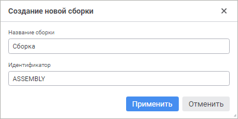

# Создание сборки: Среда разработки

Создание сборки: Среда разработки
-

# Создание сборки

Сборка является главной единицей компиляции среды разработки. Сборка
 предназначена для объединения модулей, веб-форм и форм по их функциональному
 назначению и дальнейшему формированию структуры приложения путём соединения
 по ссылке различных сборок. Отдельно созданные модули или формы также
 компилируются как отдельные сборки.

Примечание.
 Веб-формы доступны только в веб-приложении, формы - в настольном приложении.

[Создание новой
 сборки](javascript:TextPopup(this))

	Для создания новой сборки:

		- в веб-приложении:

			- в [навигаторе
			 объектов](GetStarted.chm::/Interface/Interface_Navigator.htm) нажмите кнопку 
			 «Создать» в главном
			 меню и выберите тип объекта на боковой панели «[Новый объект](UiNav.chm::/02_Navigator/General_Principles_of_Work.htm#add_object)»;

			- в [среде
			 разработки](Developer.chm::/About_Developing/Start_the_Development_Environment.htm):

				- выполните команду «Файл
				 > Создать > Сборка» в главном меню;

				- выполните команду «Создать
				 > Сборка» в контекстном меню навигатора проекта.

	При создании сборки в среде разработки
	 откроется окно «Создание новой сборки»:

	

	Укажите наименование и уникальный идентификатор
	 создаваемой сборки в соответствующих полях.

		- в настольном приложении:

			- в навигаторе объектов:

				- нажмите кнопку «Новый
				 объект > Среда
				 разработки > Сборка» в группе «Создать»
				 на вкладке «Главная»
				 ленты инструментов;

				- выполните команду «Создать
				 > Среда разработки > Сборка» в контекстном
				 меню навигатора объектов;

			- в среде разработки:

				- выполните команду «Файл
				 > Создать > Сборка» в главном меню;

				- выполните команду «Создать
				 > Сборка» в контекстном меню навигатора проекта.

[Редактирование
 существующей сборки](javascript:TextPopup(this))

	Для редактирования существующей сборки:

		- в веб-приложении:

			- в [навигаторе
			 объектов](GetStarted.chm::/Interface/Interface_Navigator.htm):

				- выполните команду «Редактировать»
				 в контекстном меню сборки;

				- выполните команду «Редактировать
				 в новой вкладке» в контекстном меню сборки;

				- выполните команду «Редактировать
				 в новом окне» в контекстном меню сборки;

				- дважды щёлкните по сборке;

				- нажмите клавишу F4;

			- в [среде
			 разработки](Developer.chm::/About_Developing/Start_the_Development_Environment.htm) выполните команду «Редактировать»
			 в контекстном меню сборки в навигаторе проекта;

			- в главном меню «Файл
			 > Открыть последние» выбрать ранее открытую сборку.

		- в настольном приложении:

			- в навигаторе объектов:

				- нажмите кнопку 
				 «Редактировать»
				 в группе «Открыть»
				 на вкладке «Главная»
				 ленты инструментов;

				- выполните команду «Редактировать»
				 в контекстном меню сборки;

				- нажмите клавишу F4;

			- в среде разработки:

				- выполните команду «Редактировать»
				 в контекстном меню сборки в навигаторе проекта;

				- выполните команду «Файл
				 > Открыть» в главном меню.

	При обращении к сборке осуществляется проверка прав доступа к ней.
	 Если и пользователя нет прав на редактирование, то действия со сборкой
	 будут недоступны.

После создания сборки вся дальнейшая работа заключается в создании внутренней
 иерархии из [папок](UiNavObj.chm::/UiNavObj_Folder.htm),
 [модулей](DevEnv_Module.htm), [веб-форм](Web_Form.htm)
 и [форм](DevEnv_Form.htm), настройке связей с другими сборками
 и написания прикладного кода. Для запуска сборки на выполнение создайте
 специальную процедуру - [точку входа](entry_point.htm). Точка
 входа используется при запуске приложения из репозитория, а во время разработки
 и отладки можно [выбрать](../../03_Windows_of_Development_Environment/Choice_main_module.htm)
 какой-либо отдельный модуль/форму, который будет запускаться при работе
 в среде разработки.

Для работы с внутренней иерархией сборки:

	- в навигаторе объектов перейдите к сборке в дереве объектов;

	- в среде разработки раскройте сборку в навигаторе проекта.

После чего добавьте готовый объект в сборку или создайте новый.

[Добавление готового
 объекта в сборку](javascript:TextPopup(this))

	Для добавления готового объекта в сборку:

		- Выберите объект:

			- в навигаторе объектов;

			- в среде разработки в навигаторе проекта.

		- Скопируйте объект с помощью
		 команды «Копировать» в
		 контекстном меню объекта.

		- Перейдите в сборку:

			- в дереве объектов навигатора;

			- в среде разработки в навигаторе проекта.

		- Вставьте объект с помощью команды
		 «Вставить» в контекстном
		 меню объекта.

	После выполнения действий выбранный объект будет добавлен в сборку
	 и сохранён.

[Создание нового
 объекта в сборке](javascript:TextPopup(this))

	Для создания нового объекта перейдите в сборку в дереве объектов
	 навигатора или в среде разработки в навигаторе проекта и выполните
	 одно из действий:

		- в веб-приложении:

			- в [навигаторе
			 объектов](GetStarted.chm::/Interface/Interface_Navigator.htm) нажмите кнопку 
			 «Создать» в главном
			 меню и выберите тип объекта на боковой панели «[Новый объект](UiNav.chm::/02_Navigator/General_Principles_of_Work.htm#add_object)»;

			- в [среде
			 разработки](Developer.chm::/About_Developing/Start_the_Development_Environment.htm):

				- выполните команду «Файл
				 > Создать» в главном меню и выберите тип объекта;

				- выполните команду «Создать»
				 в контекстном меню сборки в навигаторе проекта и выберите
				 тип объекта;

		- в настольном приложении:

			- в навигаторе объектов:

				- нажмите кнопку «Новый
				 объект > Среда
				 разработки» в группе «Создать»
				 на вкладке «Главная»
				 ленты инструментов и выберите тип объекта;

				- выполните команду «Создать
				 > Среда разработки» в контекстном меню навигатора
				 объектов и выберите тип объекта;

			- в среде разработки:

				- выполните команду «Файл
				 > Создать» в главном меню и выберите тип объекта;

				- выполните команду «Создать»
				 в контекстном меню сборки в навигаторе проекта и выберите
				 тип объекта.

[Удаление объекта
 из сборки и репозитория](javascript:TextPopup(this))

	Для удаления объекта из сборки и репозитория:

		- Перейдите в сборку:

			- в дереве объектов навигатора;

			- в среде разработки в навигаторе проекта.

		- Выделите один или несколько объектов.

		- Выполните команду «Удалить»
		 в контекстном меню.

	После подтверждения выбранные объекты будут удалены из сборки и
	 репозитория.

Любой модуль, добавленный в сборку, автоматически считается включённым
 в состав сборки. Все объекты сборки компилируются как единое целое.

Для закрытия текущей сборки выполните команду «Файл
 > Закрыть» в главном меню среды разработки. В веб-приложении
 также доступно сочетание клавиш CTRL+ALT+W.

## Работа со ссылками

Ссылки можно добавлять на системные сборки, пользовательские сборки,
 модули, Python-модули, формы и веб-формы. Для настройки ссылок используйте
 [инспектор
 сборок](../../03_Windows_of_Development_Environment/Inspector_assemblies.htm).

См. также:

[Разработка
 прикладного приложения](../../01_Purpose_of_the_constructor/Purpose_of_the_constructor.htm)

		Справочная
		 система на версию 10.9
		 от 18/08/2025,
		 © ООО «ФОРСАЙТ»,
