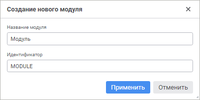

# Создание модулей: Среда разработки

Создание модулей: Среда разработки
-

# Создание модулей

Модуль является невизуальной единицей компиляции, предназначенной для
 хранения прикладного кода. Различные модули могут использоваться для функционального
 разделения хранящегося в них кода.

[Создание нового
 модуля](javascript:TextPopup(this))

	Для создания нового модуля:

		- в веб-приложении:

			- в [навигаторе
			 объектов](GetStarted.chm::/Interface/Interface_Navigator.htm) нажмите кнопку 
			 «Создать» в главном
			 меню и выберите тип объекта на боковой панели «[Новый объект](UiNav.chm::/02_Navigator/General_Principles_of_Work.htm#add_object)»;

			- в [среде
			 разработки](Developer.chm::/About_Developing/Start_the_Development_Environment.htm):

				- выполните команду «Файл
				 > Создать > Модуль» в главном меню;

				- выполните команду «Создать
				 > Модуль» в контекстном меню навигатора проекта;

				- выполните команду «Создать
				 > Модуль» в контекстном меню сборки в навигаторе
				 проекта.

	При создании модуля в среде разработки
	 откроется окно «Создание нового модуля»:

	

	Укажите наименование и уникальный идентификатор
	 создаваемого модуля в соответствующих полях.

		- в настольном приложении:

			- в навигаторе объектов:

				- нажмите кнопку «Новый
				 объект > Среда
				 разработки > Модуль» в группе «Создать»
				 на вкладке «Главная»
				 ленты инструментов;

				- выполните команду «Создать
				 > Среда разработки > Модуль» в контекстном
				 меню навигатора объектов;

			- в среде разработки:

				- выполните команду «Файл
				 > Создать > Модуль» в главном меню;

				- выполните команду «Создать
				 > Модуль» в контекстном меню навигатора проекта;

				- выполните команду «Создать
				 > Модуль» в контекстном меню сборки в навигаторе
				 проекта.

[Редактирование
 существующего модуля](javascript:TextPopup(this))

	Для редактирования существующего модуля:

		- в веб-приложении:

			- в [навигаторе
			 объектов](GetStarted.chm::/Interface/Interface_Navigator.htm):

				- выполните команду «Редактировать»
				 в контекстном меню модуля;

				- выполните команду «Редактировать
				 в новой вкладке» в контекстном меню модуля;

				- выполните команду «Редактировать
				 в новом окне» в контекстном меню модуля;

				- дважды щёлкните по модулю;

				- нажмите клавишу F4;

			- в [среде
			 разработки](Developer.chm::/About_Developing/Start_the_Development_Environment.htm) выполните команду «Редактировать»
			 в контекстном меню модуля в навигаторе проекта;

			- в главном меню «Файл
			 > Открыть последние» выбрать ранее открытый модуль.

		- в настольном приложении:

			- в навигаторе объектов:

				- нажмите кнопку 
				 «Редактировать»
				 в группе «Открыть»
				 на вкладке «Главная»
				 ленты инструментов;

				- выполните команду «Редактировать»
				 в контекстном меню модуля;

				- нажмите клавишу F4;

			- в среде разработки:

				- выполните команду «Редактировать»
				 в контекстном меню модуля в навигаторе проекта;

				- выполните команду «Файл
				 > Открыть» в главном меню.

	При обращении к модулю осуществляется проверка прав доступа к нему.
	 Если у пользователя нет прав на редактирование, но есть права на просмотр,
	 то команда «Редактировать»
	 будет заменена на команду «Открыть»
	 и модуль будет открываться только в режиме просмотра.

Модуль может содержать [точку входа](entry_point.htm), которая
 будет выполняться при запуске модуля/сборки из среды разработки или при
 выборе в качестве объекта автозапуска. После создания модуля можно непосредственно
 переходить к [наполнению
 его кодом](../../03_Windows_of_Development_Environment/Window_Macros.htm).

Для закрытия текущего модуля выполните команду «Файл
 > Закрыть» в главном меню среды разработки. В веб-приложении
 также доступно сочетание клавиш CTRL+ALT+W.

См. также:

[Разработка
 прикладного приложения](../../01_Purpose_of_the_constructor/Purpose_of_the_constructor.htm)

		Справочная
		 система на версию 10.9
		 от 18/08/2025,
		 © ООО «ФОРСАЙТ»,
