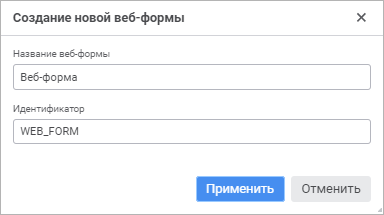
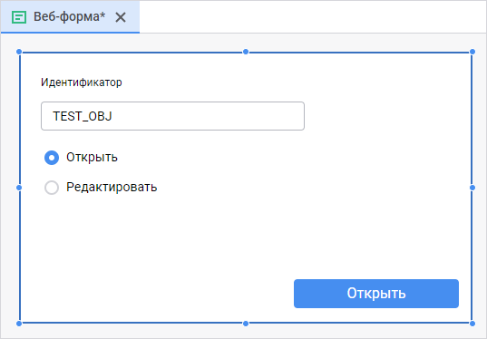

# Создание веб-формы и размещение компонентов

Создание веб-формы и размещение компонентов
-

# Создание веб-формы и размещение
 компонентов

Веб-форма является инструментом для создания визуального интерфейса
 веб-приложений. Интерфейс формируется путём размещения на веб-форме различных
 компонентов. Каждой веб-форме соответствует модуль, содержащий описание
 класса формы. Название класса должно совпадать со значением свойства name веб-формы.

В основе веб-форм лежит фреймворк React, написанный на языке JavaScript,
 и технология CSS Flexbox. Прикладной код веб-форм пишется на языке Fore.
 Свойства и методы веб-форм как объекта репозитория описывает интерфейс
 [IWebForm](KeSom.chm::/Interface/IWebForm/IWebForm.htm),
 как компонента среды разработки - [IWebFormComponent](WebForms.chm::/Interface/IWebFormComponent/IWebFormComponent.htm).

Веб-формы по умолчанию открываются модально относительно того места,
 откуда осуществляется открытие. Максимальное количество открытых относительно
 друг друга модальных веб-форм - 5 штук. Для смены режима работы веб-формы
 используйте свойство modal, доступное в режиме дизайнера.

Примечание.
 Работа с веб-формами доступна только в веб-приложении. При использовании
 веб-форм учитывайте имеющиеся [особенности
 работы](../../../Web/features_web_form.htm).

[Создание новой
 веб-формы](javascript:TextPopup(this))

	Для создания веб-формы:

		- в [навигаторе
		 объектов](GetStarted.chm::/Interface/Interface_Navigator.htm) нажмите кнопку 
		 «Создать» в главном меню
		 и выберите тип объекта на боковой панели «[Новый объект](UiNav.chm::/02_Navigator/General_Principles_of_Work.htm#add_object)»;

		- в [среде
		 разработки](Developer.chm::/About_Developing/Start_the_Development_Environment.htm):

			- выполните команду «Файл
			 > Создать > Веб-форма» в главном меню;

			- выполните команду «Создать
			 > Веб-форма» в контекстном меню навигатора проекта;

			- выполните команду «Создать
			 > Веб-форма» в контекстном меню сборки в навигаторе
			 проекта.

	При создании веб-формы в среде разработки
	 откроется окно «Создание новой веб-формы»:

	

	Укажите наименование и уникальный идентификатор
	 создаваемой веб-формы в соответствующих полях.

[Редактирование
 существующей веб-формы](javascript:TextPopup(this))

	Для открытия существующей веб-формы на редактирование:

		- в [навигаторе
		 объектов](GetStarted.chm::/Interface/Interface_Navigator.htm):

			- выполните команду «Редактировать»
			 в контекстном меню веб-формы;

			- выполните команду «Редактировать
			 в новой вкладке» в контекстном меню веб-формы;

			- выполните команду «Редактировать
			 в новом окне» в контекстном меню веб-формы;

			- нажмите клавишу F4;

		- в [среде
		 разработки](Developer.chm::/About_Developing/Start_the_Development_Environment.htm) выполните команду «Редактировать»
		 в контекстном меню веб-формы в навигаторе проекта;

		- в главном меню «Файл >
		 Открыть последние» выбрать ранее открытую веб-форму.

	При обращении к веб-форме осуществляется проверка прав доступа к
	 ней. Если и пользователя нет прав на редактирование, но есть права
	 на просмотр, то команда «Редактировать»
	 будет заменена на команду «Открыть»
	 и веб-форма будет открываться только в режиме просмотра.

	Для открытия готовой веб-формы на просмотр в [навигаторе
	 объектов](GetStarted.chm::/Interface/Interface_Navigator.htm) выделите веб-форму и выполните одно из
	 действий:

		- выполните команду «Открыть»
		 в контекстном меню веб-формы;

		- выполните команду «Открыть
		 в новой вкладке» в контекстном меню веб-формы;

		- выполните команду «Открыть
		 в новом окне» в контекстном меню веб-формы;

		- дважды щёлкните по веб-форме;

		- нажмите клавишу ENTER.

	После выполнения одного из действий будет открыта веб-форма.

Для перехода между веб-формой и окном макроса используйте горячие клавиши
 F7/Shift+F7 или кнопки / , расположенные
 в правой части окна среды разработки.

Для отображения панели компонентов нажмите кнопку 
 в левой части окна среды разработки. Для размещения компонента на веб-форме
 щёлкните его на панели компонентов и перетащите в ту область формы, куда
 его необходимо добавить. На панели Свойства/События задаются свойства
 компонентов и обработчики для событий. В список доступных свойств входят
 только те свойства, которые можно изменить в режиме дизайнера веб-формы.
 В коде для компонентов будут доступны только те свойства, которые можно
 изменить во время выполнения веб-формы.

Веб-форма имеет различный набор свойств и методов, доступных в режиме
 дизайнера и режиме выполнения.

	 Режим
	 дизайнера

	 Режим
	 выполнения

	 События

			- text. Текст,
			 отображаемый в заголовке веб-формы;

			- name. Наименование
			 веб-формы;

			- alignItems.
			 Выравнивание flex-компонентов относительно поперечной оси.
			 Доступные значения:

				- flex-start.
				 Компоненты выравниваются в начале поперечной оси;

				- center.
				 Компоненты центрированы по поперечной оси;

				- flex-end.
				 Компоненты выравниваются в конце поперечной оси.

			- color. Цвет
			 фона веб-формы;

			- flexDirection.
			 Главная ось, вдоль которой будут располагаться flex-компоненты.
			 Значение задаётся относительно родительского компонента, в
			 котором располагаются flex-компоненты. Доступные значения:

				- column.
				 Значение по умолчанию. Компоненты располагаются по вертикали;

				- row. Компоненты
				 располагаются по горизонтали.

			- imageCollection.
			 Коллекция изображений, которые будут использоваться компонентами
			 веб-формы. Для выбора доступны файлы в формате BMP, GIF, JPG,
			 JPEG, PNG, ICO, SVG. Добавленные изображения в дальнейшем
			 отображаются без сжатия в своём исходном размере, учитывайте
			 это при выборе файлов. Компоненты, использующие изображения:

				- [Button](../../../Web_components/Button.htm);

				- [PopupMenu](../../../Web_components/PopupMenu.htm).

			- justifyContent.
			 Выравнивание flex-компонентов относительно главной оси. Доступные
			 значения:

				- flex-start.
				 Значение по умолчанию. Компоненты сдвинуты в начало главной
				 оси;

				- center.
				 Компоненты центрированы вдоль главной оси;

				- flex-end.
				 Компоненты сдвинуты в конец главной оси;

				- space-around.
				 Компоненты равномерно распределены вдоль главной оси с
				 одинаковым свободным пространством вокруг них. Визуально
				 свободное пространство между крайними компонентами и границами
				 оси будет меньше т.к. свободное пространство между компонентами
				 состоит из двух свободных пространств, принадлежащих каждому
				 из компонентов;

				- space-between.
				 Компоненты равномерно распределены вдоль главной оси.
				 Первый элемент находится в начале оси, последний элемент
				 - в конце

			- modal. Признак
			 работы веб-формы в модальном режиме. При значении True
			 веб-форма открывается модально относительно репозитория или
			 объекта, из которого осуществляется открытие. При значении
			 False веб-форма открывается
			 в отдельной вкладке браузера;

			- padding. Отступы
			 от края веб-формы до её компонентов. Значения свойства влияют
			 на расположение компонентов с позиционированием относительно
			 родительского компонента: position
			 = relative;

			- popupMenu. Контекстное
			 меню, отображаемое для веб-формы. В качестве значения укажите
			 один из компонентов [PopupMenu](../../../Web_components/PopupMenu.htm),
			 размещённых на форме;

			- size. Размеры
			 веб-формы.

		Примечание.
		 Свойства flexDirection,
		 aligments, justifyContent
		 влияют на расположение компонентов, для которых свойство position имеет значение relative.

		Свойства:

			- [Clipboard](WebForms.chm::/Interface/IWebFormComponent/IWebFormComponent.Clipboard.htm).
			 Буфер обмена веб-формы.

			- [Color](WebForms.chm::/Interface/IWebControl/IWebControl.Color.htm).
			 Цвет фона веб-формы;

			- [Enabled](WebForms.chm::/Interface/IWebControl/IWebControl.Enabled.htm).
			 Признак доступности веб-формы для пользователя;

			- [PopupMenu](WebForms.chm::/Interface/IWebControl/IWebControl.PopupMenu.htm).
			 Контекстное меню, отображаемое для компонента. В качестве
			 значения укажите один из компонентов [PopupMenu](../../../Web_components/PopupMenu.htm),
			 размещённых на форме;

			- [Text](WebForms.chm::/Interface/IWebControl/IWebControl.Text.htm).
			 Текст, отображаемый в заголовке веб-формы;

			- [Visible](WebForms.chm::/Interface/IWebControl/IWebControl.Visible.htm).
			 Признак видимости веб-формы.

		Методы:

			- [Close](WebForms.chm::/Interface/IWebFormComponent/IWebFormComponent.Close.htm).
			 Закрывает текущую веб-форму;

			- [ShowObject](WebForms.chm::/Interface/IWebFormComponent/IWebFormComponent.ShowObject.htm).
			 Открывает указанную веб-форму в новой вкладке браузера.

			- onShow. Событие
			 наступает непосредственно перед выводом веб-формы на экран;

			- onCommand. Событие
			 наступает во время получения веб-формой команды, которая может
			 быть отправлена с помощью метода [SendCommand](KeSom.chm::/Interface/IWebForm/IWebForm.SendCommand.htm).

Для создания визуального оформления веб-формы доступен ряд [компонентов](../../../Web_components/web_components.htm).

См. также:

[Разработка
 прикладного приложения](../../01_Purpose_of_the_constructor/Purpose_of_the_constructor.htm) | [Особенности
 работы веб-форм](../../../Web/features_web_form.htm) | [Компоненты
 веб-форм](../../../Web_components/web_components.htm)

		Справочная
		 система на версию 10.9
		 от 18/08/2025,
		 © ООО «ФОРСАЙТ»,
