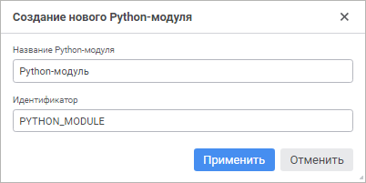
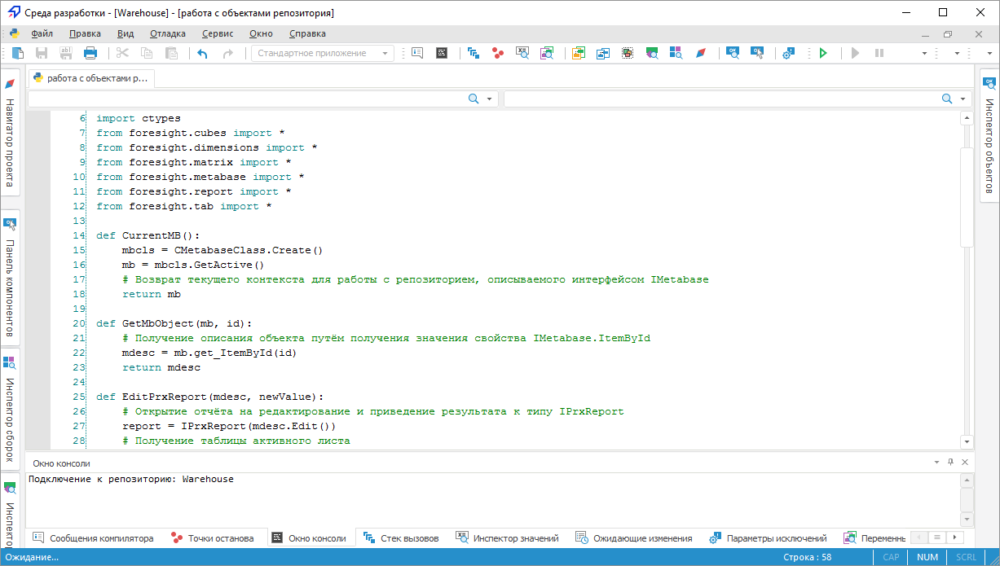

# Создание Python-модулей: Среда разработки

Создание Python-модулей: Среда разработки
-

# Создание Python-модулей

Python-модуль предназначен для хранения в репозитории кода макросов
 на языке Python. Модуль может быть открыт и отредактирован в среде разработки
 «Форсайт. Аналитическая платформа».
 Доступно выполнение Python-кода без отладки в среде разработки или из
 прикладного кода на Fore. Разработку и отладку самих макросов рекомендуется
 производить в специализированных средах разработки, ориентированных на
 работу с языком Python.

Примечание.
 Для работы потребуется установленный на компьютере язык Python. Более
 подробно об установке читайте в подразделе «[Подключение
 дополнительных модулей к «Форсайт. Аналитическая платформа](UiNav.chm::/02_Navigator/CommonSettings/Integration.htm)».

[Создание нового
 Python-модуля](javascript:TextPopup(this))

	Для создания нового Python-модуля:

		- в веб-приложении:

			- в [навигаторе
			 объектов](GetStarted.chm::/Interface/Interface_Navigator.htm) нажмите кнопку 
			 «Создать» в главном
			 меню и выберите тип объекта на боковой панели «[Новый объект](UiNav.chm::/02_Navigator/General_Principles_of_Work.htm#add_object)»;

			- в [среде
			 разработки](Developer.chm::/About_Developing/Start_the_Development_Environment.htm):

				- выполните команду «Файл
				 > Создать > Python-модуль» в главном меню;

				- выполните команду «Создать
				 > Python-модуль» в контекстном меню навигатора
				 проекта.

	При создании Python-модуля в среде разработки
	 откроется окно «Создание нового Python-модуля»:

	

	Укажите наименование и уникальный идентификатор
	 создаваемого Python-модуля в соответствующих полях.

		- в настольном приложении:

			- в навигаторе объектов:

				- нажмите кнопку «Новый
				 объект > Среда
				 разработки > Python-модуль» в группе «Создать» на вкладке
				 «Главная» ленты
				 инструментов;

				- выполните команду «Создать
				 > Среда разработки > Python-модуль» в контекстном
				 меню навигатора объектов;

			- в среде разработки:

				- выполните команду «Файл
				 > Создать > Python-модуль» в главном меню;

				- выполните команду «Создать
				 > Python-модуль» в контекстном меню навигатора
				 проекта.

[Редактирование
 существующего Python-модуля](javascript:TextPopup(this))

	Для редактирования существующего Python-модуля:

		- в веб-приложении:

			- в [навигаторе
			 объектов](GetStarted.chm::/Interface/Interface_Navigator.htm):

				- выполните команду «Редактировать»
				 в контекстном меню Python-модуля;

				- выполните команду «Редактировать
				 в новой вкладке» в контекстном меню Python-модуля;

				- выполните команду «Редактировать
				 в новом окне» в контекстном меню Python-модуля;

				- дважды щёлкните по Python-модулю;

				- нажмите клавишу F4;

			- в [среде
			 разработки](Developer.chm::/About_Developing/Start_the_Development_Environment.htm) выполните команду «Редактировать»
			 в контекстном меню Python-модуля в навигаторе проекта;

			- в главном меню «Файл
			 > Открыть последние» выбрать ранее открытый Python-модуль.

		- в настольном приложении:

			- в навигаторе объектов:

				- нажмите кнопку 
				 «Редактировать»
				 в группе «Открыть»
				 на вкладке «Главная»
				 ленты инструментов;

				- выполните команду «Редактировать»
				 в контекстном меню Python-модуля;

				- нажмите клавишу F4;

			- в среде разработки:

				- выполните команду «Редактировать»
				 в контекстном меню Python-модуля в навигаторе проекта;

				- выполните команду «Файл
				 > Открыть» в главном меню.

	При обращении к Python-модулю осуществляется проверка прав доступа
	 к нему. Если и пользователя нет прав на редактирование, но есть права
	 на просмотр, то команда «Редактировать»
	 будет заменена на команду «Открыть»
	 и Python-модуль будет открываться только в режиме просмотра.

В созданном модуле напишите код с использованием синтаксиса языка Python
 или вставьте заранее написанный и протестированный макрос. В среде разработки
 «Форсайт. Аналитическая платформа»
 поддерживается подсветка ключевых слов Python, автоформатирование кода,
 IntelliSense, при переходе к новым строкам учитывается выставленная ранее
 табуляция, которая является важной частью синтаксиса языка Python. При
 вводе в тексте различных скобок, кавычек, апострофов автоматически добавляется
 соответствующий второй элемент - закрывающая скобка, кавычка, апостроф.
 Также автоподстановка реализована для конструкции try-except
 при указании двоеточия после ключевого слова try.

	Веб-приложение Настольное приложение

		

		

Для кода применяется оформление, которое задано в [параметрах
 среды разработки](Developer.chm::/About_Developing/Development_Environment_Options.htm).

Для использования кода из Python-модуля в коде на Fore предназначены
 ресурсы сборки [Python](kepython.chm::/KePython_Title.htm):
 Для выполнения отдельных функций используйте метод [Python.InvokeModule](KePython.chm::/Class/Python/Python.InvokeModule.htm)
 или [IPythonUtils.InvokeModule](KePython.chm::/Interface/IPythonUtils/IPythonUtils.InvokeModule.htm),
 для работы с классами используйте конструктор [PythonClassObject.CreateFromModule](KePython.chm::/Class/PythonClassObject/PythonClassObject.CreateFromModule.htm).
 Также можно использовать оператор [Pyimport](Fore.chm::/08_Operators/Pyimport.htm),
 который позволяет импортировать и напрямую вызывать функции из Python-модулей.

## Доступ к репозиторию

В коде Python-модуля можно получить доступ к текущему соединению с репозиторием.
 Для этого предназначен метод GetActive класса MetabaseClass. Данный метод
 возвращает контекст для работы с репозиторием, описываемый интерфейсом
 IMetabase.

from foresight.metabase import *
def CurrentMB():
    mbcls = CMetabaseClass.Create()
    mb = mbcls.GetActive()
    # Возврат текущего контекста для работы с репозиторием
    return mb
Примечание.
 Метод GetActive можно использовать только при разработке в Python-модуле
 репозитория «Форсайт. Аналитическая платформа».

Также соединение с репозиторием может быть сформировано в прикладном
 коде Python-модуля. Различные примеры кода на языке Python, которые могут
 использоваться как внутри Python-модуля платформы, так и при разработки
 в сторонних средах разработки, представлены в подразделе базы знаний «[Работа
 в Python](KnowledgeBase.chm::/01_Fore/KB000029/Work_in_Python.htm)».

## Связь Python-модулей

Стандартные команды Python import
 и from...import позволяют получить
 доступ к коду, который реализован в других Python-модулях. В качестве
 параметра указывается идентификатор Python-модуля в репозитории. При выполнении
 содержимое Python-модуля импортируется один раз и доступно до завершения
 выполняемого кода.

Рассмотрим пример доступа к коду Python-модуля из другого Python-модуля.
 Предполагается наличие Python-модуля с идентификатором TESTMODULE, который
 содержит следующий код:

def summXY(x, y):
    return x + y

class Door:
    def __init__(self, color, height, width):
        self.color = color
        self.height = height
        self.width = width

    def getDoorDescription(self, comment):
        return comment + ". Цвет: " + self.color + " Размеры: " + str(self.height) + "X" + str(self.width) + " мм."
Получить доступ к коду можно следующими способами:

#1
import TESTMODULE
print(TESTMODULE.summXY(10, 20))
#2
import TESTMODULE as tm
print(tm.summXY(30, 40))
#3
from TESTMODULE import Door
tclass = Door("Red", 2000, 800)
print(tclass.getDoorDescription("Межкомнатная дверь"))
#4
from TESTMODULE import summXY as summ
print(summ(50, 60))
При выполнении второго Python-модуля различными способами будет получен
 доступ к функции и классу из первого Python-модуля.

См. также:

[Разработка
 прикладного приложения](../../01_Purpose_of_the_constructor/Purpose_of_the_constructor.htm)

		Справочная
		 система на версию 10.9
		 от 18/08/2025,
		 © ООО «ФОРСАЙТ»,
