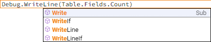
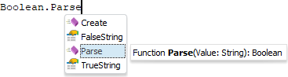
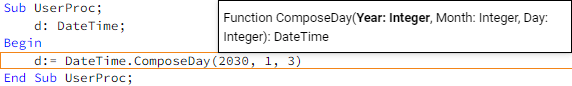

# IntelliSense

IntelliSense
-

# IntelliSense

IntelliSense - это специальная технология, позволяющая анализировать
 код, отображая определённые элементы кода, доступные для использования.
 IntelliSense предназначен для упрощения разработки приложения путём автодополнения
 печатаемого кода, что способствует сокращению затрачиваемого времени,
 исключению опечаток в коде.

Технология IntelliSense поддерживается при редактировании кода Fore/Python-модулей
 и форм.

## Список членов и типов членов

Список элементов кода, доступных для использования в текущей позиции,
 формируется в виде раскрывающегося списка, упорядоченного по алфавиту.
 Для вызова списка используется сочетание клавиш CTRL+ПРОБЕЛ. При выборе
 какого-либо элемента списка для него выводится более подробная информация.
 Дополнительная информация зависит от типа выбранного элемента и может
 содержать следующие данные:

	- тип выбранного элемента: класс, интерфейс, свойство,
	 метод и т.д.;

	- список обязательных и необязательных параметров;

	- тип возвращаемого значения или само значение;

	- ключевые слова.

	Веб-приложение Настольное приложение

		

		Для вставки необходимого элемента в код выполните одно из следующих
		 действий:

			- нажать клавишу ENTER;

			- нажать клавишу TAB;

			- щёлкнуть по элементу мышкой.

		

		Для вставки необходимого элемента в код выполните одно из следующих
		 действий:

			- нажать клавишу ПРОБЕЛ;

			- нажать клавишу ENTER;

			- нажать сочетание клавиш CTRL+ENTER;

			- нажать клавишу TAB;

			- дважды щёлкнуть по элементу мышкой.

При большом количестве доступных элементов список будет сформирован
 с полосой прокрутки. Список членов можно в любой момент закрыть, нажав
 клавишу ESC.

## Сведения о параметрах

Для любого члена типа реализована всплывающая подсказка, содержащая
 синтаксис члена и список всех его обязательных и необязательных параметров.
 Данная подсказка выводится автоматически после указания открывающей круглой
 скобки после наименования члена типа. Параметр, значение которого редактируется
 в текущий момент, подсвечивается жирным шрифтом. После указания закрывающей
 круглой скобки всплывающая подсказка будет скрыта. Для вызова подсказки
 вручную используется сочетание клавиш CTRL+SHIFT+ПРОБЕЛ.

См. также:

[Наполнение
 кодом](../03_Windows_of_Development_Environment/Window_Macros.htm)

		Справочная
		 система на версию 10.9
		 от 18/08/2025,
		 © ООО «ФОРСАЙТ»,
