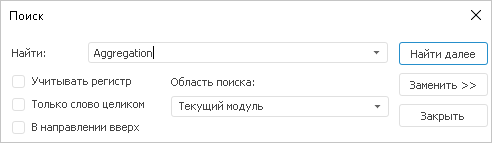
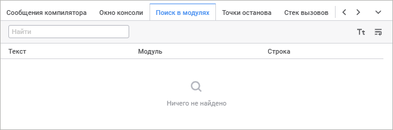
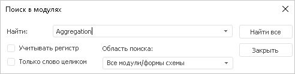
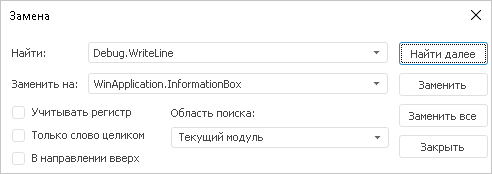
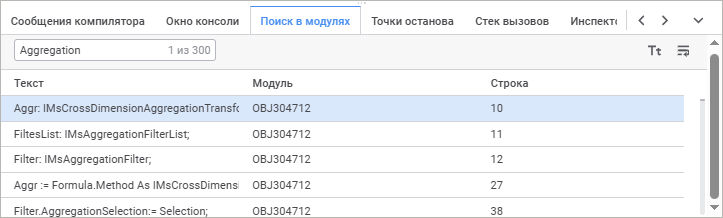
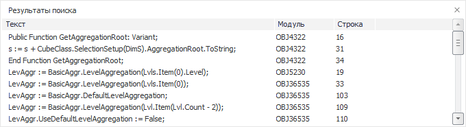

# Поиск и замена: Среда разработки

Поиск и замена: Среда разработки
-

# Поиск и замена

	Для поиска и редактирования различных частей кода в среде разработки
	 предусмотрены различные виды поиска.

## Поиск

	Для вызова окна поиска необходимо:

		- выбрать пункт главного меню «Правка
		 > Найти»;

		- нажать сочетание клавиш CTRL+F;

		- нажать кнопку  «Поиск»
		 на панели инструментов в веб-приложении.

		Веб-приложение Настольное приложение

			

			

	В поле «Найти» необходимо
	 указать текст для поиска, отметить необходимые параметры поиска, указать
	 область поиска и нажать кнопку 
	 «Найти далее» или клавишу
	 ENTER. В случае удачного поиска курсор будет установлен на найденную
	 строку, а искомый текст в этой строке будет выделен.

	Для дальнейшего поиска можно снова нажать кнопку 
	 «Найти далее» или клавишу
	 ENTER. Для возврата к предыдущему результату поиска в веб-приложении
	 нажмите кнопку  «Найти
	 предыдущее».

	При достижении окончания модуля/формы - поиск начинается с начала.
	 При достижении места начала поиска будет выведено соответствующее
	 информационное сообщение.

	В случае неудачного поиска на экран выдано сообщение «Ни одного
	 вхождения строки не найдено».

## Поиск в модулях

	В настольном приложении для поиска по всем модулям/формам активного
	 репозитория необходимо:

		- выбрать пункт главного меню «Правка
		 > Найти в модулях»;

		- нажать сочетание клавиш CTRL+SHIFT+F.

	В веб-приложении откройте панель «Поиск
	 в модулях».

		Веб-приложение Настольное приложение

			

			

	После нажатия на кнопку «Найти
	 все» или клавиши ENTER будет осуществлён поиск. Результаты
	 поиска будут отражены в окне «Результаты
	 поиска», которое располагается в нижней части окна среды разработки.

## Замена

	Для вызова окна поиска необходимо:

		- выбрать пункт главного меню «Правка
		 > Заменить»;

		- нажать кнопку  «Поиск»
		 панели инструментов, затем кнопку  «Замена»
		 на панели поиска в веб-приложении;

		- нажать сочетание клавиш CTRL+H.

		Веб-приложение Настольное приложение

			

			

	В поле «Найти» необходимо
	 указать текст для поиска. В поле «Заменить
	 на»/«Заменить» указывается
	 текст, на который необходимо заменить найденный текст.

	При первом нажатии кнопки 
	 «Заменить» будет осуществлён
	 поиск первого вхождения искомого текста. В случае удачного поиска
	 курсор будет установлен на найденную строку, а искомый текст в этой
	 строке будет выделен. Дальнейшее нажатие кнопки 
	 «Заменить» приведёт к замене
	 найденного текста и поиску следующего вхождения.

	При нажатии кнопки  «Заменить
	 все» будет осуществлена замена всех найденных строк.

## Параметры поиска и замены

		- Учитывать регистр/
		 С учетом регистра. Различаются заглавные и прописные буквы;

		- Только слово
		 целиком/ Слово целиком. Поиск осуществляется
		 по целому слову, иначе по подстроке;

		- В направлении
		 вверх. Поиск осуществляется от места установки курсора
		 до начала модуля;

		- Текущий модуль.
		 Поиск осуществляется только в модуле, для которого вызвано окно;

		- Все открытые
		 модули. Поиск осуществляется как для текущего модуля, так
		 и для все открытых модулей;

		- Только в выделенном.
		 Поиск осуществляется только в выделенном диапазоне строк модуля.

	Примечание.
	 Для выбора области поиска в веб-приложении используйте раскрывающийся
	 список кнопки  «Тип
	 поиска».

## Результаты поиска

	В окне «Результаты поиска»
	 в настольном приложении и на панели «Поиск
	 в модулях» в веб-приложении отображаются результаты поиска
	 по коду модулей репозитория.

		Веб-приложение Настольное приложение

			

			

	В окне/на панели отображается следующая информация:

		- полный текст строки, в которой найдено искомое
		 значение;

		- идентификатор модуля/формы, в котором найдена
		 строка;

		- номер строки, в которой находится искомый текст.

	[Просмотр
	 результата поиска](javascript:TextPopup(this))

		Для просмотра найденного кода необходимо произвести двойной
		 щелчок по соответствующей строке или выполнить команду контекстного
		 меню «Перейти к строке».
		 Модуль/форма будут открыты с позиционированием курсора на найденной
		 строке.

	[Копирование
	 результата поиска](javascript:TextPopup(this))

		Результат поиска можно скопировать в буфер обмена. Для этого
		 выполните следующие действия:

			- Выделите необходимую строку с результатом поиска;

			- Выполните команду контекстного меню «Копировать»/
			 «Копировать» или используйте
			 сочетание клавиш CTRL+C (CTRL+INSERT) в настольном приложении.

		В результате выполнения действий результат поиска будет сохранён
		 в буфер обмена.

См. также:

[Наполнение
 кодом](../03_Windows_of_Development_Environment/Window_Macros.htm)

		Справочная
		 система на версию 10.9
		 от 18/08/2025,
		 © ООО «ФОРСАЙТ»,
